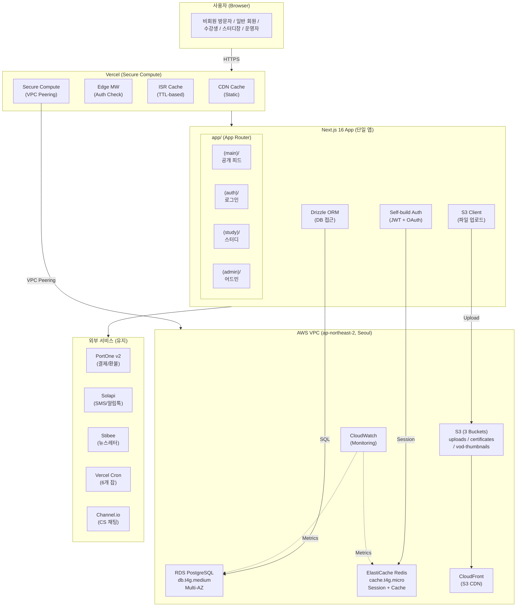
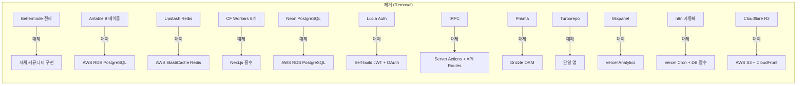
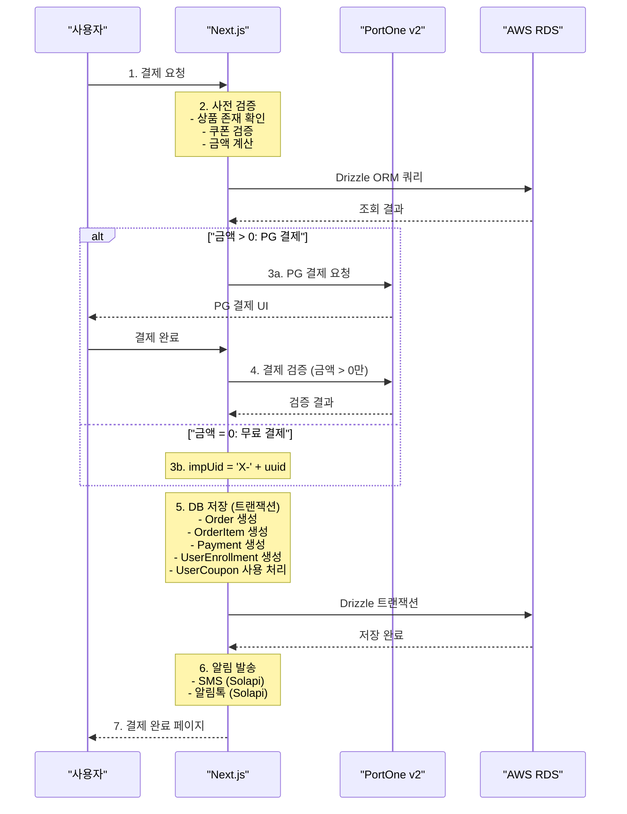
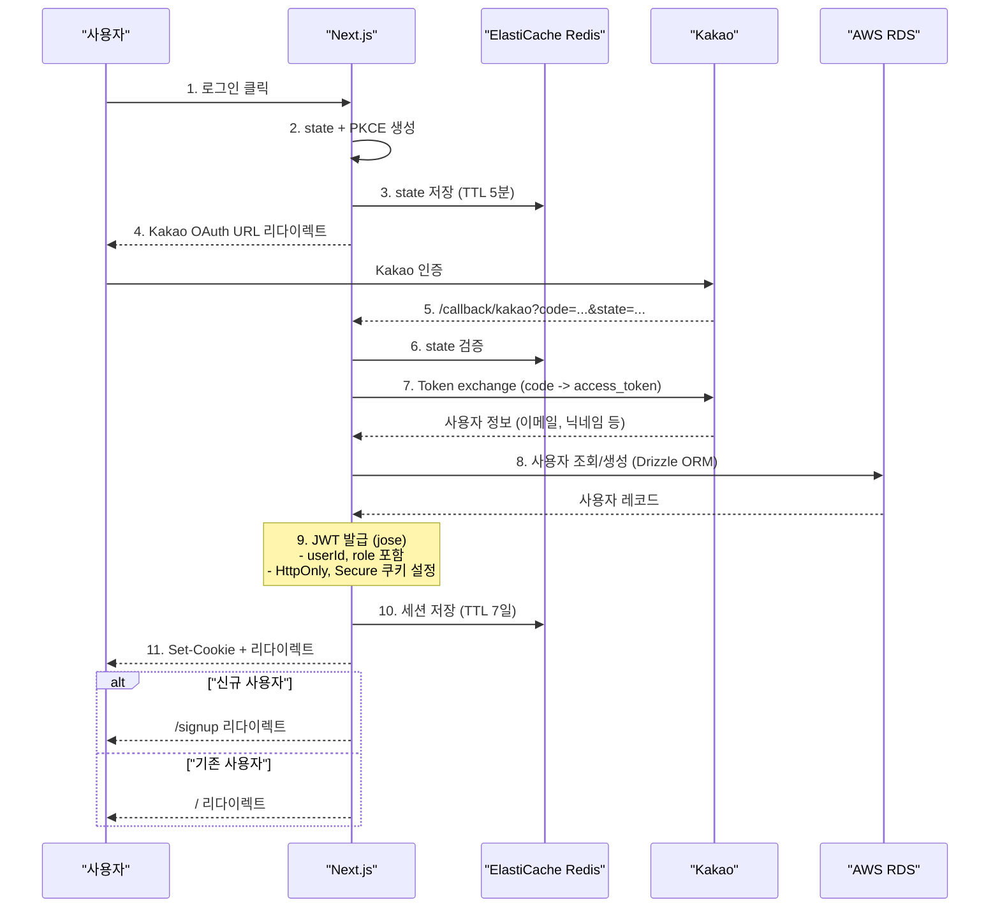
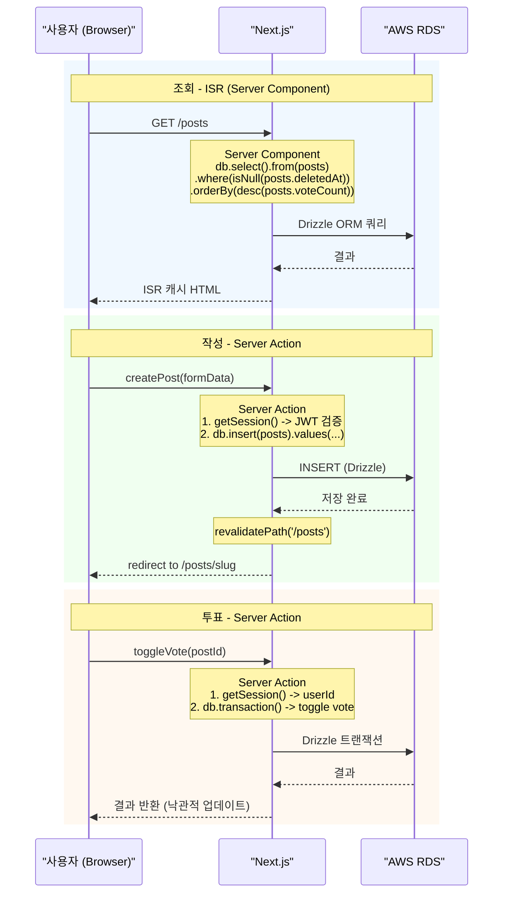
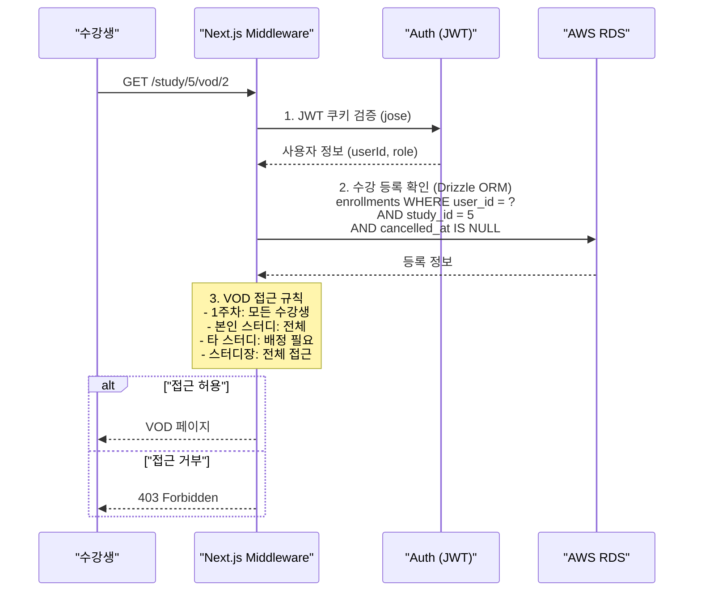
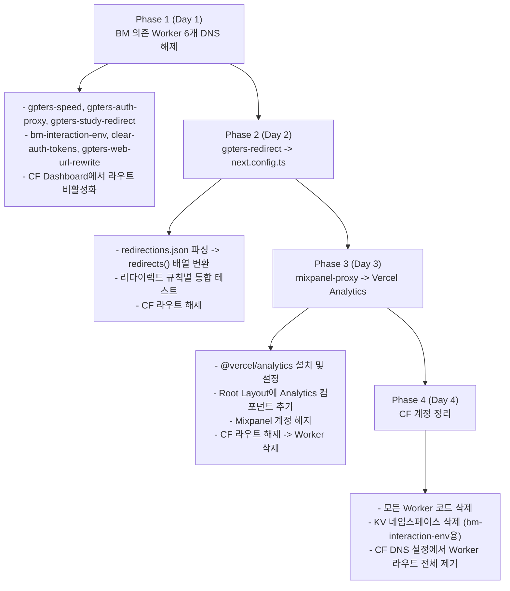
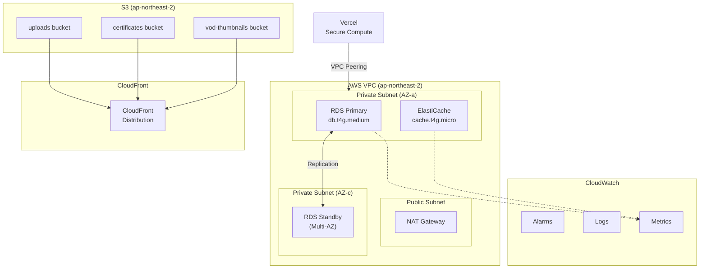

# Renewal-01: 시스템 아키텍처 설계서

> GPTers 포털 리뉴얼 전체 시스템 아키텍처
> Turborepo Monorepo -> 단일 Next.js 16 앱 전환

| 항목 | 내용 |
|------|------|
| Feature | GPTers Portal Renewal - System Architecture |
| Version | v2.0 |
| Date | 2026-03-07 |
| Status | Design (Revised) |
| Author | System Architect Agent |
| 선행 문서 | [Plan Plus](../01-plan/gpters-renewal-plan-plus.md), [Context Analysis](../01-plan/gpters-renewal-context-analysis.md), [Design Plan](../01-plan/features/portal-renewal-design.plan.md) |
| 변경 이력 | v1.0 Supabase BaaS -> v2.0 AWS All-in Self-build (RDS + ElastiCache + S3 + Self-build Auth) |

---

## 검증 사항 (Verification)

본 설계서 작성 전 아래 항목을 검증 완료함:

| 검증 항목 | 확인 결과 |
|----------|----------|
| Plan 문서 3개 존재 | gpters-renewal-plan-plus.md, gpters-renewal-context-analysis.md, portal-renewal-design.plan.md 확인 |
| 레거시 구조 분석 | gpters-study/CLAUDE.md (810줄), turbo.json (71줄), pnpm-workspace.yaml 확인 |
| 기존 설계서와 일관성 | renewal-06 (v2.0 AWS 자체 빌드 반영 완료), renewal-10 인프라 구성 확인 |
| CF Workers 소스 분석 | 8개 Worker index.ts 분석 완료 (BM 의존 6개, 독립 2개) |
| 렌더링 TTL | Plan Plus 4.3절 기준 (Home 60s, Posts 30s, Studies 300s) |
| AWS 아키텍처 확정 | RDS + ElastiCache + S3 + CloudFront, Self-build Auth (JWT + OAuth) |

---

## 목차

1. [시스템 전체 구성도](#1-시스템-전체-구성도)
2. [모듈/디렉토리 구조](#2-모듈디렉토리-구조)
3. [렌더링 전략 매트릭스 (37페이지)](#3-렌더링-전략-매트릭스-37페이지)
4. [데이터 플로우 다이어그램](#4-데이터-플로우-다이어그램)
5. [환경 구성](#5-환경-구성)
6. [레거시 vs 리뉴얼 비교](#6-레거시-vs-리뉴얼-비교)
7. [CF Workers 8개 흡수 계획](#7-cf-workers-8개-흡수-계획)
8. [ADR (Architecture Decision Records)](#8-adr-architecture-decision-records)

---

## 1. 시스템 전체 구성도

### 1.1 리뉴얼 시스템 아키텍처



### 1.2 제거 대상



### 1.3 2-Tier 데이터 접근 패턴

모든 데이터 접근은 서버 사이드에서 Drizzle ORM을 통해 수행합니다. 브라우저에서 DB로의 직접 접근은 없습니다.

```
┌───────────────────────────────────────────────────────────────────────┐
│                      2-Tier Data Access Pattern                       │
├───────────────────────────────────────────────────────────────────────┤
│                                                                       │
│  Tier 1: Server Component (ISR / SSR)                                │
│  ━━━━━━━━━━━━━━━━━━━━━━━━━━━━━━━━━━━━                                │
│  사용처: SSR/ISR 페이지 데이터 로딩, 공개 및 인증 페이지             │
│  인증: JWT 세션 쿠키 검증 (jose) → 사용자 ID 추출                    │
│  예시: 게시글 목록, 스터디 목록, 프로필 페이지, 인증 필요 페이지      │
│                                                                       │
│  ```typescript                                                        │
│  // app/_lib/db/index.ts                                              │
│  import { drizzle } from 'drizzle-orm/node-postgres'                  │
│  import { Pool } from 'pg'                                            │
│                                                                       │
│  const pool = new Pool({                                              │
│    connectionString: process.env.DATABASE_URL,                        │
│    ssl: { rejectUnauthorized: true },                                 │
│    max: 20,                                                           │
│  })                                                                   │
│  export const db = drizzle(pool)                                      │
│  ```                                                                  │
│                                                                       │
│  Tier 2: API Routes / Server Actions (Mutations + Webhooks)          │
│  ━━━━━━━━━━━━━━━━━━━━━━━━━━━━━━━━━━━━━━━━━━━━━━━━━━━━━━━━            │
│  사용처: 결제 처리, Webhook, Cron, 관리자 작업, 데이터 변경           │
│  인증: JWT 세션 검증 + Role 기반 미들웨어                             │
│  예시: PortOne 결제 검증, 환불 처리, 배치 작업, CRUD 뮤테이션         │
│                                                                       │
│  ```typescript                                                        │
│  // app/_lib/auth/session.ts                                          │
│  import { jwtVerify, SignJWT } from 'jose'                            │
│  import { cookies } from 'next/headers'                               │
│                                                                       │
│  export async function getSession() {                                 │
│    const cookieStore = await cookies()                                 │
│    const token = cookieStore.get('session')?.value                     │
│    if (!token) return null                                             │
│    const { payload } = await jwtVerify(                                │
│      token,                                                            │
│      new TextEncoder().encode(process.env.JWT_SECRET)                  │
│    )                                                                   │
│    return payload as SessionPayload                                    │
│  }                                                                    │
│  ```                                                                  │
│                                                                       │
│  Client-Side 인터랙션 (좋아요, 댓글 등)                               │
│  ━━━━━━━━━━━━━━━━━━━━━━━━━━━━━━━━━━━━━━                               │
│  사용처: 클라이언트 상호작용                                           │
│  방식: Server Action 호출 (브라우저 → Next.js → ORM → RDS)            │
│  예시: 좋아요 토글, 댓글 작성, 프로필 수정                             │
│                                                                       │
│  ```typescript                                                        │
│  // features/posts/actions/toggle-vote.ts                             │
│  'use server'                                                         │
│  import { db } from '@/app/_lib/db'                                   │
│  import { getSession } from '@/app/_lib/auth/session'                 │
│  import { votes } from '@/app/_lib/db/schema'                         │
│                                                                       │
│  export async function toggleVote(postId: string) {                   │
│    const session = await getSession()                                  │
│    if (!session) throw new Error('Unauthorized')                       │
│    // Drizzle ORM으로 vote 토글 로직                                  │
│  }                                                                    │
│  ```                                                                  │
│                                                                       │
└───────────────────────────────────────────────────────────────────────┘
```

---

## 2. 모듈/디렉토리 구조

### 2.1 전체 프로젝트 구조

renewal-06 FE 아키텍처와 일관된 구조:

```
gpters-renewal/
├── app/                              # Next.js 16 App Router
│   ├── layout.tsx                    # Root Layout (fonts, analytics, AuthProvider)
│   ├── page.tsx                      # 홈 피드 (ISR 60s)
│   ├── not-found.tsx                 # 404
│   ├── global-error.tsx              # 전역 에러 바운더리
│   ├── sitemap.ts                    # 동적 sitemap 생성
│   ├── robots.ts                     # robots.txt
│   │
│   ├── (main)/                       # 공개 레이아웃 (Navbar + Sidebar + Footer)
│   │   ├── layout.tsx
│   │   ├── posts/                    # 게시글 (BM 대체 자체 커뮤니티)
│   │   │   ├── page.tsx              # 목록 (ISR 30s)
│   │   │   ├── [slug]/page.tsx       # 상세 (ISR 30s)
│   │   │   └── new/page.tsx          # 작성 (Dynamic, 인증 필요)
│   │   ├── studies/                  # 스터디 목록/상세
│   │   │   ├── page.tsx              # 목록 (ISR 300s)
│   │   │   └── [id]/page.tsx         # 상세 (ISR 300s)
│   │   ├── products/                 # 상품 (기수별 결제 페이지)
│   │   │   └── [id]/page.tsx         # 상품 상세 + 결제 (ISR 300s)
│   │   ├── members/                  # 멤버 디렉토리
│   │   │   ├── page.tsx              # 멤버 목록 (ISR 600s)
│   │   │   └── [id]/page.tsx         # 프로필 (ISR 600s)
│   │   ├── newsletter/               # 뉴스레터
│   │   │   └── page.tsx              # 구독 (Static)
│   │   ├── about/                    # 소개 페이지
│   │   │   └── page.tsx              # (Static)
│   │   ├── faq/                      # FAQ
│   │   │   └── page.tsx              # (Static)
│   │   └── terms/                    # 이용약관/개인정보
│   │       ├── page.tsx              # 이용약관 (Static)
│   │       └── privacy/page.tsx      # 개인정보처리방침 (Static)
│   │
│   ├── (auth)/                       # 인증 레이아웃 (미니멀)
│   │   ├── layout.tsx
│   │   ├── login/page.tsx            # 로그인 (Kakao/Naver OAuth)
│   │   ├── signup/page.tsx           # 회원가입 (추가 정보)
│   │   └── callback/                 # OAuth 콜백
│   │       ├── kakao/route.ts
│   │       └── naver/route.ts
│   │
│   ├── (study)/                      # 스터디 참여 레이아웃 (인증 필수)
│   │   ├── layout.tsx                # 인증 체크 + 스터디 사이드바
│   │   ├── my-studies/               # 내 스터디 목록
│   │   │   └── page.tsx              # (Dynamic, SSR)
│   │   ├── study/[id]/               # 스터디 상세 (수강생 전용)
│   │   │   ├── page.tsx              # 대시보드 (Dynamic)
│   │   │   ├── vod/page.tsx          # VOD 목록 (Dynamic)
│   │   │   ├── vod/[week]/page.tsx   # 주차별 VOD (Dynamic)
│   │   │   ├── assignments/page.tsx  # 과제 목록 (Dynamic)
│   │   │   ├── members/page.tsx      # 스터디원 목록 (Dynamic)
│   │   │   └── notices/page.tsx      # 공지사항 (Dynamic)
│   │   └── enrollment/               # 수강 등록 플로우
│   │       └── [id]/page.tsx         # 수강 등록 (Dynamic)
│   │
│   ├── (dashboard)/                  # 마이 대시보드 (인증 필수)
│   │   ├── layout.tsx
│   │   ├── me/page.tsx               # 내 프로필 (Dynamic)
│   │   ├── me/settings/page.tsx      # 설정 (Dynamic)
│   │   ├── me/orders/page.tsx        # 주문 내역 (Dynamic)
│   │   ├── me/coupons/page.tsx       # 쿠폰함 (Dynamic)
│   │   ├── me/resume/page.tsx        # AI 이력서 (Dynamic)
│   │   └── me/resume/edit/page.tsx   # 이력서 편집 (Dynamic)
│   │
│   ├── (admin)/                      # 어드민 (admin 역할 필수)
│   │   ├── layout.tsx                # 어드민 레이아웃 + 권한 체크
│   │   ├── admin/page.tsx            # 대시보드 (Dynamic)
│   │   ├── admin/users/page.tsx      # 회원 관리 (Dynamic)
│   │   ├── admin/orders/page.tsx     # 주문 관리 (Dynamic)
│   │   ├── admin/cohorts/page.tsx    # 기수 관리 (Dynamic)
│   │   ├── admin/studies/page.tsx    # 스터디 관리 (Dynamic)
│   │   ├── admin/coupons/page.tsx    # 쿠폰 관리 (Dynamic)
│   │   ├── admin/banners/page.tsx    # 배너 관리 (Dynamic)
│   │   ├── admin/posts/page.tsx      # 게시글 관리 (Dynamic)
│   │   └── admin/settings/page.tsx   # 사이트 설정 (Dynamic)
│   │
│   ├── api/                          # API Routes (Tier 2)
│   │   ├── webhooks/
│   │   │   ├── portone/route.ts      # PortOne 결제 Webhook
│   │   │   └── stibee/route.ts       # Stibee 뉴스레터 Webhook
│   │   ├── cron/                     # Vercel Cron Jobs (6개)
│   │   │   ├── payment-consistency/route.ts
│   │   │   ├── update-status/route.ts
│   │   │   ├── vbank-expired/route.ts
│   │   │   ├── sync-newsletter/route.ts
│   │   │   ├── account-check/route.ts
│   │   │   └── integrity-check/route.ts
│   │   ├── payment/
│   │   │   ├── prepare/route.ts      # 결제 사전 검증
│   │   │   ├── confirm/route.ts      # 결제 확인
│   │   │   └── refund/route.ts       # 환불 처리
│   │   ├── og/[...path]/route.ts     # OG 이미지 생성
│   │   └── revalidate/route.ts       # ISR 수동 재검증
│   │
│   └── _lib/                         # 앱 내부 공유 라이브러리
│       ├── db/                        # 데이터베이스 (Drizzle ORM)
│       │   ├── index.ts              # DB 커넥션 풀 (pg Pool)
│       │   ├── schema.ts             # Drizzle 스키마 정의
│       │   └── migrations/           # Drizzle 마이그레이션
│       ├── auth/                      # 인증 (Self-build)
│       │   ├── session.ts            # JWT 세션 관리 (jose)
│       │   ├── oauth.ts              # Kakao/Naver OAuth 클라이언트
│       │   ├── password.ts           # bcrypt 해싱
│       │   └── middleware.ts         # Auth 미들웨어 (Role 체크)
│       ├── storage/                   # 파일 저장소 (AWS S3)
│       │   ├── s3.ts                 # S3 Client (presigned URL)
│       │   └── upload.ts            # 업로드 유틸리티
│       ├── cache/                     # 캐시 (ElastiCache Redis)
│       │   └── redis.ts             # ioredis 클라이언트
│       ├── constants/                # 상수 정의
│       ├── utils/                    # 유틸리티 함수
│       └── types/                    # 공유 타입
│
├── components/                       # 공유 UI 컴포넌트
│   ├── ui/                           # shadcn/ui 기반 (Button, Card, Dialog 등)
│   ├── layout/                       # Navbar, Sidebar, Footer
│   ├── forms/                        # 폼 컴포넌트 (react-hook-form)
│   └── shared/                       # 공통 (Avatar, Badge, ErrorBoundary)
│
├── features/                         # 도메인별 기능 모듈
│   ├── auth/                         # 인증 (Self-build JWT + OAuth)
│   │   ├── hooks/                    # useAuth, useUser
│   │   ├── components/               # LoginForm, OAuthButtons
│   │   └── actions/                  # Server Actions (login, logout)
│   ├── posts/                        # 게시글 (BM 대체)
│   │   ├── hooks/                    # usePosts, useVotes
│   │   ├── components/               # PostCard, PostEditor, CommentTree
│   │   ├── actions/                  # createPost, deletePost
│   │   └── types.ts
│   ├── studies/                      # 스터디/LMS
│   │   ├── hooks/
│   │   ├── components/
│   │   └── actions/
│   ├── payments/                     # 결제/환불
│   │   ├── hooks/
│   │   ├── components/               # PaymentForm, RefundDialog
│   │   ├── actions/                  # preparePayment, confirmPayment
│   │   └── lib/                      # PortOne 연동, 0원 결제 로직
│   ├── admin/                        # 어드민 기능
│   │   ├── hooks/
│   │   └── components/
│   └── resume/                       # AI 이력서
│       ├── hooks/
│       └── components/
│
├── services/                         # 서비스 레이어 (비즈니스 로직)
│   ├── payment.service.ts            # 결제 검증, 환불 처리
│   ├── enrollment.service.ts         # 수강 등록, 홀딩
│   ├── coupon.service.ts             # 쿠폰 적용, 검증
│   ├── notification.service.ts       # SMS, 이메일, 알림톡
│   └── cron.service.ts              # Cron Job 비즈니스 로직
│
├── middleware.ts                     # Next.js Middleware (Auth + CORS + Rate Limit)
├── next.config.ts                    # Next.js 16 설정 (redirects 포함)
├── drizzle.config.ts                 # Drizzle ORM 설정
├── tailwind.config.ts                # Tailwind v4
├── package.json
├── tsconfig.json
└── vercel.json                       # Vercel 배포 설정 + Cron 스케줄
```

### 2.2 레거시 대비 구조 변화

| 레거시 (gpters-study) | 리뉴얼 (gpters-renewal) | 변경 이유 |
|----------------------|------------------------|----------|
| `apps/web/` | `./` (루트) | 단일 앱, Turborepo 불필요 |
| `apps/slack-app/` | 제거 | Vercel Cron 또는 API Route로 이관 |
| `apps/snippets/` | 제거 | BM 제거로 불필요 |
| `packages/db/` (Prisma) | `app/_lib/db/` (Drizzle ORM) | Drizzle + RDS 직접 연결 |
| `packages/ui/` | `components/ui/` | 앱 내부로 통합 |
| `packages/bettermode/` | 제거 | BM 완전 제거 |
| `workers/*` (8개) | Next.js 내부 흡수 | 7절 상세 참조 |
| `tooling/*` | ESLint/Prettier 루트 설정 | 단일 앱으로 간소화 |
| `src/server/routes/` (tRPC) | `app/api/` + Server Actions | tRPC -> 표준 Next.js 패턴 |
| `src/server/services/` | `services/` | Static 메서드 -> 인스턴스 + DI 고려 |
| `app/_lib/supabase/` (v1) | `app/_lib/db/` + `auth/` + `storage/` + `cache/` | 역할별 분리, AWS 직접 연동 |

---

## 3. 렌더링 전략 매트릭스 (37페이지)

Plan Plus 4.3절 기준, 모든 페이지의 렌더링 전략을 정의합니다.

### 3.1 렌더링 유형 정의

| 유형 | 설명 | 사용 시점 |
|------|------|----------|
| **Static** | 빌드 시 HTML 생성, CDN 캐시 | 변경 없는 페이지 (약관, FAQ) |
| **ISR** | 정적 생성 + TTL 재검증 | 공개 콘텐츠 (게시글, 스터디, 프로필) |
| **Dynamic (SSR)** | 요청마다 서버 렌더링 | 인증 필수 페이지, 실시간 데이터 |
| **CSR** | 클라이언트 렌더링 | 인터랙티브 위젯 (좋아요, 댓글 입력) |

### 3.2 전체 페이지 렌더링 매트릭스

#### (main) 라우트 그룹 - 공개 페이지

| # | 페이지 | 경로 | 렌더링 | TTL | 데이터 접근 | 인증 | 데이터 소스 |
|---|--------|------|--------|-----|-------------|------|------------|
| 1 | 홈 피드 | `/` | ISR | 60s | ORM 서버 쿼리 | 불필요 | posts, studies (최신) |
| 2 | 게시글 목록 | `/posts` | ISR | 30s | ORM 서버 쿼리 | 불필요 | posts + vote_count |
| 3 | 게시글 상세 | `/posts/[slug]` | ISR | 30s | ORM + Server Action | 불필요(조회), 필요(투표/댓글) | posts, comments, votes |
| 4 | 게시글 작성 | `/posts/new` | Dynamic | - | Server Action | 필수 | - (입력 폼) |
| 5 | 게시글 수정 | `/posts/[slug]/edit` | Dynamic | - | ORM + Server Action | 필수(작성자) | posts (기존 데이터) |
| 6 | 스터디 목록 | `/studies` | ISR | 300s | ORM 서버 쿼리 | 불필요 | studies, cohorts |
| 7 | 스터디 상세 | `/studies/[id]` | ISR | 300s | ORM 서버 쿼리 | 불필요 | studies, study_users (수), week_schedules |
| 8 | 상품 상세 | `/products/[id]` | ISR | 300s | ORM + Server Action | 불필요(조회), 필요(결제) | course_products, coupons |
| 9 | 멤버 목록 | `/members` | ISR | 600s | ORM 서버 쿼리 | 불필요 | users (공개 프로필) |
| 10 | 멤버 프로필 | `/members/[id]` | ISR | 600s | ORM 서버 쿼리 | 불필요 | users, posts (작성글), studies (참여) |
| 11 | 뉴스레터 구독 | `/newsletter` | Static | - | - | 불필요 | Stibee 외부 폼 |
| 12 | 소개 | `/about` | Static | - | - | 불필요 | 정적 콘텐츠 |
| 13 | FAQ | `/faq` | Static | - | - | 불필요 | 정적 콘텐츠 |
| 14 | 이용약관 | `/terms` | Static | - | - | 불필요 | 정적 콘텐츠 |
| 15 | 개인정보처리방침 | `/terms/privacy` | Static | - | - | 불필요 | 정적 콘텐츠 |

#### (auth) 라우트 그룹 - 인증

| # | 페이지 | 경로 | 렌더링 | TTL | 데이터 접근 | 인증 | 데이터 소스 |
|---|--------|------|--------|-----|-------------|------|------------|
| 16 | 로그인 | `/login` | Dynamic | - | Server Action | 불필요 | Self-build Auth (OAuth) |
| 17 | 회원가입 | `/signup` | Dynamic | - | Server Action | 불필요 | Auth + users 테이블 |
| 18 | Kakao 콜백 | `/callback/kakao` | Dynamic | - | API Route | - | OAuth callback |
| 19 | Naver 콜백 | `/callback/naver` | Dynamic | - | API Route | - | OAuth callback |

#### (study) 라우트 그룹 - 스터디 참여 (인증 필수)

| # | 페이지 | 경로 | 렌더링 | TTL | 데이터 접근 | 인증 | 데이터 소스 |
|---|--------|------|--------|-----|-------------|------|------------|
| 20 | 내 스터디 목록 | `/my-studies` | Dynamic | - | ORM 서버 쿼리 | 필수 | enrollments, studies |
| 21 | 스터디 대시보드 | `/study/[id]` | Dynamic | - | ORM 서버 쿼리 | 필수(수강생) | study, week_schedules, notices |
| 22 | VOD 목록 | `/study/[id]/vod` | Dynamic | - | ORM 서버 쿼리 | 필수(수강생) | vod_recordings |
| 23 | 주차별 VOD | `/study/[id]/vod/[week]` | Dynamic | - | ORM 서버 쿼리 | 필수(수강생) | vod_recordings (주차 필터) |
| 24 | 과제 목록 | `/study/[id]/assignments` | Dynamic | - | ORM 서버 쿼리 | 필수(수강생) | assignments, submissions |
| 25 | 스터디원 목록 | `/study/[id]/members` | Dynamic | - | ORM 서버 쿼리 | 필수(수강생) | study_users |
| 26 | 공지사항 | `/study/[id]/notices` | Dynamic | - | ORM 서버 쿼리 | 필수(수강생) | notices |
| 27 | 수강 등록 | `/enrollment/[id]` | Dynamic | - | ORM + API Route | 필수 | enrollments, course_products |

#### (dashboard) 라우트 그룹 - 마이 대시보드 (인증 필수)

| # | 페이지 | 경로 | 렌더링 | TTL | 데이터 접근 | 인증 | 데이터 소스 |
|---|--------|------|--------|-----|-------------|------|------------|
| 28 | 내 프로필 | `/me` | Dynamic | - | ORM 서버 쿼리 | 필수 | users (본인) |
| 29 | 설정 | `/me/settings` | Dynamic | - | ORM + Server Action | 필수 | users (본인) |
| 30 | 주문 내역 | `/me/orders` | Dynamic | - | ORM 서버 쿼리 | 필수 | orders, payments |
| 31 | 쿠폰함 | `/me/coupons` | Dynamic | - | ORM 서버 쿼리 | 필수 | user_coupons |
| 32 | AI 이력서 | `/me/resume` | Dynamic | - | ORM 서버 쿼리 | 필수 | resumes, studies, posts |
| 33 | 이력서 편집 | `/me/resume/edit` | Dynamic | - | ORM + Server Action | 필수 | resumes |

#### (admin) 라우트 그룹 - 어드민 (admin 역할 필수)

| # | 페이지 | 경로 | 렌더링 | TTL | 데이터 접근 | 인증 | 데이터 소스 |
|---|--------|------|--------|-----|-------------|------|------------|
| 34 | 어드민 대시보드 | `/admin` | Dynamic | - | ORM 서버 쿼리 | admin | 집계 쿼리 |
| 35 | 회원 관리 | `/admin/users` | Dynamic | - | ORM 서버 쿼리 | admin | users (전체) |
| 36 | 주문 관리 | `/admin/orders` | Dynamic | - | ORM 서버 쿼리 | admin | orders, payments |
| 37 | 기수 관리 | `/admin/cohorts` | Dynamic | - | ORM 서버 쿼리 | admin | cohorts, studies |
| 38 | 스터디 관리 | `/admin/studies` | Dynamic | - | ORM 서버 쿼리 | admin | studies, study_users |
| 39 | 쿠폰 관리 | `/admin/coupons` | Dynamic | - | ORM 서버 쿼리 | admin | coupons, user_coupons |
| 40 | 배너 관리 | `/admin/banners` | Dynamic | - | ORM 서버 쿼리 | admin | banners |
| 41 | 게시글 관리 | `/admin/posts` | Dynamic | - | ORM 서버 쿼리 | admin | posts (전체, 신고 포함) |
| 42 | 사이트 설정 | `/admin/settings` | Dynamic | - | ORM 서버 쿼리 | admin | site_settings |

### 3.3 렌더링 통계 요약

| 렌더링 유형 | 페이지 수 | 비율 |
|------------|----------|------|
| Static | 5 | 12% |
| ISR | 10 | 24% |
| Dynamic (SSR) | 27 | 64% |
| **합계** | **42** | 100% |

> 참고: 42페이지로 확장됨 (Plan Plus 기준 37페이지에서 admin 5개 추가). ISR 적용 가능 공개 페이지는 모두 ISR을 사용하여 서버 부하 최소화.

### 3.4 ISR 재검증 전략

```typescript
// app/(main)/page.tsx - 홈 피드
export const revalidate = 60  // 60초

// app/(main)/posts/page.tsx - 게시글 목록
export const revalidate = 30  // 30초

// app/(main)/studies/page.tsx - 스터디 목록
export const revalidate = 300  // 5분

// app/(main)/members/page.tsx - 멤버 목록
export const revalidate = 600  // 10분

// 수동 재검증 (관리자 콘텐츠 수정 시)
// app/api/revalidate/route.ts
import { revalidatePath, revalidateTag } from 'next/cache'

export async function POST(request: Request) {
  const { secret, path, tag } = await request.json()
  if (secret !== process.env.REVALIDATION_SECRET) {
    return Response.json({ error: 'Invalid secret' }, { status: 401 })
  }
  if (path) revalidatePath(path)
  if (tag) revalidateTag(tag)
  return Response.json({ revalidated: true })
}
```

---

## 4. 데이터 플로우 다이어그램

### 4.1 결제 플로우 (0원 결제 포함)



### 4.2 인증 플로우 (Kakao OAuth - Self-build)



### 4.3 게시글 CRUD 플로우 (BM 대체)



### 4.4 VOD 접근 제어 플로우

Context Analysis 7.1절 기준 VOD 접근 규칙:



---

## 5. 환경 구성

### 5.1 환경 변수 매트릭스

레거시 약 40개 -> 리뉴얼 약 25개로 간소화:

#### 필수 환경 변수 (리뉴얼)

| 변수명 | 용도 | 환경 | 레거시 대응 |
|--------|------|------|------------|
| `DATABASE_URL` | RDS PostgreSQL 연결 문자열 | 서버 | DATABASE_URL (Neon -> RDS) |
| `JWT_SECRET` | JWT 서명 시크릿 (256-bit) | 서버 | NEXTAUTH_SECRET 대체 |
| `JWT_REFRESH_SECRET` | Refresh Token 시크릿 | 서버 | - (신규) |
| `KAKAO_CLIENT_ID` | Kakao OAuth Client ID | 서버 | 동일 (직접 관리) |
| `KAKAO_CLIENT_SECRET` | Kakao OAuth Client Secret | 서버 | 동일 (직접 관리) |
| `NAVER_CLIENT_ID` | Naver OAuth Client ID | 서버 | 동일 (직접 관리) |
| `NAVER_CLIENT_SECRET` | Naver OAuth Client Secret | 서버 | 동일 (직접 관리) |
| `REDIS_URL` | ElastiCache Redis 연결 문자열 | 서버 | UPSTASH_REDIS_REST_URL 대체 |
| `AWS_S3_BUCKET_UPLOADS` | S3 업로드 버킷 | 서버 | CLOUDFLARE_R2 대체 |
| `AWS_S3_BUCKET_CERTIFICATES` | S3 수료증 버킷 | 서버 | - (신규) |
| `AWS_S3_BUCKET_VOD_THUMBNAILS` | S3 VOD 썸네일 버킷 | 서버 | - (신규) |
| `AWS_S3_REGION` | S3 리전 (ap-northeast-2) | 서버 | - (신규) |
| `NEXT_PUBLIC_CDN_URL` | CloudFront CDN URL | 클라이언트 | - (신규) |
| `NEXT_PUBLIC_SITE_URL` | 사이트 URL | 전체 | - |
| `PORTONE_API_KEY` | PortOne v2 API Key | 서버 | PAYMENT_REST_KEY 대체 |
| `PORTONE_API_SECRET` | PortOne v2 Secret | 서버 | PAYMENT_SECRET_KEY 대체 |
| `NEXT_PUBLIC_PORTONE_STORE_ID` | PortOne 가맹점 ID | 클라이언트 | NEXT_PUBLIC_PAYMENT_IDENTITY 대체 |
| `NEXT_PUBLIC_PORTONE_CHANNEL_TOSS` | 토스 채널 | 클라이언트 | NEXT_PUBLIC_PAYMENT_TOSS_ID |
| `NEXT_PUBLIC_PORTONE_CHANNEL_KAKAO` | 카카오페이 채널 | 클라이언트 | NEXT_PUBLIC_PAYMENT_KAKAO_ID |
| `SOLAPI_API_KEY` | SMS 발송 | 서버 | 동일 |
| `SOLAPI_API_SECRET` | SMS 시크릿 | 서버 | 동일 |
| `SOLAPI_FROM` | SMS 발신번호 | 서버 | 동일 |
| `STIBEE_API_KEY` | 뉴스레터 API | 서버 | 동일 |
| `CRON_SECRET` | Cron Job 인증 | 서버 | 동일 |
| `REVALIDATION_SECRET` | ISR 수동 재검증 | 서버 | - (신규) |
| `NEXT_PUBLIC_CHANNEL_IO_PLUGIN` | Channel.io CS | 클라이언트 | 동일 |

> 참고: AWS 자격 증명은 Vercel Secure Compute의 IAM Role (IRSA) 또는 환경 변수(`AWS_ACCESS_KEY_ID`, `AWS_SECRET_ACCESS_KEY`)로 관리. 코드에 하드코딩 금지.

#### 제거되는 환경 변수

| 제거 변수 | 이유 |
|----------|------|
| `DIRECT_DATABASE_URL` | Neon -> AWS RDS (단일 연결 문자열) |
| `UPSTASH_REDIS_REST_URL/TOKEN` | Upstash -> AWS ElastiCache |
| `NEXTAUTH_SECRET` | Self-build JWT (JWT_SECRET으로 대체) |
| `BETTERMODE_*` (3개) | BM 완전 제거 |
| `OAUTH_JWT_*` (3개) | Self-build Auth로 대체 |
| `QSTASH_*` (3개) | Vercel Cron으로 대체 |
| `CLOUDFLARE_R2_*` (5개) | AWS S3 대체 |
| `MIXPANEL_*` (2개) | Vercel Analytics 대체 |
| `CONVERTKIT_*` (4개) | Stibee 단일화 |
| `BUILDER_API_KEY` | 사용 안 함 |
| `REPLICATE_API_TOKEN` | AI 이력서는 API Route + 외부 AI API |

### 5.2 환경별 구성

```mermaid
graph TD
    subgraph Environments["환경별 구성"]
        subgraph Dev["Development (로컬)"]
            Dev1["DB: Docker PostgreSQL (로컬)"]
            Dev2["Cache: Docker Redis (로컬)"]
            Dev3["Storage: LocalStack S3 또는 로컬 파일"]
            Dev4[".env.local 사용"]
            Dev5["Vercel Dev: npx vercel dev"]
        end

        subgraph Preview["Preview (PR별)"]
            Prev1["DB: RDS Staging 인스턴스"]
            Prev2["Cache: ElastiCache Staging"]
            Prev3["Vercel: PR별 자동 배포 (*.vercel.app)"]
            Prev4["환경 변수: Vercel Dashboard에서 관리"]
        end

        subgraph Prod["Production"]
            Prod1["DB: RDS Multi-AZ (ap-northeast-2)"]
            Prod2["Cache: ElastiCache Redis (VPC 내부)"]
            Prod3["Storage: S3 + CloudFront"]
            Prod4["Vercel: gpters.org 도메인 + Secure Compute"]
            Prod5["Monitoring: CloudWatch"]
        end
    end

    Dev --> Preview --> Prod
```



### 5.3 환경 변수 검증

```typescript
// app/_lib/env.ts
// @t3-oss/env-nextjs 대신 간소화된 검증
const requiredServerEnvs = [
  'DATABASE_URL',
  'JWT_SECRET',
  'REDIS_URL',
  'PORTONE_API_KEY',
  'PORTONE_API_SECRET',
  'SOLAPI_API_KEY',
  'CRON_SECRET',
] as const

const requiredClientEnvs = [
  'NEXT_PUBLIC_SITE_URL',
  'NEXT_PUBLIC_CDN_URL',
  'NEXT_PUBLIC_PORTONE_STORE_ID',
] as const

// 빌드 시 검증
for (const env of requiredServerEnvs) {
  if (!process.env[env]) {
    throw new Error(`Missing required server env: ${env}`)
  }
}
```

---

## 6. 레거시 vs 리뉴얼 비교

### 6.1 아키텍처 비교

| 항목 | 레거시 (gpters-study) | 리뉴얼 (gpters-renewal) | 변경 근거 |
|------|----------------------|------------------------|----------|
| **프레임워크** | Next.js 14 | Next.js 16 | React 19 RC, PPR 지원 |
| **프로젝트 구조** | Turborepo Monorepo (7 workspace) | 단일 Next.js 앱 | 복잡도 감소, AI 컨텍스트 통합 |
| **API 레이어** | tRPC (155+ procedures) | Server Actions + API Routes | 표준 Next.js 패턴, tRPC 의존성 제거 |
| **ORM** | Prisma (24 active models) | Drizzle ORM | 경량, 타입 안전, SQL-like API |
| **DB** | Neon PostgreSQL | AWS RDS PostgreSQL (Multi-AZ) | 고가용성, VPC 내부 통신, Seoul 리전 |
| **인증** | Lucia + Arctic OAuth + Redis | Self-build JWT + OAuth (jose + bcrypt) | 완전 제어, 외부 의존 제거 |
| **세션 저장소** | Upstash Redis | AWS ElastiCache Redis | VPC 내부, 저지연 |
| **커뮤니티** | Bettermode (SoR) + PG (캐시) | PostgreSQL (자체 SoR) | BM 제거, 단일 SoR |
| **파일 저장소** | Cloudflare R2 | AWS S3 + CloudFront | AWS 생태계 통합, CDN 최적화 |
| **CSS** | Tailwind CSS v3 | Tailwind CSS v4 | 성능 개선, CSS-first 설정 |
| **UI 라이브러리** | Shadcn + Radix (packages/ui) | Shadcn + Radix (components/ui) | 패키지 -> 앱 내부 |
| **상태 관리** | Jotai + React Query | Zustand(선택) + React Query v5 | 서버 상태 중심, 클라이언트 상태 최소화 |
| **모니터링** | Mixpanel + Statsig | Vercel Analytics + CloudWatch | 비용 절감, AWS 인프라 모니터링 통합 |
| **배포** | Vercel + CF Workers 8개 | Vercel 단일 (Secure Compute) | CF Workers 흡수, VPC 연동 |
| **Cron** | QStash + Vercel Cron | Vercel Cron 단일 | QStash 제거 |
| **뉴스레터** | ConvertKit + Stibee (혼재) | Stibee 단일 | 이중 운영 제거 |

### 6.2 비용 비교

| 항목 | 레거시 (월) | 리뉴얼 (월) | 절감 |
|------|-----------|-----------|------|
| DB (Neon Pro) | $19 | $0 (RDS 포함) | -$19 |
| AWS RDS (db.t4g.medium, Multi-AZ) | $0 | $70 | +$70 |
| AWS ElastiCache (cache.t4g.micro) | $0 | $13 | +$13 |
| AWS S3 + CloudFront | $0 | $5 | +$5 |
| Vercel Pro | $20 | $20 | $0 |
| Vercel Secure Compute | $0 | $50 | +$50 |
| Redis (Upstash) | $10 | $0 | -$10 |
| CF Workers | $5 | $0 | -$5 |
| Bettermode | $79 | $0 | -$79 |
| Mixpanel | $25 | $0 | -$25 |
| R2 Storage | $5 | $0 | -$5 |
| **합계** | **~$163** | **~$158** | **~$5 절감** |

> 참고: 비용 절감은 소폭이나, 핵심 가치는 (1) 데이터 주권 확보 (자체 DB), (2) 벤더 종속 제거, (3) 확장성 (RDS Multi-AZ, 필요 시 Read Replica), (4) VPC 보안이다. 트래픽 증가 시 BM $79 + Neon $19 비용이 더 높아지므로 장기적으로 유리.

### 6.3 코드 규모 비교 (예상)

| 항목 | 레거시 | 리뉴얼 (예상) | 변화 |
|------|--------|-------------|------|
| 워크스페이스 수 | 7 (apps 3 + packages 3 + workers 8) | 1 | -86% |
| tRPC 프로시저 | 155+ | 0 | 제거 (Server Actions) |
| API Routes | 56 | ~20 | -64% |
| DB 모델 | 24 active + 10 deprecated (Prisma) | ~20 Drizzle 스키마 | -17% |
| 환경 변수 | ~40 | ~25 | -38% |
| 외부 서비스 | 10+ | 5 | -50% |

---

## 7. CF Workers 8개 흡수 계획

### 7.1 Worker 현황 분석

레거시 `workers/` 디렉토리의 8개 Cloudflare Worker 소스 코드 분석 결과:

| # | Worker | 소스 파일 | BM 의존 | 기능 요약 |
|---|--------|----------|---------|----------|
| 1 | gpters-speed | `workers/gpters-speed/src/index.ts` | Yes | BM 페이지 SWR 캐싱 |
| 2 | gpters-redirect | `workers/gpters-redirect/src/index.ts` | No | URL 리다이렉트 (redirections.json) |
| 3 | mixpanel-proxy | `workers/mixpanel-proxy/src/index.ts` | No | Mixpanel API 프록시 (/tp/*) |
| 4 | gpters-auth-proxy | `workers/gpters-auth-proxy/src/index.ts` | Yes | BM OAuth 프록시 |
| 5 | gpters-study-redirect | `workers/gpters-study-redirect/src/index.ts` | Yes | Study ID -> BM episode 리다이렉트 |
| 6 | bm-interaction-env | `workers/bm-interaction-env/src/index.ts` | Yes | BM 인터랙션 환경 라우팅 (KV) |
| 7 | clear-auth-tokens | `workers/clear-auth-tokens/src/index.ts` | Yes | BM 쿠키 정리 |
| 8 | gpters-web-url-rewrite | `workers/gpters-web-url-rewrite/src/index.ts` | Yes | /beta/* -> Vercel 프록시 |

### 7.2 흡수 전략

```
┌─────────────────────────────────────────────────────────────────┐
│                    CF Workers 흡수 계획                          │
├─────────────────────────────────────────────────────────────────┤
│                                                                  │
│  [BM 의존 - 6개] → 완전 제거                                    │
│  ─────────────────────────────                                   │
│  1. gpters-speed (BM 캐싱) → 제거                               │
│     이유: BM 페이지가 없으므로 캐싱 불필요                       │
│     대체: Next.js ISR이 자체 캐싱 제공                           │
│                                                                  │
│  4. gpters-auth-proxy (BM OAuth) → 제거                         │
│     이유: BM 인증 자체가 불필요                                  │
│     대체: Self-build JWT Auth (Kakao/Naver 직접)                 │
│                                                                  │
│  5. gpters-study-redirect (Study→BM) → 제거                     │
│     이유: BM episode 페이지 없음                                 │
│     대체: /study/[id] 자체 라우트                                │
│                                                                  │
│  6. bm-interaction-env (BM KV) → 제거                           │
│     이유: BM 인터랙션 없음                                       │
│     대체: 해당 없음                                               │
│                                                                  │
│  7. clear-auth-tokens (BM 쿠키) → 제거                          │
│     이유: BM 쿠키 자체가 생성되지 않음                           │
│     대체: 해당 없음                                               │
│                                                                  │
│  8. gpters-web-url-rewrite (/beta→Vercel) → 제거                │
│     이유: 리뉴얼 후 /beta 경로 불필요 (본 사이트가 곧 리뉴얼)   │
│     대체: 해당 없음                                               │
│                                                                  │
│  [독립 - 2개] → Next.js 흡수                                    │
│  ────────────────────────────                                    │
│  2. gpters-redirect → next.config.ts redirects                  │
│     구현 방법:                                                   │
│     ```typescript                                                │
│     // next.config.ts                                            │
│     const nextConfig = {                                         │
│       async redirects() {                                        │
│         return [                                                 │
│           // redirections.json 내용을 여기로 이관                 │
│           { source: '/old-path', destination: '/new-path',       │
│             permanent: true },                                   │
│           // ... 전체 리다이렉션 규칙                             │
│         ]                                                        │
│       }                                                          │
│     }                                                            │
│     ```                                                          │
│     주의: redirections.json 파일의 모든 규칙 이관 필요            │
│                                                                  │
│  3. mixpanel-proxy → 제거 (Vercel Analytics 대체)               │
│     이유: Mixpanel 자체를 Vercel Analytics로 교체                │
│     대체: @vercel/analytics (빌트인)                             │
│     비용 절감: Mixpanel $25/월 → Vercel Analytics $0 (Pro 포함)  │
│                                                                  │
└─────────────────────────────────────────────────────────────────┘
```

### 7.3 마이그레이션 순서



### 7.4 Cron Jobs 처리

레거시 10개 Cron Jobs 분석 결과:

| # | Cron Job | 경로 | BM/AT 의존 | 처리 |
|---|---------|------|-----------|------|
| 1 | account-check | `api/(cron)/account-check/` | No | **유지** -> Vercel Cron |
| 2 | integrity-check | `api/(cron)/integrity-check/` | No | **유지** -> Vercel Cron |
| 3 | payment-consistency | `api/(cron)/payment-consistency/` | No | **유지** -> Vercel Cron |
| 4 | update-status | `api/(cron)/update-status/` | No | **유지** -> Vercel Cron |
| 5 | vbank-expired | `api/(cron)/vbank-expired/` | No | **유지** -> Vercel Cron |
| 6 | sync-newsletter | `api/(cron)/sync-newsletter/` | No (Stibee) | **유지** -> Vercel Cron |
| 7 | sync-missing-members | `api/(cron)/sync-missing-members/` | Yes (BM) | **제거** |
| 8 | sync-missing | `api/(cron)/sync-missing/` | Yes (BM/AT) | **제거** |
| 9 | sync-updates | `api/(cron)/sync-updates/` | Yes (AT) | **제거** |
| 10 | sync-community | `api/(cron)/sync-community/` | Yes (BM) | **제거** |

유지 6개의 Vercel Cron 설정:

```json
// vercel.json
{
  "crons": [
    { "path": "/api/cron/account-check", "schedule": "0 2 * * *" },
    { "path": "/api/cron/integrity-check", "schedule": "0 3 * * *" },
    { "path": "/api/cron/payment-consistency", "schedule": "0 4 * * *" },
    { "path": "/api/cron/update-status", "schedule": "*/30 * * * *" },
    { "path": "/api/cron/vbank-expired", "schedule": "0 */6 * * *" },
    { "path": "/api/cron/sync-newsletter", "schedule": "0 1 * * *" }
  ]
}
```

---

## 8. ADR (Architecture Decision Records)

### ADR-001: Turborepo Monorepo에서 단일 Next.js 앱으로 전환

**상태**: 승인됨

**컨텍스트**: 레거시는 Turborepo 기반 7개 워크스페이스(apps 3, packages 3, workers 8)로 구성. 빌드 시 `db:generate`, `bettermode:generate` 등 의존성 체인이 복잡하고, AI 도구(Claude Code)가 전체 컨텍스트를 파악하기 어려움.

**결정**: 단일 Next.js 16 앱으로 통합.

**근거**:
- BM 제거로 `packages/bettermode`, `apps/snippets` 불필요
- Drizzle ORM 전환으로 `packages/db` (Prisma) 불필요
- `packages/ui`는 앱 내 `components/ui/`로 흡수
- `apps/slack-app`은 Vercel Cron / API Route로 이관
- Workers 8개 전부 Next.js 흡수 또는 제거
- AI Native 개발에서 단일 앱이 컨텍스트 전달에 유리 (Plan Plus 1.3절)

**트레이드오프**:
- (+) 빌드 파이프라인 단순화 (turbo.json 제거)
- (+) 의존성 관리 간소화 (패키지 간 버전 충돌 제거)
- (+) AI 도구 컨텍스트 효율 향상
- (-) 코드 베이스 크기 증가 시 빌드 시간 증가 가능
- (-) 모듈 간 경계가 Convention 기반으로 약해질 수 있음

**완화 조치**: `features/` 디렉토리로 도메인 경계 유지, `services/`로 비즈니스 로직 분리

---

### ADR-002: tRPC에서 Server Actions + API Routes로 전환

**상태**: 승인됨

**컨텍스트**: 레거시는 tRPC 155+ 프로시저를 사용. Next.js 16에서 Server Actions가 안정화되었고, tRPC의 주요 이점(타입 안전성)은 Server Actions에서도 Zod + TypeScript로 달성 가능.

**결정**: tRPC 제거, Server Actions (mutations) + API Routes (webhooks/cron) 조합으로 전환.

**근거**:
- Server Actions: form mutation에 최적화, progressive enhancement 지원
- API Routes: webhook, cron, 외부 서비스 연동에 적합
- tRPC 의존성 제거 (6+ packages: @trpc/server, @trpc/client, @trpc/react-query 등)
- Next.js 표준 패턴 사용으로 에코시스템 호환성 향상

**트레이드오프**:
- (+) 프레임워크 표준 패턴, 학습 비용 감소
- (+) Bundle size 감소 (tRPC 클라이언트 제거)
- (+) 의존성 6+ 패키지 제거
- (-) tRPC의 자동 타입 추론 상실 (Zod 스키마로 보완)
- (-) React Query 통합이 수동 설정 필요

---

### ADR-003: Prisma에서 Drizzle ORM으로 전환

**상태**: 승인됨

**컨텍스트**: Prisma는 강력하지만 빌드 시 `prisma generate` 단계 필요, Edge Runtime 미지원, 번들 크기 큼. Drizzle은 경량이고 SQL-like API로 복잡 쿼리에 적합.

**결정**: Drizzle ORM을 기본 ORM으로 채택.

**근거**:
- Drizzle: 타입 안전 쿼리 빌더, SQL에 가까운 API, Edge Runtime 지원
- `prisma generate` 빌드 단계 제거로 빌드 속도 향상
- RDS PostgreSQL 직접 연결 (pg Pool), 커넥션 풀 직접 제어
- 마이그레이션 도구 내장 (`drizzle-kit`)

**트레이드오프**:
- (+) 경량 (번들 크기 Prisma 대비 ~90% 감소)
- (+) SQL-like API로 복잡 쿼리 가독성 향상
- (+) Edge Runtime 호환
- (-) Prisma Studio 같은 GUI 도구 부재 (drizzle-studio로 대체)
- (-) 팀 학습 비용 (Prisma -> Drizzle API 전환)

---

### ADR-004: Bettermode 완전 제거 및 자체 커뮤니티 구축

**상태**: 승인됨

**컨텍스트**: BM이 커뮤니티 게시글의 SoR이며, BM API 의존도가 높음 (6 CF Workers, 4 Cron Jobs, packages/bettermode). BM 커스터마이징 한계로 운영 병목 발생 (Plan Plus 1.1절 I-3).

**결정**: BM 완전 제거, AWS RDS PostgreSQL 기반 자체 커뮤니티 구축.

**근거**:
- BM SoR -> PostgreSQL 단일 SoR으로 데이터 일원화
- Reddit-inspired 투표 기반 큐레이션 자체 구현
- SEO 완전 제어 (BM은 SSR 미지원)
- 월 $79 비용 절감

**리스크**: 자체 커뮤니티 기능 부족 시 사용자 이탈 가능. 완화: MVP에 핵심 CRUD + 투표만 포함, 점진 확장.

---

### ADR-005: Self-build JWT Auth 도입 (Lucia 대체)

**상태**: 승인됨

**컨텍스트**: 레거시는 Lucia + Arctic OAuth + Redis 세션. Lucia는 deprecated 예정이며, 세션 관리에 Redis(Upstash) 의존. 외부 Auth 서비스 채택 시 벤더 종속 발생.

**결정**: Self-build JWT Auth (jose + bcrypt) + AWS ElastiCache Redis 세션.

**근거**:
- jose: JWT 생성/검증 (경량, Edge Runtime 호환)
- bcrypt: 비밀번호 해싱 (필요 시)
- Kakao/Naver OAuth: 직접 구현 (Arctic 대체, 의존성 최소화)
- ElastiCache Redis: 세션 저장, 토큰 블랙리스트, 캐시 통합
- Application-level 미들웨어: 5-role 인가 (guest, member, student, leader, admin)

**트레이드오프**:
- (+) 완전한 인증/인가 제어 (커스텀 JWT 클레임, 세션 전략)
- (+) 벤더 종속 없음
- (+) VPC 내부 Redis로 저지연 세션 관리
- (-) 보안 구현 책임 (토큰 갱신, CSRF, XSS 방어 직접 구현)
- (-) OAuth 프로바이더 추가 시 직접 구현 필요

**완화 조치**: 보안 감사 체크리스트 작성, HttpOnly + Secure + SameSite 쿠키 정책 강제

---

### ADR-006: ISR 기본 + Dynamic 보완 렌더링 전략

**상태**: 승인됨

**컨텍스트**: 공개 콘텐츠는 SEO/성능이 중요하고, 인증 필요 페이지는 개인화 데이터 필요.

**결정**: 공개 페이지 ISR (TTL 차등), 인증 페이지 Dynamic SSR.

**근거**:
- ISR: 서버 부하 최소화, CDN 캐시 활용, SEO 최적화
- TTL 차등: 게시글(30s) > 홈(60s) > 스터디(300s) > 프로필(600s) > 정적(3600s+)
- Dynamic: 인증 후 개인화 데이터는 캐시 불가
- 수동 재검증: 관리자 콘텐츠 수정 시 즉시 반영

---

### ADR-007: Airtable 4단계 점진 마이그레이션

**상태**: 승인됨

**컨텍스트**: Airtable 9개 테이블이 일부 데이터의 SoR 역할. 즉시 제거 시 데이터 유실/불일치 위험.

**결정**: 4단계 점진 마이그레이션 (Dual Read -> Dual Write -> Primary Switch -> Sunset).

**근거**:
- Phase 1 (Dual Read): RDS에서 읽되, 불일치 시 Airtable 폴백
- Phase 2 (Dual Write): 쓰기도 양쪽에 동시 수행
- Phase 3 (Primary Switch): RDS가 Primary, Airtable은 백업
- Phase 4 (Sunset): Airtable 완전 해지

**일정**: MVP 시점에 Phase 2 완료 목표, v1.0 시점에 Phase 4 완료.

---

### ADR-008: PostgreSQL 단일 SoR 원칙

**상태**: 승인됨

**컨텍스트**: 레거시는 3개 SoR(PostgreSQL, Airtable, Bettermode)가 혼재. 데이터 불일치, 동기화 장애, 디버깅 어려움.

**결정**: AWS RDS PostgreSQL을 유일한 SoR로 확정.

**근거**:
- BM 제거 -> 커뮤니티 데이터도 PostgreSQL이 SoR
- Airtable 제거 -> 스터디/기수 데이터도 PostgreSQL이 SoR
- 단일 SoR로 ACID 트랜잭션, FK 무결성 일관 적용
- 레거시 SoR 규칙 (sor-priority.md) 완전 해소

**보존 패턴**:
- 0원 결제 (impUid 'X-' 패턴)
- Soft Delete (5개 모델: Order, OrderItem, Payment, posts, enrollments)
- cancelled_at vs deleted_at 구분 (UserEnrollment -> enrollments)
- Webhook 멱등성 (webhook_events 테이블)

---

### ADR-009: AWS All-in Self-build (BaaS 미채택)

**상태**: 승인됨

**컨텍스트**: 초기 설계에서 BaaS 도입을 검토했으나, 벤더 종속, 인증 유연성, 비용 예측 가능성을 고려하여 AWS 자체 구축을 선택.

**결정**: AWS RDS + ElastiCache + S3 기반 자체 구축. BaaS 미채택.

**근거**:
- **벤더 종속 회피**: BaaS Auth/Storage에 의존 시 마이그레이션 비용 증가
- **인증 유연성**: Self-build JWT로 커스텀 클레임, 세션 전략, 토큰 갱신 전략 완전 제어
- **인가 유연성**: Application-level 미들웨어가 비즈니스 로직 변경에 유연. DB-level RLS는 정책 변경 시 마이그레이션 필요
- **비용 예측 가능성**: AWS 리소스 단위 과금으로 비용 예측이 명확. BaaS는 요청 수/스토리지 기반 과금으로 트래픽 증가 시 비용 급증 가능
- **VPC 보안**: RDS/ElastiCache를 VPC Private Subnet에 배치, Vercel Secure Compute로 연결
- **운영 제어**: 백업 정책, 스냅샷, 모니터링(CloudWatch)을 직접 설정

**트레이드오프**:
- (+) 완전한 인프라 제어
- (+) 벤더 종속 없음
- (+) 장기 비용 효율 (트래픽 증가 시)
- (-) 초기 구축 비용 (인프라 설정, Auth 구현)
- (-) 운영 부담 (DB 백업, 보안 패치, 모니터링 직접 관리)
- (-) 실시간 기능(Realtime) 필요 시 자체 구현 필요

**완화 조치**:
- AWS Managed Service 활용 (RDS 자동 백업, ElastiCache 관리형)
- CloudWatch 알람으로 장애 자동 감지
- Terraform IaC로 인프라 재현성 보장

---

## 부록 A: 레거시 모노레포 구조 (참조)

```
gpters-study/                        # Turborepo Monorepo
├── turbo.json                       # 빌드 파이프라인 (7 tasks)
├── pnpm-workspace.yaml              # 4 workspace groups
├── apps/
│   ├── web/                         # Next.js 14 (메인 포털)
│   │   ├── src/app/                 # 20 page.tsx + 45 route.ts
│   │   ├── src/features/            # auth(20+), payments(15+), users(2)
│   │   ├── src/server/routes/       # tRPC 라우터 (32 파일, 152 프로시저)
│   │   └── src/server/services/     # 서비스 (13 파일, 123 메서드)
│   ├── slack-app/                   # Slack/Discord 봇
│   └── snippets/                    # BM 코드 스니펫
├── packages/
│   ├── db/                          # Prisma (24 active + 10 deprecated models)
│   ├── ui/                          # Shadcn/Radix 컴포넌트
│   └── bettermode/                  # BM API 클라이언트
├── workers/                         # CF Workers 8개
│   ├── gpters-speed/
│   ├── gpters-redirect/
│   ├── mixpanel-proxy/
│   ├── gpters-auth-proxy/
│   ├── gpters-study-redirect/
│   ├── bm-interaction-env/
│   ├── clear-auth-tokens/
│   └── gpters-web-url-rewrite/
└── tooling/
    ├── eslint/
    ├── prettier/
    └── typescript/
```

## 부록 B: 5-Role 인가 매트릭스 (요약)

renewal-04-auth-security.design.md 참조:

| 역할 | 설명 | 주요 권한 |
|------|------|----------|
| **guest** | 비로그인 | 공개 게시글/스터디 목록 조회 |
| **member** | 로그인 회원 | + 게시글 작성, 투표, 댓글, 프로필 편집 |
| **student** | 수강생 | + 본인 스터디 VOD/과제/공지 접근 |
| **leader** | 스터디장 | + 담당 스터디 전체 관리, 멤버 현황 |
| **admin** | 운영자 | + 모든 데이터 CRUD, 사이트 설정 |

```typescript
// app/_lib/auth/middleware.ts - Application-level 인가
import { getSession } from './session'

type Role = 'guest' | 'member' | 'student' | 'leader' | 'admin'

export function requireRole(...roles: Role[]) {
  return async function authMiddleware() {
    const session = await getSession()
    if (!session) {
      if (roles.includes('guest')) return { user: null, role: 'guest' as const }
      throw new Error('Unauthorized')
    }
    if (!roles.includes(session.role as Role)) {
      throw new Error('Forbidden')
    }
    return { user: session, role: session.role as Role }
  }
}

// 사용 예시 - Server Action
// features/posts/actions/create-post.ts
'use server'
export async function createPost(formData: FormData) {
  const { user } = await requireRole('member', 'leader', 'admin')()
  // ... 게시글 생성 로직
}

// 사용 예시 - Admin API Route
// app/api/admin/users/route.ts
export async function GET() {
  const { user } = await requireRole('admin')()
  // ... 사용자 목록 조회
}
```

---

## 부록 C: AWS 인프라 구성도



---

> 이 문서는 GPTers 포털 리뉴얼의 시스템 아키텍처 전체를 정의합니다.
> 각 섹션의 상세 구현은 D-02 ~ D-10 설계서에서 다룹니다.
>
> 관련 문서:
> - D-02: [DB 스키마 설계](./renewal-02-database-schema.design.md)
> - D-03: [API 설계](./renewal-03-api-design.design.md)
> - D-04: [인증/보안 설계](./renewal-04-auth-security.design.md)
> - D-05: [결제 플로우 설계](./renewal-05-payment-flow.design.md)
> - D-06: [FE 아키텍처 설계](./renewal-06-frontend-architecture.design.md)
> - D-07: [LMS 설계](./renewal-07-lms-assignment.design.md)
> - D-08: [어드민 설계](./renewal-08-admin-dashboard.design.md)
> - D-09: [마이그레이션 설계](./renewal-09-data-migration.design.md)
> - D-10: [인프라 설계](./renewal-10-infrastructure.design.md)
