# GPTers Portal Renewal - Database Schema Design

> **문서 ID**: renewal-02-database-schema
> **유형**: Database Schema Design
> **역할**: Database Designer
> **대상**: AWS RDS PostgreSQL (Seoul Region, ap-northeast-2)
> **ORM**: Drizzle ORM (TypeScript)
> **작성일**: 2026-03-06
> **개정일**: 2026-03-07
> **버전**: v2.0

---

## 변경 이력

| 버전 | 날짜 | 변경 내용 |
|------|------|----------|
| v1.0 | 2026-03-06 | 초안 (Supabase 기반) |
| v2.0 | 2026-03-07 | AWS RDS PostgreSQL 전환. auth.users 제거, RLS 제거, Drizzle ORM 스키마, Airtable 9테이블 통합, Bettermode 대체 |

---

## 참조 문서 검증 완료

이 문서는 아래 4개 참조 문서를 모두 읽고 검증한 후 작성되었습니다:

1. **gpters-renewal-plan-plus.md** (읽기 완료): 25+ 테이블 구조, 5-role auth, MoSCoW 요구사항, 155+ tRPC procedures 레거시 분석
2. **gpters-renewal-context-analysis.md** (읽기 완료): VOD 접근 규칙 3가지(7.1절), 가격 자동전환 로직(7.2절), 수료 기준(7.4절), 찐친챌린지(7.5절)
3. **04-RE-01-data-schema.design.md** (읽기 완료): 53 모델(33 활성, 16 deprecated, 4 migration-only), 37 enum, Soft Delete 5모델(Order, OrderItem, Payment, CommunityPost, UserEnrollment)
4. **10-supabase-backend-architecture.design.md** (읽기 완료): 레거시 스키마 초안 31 테이블 참조 (v2.0에서 아키텍처 전면 전환)

### 설계 정합성 검증

| 검증 항목 | 결과 | 근거 |
|----------|------|------|
| 문서 일관성 | OK | 4개 참조 문서 모두 존재 확인, 상호 참조 일치 |
| VOD 접근 규칙 | OK | context-analysis 7.1절: 1주차 무조건, 내 스터디 무조건, 타 스터디 과제 제출 필요 |
| Soft Delete 5모델 | OK | RE-01 기준 5모델 -> 리뉴얼: payments, enrollments, posts (Order+OrderItem+Payment 통합) |
| 0원 결제 패턴 | OK | portone_imp_uid 'X-{uuid}' 패턴 보존, amount 0 허용 |
| Int->UUID 마이그레이션 | OK | legacy_pg_id INTEGER UNIQUE로 추적 |
| BM 제거 | OK | legacy_bettermode_id만 유지, BM 모델/enum 전부 제외 |
| Deprecated 31모델 | OK | 16 deprecated + 4 migration-only + 5 BM + 5 인프라 + 1 Log |
| 환불 정책 | OK | refunds 테이블 분리 + payments.refund_amount 요약 |
| Serializable 대체 | OK | UNIQUE INDEX로 중복 방지 |
| PII 마스킹 | OK | Application 레벨 마스킹 유지 |
| 인가 패턴 | OK | RLS 제거 -> Application-level authorization (middleware + service layer) |
| 인증 패턴 | OK | auth.users 제거 -> self-managed users 테이블 + JWT |
| Airtable 통합 | OK | 9테이블 데이터 self-managed 테이블로 마이그레이션 |

---

## 아키텍처 결정 기록 (v2.0)

### Supabase -> AWS RDS PostgreSQL 전환 사유

| 항목 | Supabase (v1.0) | AWS RDS PostgreSQL (v2.0) | 전환 사유 |
|------|-----------------|--------------------------|----------|
| 인증 | auth.users + GoTrue | self-managed users + JWT | 소셜 로그인(카카오/네이버) 커스텀 제어 |
| 인가 | RLS 30+ 정책 | Application-level middleware | 디버깅 용이, 성능 예측 가능, ORM 호환성 |
| DB Functions | PL/pgSQL 6개 | TypeScript service layer | 타입 안전, 테스트 용이, 비즈니스 로직 응집 |
| 타입 생성 | supabase gen types | Drizzle 자동 추론 (InferSelectModel) | ORM 네이티브, 별도 코드젠 불필요 |
| 커넥션 풀링 | Supavisor | RDS Proxy 또는 PgBouncer | AWS 네이티브 통합 |
| 호스팅 | Supabase Cloud | AWS RDS Multi-AZ (Seoul) | 데이터 주권, 비용 제어, VPC 격리 |

---

## 목차

1. [ER Diagram](#1-er-diagram)
2. [Drizzle ORM Schema (28 Tables)](#2-drizzle-orm-schema-28-tables)
3. [Application-Level Authorization](#3-application-level-authorization)
4. [Index Design](#4-index-design)
5. [TypeScript Service Functions](#5-typescript-service-functions)
6. [Legacy Type Mapping](#6-legacy-type-mapping)
7. [Deprecated Model Exclusion List](#7-deprecated-model-exclusion-list)
8. [Connection Pooling & Infrastructure](#8-connection-pooling--infrastructure)
9. [Migration Management Strategy](#9-migration-management-strategy)

---

## 1. ER Diagram

```mermaid
erDiagram
    users {
        UUID id PK
        TEXT email UK
        TEXT password_hash "bcrypt/argon2"
        TEXT name
        TEXT kakao_id UK
        TEXT naver_id UK
        TEXT avatar_url
        TEXT role "member, admin, operator"
        INTEGER legacy_pg_id UK
        TIMESTAMPTZ created_at
        TIMESTAMPTZ updated_at
    }

    profiles {
        UUID id PK
        UUID user_id FK "users.id"
    }

    user_roles {
        UUID user_id FK "users.id"
        TEXT role "admin, operator, leader"
    }

    user_agreements {
        UUID id PK
        UUID user_id FK "users.id"
        TEXT agreement_type
    }

    cohorts {
        UUID id PK
        INTEGER number UK
    }

    studies {
        UUID id PK
        UUID cohort_id FK "cohorts.id"
        UUID leader_id FK "users.id"
        TEXT status
    }

    week_schedules {
        UUID id PK
        UUID study_id FK "studies.id"
        INTEGER week_number
    }

    enrollments {
        UUID id PK
        UUID user_id FK "users.id"
        UUID study_id FK "studies.id"
        UUID cohort_id FK "cohorts.id"
        TIMESTAMPTZ cancelled_at "Soft Delete"
        TIMESTAMPTZ deleted_at "Soft Delete"
    }

    enrollment_holds {
        UUID id PK
        UUID enrollment_id FK "enrollments.id"
    }

    assignments {
        UUID id PK
        UUID study_id FK "studies.id"
        UUID week_schedule_id FK "week_schedules.id"
        INTEGER week_number
    }

    assignment_submissions {
        UUID id PK
        UUID assignment_id FK "assignments.id"
        UUID user_id FK "users.id"
        UUID enrollment_id FK "enrollments.id"
    }

    attendances {
        UUID id PK
        UUID enrollment_id FK "enrollments.id"
        UUID week_schedule_id FK "week_schedules.id"
    }

    payments {
        UUID id PK
        UUID user_id FK "users.id"
        UUID study_id FK "studies.id"
        TEXT portone_imp_uid UK "0won: X-uuid"
        TIMESTAMPTZ deleted_at "Soft Delete"
    }

    refunds {
        UUID id PK
        UUID payment_id FK "payments.id"
        UUID user_id FK "users.id"
    }

    coupons {
        UUID id PK
        TEXT code UK
    }

    user_coupons {
        UUID id PK
        UUID user_id FK "users.id"
        UUID coupon_id FK "coupons.id"
        UUID payment_id FK "payments.id"
    }

    posts {
        UUID id PK
        UUID user_id FK "users.id"
        UUID study_id FK "studies.id"
        TEXT type "post, assignment, notice"
        TIMESTAMPTZ deleted_at "Soft Delete"
    }

    comments {
        UUID id PK
        UUID post_id FK "posts.id"
        UUID user_id FK "users.id"
        UUID parent_id FK "comments.id"
    }

    votes {
        UUID id PK
        UUID user_id FK "users.id"
        UUID post_id FK "posts.id"
        UUID comment_id FK "comments.id"
    }

    tags {
        UUID id PK
        TEXT name UK
    }

    post_tags {
        UUID post_id FK "posts.id"
        UUID tag_id FK "tags.id"
    }

    vod_recordings {
        UUID id PK
        UUID study_id FK "studies.id"
        BOOLEAN requires_assignment "VOD access ctrl"
    }

    certificates {
        UUID id PK
        UUID enrollment_id FK "enrollments.id"
        UUID user_id FK "users.id"
        UUID study_id FK "studies.id"
    }

    invite_groups {
        UUID id PK
        UUID owner_id FK "users.id"
        UUID coupon_id FK "coupons.id"
    }

    invite_group_members {
        UUID id PK
        UUID invite_group_id FK "invite_groups.id"
        UUID invited_user_id FK "users.id"
    }

    banners {
        UUID id PK
        BOOLEAN is_active
    }

    challenge_logs {
        UUID id PK
        UUID user_id FK "users.id"
        UUID cohort_id FK "cohorts.id"
    }

    newsletter_subscribers {
        UUID id PK
        TEXT email UK
    }

    webhook_events {
        UUID id PK
        TEXT source
        TEXT event_id
    }

    users ||--o| profiles : "has"
    users ||--o{ user_roles : "has"
    users ||--o{ user_agreements : "has"
    users ||--o{ payments : "pays"
    users ||--o{ enrollments : "enrolls"
    users ||--o{ posts : "writes"
    users ||--o{ comments : "writes"
    users ||--o{ votes : "votes"
    users ||--o{ refunds : "refunds"
    users ||--o{ user_coupons : "owns"
    users ||--o{ invite_groups : "owns"
    users ||--o{ certificates : "earns"
    users ||--o{ challenge_logs : "logs"
    users ||--o{ assignment_submissions : "submits"

    cohorts ||--o{ studies : "contains"
    studies ||--o{ week_schedules : "has"
    studies ||--o{ enrollments : "has"
    studies ||--o{ payments : "for"
    studies ||--o{ posts : "has"
    studies ||--o{ vod_recordings : "has"
    studies ||--o{ certificates : "for"
    studies ||--o{ assignments : "has"

    week_schedules ||--o{ assignments : "has"
    week_schedules ||--o{ attendances : "has"

    enrollments ||--o{ enrollment_holds : "has"
    enrollments ||--o| certificates : "earns"
    enrollments ||--o{ assignment_submissions : "submits"
    enrollments ||--o{ attendances : "records"

    assignments ||--o{ assignment_submissions : "has"

    payments ||--o{ refunds : "has"
    coupons ||--o{ user_coupons : "issued"
    invite_groups ||--o{ invite_group_members : "has"

    posts ||--o{ comments : "has"
    posts ||--o{ votes : "has"
    posts ||--o{ post_tags : "tagged"
    tags ||--o{ post_tags : "tagged"
    comments ||--o{ comments : "replies"

    cohorts ||--o{ enrollments : "has"
    cohorts ||--o{ challenge_logs : "has"
```



### 테이블 분류

| 분류 | 테이블 | 수 |
|------|--------|---|
| 사용자 | users, profiles, user_agreements, user_roles | 4 |
| 운영 | cohorts, studies, week_schedules | 3 |
| 수강 | enrollments, enrollment_holds | 2 |
| LMS (Airtable 통합) | assignments, assignment_submissions, attendances | 3 |
| 결제 | payments, refunds, coupons, user_coupons | 4 |
| 커뮤니티 | posts, comments, votes, tags, post_tags | 5 |
| VOD | vod_recordings | 1 |
| 초대 | invite_groups, invite_group_members | 2 |
| 기타 | certificates, banners, challenge_logs, newsletter_subscribers, webhook_events | 5 |
| **합계** | | **29** |

> **v1.0 대비 변경**: auth.users 제거 (users 테이블 자체 관리), Airtable LMS 3테이블 추가 (assignments, assignment_submissions, attendances)

---

## 2. Drizzle ORM Schema (29 Tables)

> 모든 스키마는 Drizzle ORM TypeScript 정의입니다.
> `drizzle-kit push` 또는 `drizzle-kit generate`로 마이그레이션 파일을 생성합니다.

### 2.0 공통 헬퍼

```typescript
// src/db/schema/_helpers.ts
import { sql } from 'drizzle-orm';
import { timestamp, uuid } from 'drizzle-orm/pg-core';

export const id = uuid('id').primaryKey().defaultRandom();

export const timestamps = {
  createdAt: timestamp('created_at', { withTimezone: true }).notNull().defaultNow(),
  updatedAt: timestamp('updated_at', { withTimezone: true }).notNull().defaultNow().$onUpdate(() => new Date()),
};

export const softDelete = {
  deletedAt: timestamp('deleted_at', { withTimezone: true }),
};
```

### 2.1 사용자 도메인

#### users

```typescript
// src/db/schema/users.ts
import { pgTable, uuid, text, boolean, integer, timestamp, uniqueIndex } from 'drizzle-orm/pg-core';
import { id, timestamps, softDelete } from './_helpers';

export const users = pgTable('users', {
  id,

  // 인증 정보 (self-managed, auth.users 대체)
  email:              text('email').unique(),
  passwordHash:       text('password_hash'),  // bcrypt or argon2id
  name:               text('name'),
  nickname:           text('nickname'),
  phone:              text('phone'),
  phoneCountryCode:   text('phone_country_code').default('+82'),
  phoneVerified:      boolean('phone_verified').default(false),
  profileImage:       text('profile_image'),
  bio:                text('bio'),

  // 소셜 로그인 (자체 관리)
  kakaoId:            text('kakao_id').unique(),
  naverId:            text('naver_id').unique(),

  // 추천인
  referrerCode:       text('referrer_code').unique(),
  referrerUserId:     uuid('referrer_user_id').references(() => users.id),

  // 상태
  signupStatus:       text('signup_status', { enum: ['pending', 'completed', 'suspended'] }).default('completed'),

  // 레거시 마이그레이션 추적
  legacyPgId:         integer('legacy_pg_id').unique(),
  legacyAirtableId:   text('legacy_airtable_id').unique(),
  legacyBettermodeId: text('legacy_bettermode_id').unique(),

  ...timestamps,
  ...softDelete,
});

// 타입 추론 (supabase gen types 대체)
export type User = typeof users.$inferSelect;
export type NewUser = typeof users.$inferInsert;
```

> **v1.0 대비 변경**: `auth_id UUID REFERENCES auth.users(id)` 제거. `password_hash` 필드 추가. 소셜 로그인은 kakao_id/naver_id로 직접 관리. JWT 토큰은 서비스 레이어에서 발급.

#### profiles

```typescript
// src/db/schema/profiles.ts
import { pgTable, uuid, text, boolean, jsonb } from 'drizzle-orm/pg-core';
import { id, timestamps } from './_helpers';
import { users } from './users';

export const profiles = pgTable('profiles', {
  id,
  userId:       uuid('user_id').notNull().unique().references(() => users.id, { onDelete: 'cascade' }),

  displayName:  text('display_name'),
  slug:         text('slug').unique(),
  headline:     text('headline'),
  about:        text('about'),
  skills:       jsonb('skills').default([]),
  socialLinks:  jsonb('social_links').default({}),
  isPublic:     boolean('is_public').default(true),

  ...timestamps,
});

export type Profile = typeof profiles.$inferSelect;
export type NewProfile = typeof profiles.$inferInsert;
```

#### user_agreements

```typescript
// src/db/schema/user-agreements.ts
import { pgTable, uuid, text, boolean, timestamp, unique } from 'drizzle-orm/pg-core';
import { sql } from 'drizzle-orm';
import { id, timestamps } from './_helpers';
import { users } from './users';

export const userAgreements = pgTable('user_agreements', {
  id,
  userId:         uuid('user_id').notNull().references(() => users.id, { onDelete: 'cascade' }),

  agreementType:  text('agreement_type', {
    enum: ['marketing_email', 'marketing_sms', 'newsletter', 'privacy', 'terms']
  }).notNull(),
  agreedAt:       timestamp('agreed_at', { withTimezone: true }),
  revokedAt:      timestamp('revoked_at', { withTimezone: true }),
  // isActive는 Application 레이어에서 계산: agreedAt !== null && revokedAt === null

  ...timestamps,
}, (table) => [
  unique('uq_user_agreement').on(table.userId, table.agreementType),
]);

export type UserAgreement = typeof userAgreements.$inferSelect;
```

> **v1.0 대비 변경**: `GENERATED ALWAYS AS` 컬럼 제거. Drizzle ORM에서 generated column 지원이 제한적이므로 `isActive`는 서비스 레이어에서 계산.

#### user_roles

```typescript
// src/db/schema/user-roles.ts
import { pgTable, uuid, text, timestamp, primaryKey } from 'drizzle-orm/pg-core';
import { users } from './users';

export const userRoles = pgTable('user_roles', {
  userId:     uuid('user_id').notNull().references(() => users.id, { onDelete: 'cascade' }),
  role:       text('role', { enum: ['admin', 'operator', 'leader'] }).notNull(),
  grantedAt:  timestamp('granted_at', { withTimezone: true }).notNull().defaultNow(),
  grantedBy:  uuid('granted_by').references(() => users.id),
}, (table) => [
  primaryKey({ columns: [table.userId, table.role] }),
]);

export type UserRole = typeof userRoles.$inferSelect;
```

> **v1.0 대비 변경**: `REFERENCES auth.users(id)` -> `REFERENCES users(id)`. 모든 FK가 self-managed users 테이블을 참조.

### 2.2 운영 도메인

#### cohorts

```typescript
// src/db/schema/cohorts.ts
import { pgTable, integer, text, date, timestamp, boolean } from 'drizzle-orm/pg-core';
import { id, timestamps } from './_helpers';

export const cohorts = pgTable('cohorts', {
  id,
  number:             integer('number').notNull().unique(),
  name:               text('name').notNull(),
  description:        text('description'),

  startedAt:          date('started_at'),
  endedAt:            date('ended_at'),
  recruitStartedAt:   timestamp('recruit_started_at', { withTimezone: true }),
  recruitEndedAt:     timestamp('recruit_ended_at', { withTimezone: true }),

  isActive:           boolean('is_active').default(true),
  maxMembers:         integer('max_members'),
  currentMembers:     integer('current_members').default(0),

  legacyPgId:         integer('legacy_pg_id').unique(),
  legacyAirtableId:   text('legacy_airtable_id').unique(),

  ...timestamps,
});

export type Cohort = typeof cohorts.$inferSelect;
```

#### studies

```typescript
// src/db/schema/studies.ts
import { pgTable, uuid, text, integer, date, timestamp, boolean } from 'drizzle-orm/pg-core';
import { id, timestamps, softDelete } from './_helpers';
import { cohorts } from './cohorts';
import { users } from './users';

export const studies = pgTable('studies', {
  id,
  cohortId:           uuid('cohort_id').notNull().references(() => cohorts.id),
  leaderId:           uuid('leader_id').references(() => users.id),

  name:               text('name').notNull(),
  slug:               text('slug').unique(),
  description:        text('description'),
  studyType:          text('study_type', { enum: ['exploration', 'application', 'execution'] }),
  dayOfWeek:          text('day_of_week', { enum: ['mon', 'tue', 'wed', 'thu', 'fri', 'sat', 'sun'] }),
  timeSlot:           text('time_slot'),

  recruitStartedAt:   timestamp('recruit_started_at', { withTimezone: true }),
  recruitEndedAt:     timestamp('recruit_ended_at', { withTimezone: true }),
  studyStartedAt:     date('study_started_at'),
  studyEndedAt:       date('study_ended_at'),

  status:             text('status', {
    enum: ['draft', 'recruiting', 'active', 'ended', 'cancelled']
  }).default('draft'),
  maxParticipants:    integer('max_participants'),
  thumbnailUrl:       text('thumbnail_url'),

  // 가격 (getCurrentPrice()는 TypeScript 서비스에서 계산)
  superEarlyPrice:    integer('super_early_price'),
  superEarlyEndsAt:   timestamp('super_early_ends_at', { withTimezone: true }),
  earlyPrice:         integer('early_price'),
  earlyEndsAt:        timestamp('early_ends_at', { withTimezone: true }),
  regularPrice:       integer('regular_price').notNull(),

  isPublished:        boolean('is_published').default(false),

  legacyPgId:         integer('legacy_pg_id').unique(),
  legacyAirtableId:   text('legacy_airtable_id').unique(),

  ...timestamps,
  ...softDelete,
});

export type Study = typeof studies.$inferSelect;
```

> **v1.0 대비 변경**: `get_current_price()` DB 함수 제거 -> TypeScript `StudyService.getCurrentPrice()` 메서드로 대체 (5절 참조).

#### week_schedules

```typescript
// src/db/schema/week-schedules.ts
import { pgTable, uuid, integer, text, date, timestamp, jsonb, unique } from 'drizzle-orm/pg-core';
import { id, timestamps } from './_helpers';
import { studies } from './studies';

export const weekSchedules = pgTable('week_schedules', {
  id,
  studyId:            uuid('study_id').notNull().references(() => studies.id, { onDelete: 'cascade' }),
  weekNumber:         integer('week_number').notNull(),
  title:              text('title'),
  description:        text('description'),

  sessionDate:        date('session_date'),
  assignmentDueAt:    timestamp('assignment_due_at', { withTimezone: true }),
  topics:             jsonb('topics').default([]),

  legacyAirtableId:   text('legacy_airtable_id').unique(),

  ...timestamps,
}, (table) => [
  unique('uq_study_week').on(table.studyId, table.weekNumber),
]);

export type WeekSchedule = typeof weekSchedules.$inferSelect;
```

### 2.3 수강 도메인

#### enrollments

```typescript
// src/db/schema/enrollments.ts
import { pgTable, uuid, text, integer, boolean, timestamp } from 'drizzle-orm/pg-core';
import { id, timestamps, softDelete } from './_helpers';
import { users } from './users';
import { studies } from './studies';
import { cohorts } from './cohorts';

// 핵심 보존: cancelled_at vs deleted_at 구분
// 핵심 보존: Serializable 트랜잭션 -> UNIQUE INDEX로 대체 (4절 idx_enrollments_unique_active)

export const enrollments = pgTable('enrollments', {
  id,
  userId:             uuid('user_id').notNull().references(() => users.id),
  studyId:            uuid('study_id').references(() => studies.id),
  cohortId:           uuid('cohort_id').references(() => cohorts.id),

  status:             text('status', {
    enum: ['pending', 'approved', 'active', 'completed', 'cancelled', 'on_hold']
  }).default('pending'),

  paymentId:          uuid('payment_id'),
  amountPaid:         integer('amount_paid').default(0),

  role:               text('role', {
    enum: ['student', 'auditor', 'staff', 'leader']
  }).default('student'),

  attendanceCount:    integer('attendance_count').default(0),
  assignmentCount:    integer('assignment_count').default(0),
  isGraduated:        boolean('is_graduated').default(false),
  graduatedAt:        timestamp('graduated_at', { withTimezone: true }),

  legacyPgId:         integer('legacy_pg_id').unique(),
  legacyAirtableId:   text('legacy_airtable_id').unique(),

  ...timestamps,
  cancelledAt:        timestamp('cancelled_at', { withTimezone: true }),
  ...softDelete,
});

export type Enrollment = typeof enrollments.$inferSelect;
```

> **cancelled_at vs deleted_at**: cancelled_at은 수강 취소 (환불 시 설정), deleted_at은 데이터 삭제. 두 필드는 독립적이며 별개의 의미를 가짐.

#### enrollment_holds

```typescript
// src/db/schema/enrollment-holds.ts
import { pgTable, uuid, text, timestamp } from 'drizzle-orm/pg-core';
import { id, timestamps } from './_helpers';
import { enrollments } from './enrollments';

export const enrollmentHolds = pgTable('enrollment_holds', {
  id,
  enrollmentId:   uuid('enrollment_id').notNull().references(() => enrollments.id, { onDelete: 'cascade' }),

  reason:         text('reason'),
  holdStartedAt:  timestamp('hold_started_at', { withTimezone: true }).notNull().defaultNow(),
  holdEndedAt:    timestamp('hold_ended_at', { withTimezone: true }),

  ...timestamps,
});

export type EnrollmentHold = typeof enrollmentHolds.$inferSelect;
```

### 2.4 LMS 도메인 (Airtable 통합)

> **신규 섹션 (v2.0)**: Airtable에서 관리되던 과제, 출석, VOD 접근 데이터를 self-managed 테이블로 통합.
> 기존 week_schedules와 함께 LMS 핵심 데이터를 PostgreSQL에서 일관 관리.

#### assignments

```typescript
// src/db/schema/assignments.ts
import { pgTable, uuid, text, integer, timestamp, boolean, unique } from 'drizzle-orm/pg-core';
import { id, timestamps } from './_helpers';
import { studies } from './studies';
import { weekSchedules } from './week-schedules';

// Airtable "과제관리" 시트 대체
export const assignments = pgTable('assignments', {
  id,
  studyId:            uuid('study_id').notNull().references(() => studies.id, { onDelete: 'cascade' }),
  weekScheduleId:     uuid('week_schedule_id').references(() => weekSchedules.id, { onDelete: 'set null' }),
  weekNumber:         integer('week_number').notNull(),

  title:              text('title').notNull(),
  description:        text('description'),
  dueAt:              timestamp('due_at', { withTimezone: true }),

  isRequired:         boolean('is_required').default(true),
  maxScore:           integer('max_score'),

  legacyAirtableId:   text('legacy_airtable_id').unique(),

  ...timestamps,
}, (table) => [
  unique('uq_assignment_study_week').on(table.studyId, table.weekNumber),
]);

export type Assignment = typeof assignments.$inferSelect;
```

#### assignment_submissions

```typescript
// src/db/schema/assignment-submissions.ts
import { pgTable, uuid, text, integer, timestamp, unique } from 'drizzle-orm/pg-core';
import { id, timestamps } from './_helpers';
import { assignments } from './assignments';
import { users } from './users';
import { enrollments } from './enrollments';

// Airtable "과제제출" 시트 대체
export const assignmentSubmissions = pgTable('assignment_submissions', {
  id,
  assignmentId:       uuid('assignment_id').notNull().references(() => assignments.id, { onDelete: 'cascade' }),
  userId:             uuid('user_id').notNull().references(() => users.id),
  enrollmentId:       uuid('enrollment_id').references(() => enrollments.id),

  content:            text('content'),
  attachmentUrl:      text('attachment_url'),
  postId:             uuid('post_id'),   // posts 테이블의 type='assignment' 게시글과 연결

  score:              integer('score'),
  feedback:           text('feedback'),
  gradedAt:           timestamp('graded_at', { withTimezone: true }),
  gradedBy:           uuid('graded_by').references(() => users.id),

  status:             text('status', {
    enum: ['submitted', 'graded', 'late', 'missing']
  }).default('submitted'),

  legacyAirtableId:   text('legacy_airtable_id').unique(),

  ...timestamps,
}, (table) => [
  unique('uq_submission_assignment_user').on(table.assignmentId, table.userId),
]);

export type AssignmentSubmission = typeof assignmentSubmissions.$inferSelect;
```

#### attendances

```typescript
// src/db/schema/attendances.ts
import { pgTable, uuid, text, timestamp, unique } from 'drizzle-orm/pg-core';
import { id, timestamps } from './_helpers';
import { enrollments } from './enrollments';
import { weekSchedules } from './week-schedules';

// Airtable "출석부" 시트 대체
export const attendances = pgTable('attendances', {
  id,
  enrollmentId:       uuid('enrollment_id').notNull().references(() => enrollments.id, { onDelete: 'cascade' }),
  weekScheduleId:     uuid('week_schedule_id').notNull().references(() => weekSchedules.id, { onDelete: 'cascade' }),

  status:             text('status', {
    enum: ['present', 'late', 'absent', 'excused']
  }).default('present'),

  checkedInAt:        timestamp('checked_in_at', { withTimezone: true }),
  note:               text('note'),

  legacyAirtableId:   text('legacy_airtable_id').unique(),

  ...timestamps,
}, (table) => [
  unique('uq_attendance_enrollment_week').on(table.enrollmentId, table.weekScheduleId),
]);

export type Attendance = typeof attendances.$inferSelect;
```

### 2.5 결제 도메인

#### payments

```typescript
// src/db/schema/payments.ts
import { pgTable, uuid, text, integer, timestamp } from 'drizzle-orm/pg-core';
import { id, timestamps, softDelete } from './_helpers';
import { users } from './users';
import { studies } from './studies';
import { cohorts } from './cohorts';

// 핵심 보존: 0원 결제 portone_imp_uid = 'X-{uuid}' 패턴
// 핵심 보존: 멱등성 idempotency_key UNIQUE

export const payments = pgTable('payments', {
  id,
  userId:             uuid('user_id').notNull().references(() => users.id),
  studyId:            uuid('study_id').references(() => studies.id),
  cohortId:           uuid('cohort_id').references(() => cohorts.id),

  amount:             integer('amount').notNull(),
  originalAmount:     integer('original_amount'),
  discountAmount:     integer('discount_amount').default(0),

  portoneImpUid:      text('portone_imp_uid').unique(),    // 0원 결제: X-{uuid}
  portoneMerchantUid: text('portone_merchant_uid').unique(),
  paymentMethod:      text('payment_method', {
    enum: ['TossCard', 'Kakao', 'TossVBank', 'Paypal', 'Free', 'Admin']
  }),

  status:             text('status', {
    enum: ['pending', 'paid', 'vbank_issued', 'cancelled', 'failed']
  }).default('pending'),

  vbankName:          text('vbank_name'),
  vbankNum:           text('vbank_num'),
  vbankBankCode:      text('vbank_bank_code'),
  vbankDueDate:       timestamp('vbank_due_date', { withTimezone: true }),

  couponId:           uuid('coupon_id'),
  userCouponId:       uuid('user_coupon_id'),

  refundAmount:       integer('refund_amount').default(0),
  refundedAt:         timestamp('refunded_at', { withTimezone: true }),

  idempotencyKey:     text('idempotency_key').unique(),

  legacyPgOrderId:    integer('legacy_pg_order_id').unique(),
  legacyPgPaymentId:  integer('legacy_pg_payment_id').unique(),

  ...timestamps,
  ...softDelete,
});

export type Payment = typeof payments.$inferSelect;
```

> **0원 결제 패턴 보존**: `portone_imp_uid`가 `X-`로 시작하면 PG 호출 없이 처리. `status`는 cancelled로 변경 시에도 반드시 Cancel 상태로 설정.

#### refunds

```typescript
// src/db/schema/refunds.ts
import { pgTable, uuid, text, integer, timestamp } from 'drizzle-orm/pg-core';
import { id, timestamps } from './_helpers';
import { payments } from './payments';
import { users } from './users';

export const refunds = pgTable('refunds', {
  id,
  paymentId:      uuid('payment_id').notNull().references(() => payments.id),
  userId:         uuid('user_id').notNull().references(() => users.id),

  amount:         integer('amount').notNull(),
  reason:         text('reason'),
  kind:           text('kind', { enum: ['Admin', 'Manual', 'Auto'] }).default('Admin'),

  status:         text('status', {
    enum: ['pending', 'approved', 'completed', 'rejected']
  }).default('pending'),

  portoneImpUid:  text('portone_imp_uid'),
  processedAt:    timestamp('processed_at', { withTimezone: true }),
  processedBy:    uuid('processed_by').references(() => users.id),

  legacyPgId:     integer('legacy_pg_id').unique(),

  ...timestamps,
});

export type Refund = typeof refunds.$inferSelect;
```

#### coupons

```typescript
// src/db/schema/coupons.ts
import { pgTable, uuid, text, integer, timestamp, boolean } from 'drizzle-orm/pg-core';
import { id, timestamps, softDelete } from './_helpers';

export const coupons = pgTable('coupons', {
  id,
  code:               text('code').unique().notNull(),
  name:               text('name').notNull(),
  description:        text('description'),

  discountType:       text('discount_type', { enum: ['fixed', 'percent'] }).notNull(),
  discountValue:      integer('discount_value').notNull(),
  maxDiscount:        integer('max_discount'),
  minAmount:          integer('min_amount').default(0),

  validFrom:          timestamp('valid_from', { withTimezone: true }),
  validUntil:         timestamp('valid_until', { withTimezone: true }),

  totalLimit:         integer('total_limit'),
  perUserLimit:       integer('per_user_limit').default(1),
  usedCount:          integer('used_count').default(0),

  // UUID[] 배열 대신 JSONB로 저장 (Drizzle ORM 호환성)
  applicableStudyIds: text('applicable_study_ids').array(),
  isInviteOnly:       boolean('is_invite_only').default(false),

  ...timestamps,
  ...softDelete,
});

export type Coupon = typeof coupons.$inferSelect;
```

#### user_coupons

```typescript
// src/db/schema/user-coupons.ts
import { pgTable, uuid, text, timestamp } from 'drizzle-orm/pg-core';
import { id, timestamps } from './_helpers';
import { users } from './users';
import { coupons } from './coupons';
import { payments } from './payments';

export const userCoupons = pgTable('user_coupons', {
  id,
  userId:     uuid('user_id').notNull().references(() => users.id),
  couponId:   uuid('coupon_id').notNull().references(() => coupons.id),
  paymentId:  uuid('payment_id').references(() => payments.id),

  status:     text('status', {
    enum: ['issued', 'used', 'expired', 'revoked']
  }).default('issued'),

  issuedAt:   timestamp('issued_at', { withTimezone: true }).notNull().defaultNow(),
  usedAt:     timestamp('used_at', { withTimezone: true }),
  expiredAt:  timestamp('expired_at', { withTimezone: true }),

  ...timestamps,
});

export type UserCoupon = typeof userCoupons.$inferSelect;
```

### 2.6 커뮤니티 도메인

#### tags

```typescript
// src/db/schema/tags.ts
import { pgTable, text, integer } from 'drizzle-orm/pg-core';
import { id } from './_helpers';
import { timestamp } from 'drizzle-orm/pg-core';

export const tags = pgTable('tags', {
  id,
  name:           text('name').notNull().unique(),
  slug:           text('slug').notNull().unique(),
  category:       text('category', { enum: ['topic', 'difficulty', 'cohort', 'custom'] }),
  displayOrder:   integer('display_order').default(0),

  createdAt:      timestamp('created_at', { withTimezone: true }).notNull().defaultNow(),
});

export type Tag = typeof tags.$inferSelect;
```

#### posts

```typescript
// src/db/schema/posts.ts
import { pgTable, uuid, text, integer, real, timestamp, jsonb } from 'drizzle-orm/pg-core';
import { sql } from 'drizzle-orm';
import { id, timestamps, softDelete } from './_helpers';
import { users } from './users';
import { studies } from './studies';
import { cohorts } from './cohorts';

export const posts = pgTable('posts', {
  id,
  userId:             uuid('user_id').notNull().references(() => users.id),
  studyId:            uuid('study_id').references(() => studies.id),
  cohortId:           uuid('cohort_id').references(() => cohorts.id),

  title:              text('title'),
  content:            text('content'),
  type:               text('type', {
    enum: ['post', 'assignment', 'question', 'notice', 'challenge']
  }).default('post'),

  weekNumber:         integer('week_number'),

  visibility:         text('visibility', {
    enum: ['public', 'cohort', 'study', 'private']
  }).default('cohort'),

  attachments:        jsonb('attachments').default([]),

  spamScore:          real('spam_score'),
  aiSummary:          text('ai_summary'),

  viewCount:          integer('view_count').default(0),
  commentCount:       integer('comment_count').default(0),
  upvoteCount:        integer('upvote_count').default(0),
  downvoteCount:      integer('downvote_count').default(0),
  // voteScore는 Application 레이어에서 계산: upvoteCount - downvoteCount

  legacyAirtableId:   text('legacy_airtable_id').unique(),
  legacyBettermodeId: text('legacy_bettermode_id').unique(),

  ...timestamps,
  ...softDelete,
});

export type Post = typeof posts.$inferSelect;
```

> **v1.0 대비 변경**: `vote_score GENERATED ALWAYS AS` 컬럼 제거. Drizzle ORM 호환성을 위해 서비스 레이어에서 계산. 쿼리 시 `sql\`upvote_count - downvote_count\`` 사용 가능.

#### post_tags

```typescript
// src/db/schema/post-tags.ts
import { pgTable, uuid, primaryKey } from 'drizzle-orm/pg-core';
import { posts } from './posts';
import { tags } from './tags';

export const postTags = pgTable('post_tags', {
  postId:   uuid('post_id').notNull().references(() => posts.id, { onDelete: 'cascade' }),
  tagId:    uuid('tag_id').notNull().references(() => tags.id, { onDelete: 'cascade' }),
}, (table) => [
  primaryKey({ columns: [table.postId, table.tagId] }),
]);
```

#### comments

```typescript
// src/db/schema/comments.ts
import { pgTable, uuid, text, real, timestamp } from 'drizzle-orm/pg-core';
import { id, timestamps, softDelete } from './_helpers';
import { posts } from './posts';
import { users } from './users';

export const comments = pgTable('comments', {
  id,
  postId:             uuid('post_id').notNull().references(() => posts.id, { onDelete: 'cascade' }),
  userId:             uuid('user_id').notNull().references(() => users.id),
  parentId:           uuid('parent_id'),  // self-reference, FK는 migration SQL에서 추가

  content:            text('content').notNull(),
  spamScore:          real('spam_score'),

  legacyBettermodeId: text('legacy_bettermode_id').unique(),

  ...timestamps,
  ...softDelete,
});

export type Comment = typeof comments.$inferSelect;
```

#### votes

```typescript
// src/db/schema/votes.ts
import { pgTable, uuid, smallint, timestamp, unique, check } from 'drizzle-orm/pg-core';
import { sql } from 'drizzle-orm';
import { id } from './_helpers';
import { users } from './users';
import { posts } from './posts';
import { comments } from './comments';

export const votes = pgTable('votes', {
  id,
  userId:     uuid('user_id').notNull().references(() => users.id),
  postId:     uuid('post_id').references(() => posts.id, { onDelete: 'cascade' }),
  commentId:  uuid('comment_id').references(() => comments.id, { onDelete: 'cascade' }),

  voteType:   smallint('vote_type').notNull(),  // 1 = upvote, -1 = downvote

  createdAt:  timestamp('created_at', { withTimezone: true }).notNull().defaultNow(),
}, (table) => [
  unique('uq_vote_user_post').on(table.userId, table.postId),
  unique('uq_vote_user_comment').on(table.userId, table.commentId),
  // CHECK 제약: post_id XOR comment_id는 migration SQL에서 추가
]);

export type Vote = typeof votes.$inferSelect;
```

### 2.7 VOD 도메인

#### vod_recordings

```typescript
// src/db/schema/vod-recordings.ts
import { pgTable, uuid, integer, text, boolean, timestamp } from 'drizzle-orm/pg-core';
import { id, timestamps } from './_helpers';
import { studies } from './studies';

// VOD 접근 제어는 Application 레이어에서 처리 (VodAccessService, 3절 참조)
//   1주차: 모든 수강생 접근 가능
//   내 스터디: 무조건 접근
//   타 스터디: 해당 주차 과제 제출 시에만 접근

export const vodRecordings = pgTable('vod_recordings', {
  id,
  studyId:            uuid('study_id').notNull().references(() => studies.id),
  weekNumber:         integer('week_number').notNull(),

  title:              text('title').notNull(),
  zoomMeetingId:      text('zoom_meeting_id'),
  recordingUrl:       text('recording_url'),
  thumbnailUrl:       text('thumbnail_url'),
  durationMinutes:    integer('duration_minutes'),

  requiresAssignment: boolean('requires_assignment').default(true),

  legacyAirtableId:   text('legacy_airtable_id').unique(),

  ...timestamps,
});

export type VodRecording = typeof vodRecordings.$inferSelect;
```

### 2.8 초대 도메인

#### invite_groups

```typescript
// src/db/schema/invite-groups.ts
import { pgTable, uuid, text, integer, boolean, timestamp } from 'drizzle-orm/pg-core';
import { id, timestamps } from './_helpers';
import { users } from './users';
import { coupons } from './coupons';

export const inviteGroups = pgTable('invite_groups', {
  id,
  name:       text('name').notNull(),
  ownerId:    uuid('owner_id').notNull().references(() => users.id),

  maxInvites: integer('max_invites').default(2),
  couponId:   uuid('coupon_id').references(() => coupons.id),

  isActive:   boolean('is_active').default(true),

  ...timestamps,
});

export type InviteGroup = typeof inviteGroups.$inferSelect;
```

#### invite_group_members

```typescript
// src/db/schema/invite-group-members.ts
import { pgTable, uuid, text, timestamp } from 'drizzle-orm/pg-core';
import { id } from './_helpers';
import { inviteGroups } from './invite-groups';
import { users } from './users';

export const inviteGroupMembers = pgTable('invite_group_members', {
  id,
  inviteGroupId:  uuid('invite_group_id').notNull().references(() => inviteGroups.id, { onDelete: 'cascade' }),
  invitedUserId:  uuid('invited_user_id').references(() => users.id),

  inviteCode:     text('invite_code').unique(),
  status:         text('status', {
    enum: ['pending', 'accepted', 'expired']
  }).default('pending'),

  acceptedAt:     timestamp('accepted_at', { withTimezone: true }),

  createdAt:      timestamp('created_at', { withTimezone: true }).notNull().defaultNow(),
});

export type InviteGroupMember = typeof inviteGroupMembers.$inferSelect;
```

### 2.9 기타 도메인

#### certificates

```typescript
// src/db/schema/certificates.ts
import { pgTable, uuid, text, timestamp } from 'drizzle-orm/pg-core';
import { id } from './_helpers';
import { enrollments } from './enrollments';
import { users } from './users';
import { studies } from './studies';

export const certificates = pgTable('certificates', {
  id,
  enrollmentId:       uuid('enrollment_id').notNull().unique().references(() => enrollments.id),
  userId:             uuid('user_id').notNull().references(() => users.id),
  studyId:            uuid('study_id').notNull().references(() => studies.id),

  certificateUrl:     text('certificate_url'),
  certificateNumber:  text('certificate_number').unique(),

  issuedAt:           timestamp('issued_at', { withTimezone: true }).notNull().defaultNow(),
});

export type Certificate = typeof certificates.$inferSelect;
```

#### banners

```typescript
// src/db/schema/banners.ts
import { pgTable, text, integer, boolean, timestamp } from 'drizzle-orm/pg-core';
import { id, timestamps } from './_helpers';

export const banners = pgTable('banners', {
  id,

  title:          text('title').notNull(),
  imageUrl:       text('image_url').notNull(),
  linkUrl:        text('link_url'),
  displayOrder:   integer('display_order').default(0),
  isActive:       boolean('is_active').default(true),

  startedAt:      timestamp('started_at', { withTimezone: true }),
  endedAt:        timestamp('ended_at', { withTimezone: true }),

  ...timestamps,
});

export type Banner = typeof banners.$inferSelect;
```

#### challenge_logs

```typescript
// src/db/schema/challenge-logs.ts
import { pgTable, uuid, text, date, timestamp } from 'drizzle-orm/pg-core';
import { id, timestamps } from './_helpers';
import { users } from './users';
import { cohorts } from './cohorts';

export const challengeLogs = pgTable('challenge_logs', {
  id,
  userId:             uuid('user_id').notNull().references(() => users.id),
  cohortId:           uuid('cohort_id').references(() => cohorts.id),

  challengeDate:      date('challenge_date').notNull(),
  challengeType:      text('challenge_type'),
  content:            text('content'),
  proofUrl:           text('proof_url'),
  status:             text('status', {
    enum: ['submitted', 'approved', 'rejected']
  }).default('submitted'),

  legacyAirtableId:   text('legacy_airtable_id').unique(),

  ...timestamps,
});

export type ChallengeLog = typeof challengeLogs.$inferSelect;
```

#### newsletter_subscribers

```typescript
// src/db/schema/newsletter-subscribers.ts
import { pgTable, uuid, text, integer, timestamp } from 'drizzle-orm/pg-core';
import { id } from './_helpers';
import { users } from './users';

export const newsletterSubscribers = pgTable('newsletter_subscribers', {
  id,
  email:          text('email').notNull().unique(),
  name:           text('name'),
  userId:         uuid('user_id').references(() => users.id),

  source:         text('source').default('website'),
  status:         text('status', { enum: ['active', 'unsubscribed'] }).default('active'),

  subscribedAt:   timestamp('subscribed_at', { withTimezone: true }).notNull().defaultNow(),
  unsubscribedAt: timestamp('unsubscribed_at', { withTimezone: true }),

  legacyPgId:     integer('legacy_pg_id').unique(),
});

export type NewsletterSubscriber = typeof newsletterSubscribers.$inferSelect;
```

#### webhook_events

```typescript
// src/db/schema/webhook-events.ts
import { pgTable, text, timestamp, jsonb, unique } from 'drizzle-orm/pg-core';
import { id } from './_helpers';

export const webhookEvents = pgTable('webhook_events', {
  id,
  source:     text('source', {
    enum: ['portone', 'kakao', 'solapi', 'stibee']
  }).notNull(),
  eventId:    text('event_id').notNull(),
  eventType:  text('event_type'),
  payload:    jsonb('payload'),

  processedAt: timestamp('processed_at', { withTimezone: true }).notNull().defaultNow(),
}, (table) => [
  unique('uq_webhook_source_event').on(table.source, table.eventId),
]);

export type WebhookEvent = typeof webhookEvents.$inferSelect;
```

### 2.10 스키마 인덱스 파일

```typescript
// src/db/schema/index.ts
export * from './users';
export * from './profiles';
export * from './user-agreements';
export * from './user-roles';
export * from './cohorts';
export * from './studies';
export * from './week-schedules';
export * from './enrollments';
export * from './enrollment-holds';
export * from './assignments';
export * from './assignment-submissions';
export * from './attendances';
export * from './payments';
export * from './refunds';
export * from './coupons';
export * from './user-coupons';
export * from './tags';
export * from './posts';
export * from './post-tags';
export * from './comments';
export * from './votes';
export * from './vod-recordings';
export * from './invite-groups';
export * from './invite-group-members';
export * from './certificates';
export * from './banners';
export * from './challenge-logs';
export * from './newsletter-subscribers';
export * from './webhook-events';
```

---

## 3. Application-Level Authorization

> **v1.0의 RLS 30+ 정책을 Application-level 미들웨어 + 서비스 레이어로 대체.**
> RLS 제거 사유: ORM 호환성, 디버깅 용이성, 성능 예측 가능성, 테스트 용이성.

### 3.1 인가 아키텍처

```
┌─────────────────────────────────────────────────────────────┐
│  Request                                                     │
├──────┬──────────────────────────────────────────────────────┤
│      │  1. JWT Middleware (인증)                              │
│      │     - Authorization: Bearer {token}                   │
│      │     - 토큰 검증 -> req.user = { id, email, roles }    │
│      │                                                       │
│      │  2. Role Guard (역할 확인)                             │
│      │     - @RequireRole('admin') -> user_roles 테이블 확인  │
│      │     - @RequireAuth() -> 로그인 필수                    │
│      │                                                       │
│      │  3. Resource Guard (리소스 소유권)                      │
│      │     - @OwnerOnly() -> resource.userId === req.user.id │
│      │     - @EnrolledOnly() -> enrollments 테이블 확인        │
│      │                                                       │
│      │  4. Service Layer (비즈니스 규칙)                       │
│      │     - canAccessVod(userId, studyId, weekNumber)        │
│      │     - canViewPost(userId, post)                        │
│      │     - canManageStudy(userId, studyId)                  │
│      ▼                                                       │
│  Database (no RLS, raw PostgreSQL)                           │
└─────────────────────────────────────────────────────────────┘
```

### 3.2 5-Role 매핑 (RLS -> Application)

| 역할 | v1.0 (RLS) | v2.0 (Application) |
|------|-----------|-------------------|
| guest | `TO anon` | 인증 미들웨어 없이 접근 허용 (public 엔드포인트) |
| member | `TO authenticated` | `@RequireAuth()` 데코레이터 |
| student | `is_enrolled_in_study()` | `@EnrolledOnly()` 가드 또는 서비스에서 enrollment 확인 |
| leader | `is_study_leader()` | `@StudyLeader()` 가드 또는 서비스에서 `studies.leaderId` 확인 |
| admin | `is_admin()` | `@RequireRole('admin')` 또는 `@RequireRole('operator')` |

### 3.3 주요 인가 패턴 (TypeScript)

#### JWT 미들웨어

```typescript
// src/middleware/auth.middleware.ts
import { Request, Response, NextFunction } from 'express';
import { verifyJwt } from '../lib/jwt';
import { db } from '../db';
import { users, userRoles } from '../db/schema';
import { eq } from 'drizzle-orm';

export async function authMiddleware(req: Request, res: Response, next: NextFunction) {
  const token = req.headers.authorization?.replace('Bearer ', '');
  if (!token) {
    req.user = null;
    return next();
  }

  try {
    const payload = verifyJwt(token);
    const [user] = await db.select().from(users).where(eq(users.id, payload.sub)).limit(1);
    if (!user || user.deletedAt) {
      return res.status(401).json({ error: 'User not found or deleted' });
    }

    const roles = await db.select().from(userRoles).where(eq(userRoles.userId, user.id));
    req.user = {
      id: user.id,
      email: user.email,
      roles: roles.map(r => r.role),
    };
    next();
  } catch {
    return res.status(401).json({ error: 'Invalid token' });
  }
}
```

#### 역할 가드

```typescript
// src/middleware/guards.ts
export function requireAuth() {
  return (req: Request, res: Response, next: NextFunction) => {
    if (!req.user) return res.status(401).json({ error: 'Authentication required' });
    next();
  };
}

export function requireRole(...roles: string[]) {
  return (req: Request, res: Response, next: NextFunction) => {
    if (!req.user) return res.status(401).json({ error: 'Authentication required' });
    const hasRole = roles.some(role => req.user!.roles.includes(role));
    if (!hasRole) return res.status(403).json({ error: 'Insufficient permissions' });
    next();
  };
}
```

#### 리소스 소유권 확인 (v1.0 RLS 정책 대체)

```typescript
// src/services/authorization.service.ts
import { db } from '../db';
import { enrollments, studies, posts, userRoles } from '../db/schema';
import { eq, and, isNull, inArray } from 'drizzle-orm';

export class AuthorizationService {
  /** v1.0 is_admin() RLS helper 대체 */
  async isAdmin(userId: string): Promise<boolean> {
    const [role] = await db.select().from(userRoles)
      .where(and(eq(userRoles.userId, userId), eq(userRoles.role, 'admin')))
      .limit(1);
    return !!role;
  }

  /** v1.0 is_operator_or_above() RLS helper 대체 */
  async isOperatorOrAbove(userId: string): Promise<boolean> {
    const [role] = await db.select().from(userRoles)
      .where(and(
        eq(userRoles.userId, userId),
        inArray(userRoles.role, ['admin', 'operator'])
      ))
      .limit(1);
    return !!role;
  }

  /** v1.0 is_enrolled_in_study() RLS helper 대체 */
  async isEnrolledInStudy(userId: string, studyId: string): Promise<boolean> {
    const [enrollment] = await db.select().from(enrollments)
      .where(and(
        eq(enrollments.userId, userId),
        eq(enrollments.studyId, studyId),
        isNull(enrollments.cancelledAt),
        isNull(enrollments.deletedAt),
        inArray(enrollments.status, ['active', 'completed'])
      ))
      .limit(1);
    return !!enrollment;
  }

  /** v1.0 is_study_leader() RLS helper 대체 */
  async isStudyLeader(userId: string, studyId: string): Promise<boolean> {
    const [study] = await db.select().from(studies)
      .where(and(eq(studies.id, studyId), eq(studies.leaderId, userId)))
      .limit(1);
    return !!study;
  }

  /** v1.0 posts RLS 'posts_member_read' 정책 대체 */
  async canViewPost(userId: string | null, post: { visibility: string; userId: string; studyId: string | null; cohortId: string | null }): Promise<boolean> {
    if (post.visibility === 'public') return true;
    if (!userId) return false;
    if (post.userId === userId) return true;
    if (await this.isOperatorOrAbove(userId)) return true;

    if (post.visibility === 'cohort' && post.cohortId) {
      const [enrollment] = await db.select().from(enrollments)
        .where(and(
          eq(enrollments.userId, userId),
          eq(enrollments.cohortId, post.cohortId),
          isNull(enrollments.cancelledAt),
          isNull(enrollments.deletedAt)
        ))
        .limit(1);
      return !!enrollment;
    }

    if (post.visibility === 'study' && post.studyId) {
      return this.isEnrolledInStudy(userId, post.studyId);
    }

    return false;
  }
}
```

### 3.4 v1.0 RLS 정책 -> v2.0 Application 매핑 전체 목록

| 테이블 | v1.0 RLS 정책 | v2.0 Application 대체 |
|--------|-------------|---------------------|
| users | users_public_read, users_self_read, users_self_update, users_admin_all | public GET, @RequireAuth + ownerId check, @RequireRole('admin') |
| profiles | profiles_public_read, profiles_self_all, profiles_admin_all | isPublic field check, ownerId check, @RequireRole('admin') |
| cohorts | cohorts_read_all, cohorts_admin_write | public GET, @RequireRole('operator') |
| studies | studies_read_published, studies_leader_update, studies_admin_all | isPublished check, isStudyLeader check, @RequireRole('operator') |
| enrollments | enrollments_self_read, enrollments_leader_read, enrollments_admin_all | userId filter, isStudyLeader check, @RequireRole('operator') |
| payments | payments_self_read, payments_admin_all | userId filter, @RequireRole('admin') |
| posts | posts_public_read, posts_member_read, posts_student_insert, posts_self_update, posts_admin_all | canViewPost(), @RequireAuth + userId, @RequireRole('operator') |
| vod_recordings | vod_access_control, vod_admin_all | VodAccessService.canAccess(), @RequireRole('operator') |
| comments | comments_read, comments_insert, comments_self_update, comments_admin_all | deletedAt filter, @RequireAuth, ownerId, @RequireRole('operator') |
| votes | votes_read_all, votes_self_manage | public, @RequireAuth + userId |
| user_agreements | user_agreements_self, user_agreements_admin | userId filter, @RequireRole('admin') |
| week_schedules | week_schedules_read, week_schedules_admin | @RequireAuth, @RequireRole('operator') |
| enrollment_holds | enrollment_holds_self, enrollment_holds_admin | enrollment ownership, @RequireRole('operator') |
| refunds | refunds_self_read, refunds_admin_all | userId filter, @RequireRole('admin') |
| coupons | coupons_read_active, coupons_admin_all | deletedAt filter, @RequireRole('admin') |
| user_coupons | user_coupons_self, user_coupons_admin | userId filter, @RequireRole('admin') |
| tags/post_tags | tags_read_all, tags_admin_all, post_tags_read_all, post_tags_manage | public, @RequireRole('admin'), public, post owner |
| invite_groups | invite_groups_owner | ownerId check |
| invite_group_members | invite_members_read, invite_members_admin | invite group owner, @RequireRole('admin') |
| certificates | certificates_self, certificates_public, certificates_admin | userId filter, public, @RequireRole('admin') |
| banners | banners_read_active, banners_admin_all | isActive + date check, @RequireRole('operator') |
| challenge_logs | challenge_logs_self, challenge_logs_cohort_read, challenge_logs_admin | userId, cohort enrollment check, @RequireRole('operator') |
| newsletter_subscribers | newsletter_insert, newsletter_admin | public POST, @RequireRole('admin') |
| webhook_events | webhook_service_role_only | internal API only (API key auth) |
| user_roles | user_roles_self_read, user_roles_admin_all | userId filter, @RequireRole('admin') |

---

## 4. Index Design

> 인덱스는 Drizzle migration SQL에서 생성합니다.

### 4.1 Foreign Key Indexes

```sql
CREATE INDEX idx_users_referrer ON users(referrer_user_id) WHERE referrer_user_id IS NOT NULL;
CREATE INDEX idx_studies_cohort ON studies(cohort_id);
CREATE INDEX idx_studies_leader ON studies(leader_id) WHERE leader_id IS NOT NULL;
CREATE INDEX idx_enrollments_user ON enrollments(user_id);
CREATE INDEX idx_enrollments_study ON enrollments(study_id);
CREATE INDEX idx_enrollments_cohort ON enrollments(cohort_id);
CREATE INDEX idx_enrollment_holds_enrollment ON enrollment_holds(enrollment_id);
CREATE INDEX idx_payments_user ON payments(user_id);
CREATE INDEX idx_payments_study ON payments(study_id);
CREATE INDEX idx_payments_cohort ON payments(cohort_id);
CREATE INDEX idx_refunds_payment ON refunds(payment_id);
CREATE INDEX idx_refunds_user ON refunds(user_id);
CREATE INDEX idx_user_coupons_user ON user_coupons(user_id);
CREATE INDEX idx_user_coupons_coupon ON user_coupons(coupon_id);
CREATE INDEX idx_posts_user ON posts(user_id);
CREATE INDEX idx_posts_study ON posts(study_id);
CREATE INDEX idx_posts_cohort ON posts(cohort_id);
CREATE INDEX idx_comments_post ON comments(post_id);
CREATE INDEX idx_comments_user ON comments(user_id);
CREATE INDEX idx_comments_parent ON comments(parent_id) WHERE parent_id IS NOT NULL;
CREATE INDEX idx_vod_study ON vod_recordings(study_id);
CREATE INDEX idx_challenge_user ON challenge_logs(user_id);
CREATE INDEX idx_challenge_cohort ON challenge_logs(cohort_id);
CREATE INDEX idx_certificates_user ON certificates(user_id);
CREATE INDEX idx_certificates_study ON certificates(study_id);
CREATE INDEX idx_invite_groups_owner ON invite_groups(owner_id);

-- LMS (Airtable 통합) 인덱스
CREATE INDEX idx_assignments_study ON assignments(study_id);
CREATE INDEX idx_assignments_week_schedule ON assignments(week_schedule_id);
CREATE INDEX idx_assignment_submissions_assignment ON assignment_submissions(assignment_id);
CREATE INDEX idx_assignment_submissions_user ON assignment_submissions(user_id);
CREATE INDEX idx_assignment_submissions_enrollment ON assignment_submissions(enrollment_id);
CREATE INDEX idx_attendances_enrollment ON attendances(enrollment_id);
CREATE INDEX idx_attendances_week_schedule ON attendances(week_schedule_id);
```

### 4.2 Query Performance Indexes

```sql
-- 로그인: 소셜 ID 조회
CREATE INDEX idx_users_kakao ON users(kakao_id) WHERE kakao_id IS NOT NULL;
CREATE INDEX idx_users_naver ON users(naver_id) WHERE naver_id IS NOT NULL;
CREATE INDEX idx_users_email ON users(email) WHERE email IS NOT NULL AND deleted_at IS NULL;

-- 전화번호 UNIQUE (Soft Delete 고려)
CREATE UNIQUE INDEX idx_users_phone_unique ON users(phone, phone_country_code)
  WHERE deleted_at IS NULL AND phone IS NOT NULL;

-- 수강 중복 방지 (Serializable 대체)
CREATE UNIQUE INDEX idx_enrollments_unique_active
  ON enrollments(user_id, study_id)
  WHERE cancelled_at IS NULL AND deleted_at IS NULL;

-- 쿠폰 중복 사용 방지 (Serializable 대체)
CREATE UNIQUE INDEX idx_user_coupons_unique_active
  ON user_coupons(user_id, coupon_id)
  WHERE status NOT IN ('expired', 'revoked');

-- 스터디 목록
CREATE INDEX idx_studies_status ON studies(status) WHERE deleted_at IS NULL;
CREATE INDEX idx_studies_published ON studies(is_published, status) WHERE deleted_at IS NULL;

-- 결제
CREATE INDEX idx_payments_status ON payments(status) WHERE deleted_at IS NULL;
CREATE INDEX idx_payments_imp_uid ON payments(portone_imp_uid) WHERE portone_imp_uid IS NOT NULL;

-- 게시글
CREATE INDEX idx_posts_type ON posts(type) WHERE deleted_at IS NULL;
CREATE INDEX idx_posts_study_week ON posts(study_id, week_number) WHERE deleted_at IS NULL;
CREATE INDEX idx_posts_cohort_type ON posts(cohort_id, type) WHERE deleted_at IS NULL;
CREATE INDEX idx_posts_vote_score ON posts((upvote_count - downvote_count) DESC, created_at DESC) WHERE deleted_at IS NULL;
CREATE INDEX idx_posts_user_assignment ON posts(user_id, cohort_id, type, created_at)
  WHERE deleted_at IS NULL AND type = 'assignment';

-- VOD
CREATE INDEX idx_vod_study_week ON vod_recordings(study_id, week_number);

-- 배너
CREATE INDEX idx_banners_active ON banners(display_order) WHERE is_active = true;

-- 챌린지
CREATE INDEX idx_challenge_user_date ON challenge_logs(user_id, challenge_date);

-- LMS: 과제 제출 이력 조회
CREATE INDEX idx_submissions_status ON assignment_submissions(status);
CREATE INDEX idx_attendances_status ON attendances(status);
```

---

## 5. TypeScript Service Functions

> **v1.0의 DB Functions & Triggers (PL/pgSQL)를 TypeScript 서비스 레이어로 대체.**
> 비즈니스 로직을 DB에서 Application으로 이동하여 타입 안전성, 테스트 용이성, 디버깅 가능성을 확보.

### 5.1 StudyService.getCurrentPrice() -- 가격 자동 전환

> v1.0 `get_current_price()` PL/pgSQL 함수 대체

```typescript
// src/services/study.service.ts
import { Study } from '../db/schema';

export class StudyService {
  /**
   * 현재 가격 계산
   * - super_early_ends_at 이전: super_early_price (없으면 regular_price)
   * - early_ends_at 이전: early_price (없으면 regular_price)
   * - 그 외: regular_price
   */
  getCurrentPrice(study: Study): number {
    const now = new Date();

    if (study.superEarlyEndsAt && now < study.superEarlyEndsAt) {
      return study.superEarlyPrice ?? study.regularPrice;
    }
    if (study.earlyEndsAt && now < study.earlyEndsAt) {
      return study.earlyPrice ?? study.regularPrice;
    }
    return study.regularPrice;
  }
}
```

### 5.2 VodAccessService.canAccess() -- VOD 과제 접근 확인

> v1.0 `check_assignment_access()` PL/pgSQL 함수 + `vod_access_control` RLS 정책 대체

```typescript
// src/services/vod-access.service.ts
import { db } from '../db';
import { enrollments, posts, studies } from '../db/schema';
import { eq, and, isNull, inArray } from 'drizzle-orm';

export class VodAccessService {
  /**
   * VOD 접근 권한 확인 (context-analysis 7.1)
   * 1. 1주차: 모든 수강생 접근 가능
   * 2. 내 스터디: 무조건 접근
   * 3. 타 스터디 (2~4주차): 해당 주차 과제 1개 이상 제출 시에만
   */
  async canAccess(
    userId: string,
    studyId: string,
    weekNumber: number,
    requiresAssignment: boolean
  ): Promise<boolean> {
    // 1주차는 무조건 접근
    if (weekNumber === 1) return true;

    // 내 스터디 수강 중이면 무조건 접근
    const [myEnrollment] = await db.select().from(enrollments)
      .where(and(
        eq(enrollments.userId, userId),
        eq(enrollments.studyId, studyId),
        isNull(enrollments.cancelledAt),
        isNull(enrollments.deletedAt),
        inArray(enrollments.status, ['active', 'completed'])
      ))
      .limit(1);

    if (myEnrollment) return true;

    // 같은 기수에 수강 중인지 확인
    const [study] = await db.select().from(studies).where(eq(studies.id, studyId)).limit(1);
    if (!study) return false;

    const [cohortEnrollment] = await db.select().from(enrollments)
      .where(and(
        eq(enrollments.userId, userId),
        eq(enrollments.cohortId, study.cohortId),
        isNull(enrollments.cancelledAt),
        isNull(enrollments.deletedAt),
        inArray(enrollments.status, ['active', 'completed'])
      ))
      .limit(1);

    if (!cohortEnrollment) return false;

    // 과제 불필요 VOD
    if (!requiresAssignment) return true;

    // 해당 주차 과제 제출 확인
    const [assignment] = await db.select().from(posts)
      .where(and(
        eq(posts.userId, userId),
        eq(posts.cohortId, study.cohortId),
        eq(posts.weekNumber, weekNumber),
        eq(posts.type, 'assignment'),
        isNull(posts.deletedAt)
      ))
      .limit(1);

    return !!assignment;
  }
}
```

### 5.3 updated_at 자동 갱신

> v1.0 `update_updated_at()` 트리거 대체: Drizzle ORM의 `$onUpdate` 기능 사용

```typescript
// _helpers.ts에서 이미 정의:
// updatedAt: timestamp('updated_at', { withTimezone: true })
//   .notNull().defaultNow().$onUpdate(() => new Date()),

// Drizzle ORM이 UPDATE 시 자동으로 updated_at을 현재 시각으로 설정.
// DB 트리거 불필요.
```

### 5.4 VoteService.toggleVote() -- 투표 카운트 동기화

> v1.0 `sync_vote_counts()` 트리거 대체

```typescript
// src/services/vote.service.ts
import { db } from '../db';
import { votes, posts } from '../db/schema';
import { eq, and, sql } from 'drizzle-orm';

export class VoteService {
  /**
   * 투표 토글 + 카운트 동기화
   * - 같은 타입이면 삭제 (취소)
   * - 다른 타입이면 변경
   * - 없으면 생성
   */
  async togglePostVote(userId: string, postId: string, voteType: 1 | -1) {
    return db.transaction(async (tx) => {
      const [existing] = await tx.select().from(votes)
        .where(and(eq(votes.userId, userId), eq(votes.postId, postId)))
        .limit(1);

      if (existing) {
        if (existing.voteType === voteType) {
          // 같은 투표 -> 취소
          await tx.delete(votes).where(eq(votes.id, existing.id));
        } else {
          // 다른 투표 -> 변경
          await tx.update(votes).set({ voteType }).where(eq(votes.id, existing.id));
        }
      } else {
        // 새 투표
        await tx.insert(votes).values({ userId, postId, voteType });
      }

      // 카운트 동기화
      await tx.update(posts).set({
        upvoteCount: sql`(SELECT COUNT(*) FROM votes WHERE post_id = ${postId} AND vote_type = 1)`,
        downvoteCount: sql`(SELECT COUNT(*) FROM votes WHERE post_id = ${postId} AND vote_type = -1)`,
      }).where(eq(posts.id, postId));
    });
  }
}
```

### 5.5 CommentService -- 댓글 수 동기화

> v1.0 `sync_comment_count()` 트리거 대체

```typescript
// src/services/comment.service.ts
import { db } from '../db';
import { comments, posts } from '../db/schema';
import { eq, and, isNull, sql } from 'drizzle-orm';

export class CommentService {
  async createComment(data: { postId: string; userId: string; content: string; parentId?: string }) {
    return db.transaction(async (tx) => {
      const [comment] = await tx.insert(comments).values(data).returning();

      // 댓글 수 동기화
      await tx.update(posts).set({
        commentCount: sql`(SELECT COUNT(*) FROM comments WHERE post_id = ${data.postId} AND deleted_at IS NULL)`,
      }).where(eq(posts.id, data.postId));

      return comment;
    });
  }

  async softDeleteComment(commentId: string) {
    return db.transaction(async (tx) => {
      const [comment] = await tx.update(comments)
        .set({ deletedAt: new Date() })
        .where(eq(comments.id, commentId))
        .returning();

      if (comment) {
        await tx.update(posts).set({
          commentCount: sql`(SELECT COUNT(*) FROM comments WHERE post_id = ${comment.postId} AND deleted_at IS NULL)`,
        }).where(eq(posts.id, comment.postId));
      }

      return comment;
    });
  }
}
```

### 5.6 Soft Delete 처리

> v1.0 `soft_delete_instead()` 트리거 대체: 서비스 레이어에서 명시적으로 처리

```typescript
// src/services/base.service.ts
import { db } from '../db';
import { eq, SQL } from 'drizzle-orm';
import { PgTable } from 'drizzle-orm/pg-core';

export class SoftDeleteService {
  /**
   * Soft Delete: deleted_at을 현재 시각으로 설정
   * 대상 테이블: payments, enrollments, posts
   *
   * 주의: DELETE 쿼리가 아닌 UPDATE로 처리
   * Drizzle ORM에서 직접 delete()를 호출하지 않도록 서비스 레이어에서 강제
   */
  async softDelete(table: PgTable, id: string) {
    // @ts-ignore - dynamic table reference
    return db.update(table).set({
      deletedAt: new Date(),
      updatedAt: new Date(),
    }).where(eq(table['id'], id));
  }
}

// 사용 예시:
// await softDeleteService.softDelete(payments, paymentId);
// await softDeleteService.softDelete(enrollments, enrollmentId);
// await softDeleteService.softDelete(posts, postId);
```

### 5.7 isActive 계산 (user_agreements)

> v1.0 `GENERATED ALWAYS AS (agreed_at IS NOT NULL AND revoked_at IS NULL) STORED` 대체

```typescript
// src/services/user-agreement.service.ts
export function isAgreementActive(agreement: { agreedAt: Date | null; revokedAt: Date | null }): boolean {
  return agreement.agreedAt !== null && agreement.revokedAt === null;
}
```

---

## 6. Legacy Type Mapping

### 6.1 스칼라 타입 변환

| # | Prisma Type | Drizzle ORM | PostgreSQL | 비고 |
|---|-------------|-------------|-----------|------|
| 1 | `Int @id @default(autoincrement())` | `uuid().primaryKey().defaultRandom()` | `UUID DEFAULT gen_random_uuid()` | Int PK -> UUID PK. legacy_pg_id로 추적 |
| 2 | `String` | `text()` | `TEXT` | VARCHAR 대신 TEXT 사용 |
| 3 | `Int` | `integer()` | `INTEGER` | 금액 필드 포함 |
| 4 | `Float` | `real()` | `REAL` | spam_score 등 |
| 5 | `Boolean` | `boolean()` | `BOOLEAN` | |
| 6 | `DateTime` | `timestamp({ withTimezone: true })` | `TIMESTAMPTZ` | UTC 저장, TZ 포함 |
| 7 | `DateTime` (날짜만) | `date()` | `DATE` | started_at, ended_at 등 |
| 8 | `Json` | `jsonb()` | `JSONB` | attachments, skills 등 |
| 9 | `Decimal` | `integer()` | `INTEGER` | 금액은 원(KRW) 단위 정수 |
| 10 | `BigInt` | `bigint()` | `BIGINT` | 현재 사용 없음 |

### 6.2 Enum -> TEXT + CHECK 변환

| # | Prisma Enum | 값 |
|---|------------|---|
| 1 | `UserSignupStatus` | pending, completed, suspended |
| 2 | `PaymentMethod` | TossCard, Kakao, TossVBank, Paypal, Free, Admin |
| 3 | `PaymentStatus` | pending, paid, vbank_issued, cancelled, failed |
| 4 | `EnrollmentStatus` | pending, approved, active, completed, cancelled, on_hold |
| 5 | `EnrollmentAccessRole` | student, auditor, staff, leader |
| 6 | `PostType` | post, assignment, question, notice, challenge |
| 7 | `PostVisibility` | public, cohort, study, private |
| 8 | `CouponDiscountType` | fixed, percent |
| 9 | `RefundKind` | Admin, Manual, Auto |
| 10 | `RefundStatus` | pending, approved, completed, rejected |
| 11 | `UserCouponStatus` | issued, used, expired, revoked |
| 12 | `StudyStatus` | draft, recruiting, active, ended, cancelled |
| 13 | `StudyType` | exploration, application, execution |
| 14 | `DayOfWeek` | mon, tue, wed, thu, fri, sat, sun |
| 15 | `UserRole` | admin, operator, leader |
| 16 | `AgreementType` | marketing_email, marketing_sms, newsletter, privacy, terms |
| 17 | `AttendanceStatus` | present, late, absent, excused |
| 18 | `SubmissionStatus` | submitted, graded, late, missing |

**변환 이유**: Drizzle의 `text({ enum: [...] })` 패턴으로 TypeScript 타입 안전성 확보. PostgreSQL enum보다 마이그레이션이 쉽고 유연.

### 6.3 관계 변환

| Prisma 패턴 | Drizzle ORM 변환 |
|------------|-----------------|
| `@relation(fields: [userId], references: [id])` | `.references(() => users.id)` |
| `@relation(onDelete: Cascade)` | `{ onDelete: 'cascade' }` |
| `@relation(onDelete: SetNull)` | `{ onDelete: 'set null' }` |
| 자기 참조 (`Comment.parent`) | `uuid('parent_id')` + migration SQL에서 FK 추가 |
| FK 없는 참조 (Study.leaderId) | `.references(() => users.id)` FK 추가 |
| 번호 매칭 (Cohort-Study) | `.references(() => cohorts.id)` FK 추가 |

### 6.4 특수 패턴 변환

| Prisma 패턴 | Drizzle ORM / Application 변환 | 비고 |
|------------|------------------------------|------|
| `@@unique([userId, studyId])` | Migration SQL: `UNIQUE INDEX ... WHERE cancelled_at IS NULL` | Soft Delete 조건부 |
| `isActive` computed field | `isAgreementActive()` 서비스 함수 | Application level |
| `referrerCode` auto-gen | Application level (nanoid) | DB default로 불가 |
| Prisma Extension Soft Delete | `SoftDeleteService.softDelete()` | 서비스 레이어 |
| Serializable isolation | `UNIQUE INDEX` (migration SQL) | 쿠폰/등록 중복 방지 |
| `supabase gen types` | `typeof table.$inferSelect` | Drizzle 자동 추론 |

### 6.5 타입 생성 비교

```typescript
// v1.0: supabase gen types typescript --project-id xxx > types/supabase.ts
// -> Database["public"]["Tables"]["users"]["Row"]

// v2.0: Drizzle 자동 추론 (코드젠 불필요)
import { users } from './db/schema';
type User = typeof users.$inferSelect;    // SELECT 결과 타입
type NewUser = typeof users.$inferInsert;  // INSERT 입력 타입

// 쿼리 결과도 자동 타입 추론
const result = await db.select().from(users).where(eq(users.email, email));
// result: User[]  -- 자동 추론됨
```

---

## 7. Deprecated Model Exclusion List

### 7.1 Deprecated 모델 (16개)

| # | 모델 | 대체 모델 | 제외 이유 |
|---|------|---------|----------|
| 1 | Course | studies | @deprecated |
| 2 | CourseGroup | - | @deprecated |
| 3 | CourseEnroll | enrollments | @deprecated |
| 4 | Session | studies | @deprecated |
| 5 | Presentation | - | @deprecated |
| 6 | Topic | tags | @deprecated |
| 7 | Tag (Prisma) | tags | @deprecated |
| 8 | TagGroup | - | @deprecated |
| 9 | Waitlist | - | @deprecated |
| 10 | Partner | - | @deprecated |
| 11 | Settlement | - | @deprecated |
| 12 | Coaching | - | @deprecated |
| 13 | CoachingEnroll | - | @deprecated |
| 14 | Notification | Application push service | @deprecated |
| 15 | UserNotification | Application push service | @deprecated |
| 16 | CourseSupporter | - | @deprecated |

### 7.2 Migration-Only 모델 (4개)

| # | 모델 | 제외 이유 |
|---|------|----------|
| 17 | CommunityReaction | "마이그레이션용. 이후 사용 X" |
| 18 | CommunityBadge | "마이그레이션용. 이후 사용 X" |
| 19 | CommunityImage | "마이그레이션용. 이후 사용 X" |
| 20 | CommunityEvent | "마이그레이션용. 이후 사용 X" |

### 7.3 BM 활성 모델 (5개)

| # | 모델 | 대체 | 제외 이유 |
|---|------|------|----------|
| 21 | CommunitySpace | tags + 스터디별 | BM 의존 제거 |
| 22 | CommunityPost | posts | 자체 게시판 |
| 23 | CommunityComment | comments | 자체 댓글 |
| 24 | NotifyBotDiscord | Application level | 모델 불필요 |
| 25 | NotifyBotSlack | Application level | 모델 불필요 |

### 7.4 인프라/로그 모델 (6개)

| # | 모델 | 대체 | 제외 이유 |
|---|------|------|----------|
| 26 | Log | CloudWatch Logs | 구조화 로깅으로 대체 |
| 27 | Setting | AWS Systems Manager Parameter Store / env | 시스템 설정 |
| 28 | EmailLog | Application logging (CloudWatch) | 이메일 로그 |
| 29 | OAuthClient | Self-managed JWT auth | BM SSO 불필요 |
| 30 | ApiKey | AWS API Gateway API keys | 자체 API키 불필요 |
| 31 | ApiKeyPermission | Application-level authorization | 미들웨어로 대체 |

### 7.5 보존된 활성 모델 -> 리뉴얼 테이블 매핑

| # | 레거시 모델 | 리뉴얼 테이블 | 변경사항 |
|---|-----------|------------|---------|
| 1 | User (35 fields) | users + profiles | 프로필 분리. password_hash 추가. auth.users 제거 |
| 2 | UserAgreement | user_agreements | isActive -> 서비스 레이어 계산 |
| 3 | CourseProduct | studies | 상품+스터디 통합 |
| 4 | Order + OrderItem | payments | 단일 테이블 통합 |
| 5 | Payment | payments | Order와 통합 |
| 6 | Refund | refunds | 구조 유지 |
| 7 | Coupon + ProductCoupon | coupons | applicable_study_ids 배열 |
| 8 | UserCoupon + UserCouponUse | user_coupons | 통합 |
| 9 | UserEnrollment | enrollments | cancelled_at 보존 |
| 10 | EnrollmentHold | enrollment_holds | 구조 유지 |
| 11 | Cohort | cohorts | Airtable 기수관리 통합 |
| 12 | Study | studies | FK 정규화. leader_id FK 추가 |
| 13 | StudyUser | enrollments.role | enrollments에 통합 |
| 14 | StudyCalendar | week_schedules | Airtable N주차관리 통합 |
| 15 | InviteGroup | invite_groups | 구조 유지 |
| 16 | InviteGroupCoupon + Info | invite_group_members | 통합 |
| 17 | NewsletterSubscriber | newsletter_subscribers | 구조 유지 |
| 18 | (Airtable 과제관리) | assignments | 신규: Airtable 통합 |
| 19 | (Airtable 과제제출) | assignment_submissions | 신규: Airtable 통합 |
| 20 | (Airtable 출석부) | attendances | 신규: Airtable 통합 |

---

## 8. Connection Pooling & Infrastructure

### 8.1 RDS 구성

```
┌─────────────────────────────────────────────────────────────┐
│  AWS RDS PostgreSQL 16 (Seoul, ap-northeast-2)              │
├─────────────────────────────────────────────────────────────┤
│  Instance: db.t4g.medium (2 vCPU, 4 GB RAM)                │
│  Storage:  gp3, 100 GB, 3000 IOPS                          │
│  Multi-AZ: Enabled (Production)                             │
│  Backup:   7-day automated, cross-region optional           │
│  Engine:   PostgreSQL 16.x                                  │
│  VPC:      Private subnet only                              │
└─────────────────────────────────────────────────────────────┘
```

### 8.2 Connection Pooling

```
┌──────────────┐     ┌──────────────────┐     ┌──────────────┐
│  Application │────>│  RDS Proxy       │────>│  RDS         │
│  (ECS/EKS)   │     │  (Connection     │     │  PostgreSQL  │
│              │     │   Pooling)       │     │              │
└──────────────┘     └──────────────────┘     └──────────────┘
```

**RDS Proxy 선택 사유:**
- AWS 네이티브 통합 (IAM 인증, Secrets Manager)
- Connection multiplexing (Lambda 호환)
- 장애 시 자동 failover
- PgBouncer 대비 관리 오버헤드 제로

**Drizzle ORM 연결 설정:**

```typescript
// src/db/index.ts
import { drizzle } from 'drizzle-orm/node-postgres';
import { Pool } from 'pg';
import * as schema from './schema';

const pool = new Pool({
  host: process.env.DB_HOST,         // RDS Proxy endpoint
  port: parseInt(process.env.DB_PORT || '5432'),
  database: process.env.DB_NAME,
  user: process.env.DB_USER,
  password: process.env.DB_PASSWORD,
  max: 20,                           // Application-level pool size
  idleTimeoutMillis: 30000,
  connectionTimeoutMillis: 5000,
  ssl: { rejectUnauthorized: true },  // RDS SSL 필수
});

export const db = drizzle(pool, { schema });
```

### 8.3 환경별 구성

| 환경 | 인스턴스 | Multi-AZ | Connection Pooling | 비고 |
|------|---------|----------|-------------------|------|
| Local | Docker PostgreSQL 16 | No | pg Pool (max: 5) | docker-compose.yml |
| Staging | db.t4g.small | No | RDS Proxy | 비용 절감 |
| Production | db.t4g.medium | Yes | RDS Proxy | 고가용성 |

---

## 9. Migration Management Strategy

### 9.1 Drizzle Kit 기반 마이그레이션

```
┌────────────────────────────────────────────────────────────┐
│  Schema 변경 워크플로우                                      │
├────────────────────────────────────────────────────────────┤
│                                                            │
│  1. schema/*.ts 수정                                        │
│     └─> Drizzle ORM 스키마 파일 수정                        │
│                                                            │
│  2. drizzle-kit generate                                    │
│     └─> drizzle/ 폴더에 SQL 마이그레이션 파일 자동 생성      │
│                                                            │
│  3. 마이그레이션 파일 리뷰                                   │
│     └─> 자동 생성된 SQL 검토, 필요 시 수동 수정              │
│     └─> 롤백 SQL 작성 (drizzle/rollback/ 폴더)             │
│                                                            │
│  4. drizzle-kit push (staging)                              │
│     └─> Staging DB에 적용                                   │
│                                                            │
│  5. drizzle-kit migrate (production)                        │
│     └─> Production DB에 적용 (CI/CD 파이프라인)             │
│                                                            │
└────────────────────────────────────────────────────────────┘
```

### 9.2 마이그레이션 파일 구조

```
drizzle/
├── 0000_initial_schema.sql       # 초기 스키마 (29 tables)
├── 0001_add_indexes.sql          # 인덱스 (4절)
├── 0002_add_constraints.sql      # CHECK 제약, self-reference FK
├── meta/
│   └── _journal.json             # Drizzle Kit 마이그레이션 이력
└── rollback/
    ├── 0000_rollback.sql         # 각 마이그레이션의 롤백 SQL
    ├── 0001_rollback.sql
    └── 0002_rollback.sql
```

### 9.3 Drizzle Kit 설정

```typescript
// drizzle.config.ts
import { defineConfig } from 'drizzle-kit';

export default defineConfig({
  schema: './src/db/schema',
  out: './drizzle',
  dialect: 'postgresql',
  dbCredentials: {
    host: process.env.DB_HOST!,
    port: parseInt(process.env.DB_PORT || '5432'),
    database: process.env.DB_NAME!,
    user: process.env.DB_USER!,
    password: process.env.DB_PASSWORD!,
    ssl: true,
  },
});
```

### 9.4 레거시 데이터 마이그레이션

```
┌──────────────────────────────────────────────────────────┐
│  데이터 마이그레이션 순서                                  │
├──────────────────────────────────────────────────────────┤
│                                                          │
│  Phase 1: 스키마 생성 (drizzle-kit push)                  │
│                                                          │
│  Phase 2: 레거시 PostgreSQL -> RDS                        │
│     - users (Int PK -> UUID, legacy_pg_id 보존)           │
│     - 관계 테이블 순서대로 이관                            │
│     - FK 무결성 검증                                      │
│                                                          │
│  Phase 3: Airtable -> RDS                                │
│     - cohorts (기수관리)                                   │
│     - studies (스터디)                                     │
│     - week_schedules (N주차관리)                           │
│     - assignments (과제관리)                               │
│     - assignment_submissions (과제제출)                    │
│     - attendances (출석부)                                │
│     - vod_recordings (VOD)                                │
│     - certificates (수료증)                               │
│     - challenge_logs (챌린지)                             │
│                                                          │
│  Phase 4: Bettermode -> RDS                              │
│     - posts (CommunityPost -> posts)                     │
│     - comments (CommunityComment -> comments)             │
│     - legacy_bettermode_id 보존                           │
│                                                          │
│  Phase 5: 검증                                            │
│     - 레코드 수 비교                                      │
│     - FK 무결성 확인                                      │
│     - 금액 합계 검증                                      │
│     - Soft Delete 필드 보존 확인                          │
│                                                          │
└──────────────────────────────────────────────────────────┘
```

### 9.5 마이그레이션 안전 규칙 (refactor-migration-safety-rules 반영)

- 모든 스키마 변경에 Drizzle migration 파일 생성 필수
- 각 migration에 대응하는 rollback SQL 동시 작성
- 비즈니스 로직 변경 전 레거시 동작 테스트 캡처
- 데이터 이관 후 검증 쿼리 실행 (레코드 수, 합계, FK)
- 0원 결제 규칙 보존 (portone_imp_uid 'X-' 패턴, cancelled 상태)
- Soft Delete 모델 (payments, enrollments, posts) 보존
- cancelledAt vs deletedAt 구분 보존
- PII 마스킹 함수 보존 (Application level)

---

## 부록: DDL 실행 순서

Drizzle Kit이 자동 생성하지만, 수동 실행 시 아래 순서:

```
1. users
2. profiles
3. user_agreements
4. user_roles
5. cohorts
6. studies
7. week_schedules
8. coupons
9. payments
10. user_coupons
11. enrollments
12. enrollment_holds
13. assignments
14. assignment_submissions
15. attendances
16. refunds
17. tags
18. posts
19. post_tags
20. comments
21. votes
22. vod_recordings
23. invite_groups
24. invite_group_members
25. certificates
26. banners
27. challenge_logs
28. newsletter_subscribers
29. webhook_events
30. Indexes (전체)
31. CHECK constraints & self-reference FKs (migration SQL)
```
