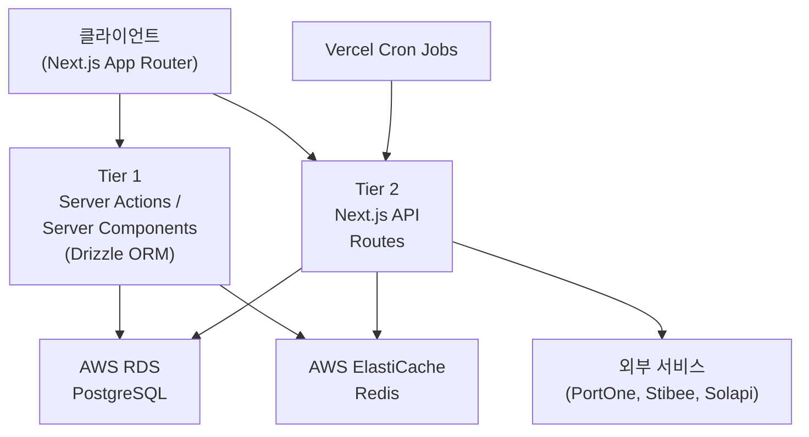
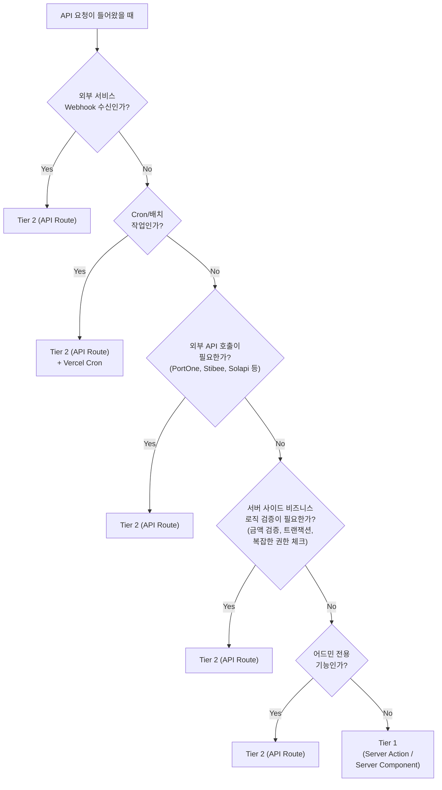

# GPTers 포털 리뉴얼 - API 설계서

> Next.js API Routes + Drizzle ORM + Self-build JWT 기반 전체 API 설계

| 항목 | 내용 |
|------|------|
| 문서 ID | renewal-03-api-design |
| 유형 | 설계 (Design) |
| 버전 | v2.0 |
| 작성일 | 2026-03-06 |
| 수정일 | 2026-03-07 |
| 상태 | Design |
| 선행 문서 | [renewal-plan-plus](../01-plan/gpters-renewal-plan-plus.md), [context-analysis](../01-plan/gpters-renewal-context-analysis.md), [RE-02 비즈니스 로직](./04-RE-02-business-logic.design.md), [tech-decision-matrix](../01-plan/tech-decision-matrix.md) |

---

## 목차

1. [API 아키텍처 개요](#1-api-아키텍처-개요)
2. [서버 데이터 접근 계층 (Drizzle ORM)](#2-서버-데이터-접근-계층-drizzle-orm)
3. [Next.js API Routes](#3-nextjs-api-routes)
4. [Vercel Cron Jobs](#4-vercel-cron-jobs)
5. [에러 응답 표준](#5-에러-응답-표준)
6. [레거시 tRPC → 리뉴얼 API 매핑표](#6-레거시-trpc--리뉴얼-api-매핑표)
7. [인증 및 인가 설계](#7-인증-및-인가-설계)

---

## 1. API 아키텍처 개요

### 1.1 2-Tier API 구조

리뉴얼 시스템은 보안 수준과 비즈니스 복잡도에 따라 2개 계층으로 API를 분류한다. 모든 데이터 접근은 서버 사이드에서 Drizzle ORM을 통해 이루어지며, 클라이언트에서 DB에 직접 접근하지 않는다.

> **v1.0에서의 변경**: 기존 3-Tier(Direct Client + API Routes + Edge Functions) 구조에서 2-Tier로 단순화. tech-decision-matrix에서 확정된 AWS RDS + Drizzle ORM + Self-build JWT 아키텍처를 반영.



### 1.2 Tier 분류 기준

| Tier | 이름 | 사용 조건 | 인증 방식 | 예시 |
|------|------|----------|----------|------|
| **Tier 1** | Server Actions / Server Components | 읽기 전용 조회 또는 단순 CRUD | JWT 세션 쿠키 (httpOnly) | 게시글 목록, 댓글 조회, 프로필 조회, 스터디 목록 |
| **Tier 2** | Next.js API Routes | 서버 사이드 검증/외부 API 호출/복잡한 트랜잭션 | Bearer Token + 미들웨어 인가 | 결제, 환불, 어드민, 수강 등록, Webhook |

### 1.3 Tier 선택 의사결정 트리



### 1.4 공통 TypeScript 타입

```typescript
// lib/types/api.ts

/** 표준 API 응답 타입 */
interface ApiResponse<T> {
  data: T;
  error: null;
}

/** 표준 API 에러 응답 */
interface ApiErrorResponse {
  data: null;
  error: {
    code: string;
    message: string;
    details?: Record<string, unknown>;
  };
}

/** 페이지네이션 요청 파라미터 */
interface PaginationParams {
  page?: number;
  limit?: number;       // 기본 20, 최대 100
  cursor?: string;      // 커서 기반 페이지네이션
}

/** 페이지네이션 응답 메타 */
interface PaginationMeta {
  total: number;
  page: number;
  limit: number;
  hasNext: boolean;
}

/** 정렬 파라미터 */
type SortOrder = 'asc' | 'desc';
```

---

## 2. 서버 데이터 접근 계층 (Drizzle ORM)

### 2.1 대상 기능

모든 데이터 접근은 서버 사이드에서 Drizzle ORM을 통해 수행한다. 클라이언트는 Server Component, Server Action, 또는 API Route를 통해서만 데이터에 접근한다. 인가(Authorization)는 애플리케이션 미들웨어에서 처리한다.

> **v1.0에서의 변경**: 기존의 클라이언트-사이드 직접 DB 쿼리(SDK `.from().select()` 패턴) 및 RLS 정책을 모두 제거. 서버 사이드 Drizzle ORM 쿼리 + 애플리케이션 레벨 인가로 전환.

### 2.2 게시글 (Posts)

#### 2.2.1 게시글 목록 조회

```typescript
// lib/queries/posts.ts (Server Component용)
import { db } from '@/lib/db';
import { posts, profiles, postTags } from '@/lib/db/schema';
import { eq, and, isNull, desc, asc, sql } from 'drizzle-orm';

export async function getPosts(params: {
  category?: string;
  sort?: 'popular' | 'latest';
  page?: number;
  limit?: number;
  cohortId?: number;
  studyId?: number;
}) {
  const page = params.page ?? 1;
  const limit = params.limit ?? 20;
  const offset = (page - 1) * limit;

  const conditions = [
    eq(posts.status, 'published'),
    isNull(posts.deletedAt),
  ];

  if (params.category) {
    conditions.push(eq(posts.category, params.category));
  }
  if (params.cohortId) {
    conditions.push(eq(posts.cohortId, params.cohortId));
  }
  if (params.studyId) {
    conditions.push(eq(posts.studyId, params.studyId));
  }

  const orderBy = params.sort === 'popular'
    ? desc(posts.voteCount)
    : desc(posts.createdAt);

  const [items, countResult] = await Promise.all([
    db
      .select({
        id: posts.id,
        title: posts.title,
        slug: posts.slug,
        excerpt: posts.excerpt,
        thumbnailUrl: posts.thumbnailUrl,
        category: posts.category,
        createdAt: posts.createdAt,
        updatedAt: posts.updatedAt,
        voteCount: posts.voteCount,
        commentCount: posts.commentCount,
        viewCount: posts.viewCount,
        authorId: profiles.id,
        authorNickname: profiles.nickname,
        authorAvatarUrl: profiles.avatarUrl,
      })
      .from(posts)
      .leftJoin(profiles, eq(posts.userId, profiles.id))
      .where(and(...conditions))
      .orderBy(orderBy)
      .limit(limit)
      .offset(offset),

    db
      .select({ count: sql<number>`count(*)` })
      .from(posts)
      .where(and(...conditions)),
  ]);

  return {
    items,
    total: countResult[0].count,
    page,
    limit,
    hasNext: offset + limit < countResult[0].count,
  };
}
```

#### 2.2.2 게시글 상세 조회

```typescript
// lib/queries/posts.ts
export async function getPostBySlug(slug: string) {
  const post = await db.query.posts.findFirst({
    where: and(
      eq(posts.slug, slug),
      eq(posts.status, 'published'),
      isNull(posts.deletedAt),
    ),
    with: {
      author: {
        columns: { id: true, nickname: true, avatarUrl: true, bio: true },
      },
      tags: true,
      comments: {
        where: isNull(comments.deletedAt),
        orderBy: asc(comments.createdAt),
        with: {
          author: {
            columns: { id: true, nickname: true, avatarUrl: true },
          },
        },
      },
    },
  });

  return post;
}
```

#### 2.2.3 게시글 CRUD (Server Actions)

```typescript
// lib/actions/posts.ts
'use server';

import { db } from '@/lib/db';
import { posts, postTags } from '@/lib/db/schema';
import { eq } from 'drizzle-orm';
import { requireAuth } from '@/lib/auth/session';
import { revalidatePath } from 'next/cache';

// 게시글 작성
export async function createPost(data: CreatePostInput) {
  const user = await requireAuth();

  const [post] = await db.insert(posts).values({
    title: data.title,
    content: data.content,
    slug: generateSlug(data.title),
    category: data.category,
    excerpt: data.excerpt,
    thumbnailUrl: data.thumbnailUrl,
    cohortId: data.cohortId,
    studyId: data.studyId,
    userId: user.id,
    status: 'published',
  }).returning();

  // 태그 저장
  if (data.tags?.length) {
    await db.insert(postTags).values(
      data.tags.map(tag => ({ postId: post.id, tag }))
    );
  }

  revalidatePath('/community');
  return post;
}

// 게시글 수정
export async function updatePost({ id, ...data }: UpdatePostInput) {
  const user = await requireAuth();
  await requirePostOwner(user.id, id);

  await db.update(posts)
    .set({
      title: data.title,
      content: data.content,
      excerpt: data.excerpt,
      thumbnailUrl: data.thumbnailUrl,
      category: data.category,
      updatedAt: new Date(),
    })
    .where(eq(posts.id, id));

  revalidatePath('/community');
}

// 게시글 삭제 (soft delete)
export async function deletePost(id: string) {
  const user = await requireAuth();
  await requirePostOwner(user.id, id);

  await db.update(posts)
    .set({ deletedAt: new Date() })
    .where(eq(posts.id, id));

  revalidatePath('/community');
}
```

#### 2.2.4 게시글 타입 정의

```typescript
// lib/types/post.ts

interface Post {
  id: string;
  title: string;
  slug: string;
  content: string;
  excerpt: string | null;
  thumbnail_url: string | null;
  category: PostCategory;
  status: 'draft' | 'published';
  user_id: string;
  cohort_id: number | null;
  study_id: number | null;
  vote_count: number;
  comment_count: number;
  view_count: number;
  created_at: string;
  updated_at: string;
  deleted_at: string | null;
}

type PostCategory =
  | 'case'           // 사례
  | 'question'       // 질문
  | 'free'           // 자유
  | 'notice'         // 공지
  | 'assignment';    // 과제

interface CreatePostInput {
  title: string;
  content: string;
  excerpt?: string;
  thumbnailUrl?: string;
  category: PostCategory;
  cohortId?: number;
  studyId?: number;
  tags?: string[];
}

interface UpdatePostInput extends Partial<CreatePostInput> {
  id: string;
}
```

### 2.3 투표 (Votes)

```typescript
// lib/actions/votes.ts
'use server';

import { db } from '@/lib/db';
import { votes } from '@/lib/db/schema';
import { and, eq } from 'drizzle-orm';
import { requireAuth } from '@/lib/auth/session';

export async function toggleVote({
  targetType,
  targetId,
  value, // 1 = upvote, -1 = downvote, 0 = 취소
}: VoteInput) {
  const user = await requireAuth();

  if (value === 0) {
    // 투표 취소
    await db.delete(votes)
      .where(
        and(
          eq(votes.userId, user.id),
          eq(votes.targetType, targetType),
          eq(votes.targetId, targetId),
        )
      );
  } else {
    // 투표 생성/수정 (upsert)
    await db
      .insert(votes)
      .values({
        userId: user.id,
        targetType,
        targetId,
        value,
      })
      .onConflictDoUpdate({
        target: [votes.userId, votes.targetType, votes.targetId],
        set: { value },
      });
  }

  // vote_count 트리거 또는 서비스 계층에서 집계 업데이트
  await updateVoteCount(targetType, targetId);
}

interface VoteInput {
  targetType: 'post' | 'comment';
  targetId: string;
  value: 1 | -1 | 0;
}
```

### 2.4 댓글 (Comments)

```typescript
// lib/queries/comments.ts

import { db } from '@/lib/db';
import { comments, profiles } from '@/lib/db/schema';
import { eq, and, isNull, asc } from 'drizzle-orm';

// 댓글 목록 조회 (SWR + polling 방식, MVP에서는 실시간 구독 대신 사용)
export async function getComments(postId: string) {
  const rows = await db
    .select({
      id: comments.id,
      content: comments.content,
      createdAt: comments.createdAt,
      updatedAt: comments.updatedAt,
      parentId: comments.parentId,
      voteCount: comments.voteCount,
      isHidden: comments.isHidden,
      authorId: profiles.id,
      authorNickname: profiles.nickname,
      authorAvatarUrl: profiles.avatarUrl,
    })
    .from(comments)
    .leftJoin(profiles, eq(comments.userId, profiles.id))
    .where(
      and(
        eq(comments.postId, postId),
        isNull(comments.deletedAt),
      )
    )
    .orderBy(asc(comments.createdAt));

  return buildCommentTree(rows); // 계층형 변환
}
```

```typescript
// lib/actions/comments.ts
'use server';

import { db } from '@/lib/db';
import { comments } from '@/lib/db/schema';
import { requireAuth } from '@/lib/auth/session';
import { revalidatePath } from 'next/cache';

// 댓글 작성
export async function createComment(data: CreateCommentInput) {
  const user = await requireAuth();

  await db.insert(comments).values({
    postId: data.postId,
    content: data.content,
    parentId: data.parentId ?? null,
    userId: user.id,
  });

  revalidatePath(`/community`);
}

interface CreateCommentInput {
  postId: string;
  content: string;
  parentId?: string;  // 대댓글인 경우
}
```

> **MVP 실시간 전략**: 레거시의 Realtime 채널 구독(`postgres_changes`) 대신, SWR의 `refreshInterval` (5초) 기반 polling을 사용한다. 향후 WebSocket 또는 SSE로 업그레이드 가능. (tech-decision-matrix 확정 사항)

### 2.5 프로필 (Profiles)

```typescript
// lib/queries/profiles.ts

import { db } from '@/lib/db';
import { profiles } from '@/lib/db/schema';
import { eq, and } from 'drizzle-orm';

// AI 이력서 페이지용 공개 프로필 조회
export async function getPublicProfile(slug: string) {
  const profile = await db.query.profiles.findFirst({
    where: and(
      eq(profiles.slug, slug),
      eq(profiles.isPublic, true),
    ),
    with: {
      studyUsers: {
        with: {
          study: {
            with: {
              cohort: { columns: { id: true, name: true, number: true } },
            },
            columns: { id: true, name: true, slug: true },
          },
        },
        columns: { role: true },
      },
      posts: {
        columns: { id: true, title: true, slug: true, excerpt: true, voteCount: true, createdAt: true, category: true },
      },
      certificates: {
        columns: { id: true, cohortName: true, studyName: true, issuedAt: true, type: true },
      },
    },
  });

  return profile;
}
```

```typescript
// lib/actions/profiles.ts
'use server';

import { db } from '@/lib/db';
import { profiles } from '@/lib/db/schema';
import { eq } from 'drizzle-orm';
import { requireAuth } from '@/lib/auth/session';

// 내 프로필 수정
export async function updateProfile(data: UpdateProfileInput) {
  const user = await requireAuth();

  await db.update(profiles)
    .set({
      nickname: data.nickname,
      bio: data.bio,
      avatarUrl: data.avatarUrl,
      isPublic: data.isPublic,
    })
    .where(eq(profiles.id, user.id));
}

interface UpdateProfileInput {
  nickname?: string;
  bio?: string;
  avatarUrl?: string;
  isPublic?: boolean;
}
```

### 2.6 스터디 조회 (Read-Only)

```typescript
// lib/queries/studies.ts

import { db } from '@/lib/db';
import { studies } from '@/lib/db/schema';
import { eq, and } from 'drizzle-orm';

export async function getStudies(params: {
  cohortId?: number;
  status?: 'recruiting' | 'running' | 'completed';
}) {
  const conditions = [eq(studies.isActive, true)];

  if (params.cohortId) {
    conditions.push(eq(studies.cohortId, params.cohortId));
  }
  if (params.status) {
    conditions.push(eq(studies.status, params.status));
  }

  return db.query.studies.findMany({
    where: and(...conditions),
    with: {
      cohort: {
        columns: { id: true, name: true, number: true, startsAt: true, endsAt: true },
      },
      leader: {
        columns: { id: true, nickname: true, avatarUrl: true },
      },
    },
    orderBy: studies.name,
  });
}

export async function getStudyBySlug(slug: string) {
  return db.query.studies.findFirst({
    where: eq(studies.slug, slug),
    with: {
      cohort: true,
      leader: {
        columns: { id: true, nickname: true, avatarUrl: true, bio: true },
      },
      weekSchedules: true,
      vodRecordings: true,
    },
  });
}
```

### 2.7 뉴스레터 구독

```typescript
// lib/actions/newsletter.ts
'use server';

import { db } from '@/lib/db';
import { newsletterSubscribers } from '@/lib/db/schema';

export async function subscribeNewsletter(email: string) {
  await db
    .insert(newsletterSubscribers)
    .values({ email, subscribedAt: new Date() })
    .onConflictDoUpdate({
      target: newsletterSubscribers.email,
      set: { subscribedAt: new Date() },
    });
}
```

### 2.8 인가 정책 요약 (애플리케이션 미들웨어)

모든 권한 제어는 애플리케이션 레벨 미들웨어에서 수행한다. 5개 역할(guest, member, student, leader, admin)에 따라 접근 제어를 적용한다.

> **v1.0에서의 변경**: 기존 DB 레벨 RLS(Row Level Security) 정책을 모두 제거하고, 애플리케이션 레벨 미들웨어 + 서비스 레이어에서 인가를 처리한다. (design-revision-supabase-removal U-5 확정)

| 테이블 | SELECT | INSERT | UPDATE | DELETE |
|--------|--------|--------|--------|--------|
| `posts` | guest: published만 / member+: 전체 | member+ | 본인만 | 본인만 (soft) |
| `comments` | guest: is_hidden=false만 | member+ | 본인만 | 본인만 (soft) |
| `votes` | 인증 사용자 | member+ | 본인만 | 본인만 |
| `profiles` | is_public=true 또는 본인 | - (가입 시 자동 생성) | 본인만 | - |
| `studies` | 모두 (공개) | admin | admin/leader | admin |
| `cohorts` | 모두 (공개) | admin | admin | admin |
| `newsletter_subscribers` | admin | 모두 | 본인 | admin |
| `vod_recordings` | 과제 제출 여부 서비스 로직으로 확인 | admin/leader | admin/leader | admin |

---

## 3. Next.js API Routes

서버 사이드 검증, 외부 API 호출, 복잡한 트랜잭션이 필요한 경우 사용한다.

### 3.1 /api/auth/* (인증)

| Method | Path | Auth | Request Body | Response | 비고 |
|--------|------|------|-------------|----------|------|
| POST | `/api/auth/callback` | - | `{ provider, code, redirectTo }` | `{ user, session }` | OAuth 콜백 처리 (카카오/네이버) |
| POST | `/api/auth/signup` | - | `SignupInput` | `{ user, session }` | 이메일 회원가입 |
| POST | `/api/auth/login` | - | `{ email, password }` | `{ user, session }` | 이메일 로그인 |
| POST | `/api/auth/magic-link` | - | `{ email }` | `{ message }` | 매직링크 발송 |
| POST | `/api/auth/verify-email` | - | `{ email, code }` | `{ verified }` | 이메일 인증 확인 |
| POST | `/api/auth/verify-phone` | Bearer | `{ phone, code? }` | `{ status }` | 전화번호 인증 (Solapi SMS) |
| POST | `/api/auth/reset-password` | - | `{ email }` | `{ message }` | 비밀번호 재설정 요청 |
| PUT | `/api/auth/update-password` | Bearer | `{ password, newPassword }` | `{ success }` | 비밀번호 변경 |
| POST | `/api/auth/logout` | Bearer | - | `{ success }` | 로그아웃 (Refresh Token 무효화) |
| POST | `/api/auth/refresh` | - | `{ refreshToken }` (httpOnly 쿠키) | `{ accessToken }` | Access Token 갱신 |
| DELETE | `/api/auth/withdraw` | Bearer | `{ reason? }` | `{ success }` | 회원 탈퇴 (PII 익명화) |

```typescript
// lib/types/auth.ts

interface SignupInput {
  email: string;
  password: string;
  name: string;
  nickname: string;
  phone?: string;
  agreements: {
    terms: boolean;       // 이용약관 (필수)
    privacy: boolean;     // 개인정보 (필수)
    marketing: boolean;   // 마케팅 (선택)
  };
  referrerCode?: string;  // 추천인 코드
}

interface AuthUser {
  id: string;
  email: string;
  name: string;
  nickname: string;
  phone: string | null;
  role: UserRole;
  avatarUrl: string | null;
  createdAt: string;
}

type UserRole = 'guest' | 'member' | 'student' | 'leader' | 'admin';
```

**비즈니스 규칙 보존:**
- 회원 탈퇴 시 PII 익명화 패턴 유지: `deleted__${timestamp}__${uuid}__${original}`
- Solapi SMS 인증 연동 유지
- 추천인 코드 처리

### 3.2 /api/payment/* (결제/환불)

| Method | Path | Auth | Request Body | Response | 비고 |
|--------|------|------|-------------|----------|------|
| POST | `/api/payment/prepare` | Bearer | `PreparePaymentInput` | `{ merchantUid, preparedAmount }` | 결제 사전 검증 (PortOne prepare) |
| POST | `/api/payment/complete` | Bearer | `CompletePaymentInput` | `{ order, payment, enrollment }` | 결제 완료 처리 |
| GET | `/api/payment/history` | Bearer | - | `OrderHistory[]` | 결제 내역 조회 |
| GET | `/api/payment/order/[orderId]` | Bearer | - | `OrderDetail` | 주문 상세 조회 |
| POST | `/api/payment/refund/request` | Bearer | `RefundRequestInput` | `{ refund, status }` | 환불 요청 |
| POST | `/api/payment/refund/execute` | Admin | `ExecuteRefundInput` | `{ refund, payment }` | 환불 실행 (관리자) |
| POST | `/api/payment/free-purchase` | Admin | `FreePurchaseInput` | `{ order, enrollment }` | 0원 결제 처리 |
| DELETE | `/api/payment/free-purchase/[orderId]` | Admin | - | `{ success }` | 0원 결제 삭제 |

```typescript
// lib/types/payment.ts

interface PreparePaymentInput {
  productId: number;
  couponIds?: number[];      // 적용할 쿠폰 ID 목록
}

interface CompletePaymentInput {
  impUid: string;            // PortOne 결제 고유번호
  merchantUid: string;       // 주문번호
  productId: number;
  studyId?: number;          // 선택한 스터디
  couponIds?: number[];
}

interface RefundRequestInput {
  orderId: number;
  reason: string;
}

interface ExecuteRefundInput {
  refundId: number;
  refundAmount: number;
  reason?: string;
}

interface FreePurchaseInput {
  userId: string;
  productId: number;
  studyId?: number;
  reason: string;            // 무료 등록 사유 (임직원, 스터디장 등)
}

interface OrderHistory {
  id: number;
  status: OrderStatus;
  totalAmount: number;
  paidAmount: number;
  paymentMethod: PaymentMethod;
  productName: string;
  cohortName: string;
  createdAt: string;
  isRefundable: boolean;
  refund: Refund | null;
}

type OrderStatus = 'Pending' | 'Completed' | 'Cancelled';
type PaymentStatus = 'Paid' | 'Cancel' | 'VBankReady' | 'Failed';
type PaymentMethod = 'Card' | 'Kakao' | 'VBank' | 'Toss' | 'None';
```

**비즈니스 규칙 보존 (Critical):**

| 규칙 | 레거시 위치 | 리뉴얼 처리 |
|------|-----------|-----------|
| 0원 결제 패턴 | `impUid: 'X-' + uuidV4()` | 동일 패턴 유지 |
| 금액 서버 검증 | PortOne API vs DB 비교 | `complete` 에서 반드시 검증 |
| 가상계좌 4일 만료 | `PendingPaymentExpireTime = 345600` | Vercel Cron으로 처리 |
| 연간멤버십 환불 계산 | `기수당 299,000원 차감` | `getRefundAmount()` 로직 보존 |
| 0원 결제 취소 시 Cancel | Payment.status를 Cancel로 | 동일 규칙 유지 |
| Webhook 멱등성 | Redis lock (`acquireWebhookLock`) | ElastiCache Redis 기반 멱등성 체크 |
| Serializable 트랜잭션 | 중복 수강등록 방지 | Drizzle 트랜잭션 + unique constraint |

### 3.3 /api/admin/* (어드민)

| Method | Path | Auth | Request Body | Response | 비고 |
|--------|------|------|-------------|----------|------|
| **기수 관리** | | | | | |
| GET | `/api/admin/cohorts` | Admin | - | `Cohort[]` | 전체 기수 목록 |
| POST | `/api/admin/cohorts` | Admin | `CreateCohortInput` | `Cohort` | 기수 생성 |
| PUT | `/api/admin/cohorts/[id]` | Admin | `UpdateCohortInput` | `Cohort` | 기수 수정 |
| DELETE | `/api/admin/cohorts/[id]` | Admin | - | `{ success }` | 기수 삭제 |
| **스터디 관리** | | | | | |
| GET | `/api/admin/studies` | Admin | query: `cohortId` | `Study[]` | 스터디 목록 |
| POST | `/api/admin/studies` | Admin | `CreateStudyInput` | `Study` | 스터디 생성 |
| PUT | `/api/admin/studies/[id]` | Admin | `UpdateStudyInput` | `Study` | 스터디 수정 |
| PATCH | `/api/admin/studies/[id]/toggle-submit` | Admin | - | `{ isSubmitted }` | 최종제출 토글 |
| **회원 관리** | | | | | |
| GET | `/api/admin/members` | Admin | query: `search, role, cohortId` | `Member[]` | 회원 검색/필터 |
| GET | `/api/admin/members/[id]` | Admin | - | `MemberDetail` | 회원 상세 |
| PUT | `/api/admin/members/[id]` | Admin | `UpdateMemberInput` | `Member` | 회원 수정 |
| PUT | `/api/admin/members/[id]/role` | Admin | `{ role }` | `{ success }` | 역할 변경 |
| **게시글 관리** | | | | | |
| GET | `/api/admin/posts` | Admin | query: `status, category` | `Post[]` | 게시글 목록 |
| PATCH | `/api/admin/posts/[id]/status` | Admin | `{ status }` | `Post` | 게시글 상태 변경 |
| DELETE | `/api/admin/posts/[id]` | Admin | - | `{ success }` | 게시글 삭제 |
| **결제/환급 관리** | | | | | |
| GET | `/api/admin/payments` | Admin | query: `cohortId, status` | `Payment[]` | 결제 목록 |
| GET | `/api/admin/refunds` | Admin | query: `status` | `Refund[]` | 환불 요청 목록 |
| POST | `/api/admin/refunds/[id]/approve` | Admin | `{ amount }` | `Refund` | 환불 승인 |
| POST | `/api/admin/refunds/[id]/reject` | Admin | `{ reason }` | `Refund` | 환불 거부 |
| GET | `/api/admin/refunds/eligible` | Admin | query: `cohortId` | `RefundEligible[]` | 환급 대상자 추출 |
| POST | `/api/admin/refunds/batch` | Admin | `{ userIds, cohortId }` | `{ processed }` | 일괄 환급 |
| **배너 관리** | | | | | |
| GET | `/api/admin/banners` | Admin | - | `Banner[]` | 배너 목록 |
| POST | `/api/admin/banners` | Admin | `CreateBannerInput` | `Banner` | 배너 생성 |
| PUT | `/api/admin/banners/[id]` | Admin | `UpdateBannerInput` | `Banner` | 배너 수정 |
| PATCH | `/api/admin/banners/reorder` | Admin | `{ ids: number[] }` | `{ success }` | 배너 순서 변경 |
| DELETE | `/api/admin/banners/[id]` | Admin | - | `{ success }` | 배너 삭제 |
| **수료/인증 관리** | | | | | |
| GET | `/api/admin/certificates/eligible` | Admin | query: `cohortId` | `CertEligible[]` | 수료 대상자 |
| POST | `/api/admin/certificates/batch` | Admin | `{ userIds, cohortId }` | `{ issued }` | 수료증 일괄 발급 |
| **쿠폰 관리** | | | | | |
| GET | `/api/admin/coupons` | Admin | - | `Coupon[]` | 쿠폰 목록 |
| POST | `/api/admin/coupons` | Admin | `CreateCouponInput` | `Coupon` | 쿠폰 생성 |
| PUT | `/api/admin/coupons/[id]` | Admin | `UpdateCouponInput` | `Coupon` | 쿠폰 수정 |
| DELETE | `/api/admin/coupons/[id]` | Admin | - | `{ success }` | 쿠폰 삭제 |
| GET | `/api/admin/invite-groups` | Admin | - | `InviteGroup[]` | 초대그룹 목록 |
| POST | `/api/admin/invite-groups` | Admin | `CreateInviteGroupInput` | `InviteGroup` | 초대그룹 생성 |

```typescript
// lib/types/admin.ts

interface CreateCohortInput {
  name: string;
  number: number;
  startsAt: string;           // ISO date
  endsAt: string;
  superEarlyBirdDeadline: string;
  earlyBirdDeadline: string;
  superEarlyBirdPrice: number;  // 예: 149000
  earlyBirdPrice: number;       // 예: 199000
  regularPrice: number;          // 예: 269000
}

interface CreateStudyInput {
  name: string;
  slug: string;
  description: string;
  cohortId: number;
  leaderUserId: string;
  dayOfWeek: number;           // 0=일, 1=월, ...
  startTime: string;           // "20:00"
  difficulty: 'beginner' | 'intermediate' | 'advanced';
  maxMembers: number;
  thumbnailUrl?: string;
}

interface CreateBannerInput {
  title: string;
  imageUrl: string;
  linkUrl: string;
  isActive: boolean;
  position: number;
  startDate?: string;
  endDate?: string;
}

interface CreateCouponInput {
  code: string;
  name: string;
  discountType: 'fixed' | 'percent';
  discountValue: number;
  maxUses: number | null;
  expiresAt: string | null;
  productIds?: number[];       // 특정 상품에만 적용
  minAmount?: number;          // 최소 결제 금액
  isAutoApply?: boolean;       // 자동 적용 쿠폰
}
```

### 3.4 /api/study/* (스터디 관리)

| Method | Path | Auth | Request Body | Response | 비고 |
|--------|------|------|-------------|----------|------|
| GET | `/api/study/current-price/[productId]` | - | - | `{ price, tier, deadline }` | 현재 가격 조회 (DB 함수) |
| GET | `/api/study/my` | Bearer | - | `MyStudyDashboard` | 내 스터디 대시보드 |
| GET | `/api/study/my/[studyId]/members` | Bearer | - | `StudyMember[]` | 스터디 멤버 목록 |
| GET | `/api/study/my/[studyId]/vod` | Bearer | - | `VodAccess[]` | VOD 접근 상태 (주차별) |
| POST | `/api/study/manage/[studyId]/notice` | Leader | `NoticeInput` | `Notice` | 공지 작성 (스터디장) |
| POST | `/api/study/manage/[studyId]/vod` | Leader | `VodInput` | `VodRecording` | VOD 등록 (스터디장) |
| GET | `/api/study/manage/[studyId]/assignment-status` | Leader | query: `week` | `AssignmentStatus[]` | 과제 현황 (스터디장) |
| GET | `/api/study/leaderboard/[cohortId]` | Bearer | - | `LeaderboardEntry[]` | 리더보드 |

```typescript
// lib/types/study.ts

interface MyStudyDashboard {
  currentCohort: {
    id: number;
    name: string;
    number: number;
    currentWeek: number;
    startsAt: string;
    endsAt: string;
  };
  enrolledStudies: EnrolledStudy[];
}

interface EnrolledStudy {
  id: number;
  name: string;
  slug: string;
  role: 'member' | 'leader' | 'buddy';
  dayOfWeek: number;
  startTime: string;
  leader: { nickname: string; avatarUrl: string | null };
  weeklyStatus: WeeklyStatus[];
}

interface WeeklyStatus {
  weekNumber: number;
  assignmentSubmitted: boolean;
  vodUnlocked: boolean;         // 과제 연동 권한
  zoomAttended: boolean;
  deadline: string;
}

interface VodAccess {
  weekNumber: number;
  title: string;
  youtubeUrl: string | null;
  isUnlocked: boolean;
  unlockCondition: string;     // "과제 제출 필요" or "접근 가능"
}

interface AssignmentStatus {
  userId: string;
  nickname: string;
  avatarUrl: string | null;
  weeklySubmissions: {
    weekNumber: number;
    submitted: boolean;
    postId: string | null;
    submittedAt: string | null;
  }[];
  totalSubmitted: number;
  attendanceCount: number;
}

interface LeaderboardEntry {
  rank: number;
  userId: string;
  nickname: string;
  avatarUrl: string | null;
  postCount: number;
  voteCount: number;
}
```

**과제 연동 권한 로직 (VOD 접근 제어):**

```typescript
// lib/services/vod-access.ts

import { db } from '@/lib/db';
import { posts } from '@/lib/db/schema';
import { and, eq, isNull, sql } from 'drizzle-orm';

/**
 * VOD 접근 권한을 확인한다.
 *
 * 규칙:
 * - 1주차: 모든 수강생 접근 가능
 * - 내 스터디: 과제 제출 여부 무관, 전체 접근
 * - 타 스터디 (2~4주차): 해당 주차 과제 1개 이상 제출 시에만 접근
 */
export async function checkVodAccess(
  userId: string,
  studyId: number,
  weekNumber: number,
  enrolledStudyIds: number[]
): Promise<boolean> {
  // 1주차는 항상 접근 가능
  if (weekNumber === 1) return true;

  // 내 스터디는 항상 접근 가능
  if (enrolledStudyIds.includes(studyId)) return true;

  // 타 스터디: 해당 주차 과제 제출 여부 확인
  const result = await db
    .select({ count: sql<number>`count(*)` })
    .from(posts)
    .where(
      and(
        eq(posts.userId, userId),
        eq(posts.category, 'assignment'),
        eq(posts.weekNumber, weekNumber),
        isNull(posts.deletedAt),
      )
    );

  return (result[0]?.count ?? 0) >= 1;
}
```

### 3.5 /api/enrollment/* (수강 등록)

| Method | Path | Auth | Request Body | Response | 비고 |
|--------|------|------|-------------|----------|------|
| POST | `/api/enrollment/create` | Bearer | `{ orderId, studyId }` | `Enrollment` | 수강 등록 (결제 완료 후) |
| GET | `/api/enrollment/status` | Bearer | query: `productId` | `{ isEnrolled, enrollment }` | 수강 상태 확인 |
| POST | `/api/enrollment/hold` | Bearer | - | `{ hold }` | 멤버십 홀드 신청 |
| POST | `/api/enrollment/hold/cancel` | Bearer | - | `{ hold }` | 홀드 취소 |
| GET | `/api/enrollment/membership` | Bearer | - | `MembershipDetail` | 멤버십 상세 |
| POST | `/api/enrollment/join-cohort` | Bearer | `{ cohortId }` | `Enrollment` | 기수 합류 (연간멤버십) |

```typescript
// lib/types/enrollment.ts

interface Enrollment {
  id: number;
  userId: string;
  productId: number;
  status: EnrollmentStatus;
  enrolledAt: string;
  cancelledAt: string | null;
  deletedAt: string | null;
}

type EnrollmentStatus = 'active' | 'cancelled' | 'hold' | 'expired';

interface MembershipDetail {
  status: 'active' | 'expired' | null;
  enrollment: Enrollment | null;
  holds: EnrollmentHold[];
  remainingHolds: number;        // 최대 2회
  cohortHistory: CohortParticipation[];
}

interface EnrollmentHold {
  id: number;
  status: 'active' | 'completed' | 'cancelled';
  startedAt: string;
  endedAt: string | null;
}
```

### 3.6 /api/webhook/* (외부 서비스 Webhook)

| Method | Path | Auth | Request Body | Response | 비고 |
|--------|------|------|-------------|----------|------|
| POST | `/api/webhook/portone` | PortOne 서명 | PortOne 콜백 | `200 OK` | 결제 완료/취소 Webhook |
| POST | `/api/webhook/n8n` | X-N8N-Secret | 이벤트 데이터 | `200 OK` | n8n 자동화 Webhook |

**PortOne Webhook 처리 플로우:**

```typescript
// app/api/webhook/portone/route.ts

import { db } from '@/lib/db';
import { redis } from '@/lib/redis';

export async function POST(req: NextRequest) {
  const body = await req.json();
  const { imp_uid, merchant_uid, status } = body;

  // 1. 멱등성 체크 (ElastiCache Redis)
  const lockKey = `webhook:portone:${imp_uid}`;
  const acquired = await redis.set(lockKey, '1', { NX: true, EX: 300 });
  if (!acquired) return NextResponse.json({ message: 'already processed' });

  // 2. PortOne API로 결제 데이터 검증
  const paymentData = await portoneGetPaymentData(imp_uid);

  // 3. 상태별 분기 처리 (Drizzle 트랜잭션)
  await db.transaction(async (tx) => {
    switch (status) {
      case 'paid':
        // 금액 서버 검증
        const product = await getProduct(tx, merchant_uid);
        if (paymentData.amount !== product.currentPrice) {
          await portoneCancel(imp_uid, '금액 불일치');
          throw new PaymentError('AMOUNT_MISMATCH');
        }
        // Order + Payment + Enrollment 생성
        await processPaymentComplete(tx, paymentData, merchant_uid);
        break;

      case 'vbank_issued':
        // 가상계좌 발급: Payment 생성 (VBankReady)
        await processVBankIssued(tx, paymentData, merchant_uid);
        break;

      case 'cancelled':
        // 결제 취소: 상태 업데이트
        await processPaymentCancelled(tx, imp_uid);
        break;
    }
  });

  return NextResponse.json({ success: true });
}
```

### 3.7 /api/coupon/* (쿠폰)

| Method | Path | Auth | Request Body | Response | 비고 |
|--------|------|------|-------------|----------|------|
| GET | `/api/coupon/check` | - | query: `code` | `CouponInfo` | 쿠폰 코드 확인 |
| POST | `/api/coupon/apply` | Bearer | `{ code, productId? }` | `UserCoupon` | 쿠폰 발급 |
| GET | `/api/coupon/my` | Bearer | query: `productId?` | `UserCoupon[]` | 내 쿠폰 목록 |
| POST | `/api/coupon/invite` | Bearer | `{ referrerCode }` | `UserCoupon` | 초대 쿠폰 발급 |

### 3.8 /api/search/* (검색)

| Method | Path | Auth | Request Body | Response | 비고 |
|--------|------|------|-------------|----------|------|
| GET | `/api/search` | - | query: `q, type?, category?, page?, limit?` | `SearchResult` | 통합 검색 |

```typescript
// lib/types/search.ts

interface SearchResult {
  posts: {
    items: PostSummary[];
    total: number;
  };
  studies: {
    items: StudySummary[];
    total: number;
  };
  profiles: {
    items: ProfileSummary[];
    total: number;
  };
}
```

### 3.9 /api/upload/* (파일 업로드)

| Method | Path | Auth | Request Body | Response | 비고 |
|--------|------|------|-------------|----------|------|
| POST | `/api/upload/image` | Bearer | `FormData (file)` | `{ url }` | 이미지 업로드 (AWS S3) |
| POST | `/api/upload/presigned` | Bearer | `{ filename, contentType }` | `{ signedUrl, path }` | S3 Presigned URL 발급 |

---

## 4. Vercel Cron Jobs

> **v1.0에서의 변경**: 기존 Edge Functions(Deno 기반) 섹션을 Vercel Cron Jobs로 전환. 결제 Webhook은 API Route(/api/webhook/portone)에서 처리하며, Cron 전용 작업만 이 섹션에 포함.

### 4.1 vbank-expiry-check

만료된 가상계좌 결제를 자동 취소한다.

```
트리거: Vercel Cron (매 시간, `0 * * * *`)
엔드포인트: GET /api/cron/vbank-expiry
인증: CRON_SECRET 헤더 검증
처리:
  1. payments 테이블에서 status='VBankReady' AND created_at < now() - 4days 조회 (Drizzle)
  2. PortOne API로 결제 취소
  3. Payment.status -> 'Cancel'
  4. Order.status -> 'Cancelled'
```

### 4.2 newsletter-sync

Stibee 뉴스레터 구독자를 동기화한다.

```
트리거: Vercel Cron (매일 03:00, `0 3 * * *`)
엔드포인트: GET /api/cron/newsletter-sync
인증: CRON_SECRET 헤더 검증
처리:
  1. newsletter_subscribers 테이블에서 신규/변경 구독자 조회 (Drizzle)
  2. Stibee API로 구독자 추가/제거
  3. 동기화 상태 업데이트
```

### 4.3 price-check-notification

가격 전환 시점에 알림을 발송한다.

```
트리거: Vercel Cron (매일 09:00, `0 9 * * *`)
엔드포인트: GET /api/cron/price-check
인증: CRON_SECRET 헤더 검증
처리:
  1. cohorts 테이블에서 오늘 마감인 가격 단계 확인 (Drizzle)
  2. 슈퍼얼리버드 -> 얼리버드 전환 시 알림
  3. 얼리버드 -> 일반가 전환 시 알림
  4. Slack/운영 채널 알림
```

> 참고: 실제 가격 전환은 DB 함수 `get_current_price(product_id)`로 조회 시점에 실시간 계산되므로 별도 상태 변경 없음.

### 4.4 certificate-generate

수료증을 자동 생성한다.

```
트리거: 관리자 일괄 발급 API 호출 시 / Vercel Cron (기수 종료 후)
엔드포인트: GET /api/cron/certificate-generate
인증: CRON_SECRET 헤더 검증
처리:
  1. 수료 대상자 조건 확인 (출석 + 과제 제출) (Drizzle)
  2. 수료증 PDF 생성 (HTML -> PDF)
  3. AWS S3에 업로드
  4. certificates 테이블에 레코드 생성 (Drizzle)
  5. 이메일/알림톡 발송
```

### 4.5 payment-consistency-check

결제/수강 데이터 정합성을 검사한다.

```
트리거: Vercel Cron (매일 00:00, `0 0 * * *`)
엔드포인트: GET /api/cron/payment-consistency
인증: CRON_SECRET 헤더 검증
처리:
  1. Payment=Paid인데 Enrollment 없는 케이스 확인 (Drizzle)
  2. Enrollment=Active인데 Payment 없는 케이스 확인 (Drizzle)
  3. 불일치 발견 시 Slack 알림
```

### 4.6 account-status-update

계정 상태를 자동 업데이트한다.

```
트리거: Vercel Cron (매 시간, `0 * * * *`)
엔드포인트: GET /api/cron/account-status
인증: CRON_SECRET 헤더 검증
처리:
  1. 만료된 멤버십 상태 업데이트 (Drizzle)
  2. 홀드 완료 처리
```

### 4.7 Vercel Cron 전체 목록

| Cron Job | 엔드포인트 | 스케줄 | 외부 서비스 | 레거시 대응 |
|----------|-----------|--------|-----------|-----------|
| `vbank-expiry-check` | `GET /api/cron/vbank-expiry` | `0 * * * *` | PortOne | `/api/vbank-expired` |
| `newsletter-sync` | `GET /api/cron/newsletter-sync` | `0 3 * * *` | Stibee | `/api/sync-newsletter` |
| `price-check-notification` | `GET /api/cron/price-check` | `0 9 * * *` | Slack | 수동 확인 |
| `certificate-generate` | `GET /api/cron/certificate-generate` | 기수 종료 후 | - | 수동 발급 |
| `payment-consistency-check` | `GET /api/cron/payment-consistency` | `0 0 * * *` | Slack | `/api/payment-consistency` |
| `account-status-update` | `GET /api/cron/account-status` | `0 * * * *` | - | `/api/update-status` |

### 4.8 Vercel Cron 설정

```json
// vercel.json
{
  "crons": [
    { "path": "/api/cron/vbank-expiry", "schedule": "0 * * * *" },
    { "path": "/api/cron/newsletter-sync", "schedule": "0 3 * * *" },
    { "path": "/api/cron/price-check", "schedule": "0 9 * * *" },
    { "path": "/api/cron/payment-consistency", "schedule": "0 0 * * *" },
    { "path": "/api/cron/account-status", "schedule": "0 * * * *" }
  ]
}
```

### 4.9 Cron 인증 미들웨어

```typescript
// lib/auth/cron-guard.ts

export function verifyCronSecret(req: NextRequest): boolean {
  const authHeader = req.headers.get('authorization');
  return authHeader === `Bearer ${process.env.CRON_SECRET}`;
}
```

> **주의**: Vercel Cron은 자동으로 `CRON_SECRET`을 `Authorization: Bearer <secret>` 헤더로 전송한다. 외부 호출 방지를 위해 반드시 검증한다.

---

## 5. 에러 응답 표준

### 5.1 에러 코드 체계

에러 코드는 `도메인_에러유형` 형식을 사용한다.

```typescript
// lib/errors/error-codes.ts

export const ErrorCodes = {
  // 인증 (AUTH_)
  AUTH_INVALID_CREDENTIALS: 'AUTH_INVALID_CREDENTIALS',
  AUTH_TOKEN_EXPIRED: 'AUTH_TOKEN_EXPIRED',
  AUTH_REFRESH_TOKEN_INVALID: 'AUTH_REFRESH_TOKEN_INVALID',
  AUTH_INSUFFICIENT_ROLE: 'AUTH_INSUFFICIENT_ROLE',
  AUTH_EMAIL_ALREADY_EXISTS: 'AUTH_EMAIL_ALREADY_EXISTS',
  AUTH_PHONE_ALREADY_EXISTS: 'AUTH_PHONE_ALREADY_EXISTS',
  AUTH_VERIFY_CODE_INVALID: 'AUTH_VERIFY_CODE_INVALID',
  AUTH_VERIFY_CODE_EXPIRED: 'AUTH_VERIFY_CODE_EXPIRED',

  // 결제 (PAYMENT_)
  PAYMENT_AMOUNT_MISMATCH: 'PAYMENT_AMOUNT_MISMATCH',
  PAYMENT_ALREADY_PAID: 'PAYMENT_ALREADY_PAID',
  PAYMENT_CANCELLED: 'PAYMENT_CANCELLED',
  PAYMENT_PG_ERROR: 'PAYMENT_PG_ERROR',
  PAYMENT_VBANK_EXPIRED: 'PAYMENT_VBANK_EXPIRED',

  // 환불 (REFUND_)
  REFUND_NOT_ELIGIBLE: 'REFUND_NOT_ELIGIBLE',
  REFUND_PERIOD_EXCEEDED: 'REFUND_PERIOD_EXCEEDED',
  REFUND_ALREADY_PROCESSED: 'REFUND_ALREADY_PROCESSED',
  REFUND_AMOUNT_EXCEEDED: 'REFUND_AMOUNT_EXCEEDED',

  // 수강 (ENROLLMENT_)
  ENROLLMENT_DUPLICATE: 'ENROLLMENT_DUPLICATE',
  ENROLLMENT_NOT_FOUND: 'ENROLLMENT_NOT_FOUND',
  ENROLLMENT_HOLD_LIMIT: 'ENROLLMENT_HOLD_LIMIT',
  ENROLLMENT_NOT_ACTIVE: 'ENROLLMENT_NOT_ACTIVE',

  // 쿠폰 (COUPON_)
  COUPON_NOT_FOUND: 'COUPON_NOT_FOUND',
  COUPON_EXPIRED: 'COUPON_EXPIRED',
  COUPON_ALREADY_USED: 'COUPON_ALREADY_USED',
  COUPON_LIMIT_EXCEEDED: 'COUPON_LIMIT_EXCEEDED',
  COUPON_NOT_APPLICABLE: 'COUPON_NOT_APPLICABLE',

  // 스터디 (STUDY_)
  STUDY_NOT_FOUND: 'STUDY_NOT_FOUND',
  STUDY_FULL: 'STUDY_FULL',
  STUDY_NOT_RECRUITING: 'STUDY_NOT_RECRUITING',

  // 게시글 (POST_)
  POST_NOT_FOUND: 'POST_NOT_FOUND',
  POST_PERMISSION_DENIED: 'POST_PERMISSION_DENIED',

  // 일반 (GENERAL_)
  GENERAL_NOT_FOUND: 'GENERAL_NOT_FOUND',
  GENERAL_BAD_REQUEST: 'GENERAL_BAD_REQUEST',
  GENERAL_INTERNAL_ERROR: 'GENERAL_INTERNAL_ERROR',
  GENERAL_RATE_LIMIT: 'GENERAL_RATE_LIMIT',
  GENERAL_VALIDATION_ERROR: 'GENERAL_VALIDATION_ERROR',
} as const;
```

### 5.2 에러 응답 JSON 포맷

```typescript
// 성공 응답
{
  "data": { ... },
  "error": null
}

// 에러 응답
{
  "data": null,
  "error": {
    "code": "PAYMENT_AMOUNT_MISMATCH",
    "message": "결제 금액이 일치하지 않습니다.",
    "details": {
      "expected": 199000,
      "actual": 149000
    }
  }
}

// 유효성 검증 에러 (복수 필드)
{
  "data": null,
  "error": {
    "code": "GENERAL_VALIDATION_ERROR",
    "message": "입력값이 올바르지 않습니다.",
    "details": {
      "fields": {
        "email": "올바른 이메일 형식이 아닙니다.",
        "phone": "전화번호는 010으로 시작해야 합니다."
      }
    }
  }
}
```

### 5.3 HTTP 상태 코드 사용 규칙

| 상태 코드 | 의미 | 사용 시점 |
|-----------|------|----------|
| **200** | 성공 | 조회, 수정, 삭제 성공 |
| **201** | 생성 성공 | POST로 리소스 생성 성공 |
| **204** | No Content | 삭제 성공 (응답 본문 없음) |
| **400** | Bad Request | 유효성 검증 실패, 잘못된 요청 |
| **401** | Unauthorized | 인증 필요 (토큰 없음/만료) |
| **403** | Forbidden | 권한 부족 (역할 부적합) |
| **404** | Not Found | 리소스 없음 |
| **409** | Conflict | 중복 (이메일, 수강등록 등) |
| **422** | Unprocessable Entity | 비즈니스 규칙 위반 (환불 불가 등) |
| **429** | Too Many Requests | Rate Limit 초과 |
| **500** | Internal Server Error | 서버 내부 오류 |

### 5.4 에러 헬퍼 함수

```typescript
// lib/errors/api-error.ts

export class ApiError extends Error {
  constructor(
    public statusCode: number,
    public code: string,
    message: string,
    public details?: Record<string, unknown>,
  ) {
    super(message);
  }
}

export function errorResponse(error: ApiError): NextResponse {
  return NextResponse.json(
    {
      data: null,
      error: {
        code: error.code,
        message: error.message,
        details: error.details,
      },
    },
    { status: error.statusCode }
  );
}

// 운영 환경에서는 INTERNAL_ERROR 상세 메시지 마스킹
export function handleApiError(error: unknown): NextResponse {
  if (error instanceof ApiError) {
    return errorResponse(error);
  }

  console.error('[API Error]', error);

  return NextResponse.json(
    {
      data: null,
      error: {
        code: ErrorCodes.GENERAL_INTERNAL_ERROR,
        message: process.env.NODE_ENV === 'production'
          ? '서버 오류가 발생했습니다.'
          : (error instanceof Error ? error.message : 'Unknown error'),
      },
    },
    { status: 500 }
  );
}
```

---

## 6. 레거시 tRPC -> 리뉴얼 API 매핑표

### 6.1 Public 라우터 (55 프로시저)

#### auth (15 프로시저)

| Legacy tRPC Procedure | Renewal API | Tier |
|----------------------|-------------|------|
| `auth.checkEmailStatus` | `POST /api/auth/login` (사전 체크) | Tier 2 |
| `auth.setRedirectUrl` | 클라이언트 쿠키 직접 설정 | 제거 |
| `auth.logout` | `POST /api/auth/logout` | Tier 2 |
| `auth.sendLoginVerifyEmail` | `POST /api/auth/magic-link` | Tier 2 |
| `auth.loginWithEmail` | `POST /api/auth/login` | Tier 2 |
| `auth.loginWithPassword` | `POST /api/auth/login` | Tier 2 |
| `auth.signup` | `POST /api/auth/signup` | Tier 2 |
| `auth.completeSocialSignup` | `POST /api/auth/callback` | Tier 2 |
| `auth.sendFindAccountVerify` | `POST /api/auth/reset-password` | Tier 2 |
| `auth.verifyFindAccount` | `POST /api/auth/verify-email` | Tier 2 |
| `auth.sendSignupPhoneVerify` | `POST /api/auth/verify-phone` | Tier 2 |
| `auth.verifySignupPhone` | `POST /api/auth/verify-phone` | Tier 2 |
| `auth.generateResetPasswordId` | `POST /api/auth/reset-password` | Tier 2 |
| `auth.verifyResetPasswordId` | `PUT /api/auth/update-password` | Tier 2 |
| `auth.createSignupCode` | 자체 JWT 인증 내장 처리 | 제거 (자체 인증으로 대체) |

#### users (8 프로시저)

| Legacy tRPC Procedure | Renewal API | Tier |
|----------------------|-------------|------|
| `users.profile` | Server Component에서 Drizzle ORM 조회 | Tier 1 |
| `users.updateEmailRequest` | `PUT /api/auth/update-email` | Tier 2 |
| `users.updateEmailVerify` | `PUT /api/auth/update-email` | Tier 2 |
| `users.updatePhoneRequest` | `POST /api/auth/verify-phone` | Tier 2 |
| `users.updatePhoneVerify` | `POST /api/auth/verify-phone` | Tier 2 |
| `users.update` | Server Action `updateProfile()` | Tier 1 |
| `users.mergeAccount` | `POST /api/auth/merge` (v2.0) | Tier 2 (향후) |
| `users.coupons` | `GET /api/coupon/my` | Tier 2 |

#### payments (7 프로시저)

| Legacy tRPC Procedure | Renewal API | Tier |
|----------------------|-------------|------|
| `payments.history` | `GET /api/payment/history` | Tier 2 |
| `payments.orderDetail` | `GET /api/payment/order/[orderId]` | Tier 2 |
| `payments.beforePay` | `POST /api/payment/prepare` | Tier 2 |
| `payments.afterPay` | `POST /api/payment/complete` | Tier 2 |
| `payments.requestRefund` | `POST /api/payment/refund/request` | Tier 2 |
| `payments.getOrderByOrderItemId` | `GET /api/payment/order/[orderId]` | Tier 2 |
| `payments.checkPendingPayment` | `GET /api/payment/order/[orderId]` | Tier 2 |

#### coupon (6 프로시저)

| Legacy tRPC Procedure | Renewal API | Tier |
|----------------------|-------------|------|
| `coupon.couponInfoByCode` | `GET /api/coupon/check?code=xxx` | Tier 2 |
| `coupon.applyCoupon` | `POST /api/coupon/apply` | Tier 2 |
| `coupon.availableCoupons` | `GET /api/coupon/my?productId=xxx` | Tier 2 |
| `coupon.deleteCoupon` | `DELETE /api/coupon/[id]` | Tier 2 |
| `coupon.applyInviteGroupCoupon` | `POST /api/coupon/invite` | Tier 2 |
| `coupon.inviteGroupCouponInfo` | `GET /api/coupon/check?code=xxx` | Tier 2 |

#### study (5 프로시저)

| Legacy tRPC Procedure | Renewal API | Tier |
|----------------------|-------------|------|
| `study.products` | Server Component에서 Drizzle ORM 조회 | Tier 1 |
| `study.requestPurchase` | `POST /api/payment/prepare` | Tier 2 |
| `study.loadPurchasePage` | 클라이언트 라우팅 | 제거 |
| `study.getOrderById` | `GET /api/payment/order/[orderId]` | Tier 2 |
| `study.currentStudy` | `GET /api/study/my` | Tier 2 |

#### enrollment (3 프로시저)

| Legacy tRPC Procedure | Renewal API | Tier |
|----------------------|-------------|------|
| `enrollment.getCurrentMembership` | `GET /api/enrollment/membership` | Tier 2 |
| `enrollment.requestHold` | `POST /api/enrollment/hold` | Tier 2 |
| `enrollment.cancelHold` | `POST /api/enrollment/hold/cancel` | Tier 2 |

#### admin (9 프로시저)

| Legacy tRPC Procedure | Renewal API | Tier |
|----------------------|-------------|------|
| `admin.apiKeys.list` | `GET /api/admin/api-keys` | Tier 2 |
| `admin.apiKeys.create` | `POST /api/admin/api-keys` | Tier 2 |
| `admin.apiKeys.revoke` | `DELETE /api/admin/api-keys/[id]` | Tier 2 |
| `admin.apiKeys.update` | `PUT /api/admin/api-keys/[id]` | Tier 2 |
| `admin.oauthClients.list` | 제거 (BM OAuth 불필요) | 제거 |
| `admin.oauthClients.create` | 제거 | 제거 |
| `admin.oauthClients.update` | 제거 | 제거 |
| `admin.oauthClients.delete` | 제거 | 제거 |
| `admin.oauthClients.regenerateSecret` | 제거 | 제거 |

#### storage (1 프로시저)

| Legacy tRPC Procedure | Renewal API | Tier |
|----------------------|-------------|------|
| `storage.getPresignedUrl` | `POST /api/upload/presigned` | Tier 2 |

#### calendar (1 프로시저)

| Legacy tRPC Procedure | Renewal API | Tier |
|----------------------|-------------|------|
| `calendar.getCalendarUrl` | Server Component에서 Drizzle ORM 조회 | Tier 1 |

### 6.2 Internal 라우터 (97 프로시저)

#### internal.bettermode (3 프로시저)

| Legacy tRPC Procedure | Renewal API | Tier |
|----------------------|-------------|------|
| `internal.bettermode.randomPost` | 제거 (BM 불필요) | 제거 |
| `internal.bettermode.findStudy` | `GET /api/admin/studies?search=xxx` | Tier 2 |
| `internal.bettermode.syncTemplates` | 제거 (BM 불필요) | 제거 |

#### internal.product (8 프로시저)

| Legacy tRPC Procedure | Renewal API | Tier |
|----------------------|-------------|------|
| `internal.product.getAllProducts` | `GET /api/admin/products` | Tier 2 |
| `internal.product.getProduct` | `GET /api/admin/products/[id]` | Tier 2 |
| `internal.product.createProduct` | `POST /api/admin/products` | Tier 2 |
| `internal.product.updateProduct` | `PUT /api/admin/products/[id]` | Tier 2 |
| `internal.product.deleteProduct` | `DELETE /api/admin/products/[id]` | Tier 2 |
| `internal.product.getProductsByPostId` | Server Component에서 Drizzle ORM 조회 | Tier 1 |
| `internal.product.linkPostToProduct` | `PUT /api/admin/products/[id]` | Tier 2 |
| `internal.product.unlinkPostFromProduct` | `PUT /api/admin/products/[id]` | Tier 2 |

#### internal.cohort (5 프로시저)

| Legacy tRPC Procedure | Renewal API | Tier |
|----------------------|-------------|------|
| `internal.cohort.getAll` | `GET /api/admin/cohorts` | Tier 2 |
| `internal.cohort.getById` | `GET /api/admin/cohorts/[id]` | Tier 2 |
| `internal.cohort.create` | `POST /api/admin/cohorts` | Tier 2 |
| `internal.cohort.update` | `PUT /api/admin/cohorts/[id]` | Tier 2 |
| `internal.cohort.delete` | `DELETE /api/admin/cohorts/[id]` | Tier 2 |

#### internal.coupon (8 프로시저)

| Legacy tRPC Procedure | Renewal API | Tier |
|----------------------|-------------|------|
| `internal.coupon.getAll` | `GET /api/admin/coupons` | Tier 2 |
| `internal.coupon.getById` | `GET /api/admin/coupons/[id]` | Tier 2 |
| `internal.coupon.create` | `POST /api/admin/coupons` | Tier 2 |
| `internal.coupon.update` | `PUT /api/admin/coupons/[id]` | Tier 2 |
| `internal.coupon.delete` | `DELETE /api/admin/coupons/[id]` | Tier 2 |
| `internal.coupon.getUsage` | `GET /api/admin/coupons/[id]/usage` | Tier 2 |
| `internal.coupon.issueBulk` | `POST /api/admin/coupons/[id]/issue-bulk` | Tier 2 |
| `internal.coupon.revoke` | `DELETE /api/admin/coupons/[id]/users/[userId]` | Tier 2 |

#### internal.payments + payment (9 프로시저)

| Legacy tRPC Procedure | Renewal API | Tier |
|----------------------|-------------|------|
| `internal.payments.getAll` | `GET /api/admin/payments` | Tier 2 |
| `internal.payments.getByUser` | `GET /api/admin/payments?userId=xxx` | Tier 2 |
| `internal.payments.cancelPayment` | `POST /api/admin/payments/[id]/cancel` | Tier 2 |
| `internal.payments.manualRefund` | `POST /api/payment/refund/execute` | Tier 2 |
| `internal.payments.getOrderHistory` | `GET /api/admin/payments` | Tier 2 |
| `internal.payment.getAll` | `GET /api/admin/payments` (통합) | Tier 2 |
| `internal.payment.getById` | `GET /api/admin/payments/[id]` | Tier 2 |
| `internal.payment.update` | `PUT /api/admin/payments/[id]` | Tier 2 |
| `internal.payment.getPendingVBanks` | `GET /api/admin/payments?status=VBankReady` | Tier 2 |

#### internal.user (4 프로시저)

| Legacy tRPC Procedure | Renewal API | Tier |
|----------------------|-------------|------|
| `internal.user.getAll` | `GET /api/admin/members` | Tier 2 |
| `internal.user.getById` | `GET /api/admin/members/[id]` | Tier 2 |
| `internal.user.update` | `PUT /api/admin/members/[id]` | Tier 2 |
| `internal.user.delete` | `DELETE /api/auth/withdraw` (관리자) | Tier 2 |

#### internal.study-* (9 프로시저)

| Legacy tRPC Procedure | Renewal API | Tier |
|----------------------|-------------|------|
| `internal.study-internal.getAll` | `GET /api/admin/studies` | Tier 2 |
| `internal.study-internal.getById` | `GET /api/admin/studies/[id]` | Tier 2 |
| `internal.study-internal.create` | `POST /api/admin/studies` | Tier 2 |
| `internal.study-internal.update` | `PUT /api/admin/studies/[id]` | Tier 2 |
| `internal.study-user.getAll` | `GET /api/admin/study-users?studyId=xxx` | Tier 2 |
| `internal.study-user.create` | `POST /api/admin/study-users` | Tier 2 |
| `internal.study-user.update` | `PUT /api/admin/study-users/[id]` | Tier 2 |
| `internal.study-user.delete` | `DELETE /api/admin/study-users/[id]` | Tier 2 |
| `internal.study.getCurrentCohort` | `GET /api/admin/cohorts?status=running` | Tier 2 |

#### internal.enrollment-hold (6 프로시저)

| Legacy tRPC Procedure | Renewal API | Tier |
|----------------------|-------------|------|
| `internal.enrollment-hold.getAll` | `GET /api/admin/enrollment-holds` | Tier 2 |
| `internal.enrollment-hold.getById` | `GET /api/admin/enrollment-holds/[id]` | Tier 2 |
| `internal.enrollment-hold.create` | `POST /api/admin/enrollment-holds` | Tier 2 |
| `internal.enrollment-hold.update` | `PUT /api/admin/enrollment-holds/[id]` | Tier 2 |
| `internal.enrollment-hold.delete` | `DELETE /api/admin/enrollment-holds/[id]` | Tier 2 |
| `internal.enrollment-hold.processAdmin` | `POST /api/admin/enrollment-holds/process` | Tier 2 |

#### internal.invite-group (10 프로시저)

| Legacy tRPC Procedure | Renewal API | Tier |
|----------------------|-------------|------|
| `internal.invite-group.getAll` | `GET /api/admin/invite-groups` | Tier 2 |
| `internal.invite-group.getById` | `GET /api/admin/invite-groups/[id]` | Tier 2 |
| `internal.invite-group.create` | `POST /api/admin/invite-groups` | Tier 2 |
| `internal.invite-group.update` | `PUT /api/admin/invite-groups/[id]` | Tier 2 |
| `internal.invite-group.delete` | `DELETE /api/admin/invite-groups/[id]` | Tier 2 |
| `internal.invite-group.getMembers` | `GET /api/admin/invite-groups/[id]/members` | Tier 2 |
| `internal.invite-group.addMember` | `POST /api/admin/invite-groups/[id]/members` | Tier 2 |
| `internal.invite-group.removeMember` | `DELETE /api/admin/invite-groups/[id]/members/[userId]` | Tier 2 |
| `internal.invite-group.getCoupons` | `GET /api/admin/invite-groups/[id]/coupons` | Tier 2 |
| `internal.invite-group.assignCoupon` | `POST /api/admin/invite-groups/[id]/coupons` | Tier 2 |

#### internal.email (7 프로시저)

| Legacy tRPC Procedure | Renewal API | Tier |
|----------------------|-------------|------|
| `internal.email.sendTemplate` | `POST /api/admin/email/send` | Tier 2 |
| `internal.email.sendBulk` | `POST /api/admin/email/send-bulk` | Tier 2 |
| `internal.email.getTemplates` | `GET /api/admin/email/templates` | Tier 2 |
| `internal.email.getTemplate` | `GET /api/admin/email/templates/[id]` | Tier 2 |
| `internal.email.createTemplate` | `POST /api/admin/email/templates` | Tier 2 |
| `internal.email.updateTemplate` | `PUT /api/admin/email/templates/[id]` | Tier 2 |
| `internal.email.deleteTemplate` | `DELETE /api/admin/email/templates/[id]` | Tier 2 |

#### internal.community-post (3 프로시저) - BM 의존

| Legacy tRPC Procedure | Renewal API | Tier |
|----------------------|-------------|------|
| `internal.community-post.getAll` | Server Component에서 Drizzle ORM `posts` 조회 | Tier 1 |
| `internal.community-post.getById` | Server Component에서 Drizzle ORM `posts` 조회 | Tier 1 |
| `internal.community-post.sync` | 제거 (BM 불필요) | 제거 |

#### 기타 internal (remaining 프로시저)

| Legacy tRPC Procedure | Renewal API | Tier |
|----------------------|-------------|------|
| `internal.order.*` (3) | `GET/PUT /api/admin/orders/*` | Tier 2 |
| `internal.refund.*` (2) | `GET/PUT /api/admin/refunds/*` | Tier 2 |
| `internal.user-agreement.*` (3) | Server Action (Drizzle ORM) | Tier 1 |
| `internal.user-enrollment.*` (1) | `GET /api/admin/enrollments` | Tier 2 |
| `internal.user-enrollment-internal.*` (4) | `*/api/admin/enrollments/*` | Tier 2 |
| `internal.user-coupon-use.*` (1) | `GET /api/admin/coupon-usage` | Tier 2 |
| `internal.study-calendar.*` (5) | `*/api/admin/study-calendars/*` | Tier 2 |
| `internal.calendar.*` (1) | Server Component에서 Drizzle ORM 조회 | Tier 1 |
| `internal.internal.*` (5) | 각 도메인 API로 분산 | Tier 2 |

### 6.3 API Route (45개 route.ts)

#### BM 관련 API (16개) - 전체 제거

| Legacy API | Renewal | 비고 |
|-----------|---------|------|
| `/api/bettermode/webhook` | 제거 | 자체 커뮤니티로 대체 |
| `/api/bettermode/access-token` | 제거 | |
| `/api/bettermode/graphql` | 제거 | |
| `/api/bettermode/cached/*` (4) | 제거 | |
| `/api/bettermode/interaction/*` (4) | 제거 | |
| `/api/bettermode/sitemap/member` | `GET /api/sitemap/profiles` | Tier 2 |
| `/api/purchase/bettermode` | 제거 (BM 구매 시작점) | |
| `/gpters-oauth/*` (4) | 제거 | 자체 JWT 인증으로 대체 |

#### 유지/변환 API (29개)

| Legacy API | Renewal API | Tier |
|-----------|-------------|------|
| `/api/purchase/webhook` | `/api/webhook/portone` | Tier 2 |
| `/api/trpc/[trpc]` | 제거 (REST API로 전환) | 제거 |
| `/api/ai/seo-optimize` | `/api/ai/seo-optimize` | Tier 2 |
| `/api/me/study-access` | `GET /api/study/my` | Tier 2 |
| `/api/study-calendar/[studyId]` | Server Component에서 Drizzle ORM 조회 | Tier 1 |
| `/api/study/running` | Server Component에서 Drizzle ORM `cohorts` 조회 | Tier 1 |
| `/api/study/selling` | Server Component에서 Drizzle ORM `cohorts` 조회 | Tier 1 |
| `/api/study/check-user-current-study` | `GET /api/study/my` | Tier 2 |
| `/api/enroll/join-cohort` | `POST /api/enrollment/join-cohort` | Tier 2 |
| `/api/enroll/validate-annual-membership` | `GET /api/enrollment/membership` | Tier 2 |
| `/api/cache/landing` | ISR로 대체 | 제거 |
| `/api/cache/study-detail` | ISR로 대체 | 제거 |
| `/api/analyze-post` | `/api/ai/analyze-post` | Tier 2 |
| `/api/summarize` | `/api/ai/summarize` | Tier 2 |
| `/api/qstash/save-webhook-log` | Server Action (Drizzle ORM insert) | Tier 1 |

#### Cron Job -> Vercel Cron 전환

| Legacy Cron | Renewal Vercel Cron | 스케줄 |
|------------|----------------------|--------|
| `/api/account-check` | `GET /api/cron/account-status` | `0 * * * *` |
| `/api/vbank-expired` | `GET /api/cron/vbank-expiry` | `0 * * * *` |
| `/api/sync-missing` | 제거 (BM sync 불필요) | 제거 |
| `/api/sync-missing-members` | 제거 (BM 불필요) | 제거 |
| `/api/update-status` | `GET /api/cron/account-status` (통합) | `0 * * * *` |
| `/api/sync-newsletter` | `GET /api/cron/newsletter-sync` | `0 3 * * *` |
| `/api/payment-consistency` | `GET /api/cron/payment-consistency` | `0 0 * * *` |
| `/api/integrity-check` | `GET /api/cron/data-integrity` | `0 18 * * 0` |
| `/api/summarize/cron-deny` | 제거 또는 통합 | 제거 |
| `/api/sync-community` | 제거 (BM 불필요) | 제거 |

### 6.4 매핑 통계 요약

| 분류 | 레거시 수 | 리뉴얼 수 | 제거 | 비고 |
|------|----------|----------|------|------|
| Public tRPC | 55 | 42 | 13 | BM/OAuth 관련 제거 |
| Internal tRPC | 97 | 82 | 15 | BM sync/template 제거 |
| BM API Routes | 16 | 0 | 16 | 전체 제거 |
| 유지 API Routes | 29 | 22 | 7 | 캐시 API -> ISR 대체 |
| Cron Jobs | 10 | 5 | 5 | BM/sync 관련 제거 |
| **총계** | **207** | **151** | **56** | 27% 감소 |

---

## 7. 인증 및 인가 설계

> **v1.0에서의 변경**: 기존 외부 Auth 서비스(JWT + Cookie) 기반 인증을 자체 JWT(jose 라이브러리) 기반으로 전환. tech-decision-matrix에서 확정된 Self-build JWT + ElastiCache Refresh Token 전략을 반영.

### 7.1 Self-build JWT 인증

모든 인증이 필요한 API 요청에는 자체 발급한 JWT를 사용한다. JWT 서명/검증에는 `jose` 라이브러리를 사용한다.

**토큰 전략 (tech-decision-matrix 확정):**

| 토큰 | 유효기간 | 저장소 | 용도 |
|------|---------|--------|------|
| Access Token | 15분 | 메모리 (클라이언트) | API 요청 인증 |
| Refresh Token | 7일 | httpOnly 쿠키 + ElastiCache Redis | Access Token 갱신 |

```
Authorization: Bearer <access-token>
```

```typescript
// lib/auth/jwt.ts
import { SignJWT, jwtVerify } from 'jose';

const ACCESS_SECRET = new TextEncoder().encode(process.env.JWT_ACCESS_SECRET);
const REFRESH_SECRET = new TextEncoder().encode(process.env.JWT_REFRESH_SECRET);

export async function signAccessToken(payload: TokenPayload): Promise<string> {
  return new SignJWT({ ...payload })
    .setProtectedHeader({ alg: 'HS256' })
    .setIssuedAt()
    .setExpirationTime('15m')
    .setIssuer('gpters.org')
    .sign(ACCESS_SECRET);
}

export async function signRefreshToken(userId: string): Promise<string> {
  const token = await new SignJWT({ sub: userId })
    .setProtectedHeader({ alg: 'HS256' })
    .setIssuedAt()
    .setExpirationTime('7d')
    .setIssuer('gpters.org')
    .sign(REFRESH_SECRET);

  // ElastiCache Redis에 Refresh Token 저장 (무효화 지원)
  await redis.set(`refresh:${userId}`, token, { EX: 7 * 24 * 60 * 60 });

  return token;
}

export async function verifyAccessToken(token: string): Promise<TokenPayload> {
  const { payload } = await jwtVerify(token, ACCESS_SECRET, {
    issuer: 'gpters.org',
  });
  return payload as TokenPayload;
}

interface TokenPayload {
  sub: string;       // user ID
  email: string;
  role: UserRole;
  nickname: string;
}
```

### 7.2 세션 관리 (SSR)

Next.js Server Component와 API Route에서는 httpOnly 쿠키 기반 세션을 사용한다.

```typescript
// lib/auth/session.ts
import { cookies } from 'next/headers';
import { verifyAccessToken, signAccessToken, verifyRefreshToken } from './jwt';
import { redis } from '@/lib/redis';
import { db } from '@/lib/db';
import { profiles } from '@/lib/db/schema';
import { eq } from 'drizzle-orm';

export async function getSession(): Promise<TokenPayload | null> {
  const cookieStore = await cookies();
  const accessToken = cookieStore.get('access_token')?.value;

  if (accessToken) {
    try {
      return await verifyAccessToken(accessToken);
    } catch {
      // Access Token 만료 시 Refresh Token으로 갱신 시도
      return await refreshSession();
    }
  }

  return null;
}

export async function requireAuth(): Promise<TokenPayload> {
  const session = await getSession();
  if (!session) {
    throw new ApiError(401, ErrorCodes.AUTH_INVALID_CREDENTIALS, '인증이 필요합니다.');
  }
  return session;
}

async function refreshSession(): Promise<TokenPayload | null> {
  const cookieStore = await cookies();
  const refreshToken = cookieStore.get('refresh_token')?.value;

  if (!refreshToken) return null;

  try {
    const payload = await verifyRefreshToken(refreshToken);
    const userId = payload.sub as string;

    // ElastiCache Redis에서 Refresh Token 유효성 확인
    const storedToken = await redis.get(`refresh:${userId}`);
    if (storedToken !== refreshToken) return null;

    // 사용자 정보 조회 (Drizzle ORM)
    const profile = await db.query.profiles.findFirst({
      where: eq(profiles.id, userId),
    });
    if (!profile) return null;

    // 새 Access Token 발급
    const newPayload: TokenPayload = {
      sub: userId,
      email: profile.email,
      role: profile.role as UserRole,
      nickname: profile.nickname,
    };
    const newAccessToken = await signAccessToken(newPayload);

    // 쿠키 설정
    cookieStore.set('access_token', newAccessToken, {
      httpOnly: true,
      secure: process.env.NODE_ENV === 'production',
      sameSite: 'lax',
      maxAge: 15 * 60,
      path: '/',
    });

    return newPayload;
  } catch {
    return null;
  }
}
```

### 7.3 인가 미들웨어 (5-Role Authorization)

```typescript
// middleware.ts
import { NextResponse, type NextRequest } from 'next/server';
import { verifyAccessToken } from '@/lib/auth/jwt';

export async function middleware(request: NextRequest) {
  const response = NextResponse.next({ request });
  const accessToken = request.cookies.get('access_token')?.value;

  let user: TokenPayload | null = null;

  if (accessToken) {
    try {
      user = await verifyAccessToken(accessToken);
    } catch {
      // Access Token 만료 -- /api/auth/refresh로 갱신 유도
    }
  }

  // Protected Routes 체크
  const protectedPaths = ['/study/my', '/study/manage', '/settings', '/admin'];
  const isProtected = protectedPaths.some(p => request.nextUrl.pathname.startsWith(p));

  if (isProtected && !user) {
    return NextResponse.redirect(new URL('/login', request.url));
  }

  // Admin Routes 추가 체크
  if (request.nextUrl.pathname.startsWith('/admin')) {
    if (user?.role !== 'admin') {
      return NextResponse.redirect(new URL('/', request.url));
    }
  }

  return response;
}
```

### 7.4 API Route 인가 가드

```typescript
// lib/auth/guards.ts

import { verifyAccessToken } from './jwt';
import { ApiError } from '@/lib/errors/api-error';
import { ErrorCodes } from '@/lib/errors/error-codes';

type UserRole = 'guest' | 'member' | 'student' | 'leader' | 'admin';

const ROLE_HIERARCHY: Record<UserRole, number> = {
  guest: 0,
  member: 1,
  student: 2,
  leader: 3,
  admin: 4,
};

/** Bearer Token에서 사용자 정보를 추출한다 */
export async function getAuthUser(req: NextRequest): Promise<TokenPayload> {
  const authHeader = req.headers.get('authorization');
  if (!authHeader?.startsWith('Bearer ')) {
    throw new ApiError(401, ErrorCodes.AUTH_INVALID_CREDENTIALS, '인증이 필요합니다.');
  }

  const token = authHeader.slice(7);
  try {
    return await verifyAccessToken(token);
  } catch {
    throw new ApiError(401, ErrorCodes.AUTH_TOKEN_EXPIRED, '토큰이 만료되었습니다.');
  }
}

/** 최소 역할 요구 가드 */
export async function requireRole(req: NextRequest, minRole: UserRole): Promise<TokenPayload> {
  const user = await getAuthUser(req);

  if (ROLE_HIERARCHY[user.role] < ROLE_HIERARCHY[minRole]) {
    throw new ApiError(403, ErrorCodes.AUTH_INSUFFICIENT_ROLE, '권한이 부족합니다.');
  }

  return user;
}

/** 어드민 전용 가드 */
export async function requireAdmin(req: NextRequest): Promise<TokenPayload> {
  return requireRole(req, 'admin');
}

/** 스터디장 전용 가드 */
export async function requireLeader(req: NextRequest, studyId: number): Promise<TokenPayload> {
  const user = await getAuthUser(req);

  if (user.role === 'admin') return user;

  // 해당 스터디의 리더인지 확인 (Drizzle ORM)
  const studyUser = await db.query.studyUsers.findFirst({
    where: and(
      eq(studyUsers.userId, user.sub),
      eq(studyUsers.studyId, studyId),
      eq(studyUsers.role, 'leader'),
    ),
  });

  if (!studyUser) {
    throw new ApiError(403, ErrorCodes.AUTH_INSUFFICIENT_ROLE, '스터디장 권한이 필요합니다.');
  }

  return user;
}
```

### 7.5 Webhook 인증

외부 서비스 Webhook은 서비스별 인증 방식을 사용한다.

| 서비스 | 인증 방식 | 구현 |
|--------|----------|------|
| PortOne | `imp_uid` + API 검증 | PortOne API로 결제 데이터 재조회하여 검증 |
| n8n | `X-N8N-Secret` 헤더 | 환경변수와 비교 |
| Stibee | API Key | 요청 시 API Key 포함 |

```typescript
// lib/auth/webhook-guard.ts

export function verifyN8nWebhook(req: NextRequest): boolean {
  const secret = req.headers.get('X-N8N-Secret');
  return secret === process.env.N8N_WEBHOOK_SECRET;
}

export async function verifyPortonePayment(impUid: string) {
  const paymentData = await portoneGetPaymentData(impUid);
  if (!paymentData) {
    throw new ApiError(400, 'PAYMENT_NOT_FOUND', '결제 정보를 찾을 수 없습니다.');
  }
  return paymentData;
}
```

### 7.6 Rate Limiting

API 요청 제한은 AWS ElastiCache Redis 기반으로 구현한다.

```typescript
// lib/rate-limit.ts
import { redis } from '@/lib/redis';

interface RateLimitConfig {
  windowMs: number;   // 시간 윈도우 (ms)
  maxRequests: number; // 최대 요청 수
}

export async function checkRateLimit(
  key: string,
  config: RateLimitConfig,
): Promise<{ allowed: boolean; remaining: number }> {
  const redisKey = `ratelimit:${key}`;
  const now = Date.now();
  const windowStart = now - config.windowMs;

  // Sorted Set 기반 슬라이딩 윈도우
  const pipeline = redis.pipeline();
  pipeline.zremrangebyscore(redisKey, 0, windowStart);
  pipeline.zadd(redisKey, { score: now, member: `${now}` });
  pipeline.zcard(redisKey);
  pipeline.expire(redisKey, Math.ceil(config.windowMs / 1000));

  const results = await pipeline.exec();
  const count = results[2] as number;

  return {
    allowed: count <= config.maxRequests,
    remaining: Math.max(0, config.maxRequests - count),
  };
}

// 사전 정의 프로필
export const RATE_LIMITS = {
  general:  { windowMs: 60_000, maxRequests: 60 },   // 60회/분
  auth:     { windowMs: 60_000, maxRequests: 10 },    // 10회/분
  payment:  { windowMs: 60_000, maxRequests: 10 },    // 10회/분
  admin:    { windowMs: 60_000, maxRequests: 120 },   // 120회/분
} as const;
```

| API 카테고리 | Rate Limit | 비고 |
|-------------|-----------|------|
| 일반 조회 | 60회/분 | 게시글, 스터디, 프로필 |
| 인증 관련 | 10회/분 | 로그인, 인증코드 발송 |
| 결제 관련 | 10회/분 | 결제 준비, 환불 요청 |
| 어드민 API | 120회/분 | 관리자 도구 |
| Webhook | 제한 없음 | 외부 서비스 콜백 |

### 7.7 CORS 정책

```typescript
// next.config.ts headers 설정

const corsHeaders = {
  'Access-Control-Allow-Origin': '<명시적 Origin>',
  'Access-Control-Allow-Methods': 'GET, POST, PUT, PATCH, DELETE, OPTIONS',
  'Access-Control-Allow-Headers': 'Authorization, Content-Type, X-N8N-Secret',
  'Access-Control-Allow-Credentials': 'true',
};
```

| 환경 | 허용 Origin |
|------|-----------|
| 운영 | `https://gpters.org`, `https://www.gpters.org` |
| 프리뷰 | `https://*.vercel.app` |
| 로컬 | `http://localhost:3000` |

> **Critical**: 레거시의 CORS Wildcard (`*`) + Credentials 문제를 반드시 해결한다. Origin whitelist를 명시적으로 설정한다.

---

## Appendix A: DB 함수 (PostgreSQL Functions)

AWS RDS PostgreSQL에 배포하는 데이터베이스 함수 목록. Drizzle의 `sql` 태그 또는 `db.execute()` 로 호출한다.

| 함수 | 용도 | 호출 방식 |
|------|------|----------|
| `get_current_price(product_id)` | 마감일 기반 현재 가격 계산 | `db.execute(sql\`SELECT * FROM get_current_price(${productId})\`)` |
| `check_vod_access(user_id, study_id, week)` | VOD 접근 권한 확인 | `db.execute(sql\`SELECT check_vod_access(${userId}, ${studyId}, ${week})\`)` |
| `get_leaderboard(cohort_id, limit)` | 리더보드 조회 | `db.execute(sql\`SELECT * FROM get_leaderboard(${cohortId}, ${limit})\`)` |
| `get_assignment_status(study_id, week)` | 과제 현황 집계 | `db.execute(sql\`SELECT * FROM get_assignment_status(${studyId}, ${week})\`)` |
| `calculate_refund_amount(order_id)` | 환불 금액 계산 (연간멤버십) | `db.execute(sql\`SELECT calculate_refund_amount(${orderId})\`)` |

## Appendix B: 전체 API 엔드포인트 수 요약

| 카테고리 | 엔드포인트 수 |
|----------|-------------|
| Tier 1 (Server Actions / Server Components) | 약 15개 (도메인별 CRUD) |
| Tier 2: /api/auth/* | 11개 |
| Tier 2: /api/payment/* | 8개 |
| Tier 2: /api/admin/* | 40개+ |
| Tier 2: /api/study/* | 8개 |
| Tier 2: /api/enrollment/* | 6개 |
| Tier 2: /api/webhook/* | 2개 |
| Tier 2: /api/coupon/* | 4개 |
| Tier 2: /api/search/* | 1개 |
| Tier 2: /api/upload/* | 2개 |
| Tier 2: /api/ai/* | 2개 |
| Vercel Cron Jobs | 6개 |
| **총계** | **약 105개** |

## Appendix C: 가격 자동 전환 DB 함수

```sql
-- AWS RDS PostgreSQL에 배포 (Drizzle migration 또는 직접 실행)

CREATE OR REPLACE FUNCTION get_current_price(p_product_id INT)
RETURNS TABLE (
  price INT,
  tier TEXT,
  deadline TIMESTAMPTZ
) AS $$
BEGIN
  RETURN QUERY
  SELECT
    CASE
      WHEN NOW() < c.super_early_bird_deadline THEN c.super_early_bird_price
      WHEN NOW() < c.early_bird_deadline THEN c.early_bird_price
      ELSE c.regular_price
    END AS price,
    CASE
      WHEN NOW() < c.super_early_bird_deadline THEN 'super_early_bird'
      WHEN NOW() < c.early_bird_deadline THEN 'early_bird'
      ELSE 'regular'
    END AS tier,
    CASE
      WHEN NOW() < c.super_early_bird_deadline THEN c.super_early_bird_deadline
      WHEN NOW() < c.early_bird_deadline THEN c.early_bird_deadline
      ELSE NULL
    END AS deadline
  FROM products p
  JOIN cohorts c ON c.id = p.cohort_id
  WHERE p.id = p_product_id;
END;
$$ LANGUAGE plpgsql STABLE;
```

---

## Appendix D: v1.0 -> v2.0 아키텍처 변경 요약

| 항목 | v1.0 (이전) | v2.0 (현재) | 근거 |
|------|------------|------------|------|
| API 구조 | 3-Tier (Direct Client + API Routes + Edge Functions) | 2-Tier (Server Actions + API Routes) | 서버 사이드 전용으로 보안 강화 |
| 데이터 접근 | 클라이언트에서 직접 DB 쿼리 (SDK) | 서버 사이드 전용 (Drizzle ORM) | tech-decision-matrix U-2 확정 |
| 인증 | 외부 Auth 서비스 JWT | 자체 JWT (jose 라이브러리) | tech-decision-matrix U-1 확정 |
| 인가 | DB 레벨 RLS 정책 | 애플리케이션 레벨 미들웨어 | design-revision U-5 확정 |
| 배경 작업 | Edge Functions (Deno Cron) | Vercel Cron Jobs | design-revision 확정 |
| 캐시 | Upstash Redis | AWS ElastiCache Redis | tech-decision-matrix U-4 확정 |
| 파일 저장소 | 외부 Storage 서비스 | AWS S3 | tech-decision-matrix U-3 확정 |
| 실시간 | Realtime 채널 구독 (postgres_changes) | SWR polling (MVP), 향후 WebSocket | tech-decision-matrix 확정 |
| 멱등성 | 테이블 기반 체크 | ElastiCache Redis 기반 | 인프라 일관성 |
| Rate Limiting | Upstash Ratelimit SDK | ElastiCache Redis 기반 구현 | 인프라 일관성 |

---

## Version History

| 버전 | 날짜 | 변경 내용 | 작성자 |
|------|------|----------|--------|
| v1.0 | 2026-03-06 | 초기 작성 - 3-Tier API 아키텍처, 전체 엔드포인트, 152 tRPC 매핑 | Claude (API Designer) |
| v2.0 | 2026-03-07 | AWS 자체 빌드 아키텍처로 전환 - 2-Tier 구조, Drizzle ORM, Self-build JWT(jose), Vercel Cron, 애플리케이션 레벨 인가. tech-decision-matrix 및 design-revision-supabase-removal 확정 사항 반영 | Claude (Enterprise Expert) |
