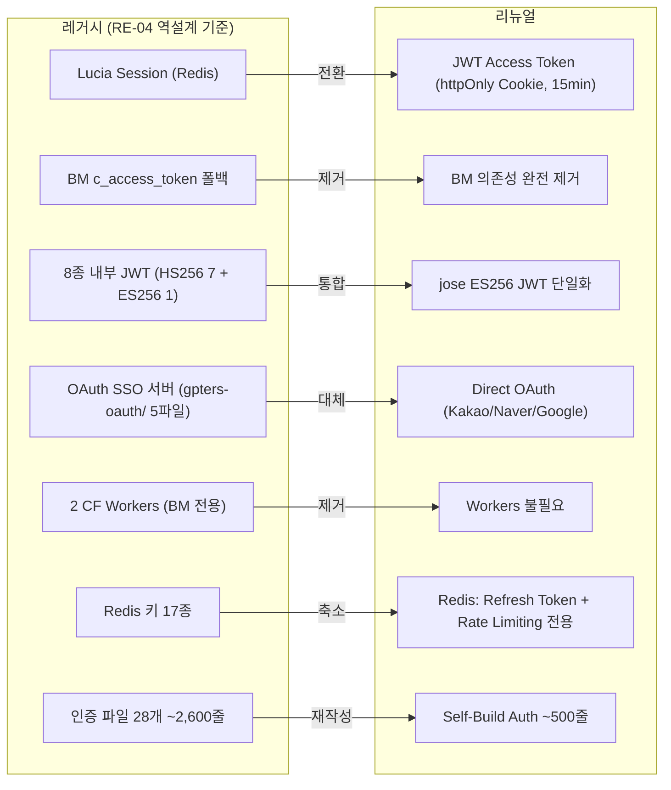
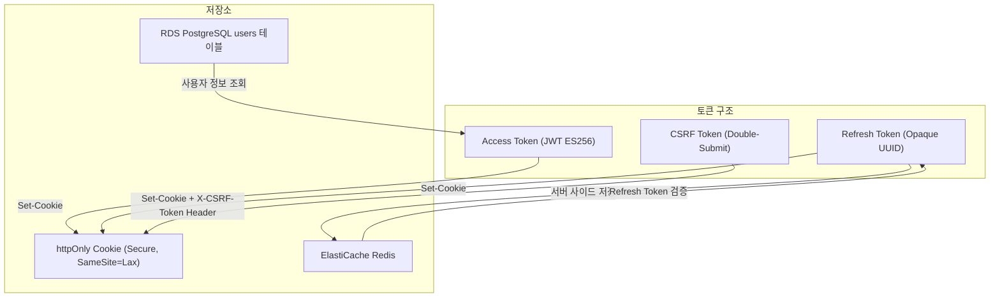
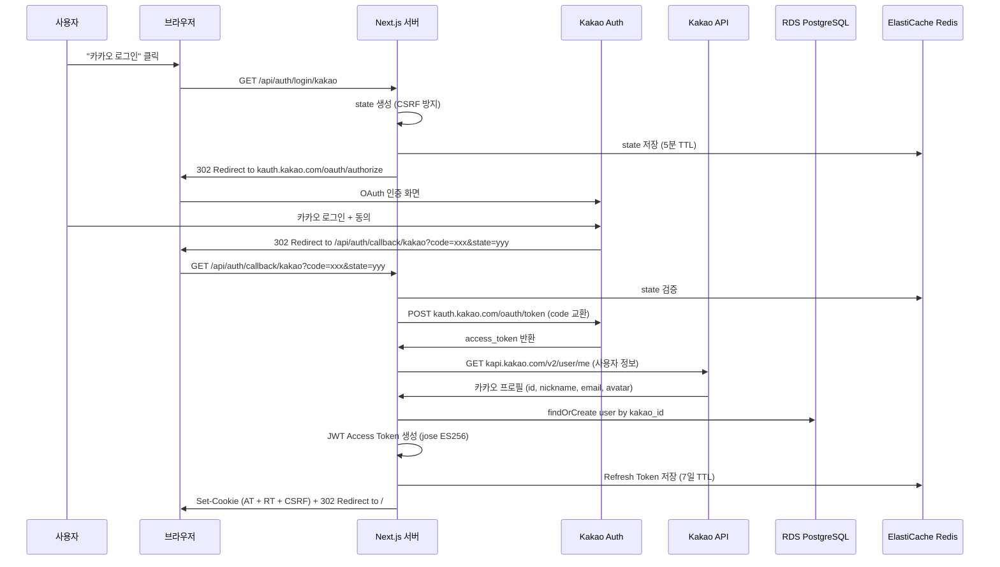
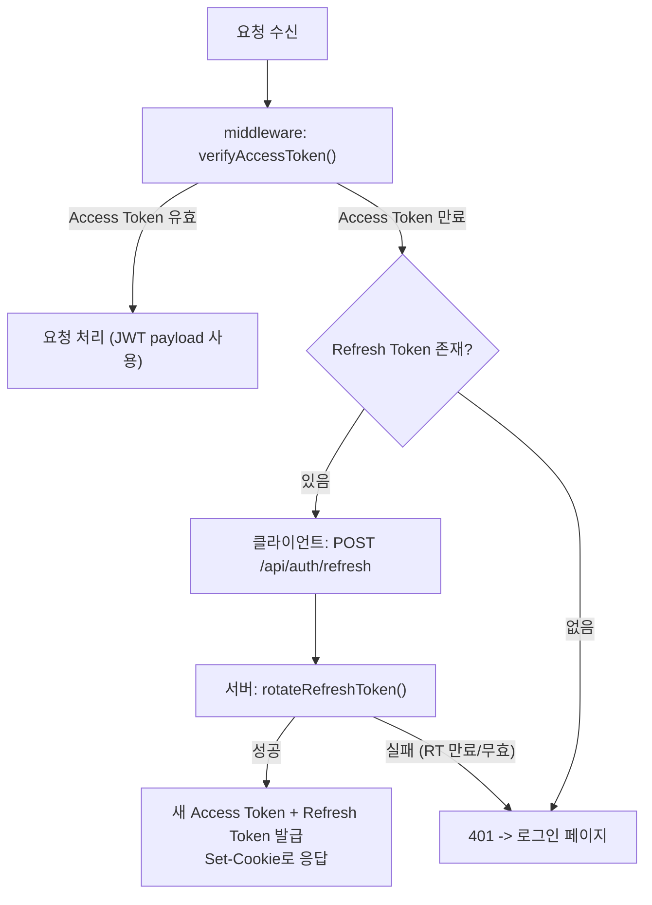
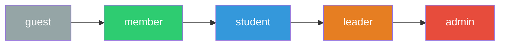

# GPTers Portal Renewal - Auth & Security 설계서

> Self-Build JWT + OAuth 기반 인증 + OWASP Top 10 대응 보안 아키텍처
>
> | 항목 | 내용 |
> |------|------|
> | 버전 | v2.0 |
> | 작성일 | 2026-03-07 |
> | 상태 | Design |
> | 작성자 | Security Architect Agent |
> | 선행 문서 | [RE-04 인증/SSO 역설계서](./04-RE-04-auth-sso.design.md), [보안 스펙](./security-spec.md) |
> | 상위 계획 | [리뉴얼 플랜 플러스](../01-plan/gpters-renewal-plan-plus.md) 4.5/4.6절 |
> | 변경 이력 | v1.0 (2026-03-06) Supabase Auth 기반 -> v2.0 (2026-03-07) Self-Build JWT + OAuth로 전면 교체 |

---

## 목차

1. [Self-Build JWT + OAuth 아키텍처](#1-self-build-jwt--oauth-아키텍처)
2. [Lucia Auth에서 Self-Build JWT 마이그레이션](#2-lucia-auth에서-self-build-jwt-마이그레이션)
3. [Next.js Middleware 설계](#3-nextjs-middleware-설계)
4. [RBAC 구현](#4-rbac-구현)
5. [보안 헤더](#5-보안-헤더)
6. [CORS 정책](#6-cors-정책)
7. [Rate Limiting](#7-rate-limiting)
8. [XSS 방지](#8-xss-방지)
9. [PII 암호화](#9-pii-암호화)
10. [OWASP Top 10 대응 매트릭스](#10-owasp-top-10-대응-매트릭스)

---

## 1. Self-Build JWT + OAuth 아키텍처

### 1.1 아키텍처 개요

레거시 인증 시스템(Lucia + Redis + BM 토큰, 28개 파일 ~2,600줄)을 Self-Build JWT + OAuth (~500줄)로 전환합니다.



### 1.2 토큰 아키텍처

| 토큰 | 알고리즘 | 유효기간 | 저장 위치 | 용도 |
|------|---------|---------|----------|------|
| Access Token | ES256 (ECDSA) | 15분 | httpOnly Cookie | API 인증 |
| Refresh Token | opaque (UUID v4) | 7일 | httpOnly Cookie + ElastiCache Redis | Access Token 갱신 |
| CSRF Token | HMAC-SHA256 | Access Token과 동일 | Cookie + Request Header | CSRF 방어 |



### 1.3 JWT 토큰 생성/검증 (jose 라이브러리)

```typescript
// lib/auth/jwt.ts
import { SignJWT, jwtVerify, importPKCS8, importSPKI } from 'jose'
import { env } from '@/env'

// ES256 키 페어 (환경변수에서 로드)
let privateKey: CryptoKey
let publicKey: CryptoKey

async function getPrivateKey(): Promise<CryptoKey> {
  if (!privateKey) {
    privateKey = await importPKCS8(env.JWT_PRIVATE_KEY, 'ES256')
  }
  return privateKey
}

async function getPublicKey(): Promise<CryptoKey> {
  if (!publicKey) {
    publicKey = await importSPKI(env.JWT_PUBLIC_KEY, 'ES256')
  }
  return publicKey
}

export interface JWTPayload {
  sub: string          // userId (UUID)
  email: string
  role: UserRole
  legacyId?: number    // 레거시 User.id 매핑
}

/**
 * Access Token을 생성합니다 (ES256, 15분 유효)
 */
export async function generateAccessToken(payload: JWTPayload): Promise<string> {
  const key = await getPrivateKey()

  return new SignJWT({
    email: payload.email,
    role: payload.role,
    legacyId: payload.legacyId,
  })
    .setProtectedHeader({ alg: 'ES256', typ: 'JWT' })
    .setSubject(payload.sub)
    .setIssuer('gpters.org')
    .setAudience('gpters.org')
    .setIssuedAt()
    .setExpirationTime('15m')
    .setJti(crypto.randomUUID())
    .sign(key)
}

/**
 * Access Token을 검증하고 페이로드를 반환합니다
 */
export async function verifyAccessToken(token: string): Promise<JWTPayload | null> {
  try {
    const key = await getPublicKey()

    const { payload } = await jwtVerify(token, key, {
      issuer: 'gpters.org',
      audience: 'gpters.org',
      algorithms: ['ES256'],
    })

    return {
      sub: payload.sub!,
      email: payload.email as string,
      role: payload.role as UserRole,
      legacyId: payload.legacyId as number | undefined,
    }
  } catch {
    return null
  }
}
```

### 1.4 Refresh Token 관리 (ElastiCache Redis)

```typescript
// lib/auth/refresh-token.ts
import { Redis } from '@upstash/redis'
import { randomUUID } from 'crypto'

const redis = Redis.fromEnv()

const REFRESH_TOKEN_PREFIX = 'rt:'
const REFRESH_TOKEN_TTL = 7 * 24 * 60 * 60 // 7일 (초)

interface RefreshTokenData {
  userId: string
  email: string
  role: UserRole
  legacyId?: number
  createdAt: string
  userAgent?: string
  ip?: string
}

/**
 * Refresh Token을 생성하고 Redis에 저장합니다
 */
export async function createRefreshToken(
  data: Omit<RefreshTokenData, 'createdAt'>,
): Promise<string> {
  const token = randomUUID()
  const key = `${REFRESH_TOKEN_PREFIX}${token}`

  await redis.set(key, JSON.stringify({
    ...data,
    createdAt: new Date().toISOString(),
  }), { ex: REFRESH_TOKEN_TTL })

  // 사용자별 토큰 Set에 추가 (전체 로그아웃용)
  await redis.sadd(`user_tokens:${data.userId}`, token)

  return token
}

/**
 * Refresh Token을 검증하고 데이터를 반환합니다
 */
export async function verifyRefreshToken(
  token: string,
): Promise<RefreshTokenData | null> {
  const key = `${REFRESH_TOKEN_PREFIX}${token}`
  const data = await redis.get<string>(key)

  if (!data) return null

  return typeof data === 'string' ? JSON.parse(data) : data
}

/**
 * Refresh Token Rotation: 기존 토큰 폐기 + 새 토큰 발급
 *
 * 보안: 동일 Refresh Token의 재사용(replay)을 방지합니다.
 * 탈취된 토큰이 사용되면 정상 사용자의 다음 갱신 시 감지됩니다.
 */
export async function rotateRefreshToken(
  oldToken: string,
): Promise<{ newToken: string; data: RefreshTokenData } | null> {
  const data = await verifyRefreshToken(oldToken)
  if (!data) return null

  // 기존 토큰 즉시 폐기
  await revokeRefreshToken(oldToken)

  // 새 토큰 발급
  const newToken = await createRefreshToken({
    userId: data.userId,
    email: data.email,
    role: data.role,
    legacyId: data.legacyId,
    userAgent: data.userAgent,
    ip: data.ip,
  })

  return { newToken, data }
}

/**
 * Refresh Token을 폐기합니다 (로그아웃 시)
 */
export async function revokeRefreshToken(token: string): Promise<void> {
  const key = `${REFRESH_TOKEN_PREFIX}${token}`
  const data = await redis.get<RefreshTokenData>(key)

  await redis.del(key)

  // 사용자별 토큰 Set에서도 제거
  if (data?.userId) {
    await redis.srem(`user_tokens:${data.userId}`, token)
  }
}

/**
 * 사용자의 모든 Refresh Token을 폐기합니다 (전체 로그아웃)
 */
export async function revokeAllUserTokens(userId: string): Promise<void> {
  const userTokensKey = `user_tokens:${userId}`
  const tokens = await redis.smembers(userTokensKey)

  if (tokens.length > 0) {
    const pipeline = redis.pipeline()
    for (const token of tokens) {
      pipeline.del(`${REFRESH_TOKEN_PREFIX}${token}`)
    }
    pipeline.del(userTokensKey)
    await pipeline.exec()
  }
}
```

### 1.5 쿠키 관리

```typescript
// lib/auth/cookies.ts
import { cookies } from 'next/headers'
import type { ResponseCookie } from 'next/dist/compiled/@edge-runtime/cookies'

const ACCESS_TOKEN_COOKIE = 'gpters_at'
const REFRESH_TOKEN_COOKIE = 'gpters_rt'
const CSRF_TOKEN_COOKIE = 'gpters_csrf'

const COOKIE_BASE: Partial<ResponseCookie> = {
  httpOnly: true,
  secure: process.env.NODE_ENV === 'production',
  sameSite: 'lax',
  path: '/',
  domain: process.env.NODE_ENV === 'production' ? '.gpters.org' : undefined,
}

/**
 * 인증 쿠키를 설정합니다 (로그인 성공 시)
 */
export async function setAuthCookies(
  accessToken: string,
  refreshToken: string,
  csrfToken: string,
): Promise<void> {
  const cookieStore = await cookies()

  cookieStore.set(ACCESS_TOKEN_COOKIE, accessToken, {
    ...COOKIE_BASE,
    maxAge: 15 * 60, // 15분
  })

  cookieStore.set(REFRESH_TOKEN_COOKIE, refreshToken, {
    ...COOKIE_BASE,
    maxAge: 7 * 24 * 60 * 60, // 7일
  })

  cookieStore.set(CSRF_TOKEN_COOKIE, csrfToken, {
    ...COOKIE_BASE,
    httpOnly: false, // 클라이언트에서 읽어서 헤더에 포함해야 함
    maxAge: 15 * 60, // Access Token과 동일
  })
}

/**
 * 인증 쿠키를 읽습니다
 */
export async function getAuthCookies() {
  const cookieStore = await cookies()

  return {
    accessToken: cookieStore.get(ACCESS_TOKEN_COOKIE)?.value ?? null,
    refreshToken: cookieStore.get(REFRESH_TOKEN_COOKIE)?.value ?? null,
    csrfToken: cookieStore.get(CSRF_TOKEN_COOKIE)?.value ?? null,
  }
}

/**
 * 인증 쿠키를 제거합니다 (로그아웃 시)
 */
export async function clearAuthCookies(): Promise<void> {
  const cookieStore = await cookies()

  cookieStore.delete(ACCESS_TOKEN_COOKIE)
  cookieStore.delete(REFRESH_TOKEN_COOKIE)
  cookieStore.delete(CSRF_TOKEN_COOKIE)
}
```

### 1.6 OAuth 소셜 로그인 (Direct Implementation)

#### 1.6.1 OAuth 플로우 (카카오 예시)



#### 1.6.2 OAuth Provider 설정

```typescript
// lib/auth/oauth/providers.ts
import { env } from '@/env'

export interface OAuthProvider {
  name: string
  authorizationUrl: string
  tokenUrl: string
  userInfoUrl: string
  clientId: string
  clientSecret: string
  scope: string
}

export function getKakaoProvider(): OAuthProvider {
  return {
    name: 'kakao',
    authorizationUrl: 'https://kauth.kakao.com/oauth/authorize',
    tokenUrl: 'https://kauth.kakao.com/oauth/token',
    userInfoUrl: 'https://kapi.kakao.com/v2/user/me',
    clientId: env.KAKAO_CLIENT_ID,
    clientSecret: env.KAKAO_CLIENT_SECRET,
    scope: 'profile_nickname,profile_image,account_email',
  }
}

export function getNaverProvider(): OAuthProvider {
  return {
    name: 'naver',
    authorizationUrl: 'https://nid.naver.com/oauth2.0/authorize',
    tokenUrl: 'https://nid.naver.com/oauth2.0/token',
    userInfoUrl: 'https://openapi.naver.com/v1/nid/me',
    clientId: env.NAVER_CLIENT_ID,
    clientSecret: env.NAVER_CLIENT_SECRET,
    scope: 'name,email,profile_image',
  }
}

export function getGoogleProvider(): OAuthProvider {
  return {
    name: 'google',
    authorizationUrl: 'https://accounts.google.com/o/oauth2/v2/auth',
    tokenUrl: 'https://oauth2.googleapis.com/token',
    userInfoUrl: 'https://www.googleapis.com/oauth2/v2/userinfo',
    clientId: env.GOOGLE_CLIENT_ID,
    clientSecret: env.GOOGLE_CLIENT_SECRET,
    scope: 'openid email profile',
  }
}

export const PROVIDERS = {
  kakao: getKakaoProvider,
  naver: getNaverProvider,
  google: getGoogleProvider,
} as const

export type ProviderName = keyof typeof PROVIDERS
```

#### 1.6.3 OAuth 로그인 시작

```typescript
// app/api/auth/login/[provider]/route.ts
import { NextResponse, type NextRequest } from 'next/server'
import { Redis } from '@upstash/redis'
import { PROVIDERS, type ProviderName } from '@/lib/auth/oauth/providers'
import { env } from '@/env'

const redis = Redis.fromEnv()

export async function GET(
  request: NextRequest,
  { params }: { params: Promise<{ provider: string }> },
) {
  const { provider: providerName } = await params

  if (!(providerName in PROVIDERS)) {
    return NextResponse.json({ error: 'Unsupported provider' }, { status: 400 })
  }

  const provider = PROVIDERS[providerName as ProviderName]()

  // CSRF 방지용 state 생성
  const state = crypto.randomUUID()
  await redis.set(`oauth_state:${state}`, providerName, { ex: 300 }) // 5분 TTL

  // 리다이렉트 후 돌아올 경로 (optional)
  const next = request.nextUrl.searchParams.get('next') ?? '/'
  await redis.set(`oauth_next:${state}`, next, { ex: 300 })

  const authUrl = new URL(provider.authorizationUrl)
  authUrl.searchParams.set('client_id', provider.clientId)
  authUrl.searchParams.set('redirect_uri', `${env.NEXT_PUBLIC_APP_URL}/api/auth/callback/${providerName}`)
  authUrl.searchParams.set('response_type', 'code')
  authUrl.searchParams.set('scope', provider.scope)
  authUrl.searchParams.set('state', state)

  return NextResponse.redirect(authUrl.toString())
}
```

#### 1.6.4 OAuth Callback 처리

```typescript
// app/api/auth/callback/[provider]/route.ts
import { NextResponse, type NextRequest } from 'next/server'
import { Redis } from '@upstash/redis'
import { PROVIDERS, type ProviderName } from '@/lib/auth/oauth/providers'
import { generateAccessToken } from '@/lib/auth/jwt'
import { createRefreshToken } from '@/lib/auth/refresh-token'
import { setAuthCookies } from '@/lib/auth/cookies'
import { generateCsrfToken } from '@/lib/auth/csrf'
import { logAudit } from '@/lib/audit-log'
import { db } from '@/lib/db'
import { env } from '@/env'
import type { UserRole } from '@/lib/auth/rbac'

const redis = Redis.fromEnv()

export async function GET(
  request: NextRequest,
  { params }: { params: Promise<{ provider: string }> },
) {
  const { provider: providerName } = await params
  const { searchParams } = new URL(request.url)
  const code = searchParams.get('code')
  const state = searchParams.get('state')
  const error = searchParams.get('error')

  // 에러 체크
  if (error || !code || !state) {
    return NextResponse.redirect(
      new URL('/login?error=oauth_denied', request.url),
    )
  }

  // State 검증 (CSRF 방지)
  const storedProvider = await redis.get<string>(`oauth_state:${state}`)
  if (!storedProvider || storedProvider !== providerName) {
    return NextResponse.redirect(
      new URL('/login?error=invalid_state', request.url),
    )
  }
  await redis.del(`oauth_state:${state}`) // 일회용 state 폐기

  const next = await redis.get<string>(`oauth_next:${state}`) ?? '/'
  await redis.del(`oauth_next:${state}`)

  try {
    if (!(providerName in PROVIDERS)) {
      throw new Error(`Unknown provider: ${providerName}`)
    }

    const provider = PROVIDERS[providerName as ProviderName]()

    // 1. Authorization Code -> Access Token 교환
    const tokenResponse = await fetch(provider.tokenUrl, {
      method: 'POST',
      headers: { 'Content-Type': 'application/x-www-form-urlencoded' },
      body: new URLSearchParams({
        grant_type: 'authorization_code',
        client_id: provider.clientId,
        client_secret: provider.clientSecret,
        redirect_uri: `${env.NEXT_PUBLIC_APP_URL}/api/auth/callback/${providerName}`,
        code,
      }),
    })

    if (!tokenResponse.ok) {
      throw new Error(`Token exchange failed: ${tokenResponse.status}`)
    }

    const tokenData = await tokenResponse.json()
    const oauthAccessToken = tokenData.access_token

    // 2. 사용자 정보 조회
    const userInfo = await fetchUserInfo(providerName, oauthAccessToken, provider.userInfoUrl)

    // 3. 사용자 찾기 또는 생성
    const user = await findOrCreateUser(providerName as ProviderName, userInfo)

    // 4. JWT Access Token 생성
    const accessToken = await generateAccessToken({
      sub: user.id,
      email: user.email,
      role: user.role,
      legacyId: user.legacyId,
    })

    // 5. Refresh Token 생성 (Redis 저장)
    const ip = request.headers.get('x-forwarded-for')?.split(',')[0] ?? 'unknown'
    const refreshToken = await createRefreshToken({
      userId: user.id,
      email: user.email,
      role: user.role,
      legacyId: user.legacyId,
      userAgent: request.headers.get('user-agent') ?? undefined,
      ip,
    })

    // 6. CSRF Token 생성
    const csrfToken = generateCsrfToken(user.id)

    // 7. 쿠키 설정
    await setAuthCookies(accessToken, refreshToken, csrfToken)

    // 8. 감사 로그
    logAudit({
      action: 'auth.login.success',
      userId: user.id,
      ip,
      userAgent: request.headers.get('user-agent') ?? undefined,
      details: { provider: providerName, isNewUser: user.isNew },
    })

    return NextResponse.redirect(new URL(next, request.url))
  } catch (e) {
    console.error(`OAuth callback error (${providerName}):`, e)
    return NextResponse.redirect(
      new URL('/login?error=auth_callback_failed', request.url),
    )
  }
}

/**
 * OAuth Provider별 사용자 정보 정규화
 */
async function fetchUserInfo(
  provider: string,
  accessToken: string,
  userInfoUrl: string,
): Promise<{
  providerId: string
  email: string | null
  name: string
  avatarUrl: string | null
}> {
  const response = await fetch(userInfoUrl, {
    headers: { Authorization: `Bearer ${accessToken}` },
  })

  if (!response.ok) {
    throw new Error(`User info fetch failed: ${response.status}`)
  }

  const data = await response.json()

  switch (provider) {
    case 'kakao':
      return {
        providerId: String(data.id),
        email: data.kakao_account?.email ?? null,
        name: data.kakao_account?.profile?.nickname ?? '사용자',
        avatarUrl: data.kakao_account?.profile?.profile_image_url ?? null,
      }
    case 'naver':
      return {
        providerId: data.response.id,
        email: data.response.email ?? null,
        name: data.response.name ?? data.response.nickname ?? '사용자',
        avatarUrl: data.response.profile_image ?? null,
      }
    case 'google':
      return {
        providerId: data.id,
        email: data.email ?? null,
        name: data.name ?? '사용자',
        avatarUrl: data.picture ?? null,
      }
    default:
      throw new Error(`Unknown provider: ${provider}`)
  }
}

/**
 * 사용자 찾기 또는 신규 생성
 */
async function findOrCreateUser(
  provider: ProviderName,
  userInfo: { providerId: string; email: string | null; name: string; avatarUrl: string | null },
): Promise<{ id: string; email: string; role: UserRole; legacyId?: number; isNew: boolean }> {
  const providerIdField = `${provider}Id` as 'kakaoId' | 'naverId' | 'googleId'

  // Provider ID로 기존 사용자 조회
  const existing = await db.user.findFirst({
    where: { [providerIdField]: userInfo.providerId },
  })

  if (existing) {
    return {
      id: existing.id,
      email: existing.email,
      role: existing.role as UserRole,
      legacyId: existing.legacyId ?? undefined,
      isNew: false,
    }
  }

  // 이메일로 기존 사용자 조회 (계정 연결)
  if (userInfo.email) {
    const emailUser = await db.user.findFirst({
      where: { email: userInfo.email },
    })

    if (emailUser) {
      // 기존 계정에 소셜 ID 연결
      await db.user.update({
        where: { id: emailUser.id },
        data: { [providerIdField]: userInfo.providerId },
      })

      return {
        id: emailUser.id,
        email: emailUser.email,
        role: emailUser.role as UserRole,
        legacyId: emailUser.legacyId ?? undefined,
        isNew: false,
      }
    }
  }

  // 신규 사용자 생성
  const newUser = await db.user.create({
    data: {
      id: crypto.randomUUID(),
      email: userInfo.email ?? `${provider}_${userInfo.providerId}@oauth.gpters.org`,
      name: userInfo.name,
      avatarUrl: userInfo.avatarUrl,
      role: 'member',
      [providerIdField]: userInfo.providerId,
    },
  })

  return {
    id: newUser.id,
    email: newUser.email,
    role: 'member',
    isNew: true,
  }
}
```

#### 1.6.5 이메일/비밀번호 로그인

```typescript
// app/api/auth/login/credentials/route.ts
import { NextResponse, type NextRequest } from 'next/server'
import bcrypt from 'bcrypt'
import { generateAccessToken } from '@/lib/auth/jwt'
import { createRefreshToken } from '@/lib/auth/refresh-token'
import { setAuthCookies } from '@/lib/auth/cookies'
import { generateCsrfToken } from '@/lib/auth/csrf'
import { migrateScryptPassword } from '@/lib/auth/legacy-password-migration'
import { logAudit } from '@/lib/audit-log'
import { db } from '@/lib/db'
import { z } from 'zod'
import type { UserRole } from '@/lib/auth/rbac'

const LoginSchema = z.object({
  email: z.string().email(),
  password: z.string().min(1).max(100),
})

export async function POST(request: NextRequest) {
  const body = await request.json()
  const result = LoginSchema.safeParse(body)

  if (!result.success) {
    return NextResponse.json({ error: '입력이 올바르지 않습니다.' }, { status: 400 })
  }

  const { email, password } = result.data
  const ip = request.headers.get('x-forwarded-for')?.split(',')[0] ?? 'unknown'

  const user = await db.user.findFirst({ where: { email } })

  if (!user || !user.passwordHash) {
    // 타이밍 공격 방지: 사용자가 없어도 동일한 응답 시간
    logAudit({ action: 'auth.login.failure', ip, details: { reason: 'user_not_found' } })
    return NextResponse.json({ error: '이메일 또는 비밀번호가 올바르지 않습니다.' }, { status: 401 })
  }

  let passwordValid = false

  // bcrypt 해시인지 확인 (마이그레이션 완료된 사용자)
  if (user.passwordMigrated) {
    passwordValid = await bcrypt.compare(password, user.passwordHash)
  } else {
    // Lazy Migration: Scrypt -> bcrypt 전환
    passwordValid = await migrateScryptPassword(user.id, user.passwordHash, password)
  }

  if (!passwordValid) {
    logAudit({
      action: 'auth.login.failure',
      userId: user.id,
      ip,
      details: { reason: 'invalid_password' },
    })
    return NextResponse.json({ error: '이메일 또는 비밀번호가 올바르지 않습니다.' }, { status: 401 })
  }

  // 토큰 생성
  const accessToken = await generateAccessToken({
    sub: user.id,
    email: user.email,
    role: user.role as UserRole,
    legacyId: user.legacyId ?? undefined,
  })

  const refreshToken = await createRefreshToken({
    userId: user.id,
    email: user.email,
    role: user.role as UserRole,
    legacyId: user.legacyId ?? undefined,
    userAgent: request.headers.get('user-agent') ?? undefined,
    ip,
  })

  const csrfToken = generateCsrfToken(user.id)

  await setAuthCookies(accessToken, refreshToken, csrfToken)

  logAudit({
    action: 'auth.login.success',
    userId: user.id,
    ip,
    userAgent: request.headers.get('user-agent') ?? undefined,
  })

  return NextResponse.json({ success: true })
}
```

#### 1.6.6 로그아웃

```typescript
// app/api/auth/logout/route.ts
import { NextResponse, type NextRequest } from 'next/server'
import { getAuthCookies, clearAuthCookies } from '@/lib/auth/cookies'
import { revokeRefreshToken } from '@/lib/auth/refresh-token'
import { logAudit } from '@/lib/audit-log'

export async function POST(request: NextRequest) {
  const { refreshToken } = await getAuthCookies()

  // Refresh Token 폐기 (Redis에서 삭제)
  if (refreshToken) {
    await revokeRefreshToken(refreshToken)
  }

  // 쿠키 제거
  await clearAuthCookies()

  logAudit({
    action: 'auth.logout',
    ip: request.headers.get('x-forwarded-for')?.split(',')[0] ?? 'unknown',
  })

  return NextResponse.json({ success: true })
}
```

#### 1.6.7 Token Refresh 엔드포인트

```typescript
// app/api/auth/refresh/route.ts
import { NextResponse, type NextRequest } from 'next/server'
import { generateAccessToken } from '@/lib/auth/jwt'
import { rotateRefreshToken } from '@/lib/auth/refresh-token'
import { setAuthCookies } from '@/lib/auth/cookies'
import { generateCsrfToken } from '@/lib/auth/csrf'

export async function POST(request: NextRequest) {
  const refreshTokenCookie = request.cookies.get('gpters_rt')?.value

  if (!refreshTokenCookie) {
    return NextResponse.json({ error: 'No refresh token' }, { status: 401 })
  }

  // Refresh Token Rotation
  const result = await rotateRefreshToken(refreshTokenCookie)

  if (!result) {
    // 무효한 Refresh Token -> 세션 강제 만료
    return NextResponse.json({ error: 'Invalid refresh token' }, { status: 401 })
  }

  const { newToken: newRefreshToken, data } = result

  // 새 Access Token 생성
  const accessToken = await generateAccessToken({
    sub: data.userId,
    email: data.email,
    role: data.role,
    legacyId: data.legacyId,
  })

  const csrfToken = generateCsrfToken(data.userId)

  await setAuthCookies(accessToken, newRefreshToken, csrfToken)

  return NextResponse.json({ success: true })
}
```

### 1.7 CSRF 방어 (Double-Submit Cookie)

```typescript
// lib/auth/csrf.ts
import { createHmac, timingSafeEqual } from 'crypto'
import { env } from '@/env'

/**
 * CSRF 토큰을 생성합니다 (Double-Submit Cookie 패턴)
 *
 * 토큰은 userId + timestamp를 HMAC-SHA256으로 서명합니다.
 * 클라이언트는 쿠키에서 이 값을 읽어 X-CSRF-Token 헤더에 포함합니다.
 * 서버는 Cookie 값과 Header 값이 일치하는지 검증합니다.
 */
export function generateCsrfToken(userId: string): string {
  const timestamp = Date.now().toString()
  const data = `${userId}:${timestamp}`
  const signature = createHmac('sha256', env.CSRF_SECRET)
    .update(data)
    .digest('hex')

  return `${data}:${signature}`
}

/**
 * CSRF 토큰을 검증합니다
 */
export function verifyCsrfToken(token: string): boolean {
  const parts = token.split(':')
  if (parts.length !== 3) return false

  const [userId, timestamp, signature] = parts
  const expectedSignature = createHmac('sha256', env.CSRF_SECRET)
    .update(`${userId}:${timestamp}`)
    .digest('hex')

  // Timing-safe 비교
  try {
    return timingSafeEqual(
      Buffer.from(signature, 'hex'),
      Buffer.from(expectedSignature, 'hex'),
    )
  } catch {
    return false
  }
}
```

### 1.8 환경 변수

```typescript
// env.ts
import { createEnv } from '@t3-oss/env-nextjs'
import { z } from 'zod'

export const env = createEnv({
  server: {
    // JWT 키 (ES256)
    JWT_PRIVATE_KEY: z.string().min(1),  // PKCS8 PEM 형식
    JWT_PUBLIC_KEY: z.string().min(1),   // SPKI PEM 형식

    // CSRF
    CSRF_SECRET: z.string().min(32),

    // OAuth (서버 전용)
    KAKAO_CLIENT_ID: z.string().min(1),
    KAKAO_CLIENT_SECRET: z.string().min(1),
    NAVER_CLIENT_ID: z.string().min(1),
    NAVER_CLIENT_SECRET: z.string().min(1),
    GOOGLE_CLIENT_ID: z.string().min(1),
    GOOGLE_CLIENT_SECRET: z.string().min(1),

    // 결제 (서버 전용)
    PORTONE_API_SECRET: z.string().min(1),
    PORTONE_WEBHOOK_SECRET: z.string().optional(),

    // 내부 API
    API_ADMIN_KEY: z.string().min(32),
    CRON_SECRET: z.string().min(32),

    // PII 암호화
    PII_ENCRYPTION_KEY: z.string().length(64), // 32바이트 hex

    // ElastiCache Redis (Upstash 호환)
    UPSTASH_REDIS_REST_URL: z.string().url(),
    UPSTASH_REDIS_REST_TOKEN: z.string().min(1),

    // RDS PostgreSQL
    DATABASE_URL: z.string().min(1),
  },
  client: {
    // 앱 URL
    NEXT_PUBLIC_APP_URL: z.string().url(),

    // 결제 (가맹점 ID만 노출)
    NEXT_PUBLIC_PORTONE_STORE_ID: z.string().min(1),
  },
  runtimeEnv: {
    JWT_PRIVATE_KEY: process.env.JWT_PRIVATE_KEY,
    JWT_PUBLIC_KEY: process.env.JWT_PUBLIC_KEY,
    CSRF_SECRET: process.env.CSRF_SECRET,
    KAKAO_CLIENT_ID: process.env.KAKAO_CLIENT_ID,
    KAKAO_CLIENT_SECRET: process.env.KAKAO_CLIENT_SECRET,
    NAVER_CLIENT_ID: process.env.NAVER_CLIENT_ID,
    NAVER_CLIENT_SECRET: process.env.NAVER_CLIENT_SECRET,
    GOOGLE_CLIENT_ID: process.env.GOOGLE_CLIENT_ID,
    GOOGLE_CLIENT_SECRET: process.env.GOOGLE_CLIENT_SECRET,
    PORTONE_API_SECRET: process.env.PORTONE_API_SECRET,
    PORTONE_WEBHOOK_SECRET: process.env.PORTONE_WEBHOOK_SECRET,
    API_ADMIN_KEY: process.env.API_ADMIN_KEY,
    CRON_SECRET: process.env.CRON_SECRET,
    PII_ENCRYPTION_KEY: process.env.PII_ENCRYPTION_KEY,
    UPSTASH_REDIS_REST_URL: process.env.UPSTASH_REDIS_REST_URL,
    UPSTASH_REDIS_REST_TOKEN: process.env.UPSTASH_REDIS_REST_TOKEN,
    DATABASE_URL: process.env.DATABASE_URL,
    NEXT_PUBLIC_APP_URL: process.env.NEXT_PUBLIC_APP_URL,
    NEXT_PUBLIC_PORTONE_STORE_ID: process.env.NEXT_PUBLIC_PORTONE_STORE_ID,
  },
})
```

---

## 2. Lucia Auth에서 Self-Build JWT 마이그레이션

### 2.1 레거시 인증 현황

RE-04 역설계서(v1.3)에서 식별된 레거시 인증 구성요소와 마이그레이션 대상입니다.

| 구성요소 | 상세 | 마이그레이션 영향 |
|---------|------|-----------------|
| 세션 저장소 | Redis (Lucia 커스텀 어댑터, `adapter.ts`) | JWT httpOnly Cookie로 대체 |
| 비밀번호 해싱 | Scrypt (Lucia `new Scrypt().hash/verify`) | bcrypt로 Lazy Migration |
| 소셜 로그인 | 카카오 1개 (Arctic 라이브러리) | Direct OAuth + 네이버/구글 추가 |
| 관리자 판별 | `email?.endsWith('@gpters.org')` | users.role = 'admin'으로 변경 |
| BM 연동 | c_access_token 폴백, OAuth SSO 서버, 2 Workers | 전체 제거 |
| 내부 JWT | 8종 (HS256 7종 + ES256 1종, `jwt-lib.ts` 133줄) | jose ES256 단일 JWT로 대체 |
| Redis 키 | 17종 (세션, OAuth, 인증코드) | Refresh Token + Rate Limiting 전용 |
| AuthService | `auth.service.ts` 464줄 | Self-Build Auth로 재작성 |

### 2.2 비밀번호 해시 호환성

레거시에서 Lucia의 `Scrypt`로 해싱한 비밀번호는 bcrypt와 호환되지 않습니다.

**Lazy Migration 전략**을 채택합니다.

```mermaid
flowchart TD
    A["사용자 로그인 시도"] --> B["이메일/비밀번호로 users 테이블 조회"]
    B --> C{"password_migrated?"}
    C -->|"true"| D["bcrypt.compare(password, hash)"]
    C -->|"false"| E["Scrypt.verify(legacyHash, password)"]
    D -->|"성공"| F["JWT 발급 + 로그인 완료"]
    D -->|"실패"| G["'비밀번호 오류' 반환"]
    E -->|"성공"| H["bcrypt.hash(password)로 재해싱"]
    H --> I["users 테이블 업데이트\n(passwordHash + passwordMigrated=true)"]
    I --> F
    E -->|"실패"| G
    E -->|"레거시 해시 없음"| J["'비밀번호 재설정' 안내"]
```



### 2.3 Lazy Migration 구현

```typescript
// lib/auth/legacy-password-migration.ts
import { Scrypt } from 'lucia'
import bcrypt from 'bcrypt'
import { db } from '@/lib/db'

const BCRYPT_ROUNDS = 12

/**
 * 레거시 Scrypt 비밀번호를 bcrypt로 마이그레이션합니다
 *
 * @remarks
 * 레거시에서 Lucia v3의 Scrypt를 사용합니다.
 * 마이그레이션 기간에만 `lucia` 패키지 의존성이 필요합니다.
 * 전체 사용자 마이그레이션 완료 후 `lucia` 패키지를 제거합니다.
 *
 * @returns 비밀번호 검증 성공 여부 (마이그레이션은 사이드 이펙트)
 */
export async function migrateScryptPassword(
  userId: string,
  legacyPasswordHash: string,
  plainPassword: string,
): Promise<boolean> {
  const scrypt = new Scrypt()
  const isValid = await scrypt.verify(legacyPasswordHash, plainPassword)

  if (!isValid) {
    return false
  }

  // bcrypt로 재해싱
  const newHash = await bcrypt.hash(plainPassword, BCRYPT_ROUNDS)

  // DB 업데이트: bcrypt 해시 저장 + 마이그레이션 완료 플래그
  await db.user.update({
    where: { id: userId },
    data: {
      passwordHash: newHash,
      passwordMigrated: true,
      legacyPasswordHash: null, // 레거시 해시 제거
    },
  })

  return true
}
```

### 2.4 사용자 데이터 스키마

```sql
-- users 테이블 (Self-managed, RDS PostgreSQL)
CREATE TABLE users (
  id UUID PRIMARY KEY DEFAULT gen_random_uuid(),
  legacy_id INTEGER UNIQUE,              -- 레거시 User.id 매핑 (RE-04 8절 참조)
  name TEXT NOT NULL,
  email TEXT NOT NULL UNIQUE,
  password_hash TEXT,                     -- bcrypt 해시 (소셜 전용은 NULL)
  password_migrated BOOLEAN DEFAULT false,
  legacy_password_hash TEXT,             -- Scrypt 해시 (마이그레이션 완료 후 NULL)
  phone TEXT,                            -- 암호화 저장 (9절 참조)
  phone_hash TEXT,                       -- Blind Index (검색용)
  avatar_url TEXT,
  role TEXT NOT NULL DEFAULT 'member'
    CHECK (role IN ('guest', 'member', 'student', 'leader', 'admin')),
  kakao_id TEXT UNIQUE,
  naver_id TEXT UNIQUE,
  google_id TEXT UNIQUE,
  referrer_code TEXT UNIQUE,
  created_at TIMESTAMPTZ DEFAULT now(),
  updated_at TIMESTAMPTZ DEFAULT now(),
  deleted_at TIMESTAMPTZ                 -- Soft Delete (레거시 패턴 보존)
);

-- 인덱스
CREATE INDEX idx_users_legacy_id ON users(legacy_id);
CREATE INDEX idx_users_kakao_id ON users(kakao_id);
CREATE INDEX idx_users_naver_id ON users(naver_id);
CREATE INDEX idx_users_google_id ON users(google_id);
CREATE INDEX idx_users_role ON users(role);
CREATE INDEX idx_users_email ON users(email);
CREATE INDEX idx_users_deleted_at ON users(deleted_at) WHERE deleted_at IS NULL;
```

### 2.5 마이그레이션 스크립트

```typescript
// scripts/migrate-users.ts
import { PrismaClient as LegacyPrisma } from '@prisma/client'
import { PrismaClient as NewPrisma } from '@prisma/client'
import { randomUUID } from 'crypto'

const legacyDb = new LegacyPrisma({
  datasources: { db: { url: process.env.LEGACY_DATABASE_URL } },
})
const newDb = new NewPrisma({
  datasources: { db: { url: process.env.DATABASE_URL } },
})

async function migrateUsers() {
  const users = await legacyDb.user.findMany({
    where: { deletedAt: null },
    select: {
      id: true,
      email: true,
      password: true,
      name: true,
      phone: true,
      kakaoId: true,
      naverId: true,
      referrerCode: true,
      createdAt: true,
    },
  })

  let migrated = 0
  let skipped = 0
  let failed = 0

  for (const user of users) {
    try {
      // 중복 체크 (legacy_id 기준)
      const existing = await newDb.user.findFirst({
        where: { legacyId: user.id },
      })

      if (existing) {
        skipped++
        continue
      }

      // 이메일 중복 체크
      if (user.email) {
        const emailExisting = await newDb.user.findFirst({
          where: { email: user.email },
        })
        if (emailExisting) {
          // legacy_id 매핑만 업데이트
          await newDb.user.update({
            where: { id: emailExisting.id },
            data: { legacyId: user.id },
          })
          skipped++
          continue
        }
      }

      // 신규 사용자 생성
      await newDb.user.create({
        data: {
          id: randomUUID(),
          legacyId: user.id,
          name: user.name,
          email: user.email ?? `legacy_${user.id}@migrated.gpters.org`,
          phone: user.phone, // 이관 후 암호화 처리 (별도 스크립트)
          kakaoId: user.kakaoId,
          naverId: user.naverId,
          referrerCode: user.referrerCode,
          role: user.email?.endsWith('@gpters.org') ? 'admin' : 'member',
          passwordMigrated: false,
          legacyPasswordHash: user.password, // Scrypt 해시 보존
          passwordHash: null, // Lazy Migration 대기
        },
      })

      migrated++
    } catch (e) {
      console.error(`User ${user.id} unexpected error:`, e)
      failed++
    }
  }

  console.log(`Migration complete: ${migrated} migrated, ${skipped} skipped, ${failed} failed`)
}
```

### 2.6 세션 전환 전략: Lazy Migration

| 전략 | 장점 | 단점 | 선택 |
|------|------|------|------|
| Big Bang | 일괄 전환, 깔끔 | 전체 사용자 로그아웃, 비밀번호 재설정 필수 | X |
| Lazy Migration | 무중단, 사용자 영향 최소 | 전환 기간 동안 lucia 패키지 유지 필요 | **채택** |

**전환 타임라인:**

```mermaid
gantt
    title "전환 타임라인"
    dateFormat X
    axisFormat Week %s

    section "데이터 이관"
    "사용자 데이터 이관 (RDS users 테이블)" :a1, 1, 2w

    section "인증 전환"
    "Self-Build JWT 기본 로그인 (이메일/비밀번호)" :a2, 3, 1w
    "소셜 로그인 전환 (카카오 Direct OAuth)" :a3, 4, 1w

    section "마이그레이션"
    "Lazy Password Migration 활성화 (Scrypt->bcrypt)" :a4, 5, 1w
    "레거시 세션 폴백 제거" :a5, 6, 1w

    section "정리"
    "BM 관련 코드 전체 제거 (OAuth SSO, Workers, c_access_token)" :a6, 8, 2w
    "lucia 패키지 제거 (마이그레이션 완료 확인 후)" :a7, 10, 1w
```



### 2.7 제거 대상 (BM 의존 코드 + Lucia)

RE-04 역설계서(v1.3) 14.3절에서 식별된 BM 의존 코드와 Lucia 관련 코드입니다.

| 파일/구성요소 | 라인 수 | 제거 시점 | 비고 |
|-------------|---------|----------|------|
| `gpters-oauth/` (4 route.ts + getOAuthServer.ts) | ~600줄 | Phase 2 | OAuth SSO 서버 전체 |
| `auth-token-validator.ts` (c_access_token) | 40줄 | Phase 2 | BM 토큰 검증 |
| `gpters-auth-proxy` Worker | 70줄 | Phase 2 | BM 리다이렉트 Worker |
| `clear-auth-tokens` Worker | 42줄 | Phase 2 | BM 쿠키 삭제 Worker |
| `.well-known/` (2 route.ts) | ~60줄 | Phase 2 | OAuth JWKS/OpenID |
| `lib.ts` validateSession BM 폴백 (L101-129) | ~30줄 | Phase 2 | c_access_token 경로 |
| `OAuthClient` Prisma 모델 | - | Phase 3 | BM OAuth 클라이언트 |
| OAuth/BM 환경변수 6개 | - | Phase 3 | 정리 |
| Lucia 세션 파일 (5개, ~400줄) | ~400줄 | Phase 3+ | 마이그레이션 완료 후 |
| `lucia` npm 패키지 | - | Phase 3+ | 마이그레이션 완료 확인 후 |
| `arctic` npm 패키지 | - | Phase 2 | Kakao OAuth Direct로 대체 |
| `@node-oauth/oauth2-server` npm 패키지 | - | Phase 2 | OAuth SSO 서버 제거 |
| `jsonwebtoken` npm 패키지 | - | Phase 2 | jose로 통합 |

---

## 3. Next.js Middleware 설계

### 3.1 보호 라우트 정의

| 경로 패턴 | 필요 인증 | 필요 역할 | 설명 |
|----------|----------|----------|------|
| `/` | 없음 | - | 홈 (공개) |
| `/posts/*` | 없음 | - | 게시글 조회 (공개) |
| `/study` | 없음 | - | 스터디 목록 (공개) |
| `/study/[slug]` | 없음 | - | 스터디 상세 (공개) |
| `/login`, `/signup` | 비인증만 | - | 로그인/가입 (인증 시 리다이렉트) |
| `/settings/*` | 로그인 | member+ | 개인 설정 |
| `/posts/write` | 로그인 | member+ | 게시글 작성 |
| `/checkout/*` | 로그인 | member+ | 결제 |
| `/study/my/*` | 로그인 | student+ | 내 스터디 대시보드 |
| `/study/manage/*` | 로그인 | leader+ | 스터디 관리 |
| `/admin/*` | 로그인 | admin | 어드민 |

### 3.2 Middleware 구현

```typescript
// middleware.ts
import { NextResponse, type NextRequest } from 'next/server'
import { verifyAccessToken, type JWTPayload } from '@/lib/auth/jwt'
import { verifyCsrfToken } from '@/lib/auth/csrf'

// 인증이 필요한 경로
const PROTECTED_PATHS = [
  '/settings',
  '/posts/write',
  '/checkout',
  '/study/my',
]

// 역할 기반 보호 경로
const ROLE_PROTECTED_PATHS: Record<string, string[]> = {
  '/study/manage': ['leader', 'admin'],
  '/admin': ['admin'],
}

// 인증된 사용자가 접근할 수 없는 경로 (로그인/가입)
const AUTH_REDIRECT_PATHS = ['/login', '/signup']

// CSRF 검증이 필요한 메서드
const CSRF_METHODS = new Set(['POST', 'PUT', 'PATCH', 'DELETE'])

// 역할 계층: 상위 역할은 하위 역할의 모든 권한 포함
const ROLE_HIERARCHY: Record<string, number> = {
  guest: 0,
  member: 1,
  student: 2,
  leader: 3,
  admin: 4,
}

function hasRole(userRole: string, requiredRole: string): boolean {
  return (ROLE_HIERARCHY[userRole] ?? 0) >= (ROLE_HIERARCHY[requiredRole] ?? 0)
}

export async function middleware(request: NextRequest) {
  const response = NextResponse.next({ request })
  const pathname = request.nextUrl.pathname

  // 1. JWT Access Token 검증 (로컬 검증, 외부 통신 없음)
  const accessToken = request.cookies.get('gpters_at')?.value
  let user: JWTPayload | null = null

  if (accessToken) {
    user = await verifyAccessToken(accessToken)
  }

  // 2. Access Token 만료 + Refresh Token 존재 시 -> 갱신 유도
  if (!user && request.cookies.get('gpters_rt')?.value) {
    // API 요청: 401로 클라이언트가 /api/auth/refresh 호출하도록 유도
    if (pathname.startsWith('/api/')) {
      return NextResponse.json(
        { error: 'Token expired', code: 'TOKEN_EXPIRED' },
        { status: 401 },
      )
    }
    // 페이지 요청: Server Component에서 자동 갱신 시도
  }

  // 3. CSRF 검증 (상태 변경 요청)
  if (user && CSRF_METHODS.has(request.method) && pathname.startsWith('/api/')) {
    // Webhook 경로와 인증 경로는 CSRF 검증 제외
    if (!pathname.startsWith('/api/webhook/') && !pathname.startsWith('/api/auth/')) {
      const csrfCookie = request.cookies.get('gpters_csrf')?.value
      const csrfHeader = request.headers.get('x-csrf-token')

      if (!csrfCookie || !csrfHeader || csrfCookie !== csrfHeader) {
        return NextResponse.json({ error: 'CSRF validation failed' }, { status: 403 })
      }

      if (!verifyCsrfToken(csrfCookie)) {
        return NextResponse.json({ error: 'Invalid CSRF token' }, { status: 403 })
      }
    }
  }

  // 4. 인증된 사용자가 로그인/가입 페이지 접근 시 홈으로 리다이렉트
  if (user && AUTH_REDIRECT_PATHS.some(p => pathname.startsWith(p))) {
    return NextResponse.redirect(new URL('/', request.url))
  }

  // 5. 보호 경로: 미인증 시 로그인으로 리다이렉트
  if (!user && PROTECTED_PATHS.some(p => pathname.startsWith(p))) {
    const loginUrl = new URL('/login', request.url)
    loginUrl.searchParams.set('next', pathname)
    return NextResponse.redirect(loginUrl)
  }

  // 6. 역할 기반 보호 경로
  for (const [path, requiredRoles] of Object.entries(ROLE_PROTECTED_PATHS)) {
    if (pathname.startsWith(path)) {
      if (!user) {
        const loginUrl = new URL('/login', request.url)
        loginUrl.searchParams.set('next', pathname)
        return NextResponse.redirect(loginUrl)
      }

      // 최소 요구 역할 확인
      const hasRequiredRole = requiredRoles.some(role => hasRole(user!.role, role))
      if (!hasRequiredRole) {
        return NextResponse.redirect(new URL('/403', request.url))
      }
    }
  }

  return response
}

export const config = {
  matcher: [
    /*
     * 정적 파일과 이미지를 제외한 모든 경로
     * _next/static, _next/image, favicon.ico, sitemap.xml, robots.txt
     */
    '/((?!_next/static|_next/image|favicon.ico|sitemap.xml|robots.txt|.*\\.(?:svg|png|jpg|jpeg|gif|webp)$).*)',
  ],
}
```

### 3.3 세션 갱신 전략

JWT 기반 세션은 Access Token 만료 시 Refresh Token으로 갱신합니다.



**주의사항:**
- Access Token은 `jose`의 `jwtVerify()`로 **로컬 검증** (외부 통신 없음, 빠름)
- Refresh Token은 **Redis에서 검증** (서버 사이드)
- **Refresh Token Rotation**으로 탈취 시 감지 가능
- Access Token에는 최소한의 정보만 포함 (sub, email, role)
- 레거시의 `getSession()` vs `getUser()` 구분 문제 없음 (자체 JWT이므로 검증 방식 단일)

---

## 4. RBAC 구현

### 4.1 역할 정의 (5 Roles)

| 역할 | 설명 | 부여 조건 |
|------|------|----------|
| `guest` | 비로그인 방문자 | JWT 없음 |
| `member` | 가입 회원 | 회원가입 완료 시 기본 역할 |
| `student` | 수강생 | Enrollment 생성 시 자동 부여 |
| `leader` | 스터디장 | 관리자가 수동 부여 |
| `admin` | 운영자 | 관리자가 수동 부여 |

### 4.2 역할 계층



> 상위 역할은 하위 역할의 모든 권한을 포함합니다.

### 4.3 역할별 접근 매트릭스

| 리소스 | guest | member | student | leader | admin |
|--------|-------|--------|---------|--------|-------|
| 공개 게시글 조회 | O | O | O | O | O |
| 스터디 목록/상세 | O | O | O | O | O |
| 게시글 작성 | X | O | O | O | O |
| 댓글 작성 | X | O | O | O | O |
| 투표 | X | O | O | O | O |
| 결제/수강신청 | X | O | O | O | O |
| 내 스터디 대시보드 | X | X | O | O | O |
| VOD 접근 | X | X | O* | O | O |
| 과제 제출 | X | X | O | O | O |
| 스터디 관리 | X | X | X | O* | O |
| 수강생 현황 | X | X | X | O | O |
| 어드민 전체 | X | X | X | X | O |

> *O\* = 해당 스터디에 등록/배정된 경우에만*

### 4.4 tRPC 미들웨어 기반 RBAC

Prisma + tRPC 아키텍처에서 RBAC는 tRPC 프로시저 미들웨어에서 처리합니다.

```typescript
// lib/auth/rbac.ts
export type UserRole = 'guest' | 'member' | 'student' | 'leader' | 'admin'

const ROLE_HIERARCHY: Record<UserRole, number> = {
  guest: 0,
  member: 1,
  student: 2,
  leader: 3,
  admin: 4,
}

/**
 * 사용자가 요구 역할 이상인지 확인합니다
 */
export function hasMinimumRole(userRole: UserRole, requiredRole: UserRole): boolean {
  return ROLE_HIERARCHY[userRole] >= ROLE_HIERARCHY[requiredRole]
}
```

```typescript
// server/lib/trpc.ts (tRPC 미들웨어)
import { initTRPC, TRPCError } from '@trpc/server'
import { verifyAccessToken } from '@/lib/auth/jwt'
import { hasMinimumRole, type UserRole } from '@/lib/auth/rbac'

const t = initTRPC.context<Context>().create()

/**
 * 인증 필수 미들웨어
 */
const isAuthed = t.middleware(async ({ ctx, next }) => {
  const token = ctx.req.cookies.get('gpters_at')?.value

  if (!token) {
    throw new TRPCError({ code: 'UNAUTHORIZED', message: '로그인이 필요합니다.' })
  }

  const payload = await verifyAccessToken(token)
  if (!payload) {
    throw new TRPCError({ code: 'UNAUTHORIZED', message: '세션이 만료되었습니다.' })
  }

  return next({
    ctx: {
      ...ctx,
      user: payload,
    },
  })
})

/**
 * 역할 기반 인가 미들웨어
 */
function requireRole(role: UserRole) {
  return t.middleware(async ({ ctx, next }) => {
    if (!ctx.user) {
      throw new TRPCError({ code: 'UNAUTHORIZED' })
    }

    if (!hasMinimumRole(ctx.user.role, role)) {
      throw new TRPCError({
        code: 'FORBIDDEN',
        message: '접근 권한이 없습니다.',
      })
    }

    return next({ ctx })
  })
}

// 프로시저 빌더
export const publicProcedure = t.procedure
export const protectedProcedure = t.procedure.use(isAuthed)
export const studentProcedure = t.procedure.use(isAuthed).use(requireRole('student'))
export const leaderProcedure = t.procedure.use(isAuthed).use(requireRole('leader'))
export const adminProcedure = t.procedure.use(isAuthed).use(requireRole('admin'))
```

### 4.5 역할 부여/변경 로직

```typescript
// lib/auth/roles.ts
import { db } from '@/lib/db'
import type { UserRole } from '@/lib/auth/rbac'

/**
 * 사용자 역할을 변경합니다 (관리자 전용)
 */
export async function updateUserRole(
  userId: string,
  newRole: UserRole,
): Promise<void> {
  await db.user.update({
    where: { id: userId },
    data: { role: newRole, updatedAt: new Date() },
  })
}

/**
 * Enrollment 생성 시 자동으로 student 역할 부여
 * member -> student 승격만 수행 (이미 student 이상이면 무시)
 */
export async function promoteToStudent(userId: string): Promise<void> {
  const user = await db.user.findUnique({
    where: { id: userId },
    select: { role: true },
  })

  if (!user) return

  // member인 경우에만 student로 승격
  if (user.role === 'member') {
    await db.user.update({
      where: { id: userId },
      data: { role: 'student', updatedAt: new Date() },
    })
  }
}
```

### 4.6 리소스 소유권 확인 (Object-Level Authorization)

```typescript
// lib/auth/ownership.ts
import { db } from '@/lib/db'
import { TRPCError } from '@trpc/server'

/**
 * 게시글 수정/삭제 시 소유권 확인
 */
export async function assertPostOwnership(
  postId: string,
  userId: string,
  userRole: string,
): Promise<void> {
  // admin은 모든 게시글 접근 가능
  if (userRole === 'admin') return

  const post = await db.post.findUnique({
    where: { id: postId },
    select: { authorId: true },
  })

  if (!post) {
    throw new TRPCError({ code: 'NOT_FOUND', message: '게시글을 찾을 수 없습니다.' })
  }

  if (post.authorId !== userId) {
    throw new TRPCError({ code: 'FORBIDDEN', message: '접근 권한이 없습니다.' })
  }
}

/**
 * 스터디 관리 권한 확인 (leader: 본인 스터디만, admin: 전체)
 */
export async function assertStudyManagement(
  studyId: string,
  userId: string,
  userRole: string,
): Promise<void> {
  if (userRole === 'admin') return

  const study = await db.study.findFirst({
    where: {
      id: studyId,
      leaderId: userId,
    },
  })

  if (!study) {
    throw new TRPCError({ code: 'FORBIDDEN', message: '스터디 관리 권한이 없습니다.' })
  }
}
```

---

## 5. 보안 헤더

### 5.1 현재 상태

| 프로젝트 | 보안 헤더 | 상태 |
|---------|---------|------|
| gpters-study (레거시) | 없음 | CORS wildcard만 존재 |
| gpters-portal (포털) | `X-DNS-Prefetch-Control`만 | 미흡 |

### 5.2 리뉴얼 보안 헤더 설정

```typescript
// next.config.ts
import type { NextConfig } from 'next'

const ContentSecurityPolicy = [
  // 기본 정책
  "default-src 'self'",

  // 스크립트: self + 카카오 SDK + Channel.io + Vercel Analytics
  "script-src 'self' 'unsafe-inline' 'unsafe-eval' https://t1.kakaocdn.net https://cdn.channel.io https://va.vercel-scripts.com",

  // 스타일: self + inline (Tailwind JIT)
  "style-src 'self' 'unsafe-inline'",

  // 이미지: self + R2 + 카카오 프로필 + YouTube 썸네일
  "img-src 'self' data: blob: https://*.gpters.org https://*.r2.dev https://k.kakaocdn.net https://i.ytimg.com",

  // 폰트
  "font-src 'self' data:",

  // API 연결: self + Portone + Sentry
  "connect-src 'self' https://*.gpters.org https://api.portone.io https://*.sentry.io https://va.vercel-scripts.com",

  // 프레임: YouTube embed + Portone 결제창 + 카카오 로그인
  "frame-src https://www.youtube.com https://*.portone.io https://accounts.kakao.com",

  // 프레임 조상: 없음 (clickjacking 방지)
  "frame-ancestors 'none'",

  // 폼 제출: self + OAuth 프로바이더 리다이렉트
  "form-action 'self' https://kauth.kakao.com https://nid.naver.com https://accounts.google.com",

  // base-uri 제한
  "base-uri 'self'",
].join('; ')

const securityHeaders = [
  {
    key: 'Strict-Transport-Security',
    value: 'max-age=63072000; includeSubDomains; preload',
  },
  {
    key: 'X-Frame-Options',
    value: 'DENY',
  },
  {
    key: 'X-Content-Type-Options',
    value: 'nosniff',
  },
  {
    key: 'Referrer-Policy',
    value: 'strict-origin-when-cross-origin',
  },
  {
    key: 'Permissions-Policy',
    value: 'camera=(), microphone=(), geolocation=(), interest-cohort=()',
  },
  {
    key: 'Content-Security-Policy',
    value: ContentSecurityPolicy,
  },
  {
    key: 'X-DNS-Prefetch-Control',
    value: 'on',
  },
]

const nextConfig: NextConfig = {
  async headers() {
    return [
      {
        source: '/(.*)',
        headers: securityHeaders,
      },
    ]
  },
}

export default nextConfig
```

### 5.3 헤더별 목적

| 헤더 | 값 | 방어 대상 |
|------|---|----------|
| `Strict-Transport-Security` | `max-age=63072000; includeSubDomains; preload` | MITM, 프로토콜 다운그레이드 |
| `X-Frame-Options` | `DENY` | Clickjacking |
| `X-Content-Type-Options` | `nosniff` | MIME 타입 스니핑 |
| `Referrer-Policy` | `strict-origin-when-cross-origin` | 리퍼러 정보 유출 |
| `Permissions-Policy` | `camera=(), microphone=()...` | 브라우저 기능 무단 사용 |
| `Content-Security-Policy` | (위 참조) | XSS, 데이터 인젝션 |

---

## 6. CORS 정책

### 6.1 현재 문제

```javascript
// gpters-study/apps/web/next.config.mjs L12-13
{ key: 'Access-Control-Allow-Origin', value: '*' },        // Critical!
{ key: 'Access-Control-Allow-Credentials', value: 'true' },
```

모든 Origin에서 Credentials 포함 요청을 허용하는 설정입니다. 브라우저가 `*`와 `credentials: true` 조합을 차단하지만 설계 의도 자체가 위험합니다.

### 6.2 리뉴얼 CORS 설정

```typescript
// next.config.ts (headers 섹션에 추가)
const ALLOWED_ORIGINS = [
  'https://www.gpters.org',
  'https://gpters.org',
  'https://renewal.gpters.org',
]

// 개발 환경에서 추가 허용
if (process.env.NODE_ENV === 'development') {
  ALLOWED_ORIGINS.push('http://localhost:3000')
  ALLOWED_ORIGINS.push('http://localhost:3001')
}

const nextConfig: NextConfig = {
  async headers() {
    return [
      // 전역 보안 헤더
      {
        source: '/(.*)',
        headers: securityHeaders,
      },
      // API CORS 설정
      {
        source: '/api/:path*',
        headers: [
          {
            key: 'Access-Control-Allow-Origin',
            value: ALLOWED_ORIGINS.join(', '),
          },
          {
            key: 'Access-Control-Allow-Methods',
            value: 'GET, POST, PUT, DELETE, OPTIONS',
          },
          {
            key: 'Access-Control-Allow-Headers',
            value: 'Content-Type, Authorization, X-CSRF-Token, X-Admin-Token',
          },
          {
            key: 'Access-Control-Allow-Credentials',
            value: 'true',
          },
          {
            key: 'Access-Control-Max-Age',
            value: '86400', // 24시간 프리플라이트 캐시
          },
        ],
      },
    ]
  },
}
```

### 6.3 동적 Origin 검증 (Route Handler)

Next.js의 정적 headers 설정은 단일 Origin만 반환할 수 없으므로, 동적 검증이 필요한 경우 Route Handler에서 처리합니다.

```typescript
// lib/cors.ts
const ALLOWED_ORIGINS = new Set([
  'https://www.gpters.org',
  'https://gpters.org',
  'https://renewal.gpters.org',
])

export function getCorsHeaders(request: Request): HeadersInit {
  const origin = request.headers.get('origin')

  if (origin && ALLOWED_ORIGINS.has(origin)) {
    return {
      'Access-Control-Allow-Origin': origin,
      'Access-Control-Allow-Methods': 'GET, POST, PUT, DELETE, OPTIONS',
      'Access-Control-Allow-Headers': 'Content-Type, Authorization, X-CSRF-Token',
      'Access-Control-Allow-Credentials': 'true',
      'Access-Control-Max-Age': '86400',
    }
  }

  return {}
}

// Preflight 처리
export function handlePreflight(request: Request): Response | null {
  if (request.method === 'OPTIONS') {
    return new Response(null, {
      status: 204,
      headers: getCorsHeaders(request),
    })
  }
  return null
}
```

---

## 7. Rate Limiting

### 7.1 구현 (@upstash/ratelimit)

ElastiCache Redis(Upstash 호환)를 사용하여 Rate Limiting을 구현합니다.

```typescript
// lib/rate-limit.ts
import { Ratelimit } from '@upstash/ratelimit'
import { Redis } from '@upstash/redis'

const redis = Redis.fromEnv()

// 엔드포인트별 Rate Limiter 정의
export const rateLimiters = {
  // 인증: 분당 5회 (Brute Force 방지)
  auth: new Ratelimit({
    redis,
    limiter: Ratelimit.slidingWindow(5, '60 s'),
    prefix: 'rl:auth',
    analytics: true,
  }),

  // 일반 API: 분당 100회
  api: new Ratelimit({
    redis,
    limiter: Ratelimit.slidingWindow(100, '60 s'),
    prefix: 'rl:api',
    analytics: true,
  }),

  // 결제: 분당 10회
  payment: new Ratelimit({
    redis,
    limiter: Ratelimit.slidingWindow(10, '60 s'),
    prefix: 'rl:payment',
    analytics: true,
  }),

  // 게시글 작성: 분당 5회
  post: new Ratelimit({
    redis,
    limiter: Ratelimit.slidingWindow(5, '60 s'),
    prefix: 'rl:post',
    analytics: true,
  }),

  // 파일 업로드: 분당 10회
  upload: new Ratelimit({
    redis,
    limiter: Ratelimit.slidingWindow(10, '60 s'),
    prefix: 'rl:upload',
    analytics: true,
  }),

  // 비밀번호 재설정: 시간당 3회
  passwordReset: new Ratelimit({
    redis,
    limiter: Ratelimit.slidingWindow(3, '3600 s'),
    prefix: 'rl:pwd-reset',
    analytics: true,
  }),

  // Token Refresh: 분당 10회
  tokenRefresh: new Ratelimit({
    redis,
    limiter: Ratelimit.slidingWindow(10, '60 s'),
    prefix: 'rl:refresh',
    analytics: true,
  }),
}
```

### 7.2 Middleware 적용

```typescript
// middleware.ts (Rate Limiting 부분)
import { rateLimiters } from '@/lib/rate-limit'

// Rate Limiting 경로 매핑
const RATE_LIMIT_PATHS: Record<string, keyof typeof rateLimiters> = {
  '/api/auth/login': 'auth',
  '/api/auth/callback': 'auth',
  '/api/auth/refresh': 'tokenRefresh',
  '/login': 'auth',
  '/signup': 'auth',
  '/api/payment': 'payment',
  '/api/checkout': 'payment',
  '/api/posts': 'post',
  '/api/upload': 'upload',
}

async function applyRateLimit(request: NextRequest): Promise<Response | null> {
  const pathname = request.nextUrl.pathname
  const ip = request.headers.get('x-forwarded-for')?.split(',')[0]
    ?? request.headers.get('x-real-ip')
    ?? '127.0.0.1'

  // 경로별 Rate Limiter 선택
  let limiterKey: keyof typeof rateLimiters = 'api' // 기본값
  for (const [pathPrefix, key] of Object.entries(RATE_LIMIT_PATHS)) {
    if (pathname.startsWith(pathPrefix)) {
      limiterKey = key
      break
    }
  }

  const limiter = rateLimiters[limiterKey]
  const { success, limit, remaining, reset } = await limiter.limit(ip)

  if (!success) {
    return new Response(
      JSON.stringify({ error: 'Too Many Requests', retryAfter: reset }),
      {
        status: 429,
        headers: {
          'Content-Type': 'application/json',
          'X-RateLimit-Limit': limit.toString(),
          'X-RateLimit-Remaining': '0',
          'X-RateLimit-Reset': reset.toString(),
          'Retry-After': Math.ceil((reset - Date.now()) / 1000).toString(),
        },
      },
    )
  }

  return null
}
```

### 7.3 엔드포인트별 한도 요약

| 엔드포인트 | 한도 | 윈도우 | 식별자 | 이유 |
|-----------|------|--------|--------|------|
| 로그인/가입 | 5회 | 1분 | IP | Brute Force 방지 |
| 비밀번호 재설정 | 3회 | 1시간 | IP | 이메일 폭탄 방지 |
| Token Refresh | 10회 | 1분 | IP | 토큰 갱신 남용 방지 |
| 일반 API | 100회 | 1분 | IP | DoS 방지 |
| 결제 | 10회 | 1분 | IP | 결제 어뷰징 방지 |
| 게시글 작성 | 5회 | 1분 | IP | 스팸 방지 |
| 파일 업로드 | 10회 | 1분 | IP | 스토리지 어뷰징 방지 |

---

## 8. XSS 방지

### 8.1 현재 Critical 취약점

```tsx
// gpters-portal/apps/web/src/features/community/ui/post-content.tsx
export function PostContent({ content }: PostContentProps) {
  return (
    <article
      dangerouslySetInnerHTML={{ __html: content }}  // sanitize 없음!
    />
  )
}
```

`sanitize-html`이나 `DOMPurify` 라이브러리가 프로젝트에 설치되어 있지 않습니다.

### 8.2 Sanitize 라이브러리 설정

```bash
# 서버 사이드 sanitize (Node.js 환경)
pnpm add sanitize-html
pnpm add -D @types/sanitize-html

# 클라이언트 사이드 fallback (필요 시)
pnpm add isomorphic-dompurify
```

### 8.3 서버 사이드 Sanitize 유틸

```typescript
// lib/sanitize.ts
import sanitizeHtml from 'sanitize-html'

/**
 * 게시글 본문 HTML을 정화합니다
 *
 * @remarks
 * 허용된 태그와 속성만 남기고 나머지는 제거합니다.
 * 모든 링크에 rel="noopener noreferrer"를 강제합니다.
 * href/src에 javascript: 프로토콜을 차단합니다.
 */

const ALLOWED_TAGS = [
  // 블록 요소
  'h1', 'h2', 'h3', 'h4', 'h5', 'h6',
  'p', 'br', 'hr', 'blockquote', 'pre',
  'ul', 'ol', 'li',
  'table', 'thead', 'tbody', 'tfoot', 'tr', 'th', 'td',
  'figure', 'figcaption',
  'div', 'section',

  // 인라인 요소
  'strong', 'em', 'u', 's', 'del', 'ins',
  'code', 'kbd', 'mark', 'sub', 'sup',
  'a', 'img', 'span',
]

const ALLOWED_ATTRIBUTES: Record<string, string[]> = {
  a: ['href', 'target', 'rel', 'title'],
  img: ['src', 'alt', 'width', 'height', 'loading'],
  td: ['colspan', 'rowspan'],
  th: ['colspan', 'rowspan'],
  code: ['class'],  // 코드 하이라이팅 클래스
  pre: ['class'],
  span: ['class'],
  div: ['class'],
}

const ALLOWED_SCHEMES = ['https', 'mailto']

export function sanitizePostContent(html: string): string {
  return sanitizeHtml(html, {
    allowedTags: ALLOWED_TAGS,
    allowedAttributes: ALLOWED_ATTRIBUTES,
    allowedSchemes: ALLOWED_SCHEMES,
    allowedSchemesByTag: {
      img: ['https', 'data'],  // data: URI는 img만 허용 (base64 이미지)
    },
    transformTags: {
      a: sanitizeHtml.simpleTransform('a', {
        rel: 'noopener noreferrer',
        target: '_blank',
      }),
      img: (tagName, attribs) => ({
        tagName,
        attribs: {
          ...attribs,
          loading: 'lazy',
        },
      }),
    },
    // 허용되지 않은 태그의 텍스트 내용은 유지
    nonTextTags: ['style', 'script', 'textarea', 'option', 'noscript'],
  })
}

/**
 * 댓글 HTML을 정화합니다 (더 엄격한 정책)
 */
export function sanitizeCommentContent(html: string): string {
  return sanitizeHtml(html, {
    allowedTags: [
      'p', 'br', 'strong', 'em', 'u', 's',
      'code', 'pre', 'a', 'ul', 'ol', 'li',
      'blockquote',
    ],
    allowedAttributes: {
      a: ['href', 'rel', 'target'],
    },
    allowedSchemes: ['https'],
    transformTags: {
      a: sanitizeHtml.simpleTransform('a', {
        rel: 'noopener noreferrer',
        target: '_blank',
      }),
    },
  })
}

/**
 * 플레인 텍스트로 변환 (검색 인덱스, 미리보기용)
 */
export function stripHtml(html: string): string {
  return sanitizeHtml(html, {
    allowedTags: [],
    allowedAttributes: {},
  }).trim()
}
```

### 8.4 적용 위치

| 위치 | 함수 | 시점 |
|------|------|------|
| 게시글 작성/수정 API | `sanitizePostContent()` | DB 저장 전 (서버 사이드) |
| 댓글 작성/수정 API | `sanitizeCommentContent()` | DB 저장 전 (서버 사이드) |
| 게시글 조회 응답 | 이미 sanitize된 데이터 반환 | DB에서 읽은 후 |
| 검색 인덱스 | `stripHtml()` | 인덱싱 시 |

```typescript
// 게시글 작성 예시 (tRPC)
import { sanitizePostContent } from '@/lib/sanitize'

export const createPost = protectedProcedure
  .input(z.object({
    title: z.string().min(1).max(200),
    content: z.string().min(1),
  }))
  .mutation(async ({ input, ctx }) => {
    const sanitizedContent = sanitizePostContent(input.content)

    const post = await db.post.create({
      data: {
        title: input.title.slice(0, 200),
        content: sanitizedContent,
        authorId: ctx.user.sub,
      },
    })

    return post
  })
```

### 8.5 추가 XSS 방어 레이어

```tsx
// 수정된 PostContent 컴포넌트
// features/community/ui/post-content.tsx
import { sanitizePostContent } from '@/lib/sanitize'

interface PostContentProps {
  content: string
}

export function PostContent({ content }: PostContentProps) {
  // 이중 방어: DB에 sanitize된 데이터가 저장되어 있어야 하지만,
  // 렌더링 시에도 한 번 더 sanitize
  const safeContent = sanitizePostContent(content)

  return (
    <article
      className="prose prose-gpters max-w-none"
      dangerouslySetInnerHTML={{ __html: safeContent }}
    />
  )
}
```

---

## 9. PII 암호화

### 9.1 암호화 대상

| PII 항목 | 현재 상태 | 리뉴얼 처리 | 검색 필요 |
|---------|----------|-----------|----------|
| 이메일 | 평문 저장 | AES-256-GCM 암호화 | Blind Index |
| 전화번호 | 평문 저장 | AES-256-GCM 암호화 | Blind Index |
| 이름 | 평문 저장 | 평문 유지 (공개 정보) | 직접 검색 |
| 카카오 ID | 평문 저장 | 평문 유지 (OAuth ID) | 직접 검색 |
| 카드 정보 | Portone 토큰 | PG 관리 (변경 없음) | - |

### 9.2 AES-256-GCM 암호화 유틸

```typescript
// lib/crypto/pii.ts
import {
  createCipheriv,
  createDecipheriv,
  createHash,
  randomBytes,
} from 'crypto'
import { env } from '@/env'

const ALGORITHM = 'aes-256-gcm'
const IV_LENGTH = 12  // GCM 권장 IV 길이
const TAG_LENGTH = 16 // GCM 인증 태그 길이
const ENCODING = 'base64' as const

/**
 * 암호화 키를 환경변수에서 로드합니다
 * PII_ENCRYPTION_KEY: 64자 hex 문자열 (32바이트)
 */
function getEncryptionKey(): Buffer {
  return Buffer.from(env.PII_ENCRYPTION_KEY, 'hex')
}

/**
 * PII 문자열을 AES-256-GCM으로 암호화합니다
 *
 * @param plaintext - 암호화할 평문
 * @returns Base64 인코딩된 암호문 (IV + AuthTag + Ciphertext)
 */
export function encryptPII(plaintext: string): string {
  const key = getEncryptionKey()
  const iv = randomBytes(IV_LENGTH)
  const cipher = createCipheriv(ALGORITHM, key, iv)

  const encrypted = Buffer.concat([
    cipher.update(plaintext, 'utf8'),
    cipher.final(),
  ])
  const tag = cipher.getAuthTag()

  // IV(12) + Tag(16) + Ciphertext 결합
  return Buffer.concat([iv, tag, encrypted]).toString(ENCODING)
}

/**
 * AES-256-GCM으로 암호화된 PII를 복호화합니다
 *
 * @param ciphertext - Base64 인코딩된 암호문
 * @returns 복호화된 평문
 * @throws 복호화 실패 시 (데이터 변조 감지)
 */
export function decryptPII(ciphertext: string): string {
  const key = getEncryptionKey()
  const data = Buffer.from(ciphertext, ENCODING)

  const iv = data.subarray(0, IV_LENGTH)
  const tag = data.subarray(IV_LENGTH, IV_LENGTH + TAG_LENGTH)
  const encrypted = data.subarray(IV_LENGTH + TAG_LENGTH)

  const decipher = createDecipheriv(ALGORITHM, key, iv)
  decipher.setAuthTag(tag)

  return Buffer.concat([
    decipher.update(encrypted),
    decipher.final(),
  ]).toString('utf8')
}

/**
 * PII의 Blind Index를 생성합니다 (검색용)
 *
 * @remarks
 * HMAC-SHA256으로 해시하여 암호화된 데이터를 검색할 수 있게 합니다.
 * 동일한 평문은 항상 동일한 해시를 생성합니다.
 *
 * @param plaintext - 해시할 평문
 * @returns hex 인코딩된 해시
 */
export function createBlindIndex(plaintext: string): string {
  const normalized = plaintext.toLowerCase().trim()
  return createHash('sha256')
    .update(env.PII_ENCRYPTION_KEY) // 키를 salt로 사용
    .update(normalized)
    .digest('hex')
}

/**
 * Nullable PII를 안전하게 암호화합니다
 */
export function encryptPIINullable(value: string | null): string | null {
  if (value === null || value === '') return null
  return encryptPII(value)
}

/**
 * Nullable PII를 안전하게 복호화합니다
 */
export function decryptPIINullable(value: string | null): string | null {
  if (value === null || value === '') return null
  try {
    return decryptPII(value)
  } catch {
    // 마이그레이션 기간 중 평문 데이터 호환
    return value
  }
}
```

### 9.3 DB 스키마 변경

```sql
-- users 테이블에 Blind Index 컬럼 추가
ALTER TABLE users
  ADD COLUMN email_hash TEXT,
  ADD COLUMN phone_hash TEXT;

-- Blind Index에 인덱스 생성
CREATE INDEX idx_users_email_hash ON users(email_hash);
CREATE INDEX idx_users_phone_hash ON users(phone_hash);
```

### 9.4 사용 예시

```typescript
// 사용자 조회 (Blind Index 검색)
import { createBlindIndex, decryptPIINullable } from '@/lib/crypto/pii'

async function findUserByEmail(email: string) {
  const emailHash = createBlindIndex(email)

  const user = await db.user.findFirst({
    where: { emailHash },
  })

  if (!user) return null

  return {
    ...user,
    email: decryptPIINullable(user.email),
    phone: decryptPIINullable(user.phone),
  }
}

// 사용자 생성 (암호화 저장)
import { encryptPII, createBlindIndex } from '@/lib/crypto/pii'

async function createUser(profile: {
  id: string
  name: string
  email: string
  phone?: string
}) {
  await db.user.create({
    data: {
      id: profile.id,
      name: profile.name,
      email: encryptPII(profile.email),
      emailHash: createBlindIndex(profile.email),
      phone: profile.phone ? encryptPII(profile.phone) : null,
      phoneHash: profile.phone ? createBlindIndex(profile.phone) : null,
    },
  })
}
```

### 9.5 키 관리

```
PII_ENCRYPTION_KEY 생성:
  openssl rand -hex 32

JWT ES256 키 페어 생성:
  openssl ecparam -genkey -name prime256v1 -noout -out private.pem
  openssl pkcs8 -topk8 -nocrypt -in private.pem -out private_pkcs8.pem
  openssl ec -in private.pem -pubout -out public.pem

키 로테이션:
  PII:
    1. 새 키 생성
    2. 마이그레이션 스크립트: 모든 PII를 이전 키로 복호화 -> 새 키로 암호화
    3. 환경변수 교체
    4. 이전 키 폐기

  JWT:
    1. 새 키 페어 생성
    2. 공개 키를 JWKS 엔드포인트에 추가 (이전 키와 병행)
    3. 새 키로 서명 시작
    4. 이전 Access Token 만료 대기 (최대 15분)
    5. 이전 공개 키 폐기

저장 위치:
  - 개발: .env.local (gitignore)
  - 스테이징/프로덕션: AWS Secrets Manager 또는 Vercel Environment Variables (Encrypted)
  - 백업: 1Password 또는 별도 비밀 관리 시스템
```

---

## 10. OWASP Top 10 대응 매트릭스

### 10.1 대응 현황

| OWASP | 위협 | 심각도 | 레거시 상태 | 리뉴얼 대응 | 관련 섹션 |
|-------|------|--------|-----------|-----------|----------|
| **A01** | Broken Access Control | Critical | tRPC 프로시저 레벨만, RLS 없음 | tRPC RBAC 미들웨어 + Object-Level Authorization | 4절 |
| **A02** | Cryptographic Failures | High | PII 평문 저장, JWT 키 로테이션 없음 | AES-256-GCM PII 암호화 + ES256 JWT + 키 로테이션 절차 | 9절 |
| **A03** | Injection | Low | Prisma ORM + Zod (양호) | Prisma parameterized query + Zod 유지 | - |
| **A04** | Insecure Design | Critical | XSS (dangerouslySetInnerHTML 무방비) | sanitize-html 서버사이드 적용 | 8절 |
| **A05** | Security Misconfiguration | Critical | CORS wildcard, 보안 헤더 없음 | Origin whitelist + 7종 보안 헤더 | 5, 6절 |
| **A06** | Vulnerable Components | Medium | Airtable 잔존, 의존성 관리 미흡 | Dependabot + Airtable/BM 제거 | - |
| **A07** | Auth Failures | High | BM 토큰 폴백, Rate Limiting 없음 | Self-Build JWT + Rate Limiting + Refresh Token Rotation | 1, 7절 |
| **A08** | Integrity Failures | Low | Portone webhook 멱등성 (양호) | Portone webhook signature 추가 | - |
| **A09** | Logging Failures | Medium | 보안 이벤트 전용 로그 없음 | 보안 감사 로그 구성 | 10.2절 |
| **A10** | SSRF | Low | BM/Airtable 외부 호출 | 외부 호출 감소 (BM/AT 제거), OAuth URL 화이트리스트 | - |

### 10.2 보안 감사 로그

```typescript
// lib/audit-log.ts
import { createModuleLogger } from '@gpters/logger'

const auditLogger = createModuleLogger('security-audit')

export type AuditAction =
  | 'auth.login.success'
  | 'auth.login.failure'
  | 'auth.logout'
  | 'auth.signup'
  | 'auth.password_reset'
  | 'auth.password_migrated'
  | 'auth.role_change'
  | 'auth.token_refresh'
  | 'auth.token_revoke'
  | 'auth.all_tokens_revoke'
  | 'payment.checkout'
  | 'payment.refund'
  | 'admin.user_modify'
  | 'admin.data_export'
  | 'pii.access'
  | 'pii.modify'

interface AuditEntry {
  action: AuditAction
  userId?: string
  targetUserId?: string
  ip: string
  userAgent?: string
  details?: Record<string, unknown>
}

export function logAudit(entry: AuditEntry): void {
  auditLogger.info(
    {
      ...entry,
      timestamp: new Date().toISOString(),
    },
    `[AUDIT] ${entry.action}`,
  )
}

// 사용 예시
// logAudit({
//   action: 'auth.login.success',
//   userId: user.id,
//   ip: request.headers.get('x-forwarded-for') ?? 'unknown',
//   userAgent: request.headers.get('user-agent') ?? 'unknown',
// })
```

### 10.3 CSRF 방어

Self-Build JWT 아키텍처에서의 CSRF 방어 전략:

```
1. Double-Submit Cookie 패턴 (1.7절 참조)
   - 서버가 CSRF 토큰을 생성하여 httpOnly=false 쿠키에 설정
   - 클라이언트가 쿠키에서 읽어 X-CSRF-Token 헤더에 포함
   - 서버가 Cookie 값과 Header 값 일치 검증
   - HMAC-SHA256 서명으로 변조 방지
   - timingSafeEqual로 타이밍 공격 방지

2. SameSite=Lax 쿠키 속성
   - 크로스 사이트 요청에서 쿠키 자동 전송 차단
   - GET 링크 네비게이션은 허용 (사용성)
   - POST/PUT/DELETE는 같은 사이트에서만 쿠키 전송

3. Next.js Server Actions Origin 검증
   - Server Actions는 내장 Origin 검증으로 CSRF 방지

4. OAuth state 파라미터
   - OAuth 플로우에서 CSRF 방지 (1.6.3절 참조)
   - Redis에 state 저장 (5분 TTL, 일회용)
```

### 10.4 에러 메시지 보안

```typescript
// 프로덕션 에러 포맷터 (tRPC 사용 시)
errorFormatter({ shape, error }) {
  const isProduction = process.env.NODE_ENV === 'production'
  return {
    ...shape,
    data: {
      ...shape.data,
      // 프로덕션에서 스택 트레이스 숨김
      stack: isProduction ? undefined : shape.data.stack,
    },
    // 500 에러 메시지 일반화
    message:
      isProduction && shape.data.httpStatus === 500
        ? '서버 오류가 발생했습니다'
        : shape.message,
  }
}
```

---

## 부록 A: 보안 체크리스트

### Phase 0 (Foundation) - 즉시 조치

- [ ] `sanitize-html` 패키지 설치 및 PostContent 컴포넌트 수정
- [ ] `next.config.ts`에 7종 보안 헤더 추가
- [ ] CORS wildcard를 Origin whitelist로 변경
- [ ] `@upstash/ratelimit` 패키지 설치 및 middleware 적용

### Phase 1 (MVP Core) - Auth 구현

- [ ] `jose`, `bcrypt` 라이브러리 설치
- [ ] ES256 키 페어 생성 및 환경변수 등록
- [ ] JWT Access/Refresh Token 생성/검증 모듈 구현 (`lib/auth/jwt.ts`)
- [ ] Refresh Token Redis 관리 모듈 구현 (`lib/auth/refresh-token.ts`)
- [ ] 쿠키 관리 모듈 구현 (`lib/auth/cookies.ts`)
- [ ] CSRF Double-Submit Cookie 구현 (`lib/auth/csrf.ts`)
- [ ] OAuth Direct Implementation: 카카오 (`/api/auth/login/kakao`, `/api/auth/callback/kakao`)
- [ ] OAuth Direct Implementation: 네이버
- [ ] 이메일/비밀번호 로그인 구현 (`/api/auth/login/credentials`)
- [ ] 로그아웃 구현 (`/api/auth/logout`)
- [ ] Token Refresh 구현 (`/api/auth/refresh`)
- [ ] users 테이블 스키마 생성 (RDS PostgreSQL)
- [ ] 사용자 데이터 이관 스크립트 작성 및 실행
- [ ] middleware.ts 구현 (JWT 검증 + 보호 라우트 + CSRF)
- [ ] Lazy Password Migration 구현 (Scrypt -> bcrypt)

### Phase 2 (LMS) - RBAC + 보안 강화

- [ ] 5 Roles RBAC 구현 (tRPC 미들웨어 + Object-Level Authorization)
- [ ] PII 암호화 유틸 구현 및 적용
- [ ] 보안 감사 로그 구성
- [ ] Portone webhook signature 검증 추가
- [ ] BM 의존 코드 전체 제거 (2.7절 참조)

### Phase 3 (Enhancement) - 고도화

- [ ] CSP nonce 기반 스크립트 관리 (optional)
- [ ] 의존성 취약점 스캔 자동화 (GitHub Dependabot)
- [ ] 회원 탈퇴 시 PII 익명화 구현
- [ ] PII 암호화 키 로테이션 절차 수립
- [ ] JWT 키 로테이션 절차 수립
- [ ] `lucia` 패키지 제거 (Scrypt 마이그레이션 완료 확인 후)
- [ ] Google OAuth 추가 (optional)

---

## 부록 B: 참조 파일 경로

| 항목 | 경로 |
|------|------|
| 레거시 인증 라이브러리 | `/Users/popup-kay/Documents/GitHub/agentkay/gpters/gpters-study/apps/web/src/server/features/auth/lib.ts` |
| 레거시 Lucia 설정 | `/Users/popup-kay/Documents/GitHub/agentkay/gpters/gpters-study/apps/web/src/server/features/auth/lucia.ts` |
| 레거시 Redis 어댑터 | `/Users/popup-kay/Documents/GitHub/agentkay/gpters/gpters-study/apps/web/src/server/features/auth/adapter.ts` |
| 레거시 AuthService | `/Users/popup-kay/Documents/GitHub/agentkay/gpters/gpters-study/apps/web/src/server/services/auth.service.ts` |
| 레거시 tRPC 미들웨어 | `/Users/popup-kay/Documents/GitHub/agentkay/gpters/gpters-study/apps/web/src/server/lib/trpc.ts` |
| 레거시 CORS 설정 | `/Users/popup-kay/Documents/GitHub/agentkay/gpters/gpters-study/apps/web/next.config.mjs` (L11-20) |
| 레거시 Auth Proxy Worker | `/Users/popup-kay/Documents/GitHub/agentkay/gpters/gpters-study/workers/gpters-auth-proxy/src/index.ts` |
| 레거시 JWT 라이브러리 | `/Users/popup-kay/Documents/GitHub/agentkay/gpters/gpters-study/apps/web/src/server/features/auth/jwt-lib.ts` |
| 포털 XSS 취약점 | `/Users/popup-kay/Documents/GitHub/agentkay/gpters/gpters-portal/apps/web/src/features/community/ui/post-content.tsx` |
| 보안 스펙 (기존) | `/Users/popup-kay/Documents/GitHub/agentkay/gpters/docs/02-design/security-spec.md` |
| 인증 역설계서 | `/Users/popup-kay/Documents/GitHub/agentkay/gpters/docs/02-design/04-RE-04-auth-sso.design.md` |
| 리뉴얼 플랜 | `/Users/popup-kay/Documents/GitHub/agentkay/gpters/docs/01-plan/gpters-renewal-plan-plus.md` |

---

## 부록 C: Self-Build vs Supabase Auth 결정 근거

| 기준 | Supabase Auth | Self-Build JWT + OAuth | 선택 근거 |
|------|--------------|----------------------|----------|
| 인프라 의존성 | Supabase 플랫폼 종속 | AWS 인프라만 사용 | Self-Build: 인프라 통일 (RDS + ElastiCache) |
| 세션 관리 | Supabase 관리 (블랙박스) | 직접 제어 (Redis + JWT) | Self-Build: 완전한 제어 |
| 토큰 커스터마이징 | 제한적 (Supabase JWT 형식) | 자유로운 Claim 설계 (legacyId 등) | Self-Build: 유연성 |
| OAuth 제공자 | Supabase 지원 목록 제한 (네이버 미지원) | 직접 구현으로 무제한 | Self-Build: 확장성 |
| 비용 | Supabase Auth 무료 티어 50K MAU | Redis + 코드 유지비용 | 중립 |
| 운영 복잡도 | 낮음 (관리형) | 높음 (직접 운영) | Supabase 우위, 감수 |
| 보안 감사 | Supabase 의존 | 직접 감사 가능 | Self-Build: 투명성 |
| RLS 연동 | `auth.uid()` 네이티브 | 직접 구현 필요 | Supabase 우위, tRPC RBAC로 대체 |
| 레거시 호환 | lucia 패키지 마이그레이션 어댑터 필요 | 동일하게 lucia Scrypt 필요 | 동등 |
