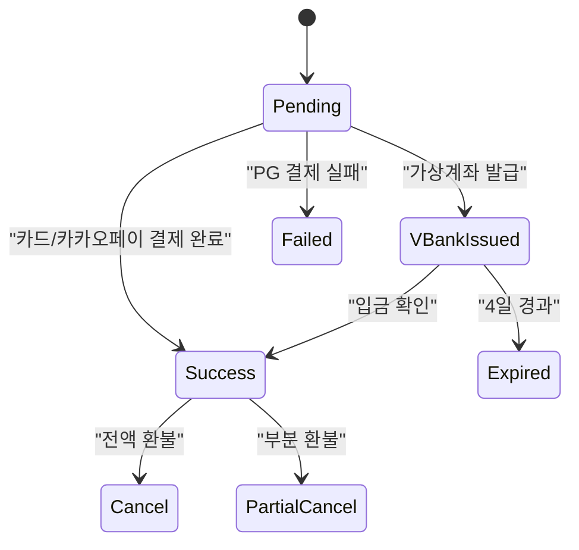
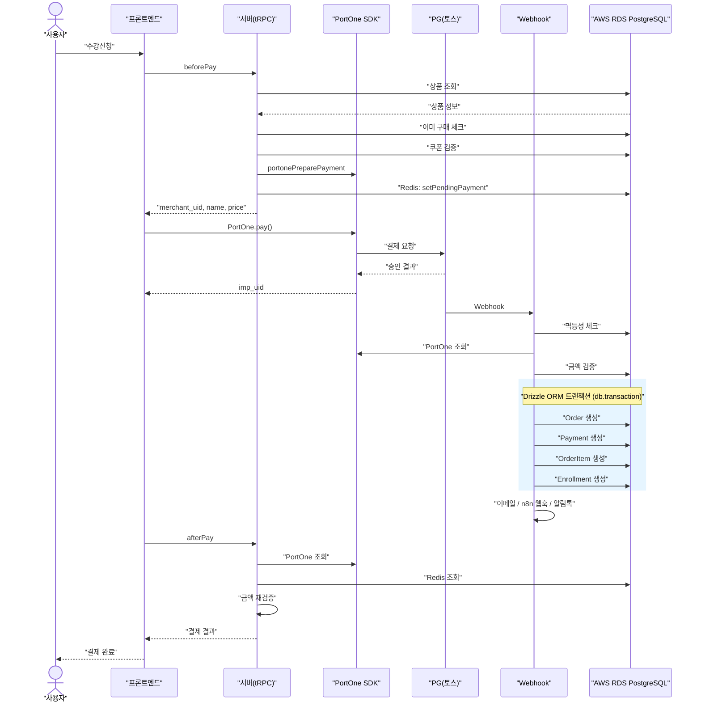
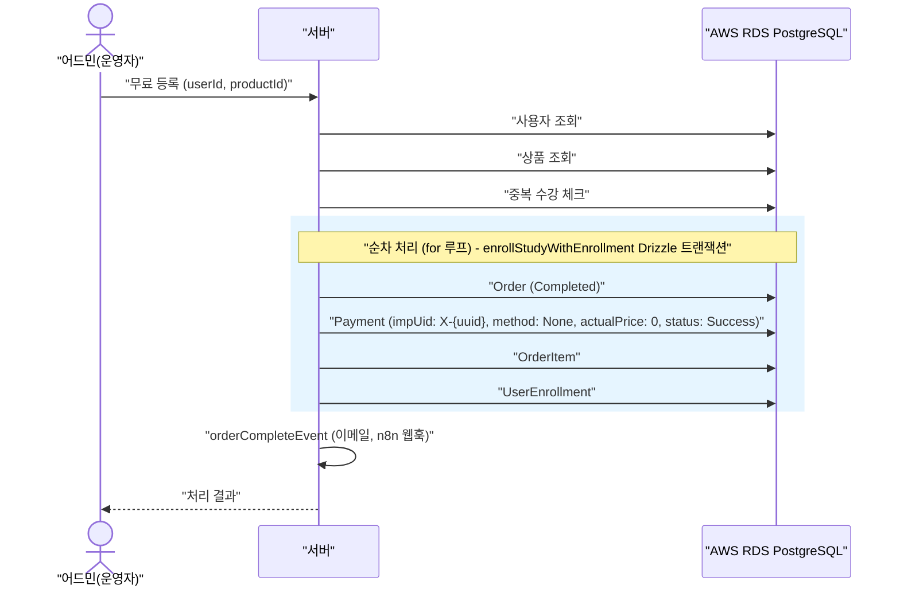
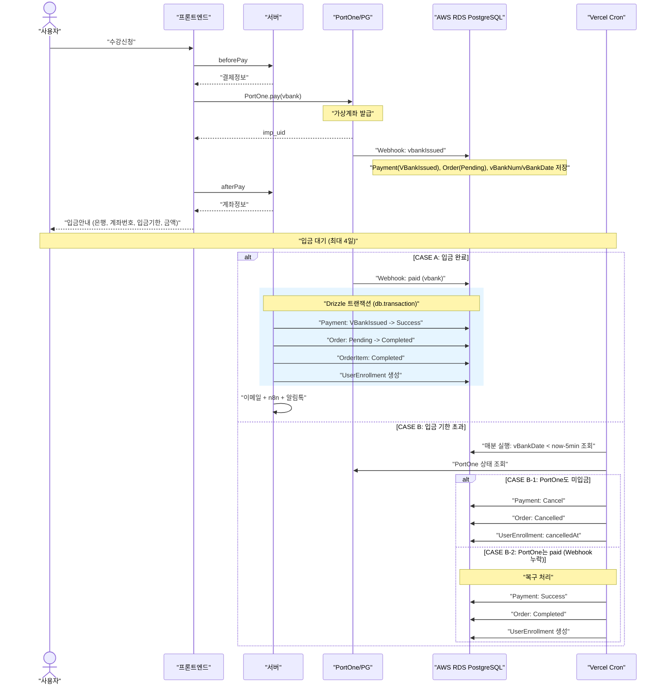
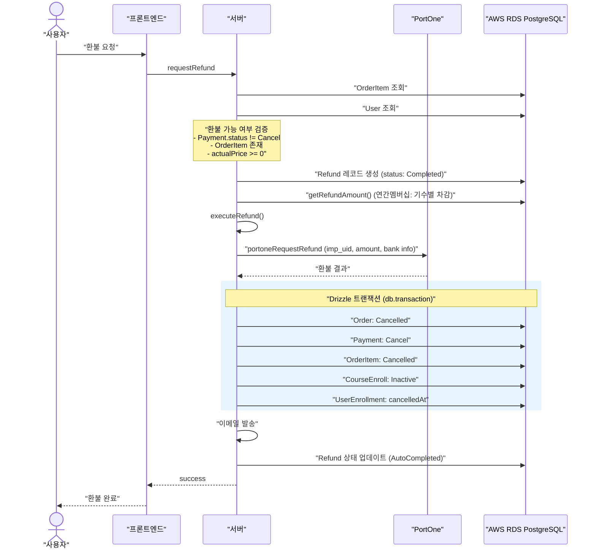
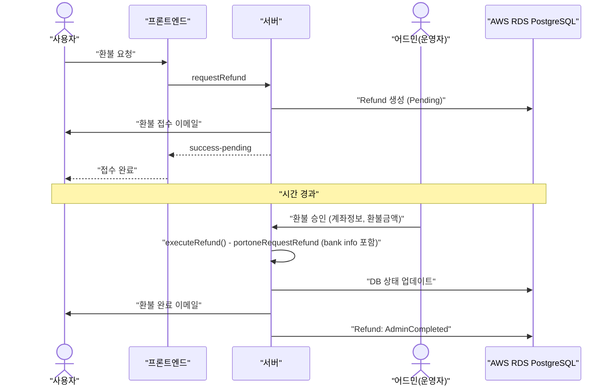
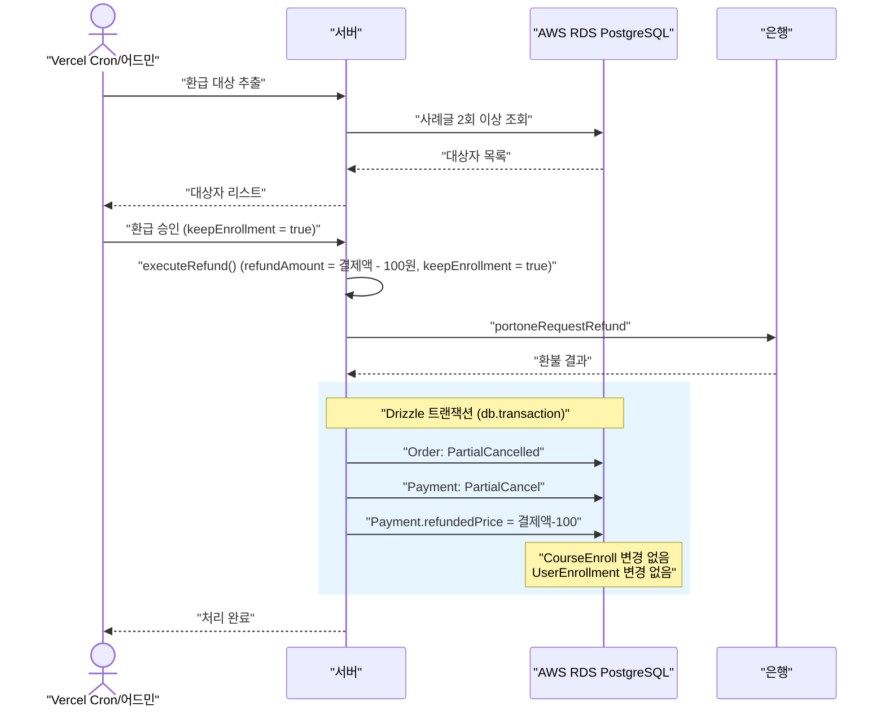
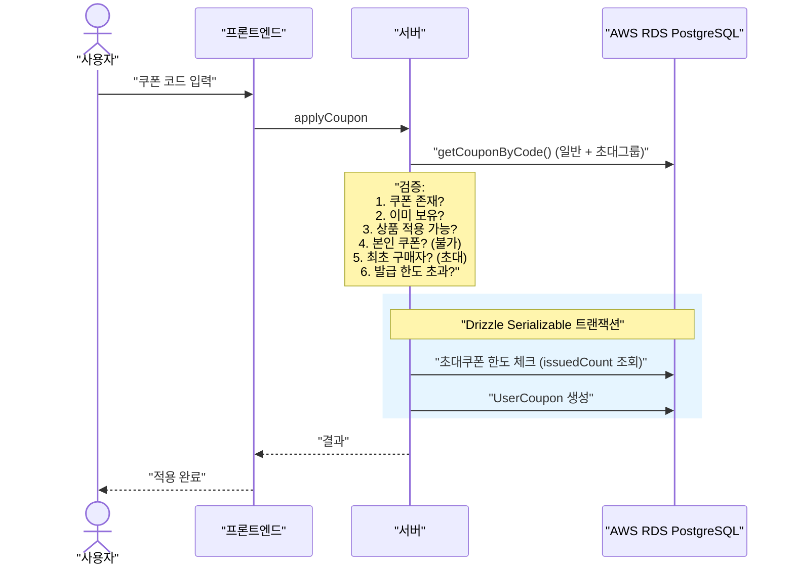

# renewal-05: 결제 플로우 설계서

> PortOne 기반 결제/환불 전체 플로우 설계
> 레거시 `gpters-study` 코드 분석 기반

| 항목 | 내용 |
|------|------|
| 문서 ID | renewal-05-payment-flow |
| 유형 | Design |
| 작성일 | 2026-03-06 |
| 버전 | v1.1 |
| 참조 | gpters-renewal-plan-plus.md (M-04, S-04, S-05), gpters-renewal-context-analysis.md (6.5, 7.2), 04-RE-02-business-logic.design.md |

---

## 설계 검증 체크리스트

- [x] 참조 문서 존재 확인: `gpters-renewal-plan-plus.md`, `gpters-renewal-context-analysis.md`, `04-RE-02-business-logic.design.md` 모두 확인
- [x] Plan 문서 정합성: M-04 결제, S-04 환급, S-05 쿠폰 요구사항 반영
- [x] Context 문서 정합성: 6.5 결제 플로우(0원 결제, 가상계좌, 지인초대), 7.2 가격 자동 전환 반영
- [x] RE-02 비즈니스 로직 정합성: PaymentService 21메서드, CouponService 10메서드, Webhook 멱등성, Serializable 트랜잭션 등 보존 항목 반영
- [x] DB 스키마: AWS 자체 구축 아키텍처(UUID PK, self-managed users FK, Drizzle ORM) 기반 설계
- [x] 레거시 코드 분석: `payment.service.ts`(1,920줄), `coupon.service.ts`(760줄), `webhook/route.ts`(413줄), `payments.routes.ts`(497줄) 전문 분석 완료

---

## 목차

1. [Payment 상태기계](#1-payment-상태기계)
2. [결제 플로우 시퀀스 다이어그램](#2-결제-플로우-시퀀스-다이어그램)
3. [0원 결제 플로우](#3-0원-결제-플로우)
4. [가상계좌 입금 대기 플로우](#4-가상계좌-입금-대기-플로우)
5. [환불 플로우](#5-환불-플로우)
6. [버디 환급 플로우](#6-버디-환급-플로우)
7. [가격 자동 전환 로직](#7-가격-자동-전환-로직)
8. [쿠폰 적용 플로우](#8-쿠폰-적용-플로우)
9. [Webhook 멱등성 처리](#9-webhook-멱등성-처리)
10. [금액 서버 검증](#10-금액-서버-검증)
11. [DB 스키마 (리뉴얼)](#11-db-스키마-리뉴얼)
12. [레거시 대비 변경점](#12-레거시-대비-변경점)

---

## 1. Payment 상태기계

### 1.1 상태 정의

| 상태 | 코드 | 설명 |
|------|------|------|
| 대기 | `Pending` | 결제 요청 생성됨 (아직 PG 응답 없음) |
| 가상계좌 발급 | `VBankIssued` | 가상계좌 번호 발급 완료, 입금 대기 중 |
| 성공 | `Success` | 결제 완료 (카드/카카오페이 즉시 또는 가상계좌 입금 확인) |
| 취소 | `Cancel` | 전액 환불 또는 결제 취소 |
| 부분취소 | `PartialCancel` | 부분 환불 (버디 환급 등, 수강 유지) |
| 실패 | `Failed` | PG 결제 실패 |
| 만료 | `Expired` | 가상계좌 입금 기한 초과 (4일) |

### 1.2 상태 전이 다이어그램



### 1.3 전이 규칙

| 출발 상태 | 도착 상태 | 트리거 | 비고 |
|-----------|-----------|--------|------|
| Pending | Success | 카드/카카오페이 결제 완료 Webhook | 즉시 결제 |
| Pending | VBankIssued | 가상계좌 발급 Webhook | 입금 대기 시작 |
| Pending | Failed | PG 결제 실패 Webhook | 결제 포기/오류 |
| VBankIssued | Success | 가상계좌 입금 확인 Webhook | 수강 등록 동시 처리 |
| VBankIssued | Expired | Vercel Cron (4일 경과) | 자동 취소 |
| Success | Cancel | 전액 환불 실행 | PortOne 환불 API + DB |
| Success | PartialCancel | 부분 환불 (버디 환급) | 수강 유지 |

### 1.4 금지된 전이

- `Cancel` -> 다른 상태 (환불 완료 후 되돌릴 수 없음)
- `Failed` -> `Success` (실패한 결제는 새로 결제해야 함)
- `Expired` -> `Success` (만료된 가상계좌는 재결제 필요)

> **중요**: 0원 결제도 환불 시 반드시 `Cancel` 상태로 변경해야 한다. `Success`로 남기면 "결제 완료"로 표시되어 혼란을 야기한다. (레거시 `payment.service.ts:L1499` 보존 규칙)

---

## 2. 결제 플로우 시퀀스 다이어그램

### 2.1 카드 결제 (토스페이먼츠)



### 2.2 카카오페이

카드 결제와 동일한 흐름. 차이점:
- `paymentMethod: 'kakao'`
- `PaymentMethod.Kakao` 저장
- PortOne 채널 ID: `NEXT_PUBLIC_PAYMENT_KAKAO_ID`

### 2.3 토스페이

카드 결제와 동일한 흐름. 차이점:
- `paymentMethod: 'toss'` (toss.card 채널)
- `PaymentMethod.TossCard` 저장
- PortOne 채널 ID: `NEXT_PUBLIC_PAYMENT_TOSS_ID`

### 2.4 가상계좌 결제

별도 섹션 4에서 상세 설명.

---

## 3. 0원 결제 플로우

### 3.1 개요

PG 호출 없이 내부적으로 결제를 처리하는 특수 플로우.

### 3.2 적용 케이스

| 케이스 | 대상 | 결제 금액 | 처리 방식 |
|--------|------|----------|----------|
| 임직원 무료 등록 | GPTers 임직원 | 0원 | 어드민에서 processFreePurchase 호출 |
| 스터디장 수강 | 스터디장 | 0원 | 어드민에서 processFreePurchase 호출 |
| 100% 쿠폰 적용 | 쿠폰 할인 = 상품가 | 0원 | 결제 플로우에서 자동 분기 |

### 3.3 시퀀스 다이어그램



### 3.4 핵심 규칙

```typescript
// 0원 결제 식별 패턴 (레거시 payment.service.ts:L1538)
impUid: 'X-' + uuidV4()    // 'X-' 프리픽스로 PG 미경유 식별
method: PaymentMethod.None   // 결제 수단 없음
actualPrice: 0               // 결제 금액 0원
status: PaymentStatus.Success // 바로 Success 상태
```

### 3.5 0원 결제 환불 규칙

- 0원 결제도 `Cancel` 상태로 변경해야 함
- `AutoRefund` 타입인 경우에만 자동 환불 가능
- `ManualRefund` 타입이면 0원 결제는 환불 불가 (어드민에서 직접 처리)
- PG 환불 API 호출하지 않음 (DB 상태만 변경)

### 3.6 0원 결제 삭제

`deleteFreePurchaseByOrderId` 메서드로 완전 삭제 가능:

```
삭제 순서 (Drizzle 트랜잭션):
1. UserCouponUse 삭제
2. OrderItem 삭제
3. UserEnrollment 삭제
4. CourseEnroll 비활성화
5. Order 삭제
6. Payment 삭제
```

> **안전장치**: `actualPrice !== 0`이면 삭제 중단

---

## 4. 가상계좌 입금 대기 플로우

### 4.1 전체 시퀀스



### 4.2 만료 타이머

```typescript
const PendingPaymentExpireTime = 60 * 60 * 24 * 4  // 4일 (345,600초)
```

- Redis(AWS ElastiCache)에 결제 대기 정보를 4일 TTL로 저장
- Vercel Cron Job이 매분 실행하여 `vBankDate < now - 5분`인 결제를 찾음
- 5분 버퍼: PG사와의 시간 동기화 이슈 및 경쟁 조건 방지

### 4.3 가상계좌 만료 처리 로직 (cancelExpiredVBankPayments)

```
1. VBankIssued 상태이면서 vBankDate < (현재 - 5분)인 결제 조회
2. 각 결제에 대해:
   a. impUid 없음 -> 바로 Cancel 처리
   b. PortOne API 호출 실패 -> 스킵 (다음 Cron에서 재시도)
   c. PortOne 상태가 'paid' -> Webhook 누락! 복구 처리 (Success + Enrollment 생성)
   d. PortOne 상태가 'paid'가 아님 -> Cancel 처리
3. 결과 로깅: recovered / cancelled / skipped / errors
```

### 4.4 가상계좌 입금 완료 처리 (vBankCompletedWithEnrollment)

하나의 Drizzle 트랜잭션으로 처리 (DEV-2823):

```
db.transaction(async (tx) => {
  1. 멱등성 확인: 이미 Success면 기존 결과 반환
  2. Payment 상태 업데이트: VBankIssued -> Success
  3. Order/OrderItem 상태: Pending -> Completed
  4. UserEnrollment 생성 (중복 체크 포함)
})
```

---

## 5. 환불 플로우

### 5.1 환불 유형

| 유형 | 코드 | 처리 방식 | 적용 대상 |
|------|------|----------|----------|
| 자동 환불 | `AutoRefund` | 즉시 PG 환불 + DB 업데이트 | 카드/카카오페이 결제 |
| 수동 환불 | `ManualRefund` | 관리자 승인 후 처리 | 가상계좌 (계좌 입력 필요) |
| 관리자 환불 | `Admin` | 어드민에서 직접 실행 | 특수 케이스 |

### 5.2 자동 환불 시퀀스



### 5.3 수동 환불 시퀀스



### 5.4 환불 시 관련 모델 전체 업데이트

| 모델 | 필드 | 변경 값 | 비고 |
|------|------|---------|------|
| Order | status | `Cancelled` | 전액환불 시 |
| Order | status | `PartialCancelled` | 부분환불(환급) 시 |
| Payment | status | `Cancel` | 전액환불 시 |
| Payment | status | `PartialCancel` | 부분환불 시 |
| Payment | cancelHistory | PG 취소 이력 | PortOne 응답 |
| Payment | refundedPrice | 환불 금액 | |
| OrderItem | status | `Cancelled` | 전액환불 시 |
| OrderItem | refundedPrice | 환불 금액 | |
| CourseEnroll | courseEnrollStatus | `Inactive` | 전액환불 시만 (레거시 호환) |
| CourseEnroll | listenAbleTagIds | `[]` | 전액환불 시만 (레거시 호환) |
| UserEnrollment | cancelledAt | `new Date()` | 전액환불 시만 |
| Refund | status | `AutoCompleted` / `AdminCompleted` / `Completed` / `Rejected` | |

> **부분환불(keepEnrollment=true)**: CourseEnroll, UserEnrollment는 변경하지 않음. 수강 유지.

### 5.5 연간멤버십 환불 금액 계산

```
환불금액 = 실결제금액 - (참여 기수 수 x 299,000원)

참여 기수 수 = 멤버십 시작일 이후 시작된 단건 기수 중
              기간이 2개월 미만인 상품의 cohort 수 (DISTINCT)

예시:
  990,000원 연간멤버십
  - 2기수 참여: 990,000 - (2 x 299,000) = 392,000원 환불
  - 4기수 참여: 990,000 - (4 x 299,000) = 0원 -> 환불 불가
```

레거시 코드 위치: `payment.service.ts:L1777-1825` (Raw SQL)

### 5.6 환불 가능 여부 검증 (validateRefundEligibility)

```
환불 가능 조건 (모두 충족):
1. 주문 정보 + 결제 정보 존재
2. Payment.status != Cancel
3. OrderItem 존재
4. actualPrice >= 0
5. 0원 결제는 AutoRefund 타입만 가능
6. 환불금액 > 0 또는 (환불금액 == 0 AND 결제금액 == 0)
```

### 5.7 PG 환불 실패 대응 (DEV-2824)

```
PG 환불 성공 -> DB 업데이트 실패 시:
  - CRITICAL 레벨로 Sentry 알림
  - 태그: pgRefundStatus=completed, requiresManualRecovery=true
  - 수동 복구 필요 (PG는 환불됨, DB는 미반영)
```

---

## 6. 버디 환급 플로우

### 6.1 개요

버디 프로그램 참여자가 조건(사례글 2회 작성)을 충족하면 결제 금액의 100% - 100원을 환급받는 플로우.

출처: `gpters-renewal-context-analysis.md` 섹션 5.4, `study-runtime-checklist.md`

### 6.2 조건

| 항목 | 내용 |
|------|------|
| 대상 | 버디 등록 완료 수강생 (선착순 30명) |
| 조건 | 사례 게시글 2회 이상 작성 |
| 환급액 | 결제금액 - 100원 (100% 환급이지만 100원 차감) |
| 처리 방식 | 부분환불 (수강 유지, PartialCancel) |

### 6.3 시퀀스



### 6.4 리뉴얼 구현 방향

```
현재 (레거시):
  1. 에어테이블에서 출석 + 과제 데이터 수동 집계
  2. 환급 대상자 수동 추출
  3. 수동 환급 처리

리뉴얼:
  1. AWS RDS PostgreSQL에서 자동 집계 (posts 테이블 조인)
  2. 어드민 > 수료/환급 대시보드에서 자동 필터링
  3. 일괄 환급 처리 (executeRefund with keepEnrollment=true)
```

---

## 7. 가격 자동 전환 로직

### 7.1 가격 구간

출처: `gpters-renewal-context-analysis.md` 섹션 7.2

```
슈퍼얼리버드: 149,000원 (모집 시작 ~ 슈퍼얼리버드 마감일)
얼리버드:     199,000원 (슈퍼얼리버드 마감일 ~ 얼리버드 마감일)
일반가:       269,000원 (얼리버드 마감일 이후)
```

### 7.2 TypeScript 서비스 함수 설계

```typescript
// services/pricing.service.ts
import { db } from '@/db';
import { cohorts } from '@/db/schema';
import { eq } from 'drizzle-orm';

type PriceResult = {
  price: number;
  priceType: 'super_early_bird' | 'early_bird' | 'regular';
  deadline: Date | null;
};

export async function getCurrentPrice(cohortId: string): Promise<PriceResult> {
  const cohort = await db
    .select()
    .from(cohorts)
    .where(eq(cohorts.id, cohortId))
    .limit(1)
    .then(rows => rows[0]);

  if (!cohort) {
    throw new Error('Cohort not found');
  }

  const now = new Date();

  if (cohort.superEarlyBirdDeadline && now < cohort.superEarlyBirdDeadline) {
    return {
      price: cohort.superEarlyBirdPrice,
      priceType: 'super_early_bird',
      deadline: cohort.superEarlyBirdDeadline,
    };
  }

  if (cohort.earlyBirdDeadline && now < cohort.earlyBirdDeadline) {
    return {
      price: cohort.earlyBirdPrice,
      priceType: 'early_bird',
      deadline: cohort.earlyBirdDeadline,
    };
  }

  return {
    price: cohort.regularPrice,
    priceType: 'regular',
    deadline: null,
  };
}
```

### 7.3 핵심 설계 원칙

- **Cron 불필요**: 조회 시점에 실시간 계산
- **서버 사이드 계산**: 클라이언트에서 가격을 조작할 수 없음
- **결제 시 이중 검증**: `beforePay`에서 DB 가격과 요청 가격 비교

### 7.4 cohorts 테이블 Drizzle 스키마

```typescript
// db/schema/cohorts.ts
import { pgTable, uuid, integer, text, timestamp } from 'drizzle-orm/pg-core';

export const cohorts = pgTable('cohorts', {
  id: uuid('id').primaryKey().defaultRandom(),
  number: integer('number').notNull(),                           // 기수 번호
  superEarlyBirdPrice: integer('super_early_bird_price').notNull(), // 슈퍼얼리버드가
  superEarlyBirdDeadline: timestamp('super_early_bird_deadline', { withTimezone: true }),
  earlyBirdPrice: integer('early_bird_price').notNull(),           // 얼리버드가
  earlyBirdDeadline: timestamp('early_bird_deadline', { withTimezone: true }),
  regularPrice: integer('regular_price').notNull(),                // 일반가
  enrollmentDeadline: timestamp('enrollment_deadline', { withTimezone: true }),
  startsAt: timestamp('starts_at', { withTimezone: true }).notNull(),
  expiresAt: timestamp('expires_at', { withTimezone: true }).notNull(),
  // ...
});
```

---

## 8. 쿠폰 적용 플로우

### 8.1 쿠폰 유형

출처: `gpters-renewal-context-analysis.md` 섹션 5.2, `coupon.service.ts`

| 유형 | 코드 | 할인 방식 | 발급 조건 | 사용 제한 |
|------|------|----------|----------|----------|
| 일반 쿠폰 | `Code` | 정액 할인 | 코드 입력 | 상품별 지정 |
| 지인초대 쿠폰 | `InviteGroup` (SpecificUser) | 정액 (10만원) | 스터디장이 발급 | 스터디장당 2명 |
| 임직원 지인초대 | `InviteGroup` (SpecificUser) | 정액 (10만원) | 임직원이 발급 | 인당 5명 |
| 전체 사용자 쿠폰 | `InviteGroup` (AllUser) | 정액/정률 | 자동 | 상품별 지정 |
| 자동 계산 쿠폰 | `Calculate` | 정액 | 시스템 자동 | 결제 시 자동 적용 |

### 8.2 쿠폰 적용 시퀀스 (applyCouponToUser)



### 8.3 쿠폰 Serializable 트랜잭션 구현

```typescript
// Drizzle ORM 기반 Serializable 격리 수준
await db.transaction(async (tx) => {
  // 초대쿠폰 발급 수량 조회 (동시성 제어)
  const issuedCount = await tx
    .select({ count: sql<number>`count(*)` })
    .from(userCoupons)
    .where(eq(userCoupons.couponId, couponId));

  if (issuedCount[0].count >= maxUsage) {
    throw new Error('max-usage-exceeded');
  }

  // UserCoupon 생성
  await tx.insert(userCoupons).values({
    userId,
    couponId,
    referrerId,
    issuedBy: 'code',
  });
}, { isolationLevel: 'serializable' });
```

### 8.4 쿠폰 검증 규칙

| 검증 | 결과 코드 | 설명 |
|------|----------|------|
| 쿠폰 없음 | `invalid-coupon` | 존재하지 않는 코드 |
| 이미 보유 | `exists` | 동일 쿠폰 중복 발급 불가 |
| 상품 불일치 | `invalid-for-product` | 해당 상품에 적용 불가 |
| 본인 쿠폰 | `invalid-for-user` | 자기가 발급한 초대쿠폰은 사용 불가 |
| 구매 이력 있음 | `has-order` | 초대쿠폰은 최초 구매자만 사용 가능 |
| 한도 초과 | `max-usage-exceeded` | 초대쿠폰 발급 한도 초과 |

### 8.5 쿠폰 중복 적용 규칙

- `canDuplicate` 필드로 중복 허용 여부 제어
- 초대쿠폰은 기본적으로 다른 쿠폰과 중복 적용 가능
- 예: 슈퍼얼리버드 149,000원 + 지인초대 -100,000원 = 49,000원

### 8.6 결제 시 쿠폰 처리

```
beforePay:
  1. userAvailableCoupons() 조회
  2. 선택된 쿠폰 유효성 확인
  3. 초대쿠폰 사용 횟수 체크 (inviteCouponUsageCount)
  4. 최종 금액 = 상품가 - 쿠폰할인

Webhook (결제 완료):
  1. UserCouponUse 레코드 생성 (Order와 연결)
  2. 사용된 쿠폰은 isUsed = true로 표시

환불 시:
  1. UserCouponUse는 Order에 연결되어 있으므로 자동 처리
  2. 쿠폰은 재사용 가능 (Order.status == Cancelled면 isUsed = false)
```

### 8.7 초대 그룹 쿠폰 코드 생성

```
형식: 8자리 영숫자
문자셋: 23456789ABCDEFGHJKLMNPQRSTUVWXYZ (혼동 문자 O, I, L, 0, 1 제외)
생성: nanoid customAlphabet 사용
```

---

## 9. Webhook 멱등성 처리

### 9.1 PortOne Webhook 멱등성

레거시 코드 위치: `webhook/route.ts:L157-168`, `webhook-idempotency.ts`

```typescript
// 멱등성 키 생성
idempotencyKey = `${imp_uid}:${portonePaymentData.status}`

// Redis(AWS ElastiCache) 기반 Lock 획득
const isNewEvent = await acquireWebhookLock('portone', idempotencyKey)
if (!isNewEvent) {
  // 중복 이벤트 -> 200 반환 (무시)
  return NextResponse.json({ message: 'Duplicate event ignored' }, { status: 200 })
}

// 처리 실패 시 Lock 해제 (재처리 허용)
if (idempotencyKey) {
  await releaseWebhookLock('portone', idempotencyKey)
}
```

### 9.2 멱등성 키 구조

```
portone:{imp_uid}:{status}
```

- 동일 `imp_uid`라도 `status`가 다르면 별도 이벤트로 처리
- 예: `imp_12345:paid`, `imp_12345:cancelled`

### 9.3 리뉴얼 구현

```
레거시: Upstash Redis 기반 acquireWebhookLock/releaseWebhookLock
리뉴얼: AWS ElastiCache Redis로 동일 패턴 구현

구현:
  // AWS ElastiCache Redis
  SET portone:{key} 1 EX 86400 NX  -- 24시간 TTL, 없을 때만 설정

  // ioredis 클라이언트
  import Redis from 'ioredis';
  const redis = new Redis(process.env.ELASTICACHE_REDIS_URL);

  async function acquireWebhookLock(provider: string, key: string): Promise<boolean> {
    const result = await redis.set(`${provider}:${key}`, '1', 'EX', 86400, 'NX');
    return result === 'OK';
  }

  async function releaseWebhookLock(provider: string, key: string): Promise<void> {
    await redis.del(`${provider}:${key}`);
  }
```

### 9.4 가상계좌 입금 완료의 추가 멱등성

```typescript
// vBankCompletedWithEnrollment 내부 멱등성 (payment.service.ts:L376-394)
// Drizzle 트랜잭션 내부
await db.transaction(async (tx) => {
  const currentPayment = await tx
    .select()
    .from(payments)
    .where(eq(payments.merchantUid, merchantUid))
    .limit(1)
    .then(rows => rows[0]);

  if (currentPayment?.status === PaymentStatus.Success) {
    // 이미 처리됨 -> 기존 결과 반환
    return currentPayment;
  }

  // UserEnrollment 중복 생성 방지
  const existingEnrollment = await tx
    .select()
    .from(enrollments)
    .where(eq(enrollments.paymentId, payment.id))
    .limit(1)
    .then(rows => rows[0]);

  if (!existingEnrollment) {
    await tx.insert(enrollments).values({ ... });
  }
});
```

---

## 10. 금액 서버 검증

### 10.1 검증 흐름

```
사전 검증 (beforePay, payments.routes.ts:L174-288):
  1. 클라이언트 요청 가격 검증: input.price >= 100
  2. DB 상품 가격 조회
  3. 쿠폰 할인 적용 후 최종 금액 계산
  4. input.price == 계산된 금액 확인
  5. PortOne에 금액 사전 등록 (portonePreparePayment)
  6. Redis(ElastiCache)에 결제 정보 저장 (가격 포함)

사후 검증 (Webhook, webhook/route.ts:L191-206):
  1. PortOne API에서 실제 결제 금액 조회 (portoneGetPaymentData)
  2. Redis에서 사전 저장된 금액 조회 (getPendingPayment)
  3. portonePaymentData.amount == savedPrice 비교
  4. 불일치 시 -> 결제 실패 처리 (is_결제실패 = true)

afterPay (클라이언트 검증, payments.routes.ts:L305-450):
  1. PortOne API에서 결제 금액 조회
  2. Redis의 사전 저장 금액과 비교
  3. 불일치 시 -> { status: 'wrong', message: '결제에 실패하였습니다.' }
```

### 10.2 검증 실패 시 처리

```
Webhook 금액 불일치:
  -> 404 반환 (결제 실패로 처리)
  -> PG 취소는 PortOne이 자동 처리

afterPay 금액 불일치:
  -> 클라이언트에 'wrong' 상태 반환
  -> 사용자에게 실패 안내
```

### 10.3 리뉴얼 구현

```
동일한 2단계 검증 패턴 유지:
1. 결제 전: getCurrentPrice() TypeScript 함수로 실시간 가격 계산 + Drizzle ORM으로 DB 조회
2. 결제 후: PortOne 응답 금액 vs ElastiCache Redis 저장 금액 비교
3. 불일치 시: 결제 자동 취소 + Sentry 알림
```

---

## 11. DB 스키마 (리뉴얼)

### 11.1 핵심 테이블

AWS 자체 구축 아키텍처 기반. Drizzle ORM으로 스키마 관리, AWS RDS PostgreSQL에서 운영.

```sql
-- 사용자 (self-managed, NextAuth 기반)
CREATE TABLE users (
  id UUID PRIMARY KEY DEFAULT gen_random_uuid(),
  email TEXT UNIQUE NOT NULL,
  name TEXT,
  role TEXT NOT NULL DEFAULT 'user',  -- user/admin
  created_at TIMESTAMPTZ DEFAULT NOW(),
  updated_at TIMESTAMPTZ DEFAULT NOW()
);

-- 상품 (기수 단위)
CREATE TABLE products (
  id UUID PRIMARY KEY DEFAULT gen_random_uuid(),
  cohort_id UUID REFERENCES cohorts(id),
  name TEXT NOT NULL,
  description TEXT,
  super_early_bird_price INTEGER,
  early_bird_price INTEGER,
  regular_price INTEGER,
  status TEXT NOT NULL DEFAULT 'upcoming',  -- upcoming/selling/sold_out/stop
  refund_type TEXT NOT NULL DEFAULT 'auto', -- auto/manual
  starts_at TIMESTAMPTZ,
  expires_at TIMESTAMPTZ,
  created_at TIMESTAMPTZ DEFAULT NOW(),
  updated_at TIMESTAMPTZ DEFAULT NOW()
);

-- 주문
CREATE TABLE orders (
  id UUID PRIMARY KEY DEFAULT gen_random_uuid(),
  user_id UUID REFERENCES users(id) NOT NULL,
  status TEXT NOT NULL DEFAULT 'pending',  -- pending/completed/cancelled/partial_cancelled
  deleted_at TIMESTAMPTZ,                  -- Soft Delete
  created_at TIMESTAMPTZ DEFAULT NOW(),
  updated_at TIMESTAMPTZ DEFAULT NOW()
);

-- 주문 항목
CREATE TABLE order_items (
  id UUID PRIMARY KEY DEFAULT gen_random_uuid(),
  order_id UUID REFERENCES orders(id) NOT NULL,
  product_id UUID REFERENCES products(id) NOT NULL,
  status TEXT NOT NULL DEFAULT 'pending',
  actual_price INTEGER NOT NULL,
  refunded_price INTEGER,
  currency TEXT NOT NULL DEFAULT 'KRW',
  deleted_at TIMESTAMPTZ,                  -- Soft Delete
  created_at TIMESTAMPTZ DEFAULT NOW()
);

-- 결제
CREATE TABLE payments (
  id UUID PRIMARY KEY DEFAULT gen_random_uuid(),
  order_id UUID REFERENCES orders(id) NOT NULL UNIQUE,
  merchant_uid TEXT NOT NULL UNIQUE,
  imp_uid TEXT NOT NULL,                   -- 'X-{uuid}' = 0원 결제
  name TEXT NOT NULL,
  actual_price INTEGER NOT NULL,
  refunded_price INTEGER,
  status TEXT NOT NULL DEFAULT 'pending',  -- pending/success/cancel/partial_cancel/vbank_issued/failed
  method TEXT,                              -- toss_card/kakao/toss_vbank/paypal/none
  card_name TEXT,
  card_number TEXT,
  card_quota INTEGER,
  vbank_num TEXT,
  vbank_date TIMESTAMPTZ,
  vbank_name TEXT,
  vbank_holder TEXT,
  receipt_url TEXT,
  cancel_history JSONB,
  paid_at TIMESTAMPTZ,
  deleted_at TIMESTAMPTZ,                  -- Soft Delete
  created_at TIMESTAMPTZ DEFAULT NOW(),
  updated_at TIMESTAMPTZ DEFAULT NOW()
);

-- 환불
CREATE TABLE refunds (
  id UUID PRIMARY KEY DEFAULT gen_random_uuid(),
  order_id UUID REFERENCES orders(id) NOT NULL,
  status TEXT NOT NULL DEFAULT 'pending',  -- pending/completed/auto_completed/admin_completed/rejected
  reason TEXT,
  bank_account TEXT,
  bank_code TEXT,
  bank_holder TEXT,
  order_item_ids UUID[],
  refund_data JSONB,
  created_at TIMESTAMPTZ DEFAULT NOW(),
  updated_at TIMESTAMPTZ DEFAULT NOW()
);

-- 수강 등록
CREATE TABLE enrollments (
  id UUID PRIMARY KEY DEFAULT gen_random_uuid(),
  user_id UUID REFERENCES users(id) NOT NULL,
  product_id UUID REFERENCES products(id) NOT NULL,
  order_id UUID REFERENCES orders(id) NOT NULL,
  payment_id UUID REFERENCES payments(id) NOT NULL,
  cohort INTEGER,
  starts_at TIMESTAMPTZ,
  expires_at TIMESTAMPTZ,
  cancelled_at TIMESTAMPTZ,
  deleted_at TIMESTAMPTZ,                  -- Soft Delete
  created_at TIMESTAMPTZ DEFAULT NOW(),
  updated_at TIMESTAMPTZ DEFAULT NOW()
);

-- 쿠폰
CREATE TABLE coupons (
  id UUID PRIMARY KEY DEFAULT gen_random_uuid(),
  name TEXT NOT NULL,
  code TEXT UNIQUE,
  description TEXT,
  discount_price INTEGER NOT NULL,
  can_duplicate BOOLEAN DEFAULT FALSE,
  status TEXT NOT NULL DEFAULT 'active',   -- active/deactive/expired
  expires_at TIMESTAMPTZ,
  created_at TIMESTAMPTZ DEFAULT NOW()
);

-- 사용자 보유 쿠폰
CREATE TABLE user_coupons (
  id UUID PRIMARY KEY DEFAULT gen_random_uuid(),
  user_id UUID REFERENCES users(id) NOT NULL,
  coupon_id UUID REFERENCES coupons(id) NOT NULL,
  referrer_id UUID REFERENCES users(id),
  issued_by TEXT NOT NULL,                 -- code/calculate/admin
  created_at TIMESTAMPTZ DEFAULT NOW()
);

-- 쿠폰 사용 기록
CREATE TABLE user_coupon_uses (
  id UUID PRIMARY KEY DEFAULT gen_random_uuid(),
  user_coupon_id UUID REFERENCES user_coupons(id) NOT NULL,
  order_id UUID REFERENCES orders(id) NOT NULL,
  created_at TIMESTAMPTZ DEFAULT NOW()
);

-- 초대 그룹
CREATE TABLE invite_groups (
  id UUID PRIMARY KEY DEFAULT gen_random_uuid(),
  name TEXT NOT NULL,
  description TEXT,
  type TEXT NOT NULL,                      -- all_user/specific_user
  created_at TIMESTAMPTZ DEFAULT NOW()
);
```

### 11.2 접근 제어 (애플리케이션 레벨)

```typescript
// RLS 대신 애플리케이션 레벨 미들웨어로 접근 제어
// tRPC 미들웨어 예시

const isAuthenticated = t.middleware(async ({ ctx, next }) => {
  if (!ctx.session?.user) {
    throw new TRPCError({ code: 'UNAUTHORIZED' });
  }
  return next({ ctx: { user: ctx.session.user } });
});

const isAdmin = t.middleware(async ({ ctx, next }) => {
  if (ctx.session?.user?.role !== 'admin') {
    throw new TRPCError({ code: 'FORBIDDEN' });
  }
  return next({ ctx: { user: ctx.session.user } });
});

// 본인 주문만 조회 (서비스 레벨)
async function getUserOrders(userId: string, requesterId: string) {
  if (userId !== requesterId) {
    throw new TRPCError({ code: 'FORBIDDEN' });
  }
  return db.select().from(orders).where(eq(orders.userId, userId));
}
```

---

## 12. 레거시 대비 변경점

### 12.1 제거 대상

| 레거시 | 제거 이유 | 대체 |
|--------|----------|------|
| Bettermode 구매 시작점 (`/api/purchase/bettermode`) | BM 제거 | 자체 결제 페이지 |
| `bettermodePostId` 참조 | BM 제거 | 자체 `product_id` |
| `bettermodeUserId` 파라미터 | BM 제거 | self-managed `user_id` |
| Redis 결제 대기 (setPendingPayment) | 검토 필요 | ElastiCache Redis 유지 (검토) |
| Airtable 동기화 | 일몰 | AWS RDS 단일 DB |
| CourseEnroll 모델 | Deprecated (legacy-rules.md) | enrollments 테이블 |
| n8n 결제 웹훅 | 검토 필요 | Vercel Cron 또는 n8n 유지 |

### 12.2 유지/보존 대상

| 항목 | 이유 | 코드 위치 (레거시) |
|------|------|-------------------|
| 0원 결제 `X-{uuid}` 패턴 | 비즈니스 필수 | `payment.service.ts:L1538` |
| 가상계좌 4일 만료 | 비즈니스 정책 | `payment.service.ts:L30` |
| 연간멤버십 환불 공식 (기수당 299,000원) | 비즈니스 정책 | `payment.service.ts:L1817` |
| Webhook 멱등성 Lock | 데이터 안전 | `webhook-idempotency.ts` |
| 금액 서버 검증 (2단계) | 보안 필수 | `payments.routes.ts`, `webhook/route.ts` |
| PG 환불 후 DB 실패 CRITICAL 알림 | 운영 안전 | `payment.service.ts:L724-752` |
| Serializable 트랜잭션 (수강등록) | 동시성 제어 | `user-enrollment.service.ts:L129` |
| Soft Delete (Order, Payment, Enrollment) | 데이터 보존 | 전체 |
| PII 마스킹 (환불 계좌번호) | 개인정보보호 | `internal-api-rules.md` |
| `cancelledAt` vs `deletedAt` 구분 | UserEnrollment 의미 분리 | `user-enrollment.service.ts` |

### 12.3 개선 대상

| 항목 | 현재 | 리뉴얼 |
|------|------|--------|
| 결제 페이지 진입 | BM snippets -> /api/purchase/bettermode -> 결제 페이지 | 직접 /checkout/[productId] |
| 가격 확인 | Airtable + 구글 캘린더 수동 확인 | `getCurrentPrice()` TypeScript 서비스 함수 |
| 환급 대상 추출 | 에어테이블 수동 집계 | 어드민 자동 필터링 |
| 결제 상태 알림 | n8n 웹훅 -> Slack | Vercel Cron 또는 n8n 유지 |
| 결제 대기 정보 저장 | Redis (4일 TTL) | ElastiCache Redis 유지 (검토) |

### 12.4 아키텍처 마이그레이션 요약

| 영역 | 레거시 (v1.0) | 리뉴얼 (v1.1) |
|------|--------------|---------------|
| DB | Prisma ORM | Drizzle ORM |
| DB 호스팅 | (미정) | AWS RDS PostgreSQL |
| 인증/사용자 | `auth.users` (외부) | self-managed `users` 테이블 (NextAuth) |
| 트랜잭션 | Prisma `$transaction` | Drizzle `db.transaction()` |
| Serializable 격리 | Prisma RPC | Drizzle `{ isolationLevel: 'serializable' }` |
| 가격 계산 | SQL DB 함수 (`get_current_price`) | TypeScript 서비스 함수 (`getCurrentPrice`) |
| Redis | Upstash | AWS ElastiCache |
| Cron | Vercel Cron (유지) | Vercel Cron |
| 접근 제어 | RLS 정책 | tRPC 미들웨어 + 서비스 레벨 체크 |

---

## 부록 A: 결제 수단별 PaymentMethod 매핑

| 결제 수단 | paymentMethod (input) | PaymentMethod (DB) | PortOne 채널 |
|-----------|----------------------|-------------------|-------------|
| 카드 (토스) | `'toss'` | `TossCard` | `NEXT_PUBLIC_PAYMENT_TOSS_ID` |
| 카카오페이 | `'kakao'` | `Kakao` | `NEXT_PUBLIC_PAYMENT_KAKAO_ID` |
| 가상계좌 (토스) | `'toss.vbank'` | `TossVBank` | `NEXT_PUBLIC_PAYMENT_TOSS_ID` |
| 페이팔 | `'paypal'` | `Paypal` | `NEXT_PUBLIC_PAYMENT_PAYPAL_ID` |
| 0원 결제 | - | `None` | - (PG 미경유) |

## 부록 B: PortOne API 호출 목록

| 함수 | API | 용도 | 파일 |
|------|-----|------|------|
| `portonePreparePayment` | POST `/payments/prepare` | 결제 사전 등록 | `portone.ts` |
| `portoneGetPaymentData` | GET `/payments/{imp_uid}` | 결제 정보 조회 | `portone.ts` |
| `portoneRequestRefund` | POST `/payments/cancel` | 결제 취소/환불 | `portone.ts` |

- 인증: REST API Key + Secret Key
- 토큰 캐싱: ElastiCache Redis (`payment:access_token`)
- 재시도: axios-retry (3회, exponential backoff)

## 부록 C: Cron Job

| 경로 | 스케줄 | 용도 | 런타임 |
|------|--------|------|--------|
| `/api/vbank-expired` | `* * * * *` (매분) | 만료 가상계좌 취소 + Webhook 누락 복구 | Vercel Cron |
| `/api/payment-consistency` | `0 0 * * *` (매일 0시) | 결제/수강 데이터 정합성 검사 | Vercel Cron |

## 부록 D: 에러 코드

| 에러 코드 | 클래스 | 설명 |
|-----------|--------|------|
| `USER_NOT_FOUND` | `PaymentError` | 사용자를 찾을 수 없음 |
| `PRODUCT_NOT_FOUND` | `PaymentError` | 상품을 찾을 수 없음 |
| `PROCESS_ERROR` | `PaymentError` | 결제 처리 중 오류 |

---

## 버전 이력

| 버전 | 날짜 | 변경 내용 | 작성자 |
|------|------|----------|--------|
| v1.0 | 2026-03-06 | 초기 작성 - 레거시 코드 분석 기반 전체 결제 플로우 설계 | Claude (Payment Flow Expert) |
| v1.1 | 2026-03-07 | AWS 자체 구축 아키텍처 전환: Drizzle ORM, AWS RDS PostgreSQL, ElastiCache Redis, self-managed users, Vercel Cron, 애플리케이션 레벨 접근 제어 | Claude (Payment Flow Expert) |
