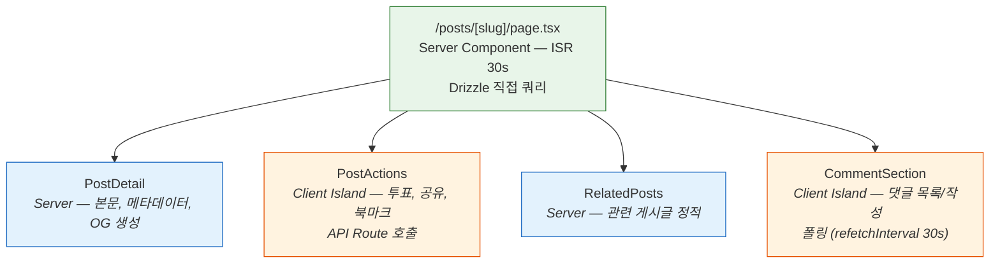
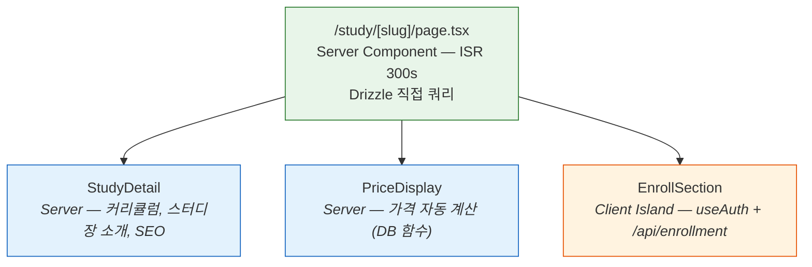
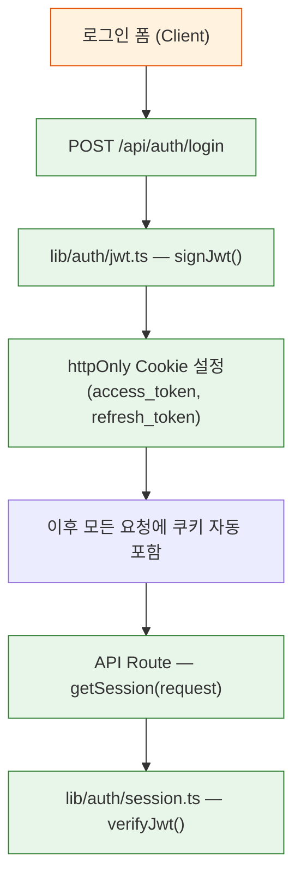
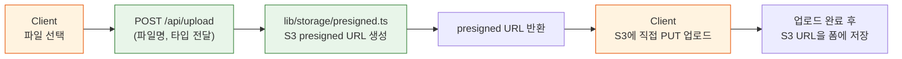
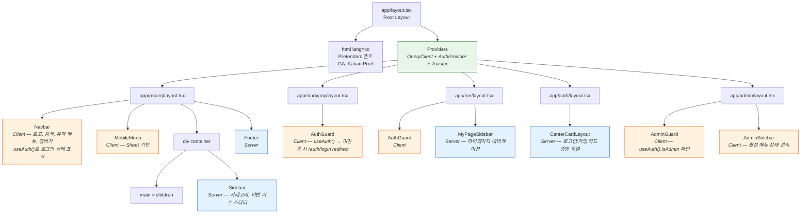
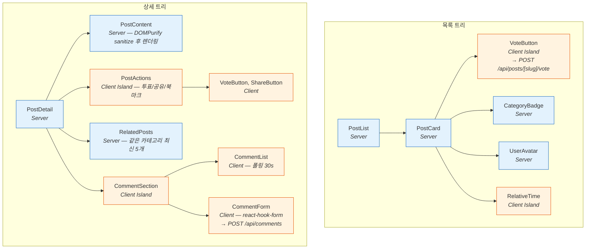
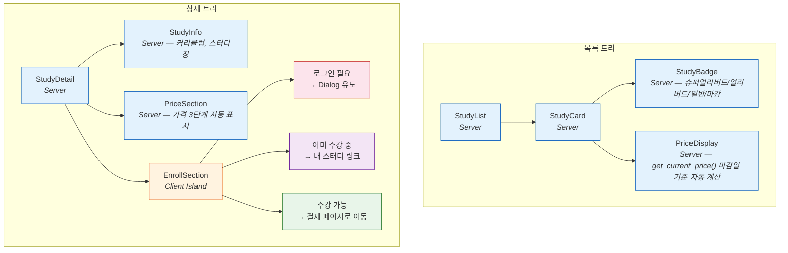
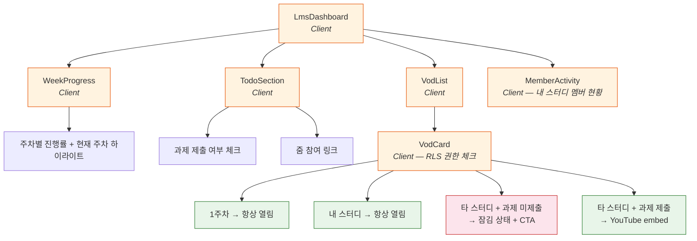

# renewal-06: 프론트엔드 아키텍처 설계서

> **관점**: Frontend Architecture (컴포넌트 설계, 렌더링 전략, 상태 관리, 데이터 페칭)
> **대상**: GPTers 포털 리뉴얼 — Next.js 16 App Router + Tailwind CSS v4 + shadcn/ui
> **작성일**: 2026-03-06
> **버전**: v2.0
> **변경 이력**: v1.0 Supabase SDK → v2.0 AWS 자체 빌드 (Drizzle ORM + JWT Auth + S3)
> **선행 문서**:
> - [gpters-renewal-plan-plus.md](../01-plan/gpters-renewal-plan-plus.md) §6 Frontend Architecture
> - [gpters-renewal-context-analysis.md](../01-plan/gpters-renewal-context-analysis.md) §6 사용자별 화면
> - [04-RE-03-frontend-ui.design.md](./04-RE-03-frontend-ui.design.md) 레거시 FE 역설계
> - [renewal-04-auth-security.design.md](./renewal-04-auth-security.design.md) Auth 설계 (v2.0: JWT 기반)

---

## 목차

1. [디렉토리 구조](#1-디렉토리-구조)
2. [Server/Client Component 분류 (37페이지)](#2-serverclient-component-분류-37페이지)
3. [데이터 페칭 패턴](#3-데이터-페칭-패턴)
4. [상태 관리 전략](#4-상태-관리-전략)
5. [컴포넌트 트리](#5-컴포넌트-트리)
6. [폼 관리](#6-폼-관리)
7. [에러/로딩/빈 상태 처리](#7-에러로딩빈-상태-처리)
8. [이미지 최적화](#8-이미지-최적화)
9. [반응형 전략](#9-반응형-전략)
10. ["use client" 최적화 전략 (Island Architecture)](#10-use-client-최적화-전략-island-architecture)
11. [shadcn/ui 컴포넌트 활용 가이드](#11-shadcnui-컴포넌트-활용-가이드)

---

## 기술 스택 개요

| 레이어 | 기술 | 비고 |
|--------|------|------|
| Framework | Next.js 16 App Router, Turbopack | |
| UI | shadcn/ui + Tailwind CSS v4 | |
| Server 데이터 페칭 | Drizzle ORM (직접 DB 쿼리) | `server-only` 패키지로 격리 |
| Client 데이터 페칭 | API Routes + TanStack Query | DB 직접 접근 불가 |
| 서버 상태 관리 | TanStack Query | 캐싱, 백그라운드 업데이트, Optimistic UI |
| 클라이언트 상태 | Jotai (인증, 결제 진행) | 경량 원자 단위 상태 |
| 인증 | JWT in httpOnly Cookie + `useAuth` hook | ElastiCache 세션 스토어 |
| 파일 업로드 | S3 Presigned URL (API Route 경유) | 클라이언트 → S3 직접 PUT |
| 실시간 | 폴링 + React Query refetchInterval (MVP) | WebSocket은 v2 예정 |
| 폼 | react-hook-form + zod | |
| Toast | Sonner | |

---

## 1. 디렉토리 구조

### 1.1 전체 구조

```
gpters-renewal/
├── app/                         # Next.js App Router 루트
│   ├── layout.tsx               # Root Layout (HTML, fonts, analytics)
│   ├── page.tsx                 # 홈 피드 (ISR 60s)
│   ├── not-found.tsx            # 404 전역
│   ├── global-error.tsx         # 전역 에러 바운더리
│   ├── sitemap.ts               # 동적 sitemap
│   ├── robots.ts                # robots.txt
│   │
│   ├── (main)/                  # 메인 레이아웃 그룹
│   │   ├── layout.tsx           # Navbar + Sidebar + Footer
│   │   ├── posts/               # 게시글
│   │   │   ├── page.tsx         # 목록 (ISR 30s)
│   │   │   ├── [slug]/
│   │   │   │   ├── page.tsx     # 상세 (ISR 30s)
│   │   │   │   ├── loading.tsx
│   │   │   │   └── error.tsx
│   │   │   ├── write/
│   │   │   │   └── page.tsx     # 작성 (CSR, 인증 필요)
│   │   │   └── [slug]/edit/
│   │   │       └── page.tsx     # 수정 (CSR, 작성자 확인)
│   │   ├── search/
│   │   │   └── page.tsx         # 검색 결과 (SSR)
│   │   └── leaderboard/
│   │       └── page.tsx         # 리더보드 (ISR 300s)
│   │
│   ├── study/                   # 스터디 그룹
│   │   ├── layout.tsx           # 스터디 공용 레이아웃
│   │   ├── page.tsx             # 스터디 목록 (ISR 300s)
│   │   ├── [slug]/
│   │   │   ├── page.tsx         # 스터디 상세 (ISR 300s)
│   │   │   ├── loading.tsx
│   │   │   └── error.tsx
│   │   ├── my/                  # 내 스터디 (인증 필요)
│   │   │   ├── layout.tsx       # AuthGuard
│   │   │   ├── page.tsx         # 내 스터디 대시보드 (CSR)
│   │   │   └── [studySlug]/
│   │   │       └── page.tsx     # 스터디별 상세 대시보드 (CSR)
│   │   └── manage/              # 스터디장 관리 (leader 역할)
│   │       ├── layout.tsx       # AuthGuard (leader)
│   │       └── [slug]/
│   │           └── page.tsx     # 스터디 관리 (CSR)
│   │
│   ├── checkout/                # 결제 그룹
│   │   ├── layout.tsx           # PortOne SDK 스크립트 로딩
│   │   ├── [studyId]/
│   │   │   └── page.tsx         # 결제 페이지 (SSR + Client)
│   │   └── result/
│   │       └── page.tsx         # 결제 결과 (Server)
│   │
│   ├── profile/                 # AI 이력서
│   │   └── [username]/
│   │       ├── page.tsx         # AI 이력서 (ISR 600s)
│   │       └── loading.tsx
│   │
│   ├── me/                      # 마이페이지 (인증 필요)
│   │   ├── layout.tsx           # AuthGuard + 마이페이지 사이드바
│   │   ├── page.tsx             # 마이페이지 홈 (CSR)
│   │   ├── settings/
│   │   │   └── page.tsx         # 계정 설정 (CSR)
│   │   ├── orders/
│   │   │   └── page.tsx         # 결제 내역 (CSR)
│   │   ├── coupons/
│   │   │   └── page.tsx         # 쿠폰 목록 (CSR)
│   │   └── invites/
│   │       └── page.tsx         # 초대 내역 (CSR)
│   │
│   ├── auth/                    # 인증 그룹
│   │   ├── layout.tsx           # 중앙 카드 레이아웃
│   │   ├── login/
│   │   │   └── page.tsx         # 로그인 (Server 세션 확인 → redirect)
│   │   ├── signup/
│   │   │   └── page.tsx         # 회원가입 (CSR)
│   │   └── callback/
│   │       └── route.ts         # OAuth 콜백 (JWT 발급 후 redirect)
│   │
│   ├── api/                     # API Routes (Client → Server 브릿지)
│   │   ├── auth/
│   │   │   ├── login/route.ts   # POST: JWT 발급
│   │   │   ├── logout/route.ts  # POST: 쿠키 삭제
│   │   │   ├── me/route.ts      # GET: 현재 유저 정보
│   │   │   └── refresh/route.ts # POST: JWT 갱신
│   │   ├── posts/
│   │   │   ├── route.ts         # GET(목록), POST(생성)
│   │   │   └── [slug]/
│   │   │       ├── route.ts     # GET, PATCH, DELETE
│   │   │       └── vote/route.ts # POST: 투표
│   │   ├── comments/
│   │   │   └── route.ts         # GET, POST
│   │   ├── studies/
│   │   │   └── route.ts         # GET, POST
│   │   ├── upload/
│   │   │   └── route.ts         # POST: S3 presigned URL 발급
│   │   └── admin/
│   │       └── [...]/route.ts   # 어드민 API
│   │
│   ├── certificate/             # 수료증
│   │   └── [id]/
│   │       └── page.tsx         # 수료증 확인 (ISR 3600s)
│   │
│   ├── about/
│   │   └── page.tsx             # 소개 페이지 (Server, static)
│   │
│   └── admin/                   # 어드민 (admin 역할 필요)
│       ├── layout.tsx           # AdminGuard + 어드민 사이드바
│       ├── page.tsx             # 어드민 대시보드 (CSR)
│       ├── cohorts/
│       │   ├── page.tsx         # 기수 목록 (CSR)
│       │   └── [id]/
│       │       └── page.tsx     # 기수 상세 (CSR)
│       ├── studies/
│       │   └── page.tsx         # 스터디 관리 + 최종제출 토글 (CSR)
│       ├── members/
│       │   └── page.tsx         # 회원 관리 (CSR)
│       ├── payments/
│       │   └── page.tsx         # 결제/환급 대시보드 (CSR)
│       ├── banners/
│       │   └── page.tsx         # 배너 관리 드래그앤드롭 (CSR)
│       └── certificates/
│           └── page.tsx         # 수료증 일괄 발급 (CSR)
│
├── components/                  # 컴포넌트 라이브러리
│   ├── ui/                      # shadcn/ui 원자 컴포넌트
│   │   ├── button.tsx
│   │   ├── input.tsx
│   │   ├── card.tsx
│   │   ├── dialog.tsx
│   │   ├── alert-dialog.tsx
│   │   ├── sheet.tsx
│   │   ├── skeleton.tsx
│   │   ├── sonner.tsx
│   │   ├── form.tsx
│   │   ├── select.tsx
│   │   ├── textarea.tsx
│   │   ├── badge.tsx
│   │   ├── avatar.tsx
│   │   ├── tabs.tsx
│   │   ├── separator.tsx
│   │   ├── popover.tsx
│   │   ├── dropdown-menu.tsx
│   │   ├── checkbox.tsx
│   │   ├── label.tsx
│   │   ├── switch.tsx
│   │   ├── progress.tsx
│   │   └── tooltip.tsx
│   │
│   ├── layout/                  # 레이아웃 컴포넌트
│   │   ├── Navbar.tsx           # 상단 네비게이션 (Client)
│   │   ├── MobileMenu.tsx       # Sheet 기반 모바일 메뉴 (Client)
│   │   ├── Sidebar.tsx          # 사이드바 (Server)
│   │   ├── Footer.tsx           # 푸터 (Server)
│   │   └── AdminSidebar.tsx     # 어드민 사이드바 (Client)
│   │
│   ├── common/                  # 공용 컴포넌트
│   │   ├── EmptyState.tsx       # 빈 상태 표시 (Server)
│   │   ├── ImageWithFallback.tsx # 이미지 + fallback (Client)
│   │   ├── VoteButton.tsx       # 투표 버튼, Optimistic (Client)
│   │   ├── ShareButton.tsx      # 공유 버튼 (Client)
│   │   ├── CategoryBadge.tsx    # 카테고리 배지 (Server)
│   │   ├── UserAvatar.tsx       # 아바타 + DiceBear fallback (Server)
│   │   ├── RelativeTime.tsx     # "3분 전" 표시 (Client)
│   │   └── Pagination.tsx       # URL params 기반 페이지네이션 (Server)
│   │
│   ├── post/                    # 게시글 도메인
│   │   ├── PostCard.tsx         # 게시글 카드 (Server)
│   │   ├── PostList.tsx         # 게시글 목록 (Server)
│   │   ├── PostDetail.tsx       # 게시글 본문 (Server)
│   │   ├── PostEditor.tsx       # 게시글 에디터 (Client)
│   │   ├── PostFilter.tsx       # 필터/정렬 탭 (Client)
│   │   ├── CommentList.tsx      # 댓글 목록, Realtime (Client)
│   │   ├── CommentForm.tsx      # 댓글 작성 (Client)
│   │   └── PostSkeleton.tsx     # 로딩 스켈레톤 (Server)
│   │
│   ├── study/                   # 스터디 도메인
│   │   ├── StudyCard.tsx        # 스터디 카드 (Server)
│   │   ├── StudyList.tsx        # 스터디 목록 (Server)
│   │   ├── StudyDetail.tsx      # 스터디 상세 (Server)
│   │   ├── StudyBadge.tsx       # 모집 상태 배지 (Server)
│   │   ├── PriceDisplay.tsx     # 가격 표시 (Server)
│   │   ├── EnrollButton.tsx     # 수강신청 버튼 (Client)
│   │   └── StudySkeleton.tsx    # 로딩 스켈레톤 (Server)
│   │
│   ├── lms/                     # LMS 도메인
│   │   ├── WeekProgress.tsx     # 주차별 진행 현황 (Client)
│   │   ├── VodCard.tsx          # VOD 카드, 권한 체크 (Client)
│   │   ├── AssignmentStatus.tsx # 과제 제출 상태 (Client)
│   │   ├── MemberTable.tsx      # 수강생 현황 테이블 (Client)
│   │   └── LmsDashboard.tsx     # LMS 대시보드 컨테이너 (Client)
│   │
│   ├── admin/                   # 어드민 도메인
│   │   ├── DataTable.tsx        # 데이터 테이블 (Client)
│   │   ├── BannerDnd.tsx        # 배너 드래그앤드롭 (Client)
│   │   ├── CohortForm.tsx       # 기수 생성/수정 폼 (Client)
│   │   ├── StudyToggle.tsx      # 최종제출 원클릭 토글 (Client)
│   │   ├── MemberSearch.tsx     # 회원 검색 (Client)
│   │   └── PaymentStats.tsx     # 결제 통계 카드 (Client)
│   │
│   └── profile/                 # 프로필 도메인
│       ├── AIResume.tsx         # AI 이력서 (Server)
│       ├── SkillMap.tsx         # 스킬맵 진행률 (Server)
│       ├── PostHistory.tsx      # 게시글 이력 (Server)
│       └── CertificateList.tsx  # 수료증 목록 (Server)
│
├── lib/                         # 유틸리티 및 서버 전용 모듈
│   ├── db/                      # Drizzle ORM (server-only)
│   │   ├── index.ts             # DB 연결 (RDS Proxy)
│   │   ├── schema.ts            # Drizzle 스키마 정의
│   │   └── migrate.ts           # 마이그레이션 실행
│   ├── auth/                    # JWT 유틸리티 (server-only)
│   │   ├── jwt.ts               # signJwt, verifyJwt
│   │   ├── session.ts           # getSession (쿠키에서 JWT 추출)
│   │   └── guard.ts             # requireAuth, requireAdmin
│   ├── storage/                 # S3 유틸리티 (server-only)
│   │   ├── s3.ts                # S3Client 인스턴스
│   │   └── presigned.ts         # getPresignedUploadUrl, getPresignedDownloadUrl
│   ├── queries/                 # Server Component 전용 쿼리 함수 (server-only)
│   │   ├── posts.ts             # getPosts, getPostBySlug, getRelatedPosts
│   │   ├── studies.ts           # getStudies, getStudyBySlug
│   │   ├── cohorts.ts           # getCohorts, getActiveCohort
│   │   ├── profiles.ts          # getProfile, getAIResume
│   │   └── admin.ts             # getAdminStats, getMemberList
│   ├── api/                     # API Route 공용 유틸
│   │   ├── response.ts          # apiSuccess, apiError 헬퍼
│   │   └── validate.ts          # zod 기반 요청 파싱
│   ├── utils.ts                 # cn(), formatDate(), formatPrice()
│   ├── constants.ts             # CATEGORIES, SORT_OPTIONS, PRICE_TIERS
│   └── validations/             # Zod 스키마
│       ├── post.ts              # PostCreateSchema, PostUpdateSchema
│       ├── auth.ts              # LoginSchema, SignupSchema
│       ├── checkout.ts          # CheckoutSchema, CouponSchema
│       └── admin.ts             # CohortSchema, StudySchema
│
├── hooks/                       # Custom Hooks (Client 전용)
│   ├── use-auth.ts              # useAuth (JWT 상태, /api/auth/me 폴링)
│   ├── use-posts.ts             # usePosts, usePost, useCreatePost, useVote
│   ├── use-comments.ts          # useComments (폴링 30s)
│   ├── use-study.ts             # useStudies, useMyStudies, useEnroll
│   ├── use-payment.ts           # useCheckout, useCoupon, usePaymentResult
│   ├── use-lms.ts               # useVodAccess, useAssignment, useWeekProgress
│   ├── use-upload.ts            # useS3Upload (presigned URL 플로우)
│   └── use-admin.ts             # useCohort, useMember, useBanner
│
└── types/                       # TypeScript 타입 정의
    ├── db.ts                    # Drizzle InferSelectModel 기반 타입 (자동 추론)
    ├── post.ts                  # Post, Comment, Vote 타입
    ├── study.ts                 # Study, Cohort, Enrollment 타입
    ├── user.ts                  # User, Profile, Certificate 타입
    ├── payment.ts               # Order, Payment, Coupon 타입
    └── api.ts                   # API 응답 공통 타입 (ApiResponse<T>)
```

---

## 2. Server/Client Component 분류 (37페이지)

### 2.1 판단 기준

| Server Component | Client Component |
|-----------------|-----------------|
| SEO 필요 (공개 페이지) | 사용자 인터랙션 필요 |
| 초기 데이터가 공개 | 인증 상태 실시간 확인 |
| 정적/준정적 데이터 (ISR) | 폴링 기반 실시간 업데이트 |
| 빌드 타임 렌더링 가능 | 브라우저 API 필요 (window, localStorage) |
| OG/메타데이터 생성 | PortOne SDK, 드래그앤드롭 등 |
| Drizzle 직접 쿼리 가능 | API Routes를 통한 간접 접근만 허용 |

### 2.2 전체 37페이지 렌더링 전략

| # | 페이지 | 경로 | 렌더링 | S/C | 이유 |
|---|--------|------|--------|-----|------|
| 1 | 홈 피드 | `/` | ISR 60s | Server | SEO 핵심, 투표/필터만 Client Island |
| 2 | 게시글 목록 | `/posts` | ISR 30s | Server | SEO, 필터 탭은 URL params |
| 3 | 게시글 상세 | `/posts/[slug]` | ISR 30s | Server | SEO 필수 (본문, OG, JSON-LD) |
| 4 | 게시글 작성 | `/posts/write` | CSR | Client | 에디터, 파일 업로드, 인증 필요 |
| 5 | 게시글 수정 | `/posts/[slug]/edit` | CSR | Client | 에디터, 기존 데이터 로드 |
| 6 | 검색 결과 | `/search` | SSR | Server | searchParams 기반, SEO 반영 가능 |
| 7 | 리더보드 | `/leaderboard` | ISR 300s | Server | 공개 랭킹, 업데이트 주기 낮음 |
| 8 | 스터디 목록 | `/study` | ISR 300s | Server | 모집 상태 SEO, 변경 주기 낮음 |
| 9 | 스터디 상세 | `/study/[slug]` | ISR 300s | Server | SEO 핵심, 신청 버튼만 Client Island |
| 10 | 내 스터디 대시보드 | `/study/my` | CSR | Client | 개인화 데이터, 실시간 진행 상황 |
| 11 | 내 스터디 상세 | `/study/my/[studySlug]` | CSR | Client | 과제 현황, VOD 권한, 개인 데이터 |
| 12 | 스터디 관리 | `/study/manage/[slug]` | CSR | Client | 수강생 현황, 스터디장 전용 |
| 13 | 결제 페이지 | `/checkout/[studyId]` | SSR | Client | 서버 가격 검증 + PortOne SDK |
| 14 | 결제 결과 | `/checkout/result` | Server | Server | URL params 처리, redirect |
| 15 | AI 이력서 | `/profile/[username]` | ISR 600s | Server | 공개 프로필, SEO, OG 이미지 |
| 16 | 마이페이지 홈 | `/me` | CSR | Client | 개인 데이터, 인증 필수 |
| 17 | 계정 설정 | `/me/settings` | CSR | Client | 폼 인터랙션, 파일 업로드 |
| 18 | 결제 내역 | `/me/orders` | CSR | Client | 개인 결제 내역, 인증 필수 |
| 19 | 쿠폰 목록 | `/me/coupons` | CSR | Client | 개인 쿠폰, 인증 필수 |
| 20 | 초대 내역 | `/me/invites` | CSR | Client | 개인 초대 링크, 인증 필수 |
| 21 | 로그인 | `/auth/login` | Server | Server | 세션 확인 후 redirect, 폼은 Client Island |
| 22 | 회원가입 | `/auth/signup` | CSR | Client | 폼 인터랙션, 이메일 인증 단계 |
| 23 | 어드민 대시보드 | `/admin` | CSR | Client | 실시간 통계, noindex |
| 24 | 기수 목록 | `/admin/cohorts` | CSR | Client | 관리 UI, noindex |
| 25 | 기수 상세 | `/admin/cohorts/[id]` | CSR | Client | 관리 폼, noindex |
| 26 | 스터디 관리 | `/admin/studies` | CSR | Client | 최종제출 토글, noindex |
| 27 | 회원 관리 | `/admin/members` | CSR | Client | 검색/필터, noindex |
| 28 | 결제/환급 | `/admin/payments` | CSR | Client | 대용량 데이터 테이블, noindex |
| 29 | 배너 관리 | `/admin/banners` | CSR | Client | 드래그앤드롭, noindex |
| 30 | 수료증 관리 | `/admin/certificates` | CSR | Client | 일괄 처리, noindex |
| 31 | 수료증 확인 | `/certificate/[id]` | ISR 3600s | Server | 공개 수료증, SEO |
| 32 | 설명회 페이지 | `/info-session` | ISR 3600s | Server | 정적 랜딩, YouTube embed |
| 33 | 소개 페이지 | `/about` | Server (static) | Server | 정적 소개, SEO |
| 34 | 404 Not Found | `not-found.tsx` | Server | Server | 정적 에러 |
| 35 | 에러 페이지 | `error.tsx` | Client | Client | useEffect, reset 함수 필요 |
| 36 | 뉴스레터 구독 해제 | `/unsubscribe/[token]` | Server | Server | 토큰 기반 처리 |
| 37 | 뉴스레터 랜딩 | `/newsletter` | ISR 3600s | Server | 정적 랜딩, 구독 폼만 Client Island |

### 2.3 핵심 Island 패턴

게시글 상세 페이지는 Island Architecture의 대표 사례입니다:



스터디 상세 페이지 Island 패턴:



---

## 3. 데이터 페칭 패턴

### 3.1 Server Component: Drizzle ORM 직접 쿼리

Server Component에서는 `lib/db`를 통해 Drizzle ORM으로 직접 DB에 접근합니다.
`server-only` 패키지로 Client Bundle 포함을 차단합니다.

```typescript
// lib/db/index.ts
import 'server-only'
import { drizzle } from 'drizzle-orm/node-postgres'
import { Pool } from 'pg'
import * as schema from './schema'

const pool = new Pool({
  connectionString: process.env.DATABASE_URL, // RDS Proxy endpoint
  max: 10,
})

export const db = drizzle(pool, { schema })
```

```typescript
// lib/queries/posts.ts  (server-only: Server Component 전용)
import 'server-only'
import { db } from '@/lib/db'
import { posts, categories, profiles } from '@/lib/db/schema'
import { eq, desc, isNull, and, sql } from 'drizzle-orm'

export async function getPosts({
  category,
  sort = 'hot',
  page = 1,
  limit = 20,
}: {
  category?: string
  sort?: 'hot' | 'new' | 'top'
  page?: number
  limit?: number
}) {
  const offset = (page - 1) * limit
  const orderBy = sort === 'new' ? desc(posts.createdAt) : desc(posts.voteCount)

  const data = await db
    .select({
      id: posts.id,
      title: posts.title,
      slug: posts.slug,
      excerpt: posts.excerpt,
      createdAt: posts.createdAt,
      voteCount: posts.voteCount,
      commentCount: posts.commentCount,
      category: { name: categories.name, slug: categories.slug },
      author: { username: profiles.username, avatarUrl: profiles.avatarUrl },
    })
    .from(posts)
    .leftJoin(categories, eq(posts.categorySlug, categories.slug))
    .leftJoin(profiles, eq(posts.authorId, profiles.id))
    .where(
      and(
        isNull(posts.deletedAt),
        category ? eq(posts.categorySlug, category) : undefined
      )
    )
    .orderBy(orderBy)
    .limit(limit)
    .offset(offset)

  const [{ count }] = await db
    .select({ count: sql<number>`count(*)` })
    .from(posts)
    .where(isNull(posts.deletedAt))

  return { posts: data, total: Number(count) }
}
```

```typescript
// app/(main)/posts/page.tsx — Server Component 사용 예시
import { getPosts } from '@/lib/queries/posts'
import { PostList } from '@/components/post/PostList'
import { PostFilter } from '@/components/post/PostFilter'
import type { Metadata } from 'next'

export const revalidate = 30

export const metadata: Metadata = {
  title: '커뮤니티 | GPTers AI캠프',
  description: '4,000명이 공유하는 AI 활용 사례 모음',
}

interface PageProps {
  searchParams: { category?: string; sort?: string; page?: string }
}

export default async function PostsPage({ searchParams }: PageProps) {
  const { posts, total } = await getPosts({
    category: searchParams.category,
    sort: (searchParams.sort as 'hot' | 'new' | 'top') ?? 'hot',
    page: Number(searchParams.page ?? 1),
  })

  return (
    <div className="flex gap-6">
      <main className="flex-1 min-w-0">
        {/* Client Island: URL params 조작 */}
        <PostFilter />
        {/* Server: 목록 렌더링 */}
        <PostList posts={posts} total={total} />
      </main>
      <aside className="hidden lg:block w-72 shrink-0">
        {/* 사이드바 (Server) */}
      </aside>
    </div>
  )
}
```

### 3.2 API Routes: Client → Server 브릿지

Client Component는 DB에 직접 접근하지 않습니다. 반드시 API Routes를 경유합니다.

```typescript
// app/api/posts/[slug]/vote/route.ts
import { NextRequest } from 'next/server'
import { getSession } from '@/lib/auth/session'
import { db } from '@/lib/db'
import { votes } from '@/lib/db/schema'
import { apiSuccess, apiError } from '@/lib/api/response'

export async function POST(
  request: NextRequest,
  { params }: { params: { slug: string } }
) {
  const session = await getSession(request)
  if (!session) return apiError(401, 'UNAUTHORIZED', '로그인이 필요합니다.')

  const { type } = await request.json()

  // 기존 투표 확인 후 toggle / update
  const existing = await db.query.votes.findFirst({
    where: (v, { and, eq }) =>
      and(eq(v.postSlug, params.slug), eq(v.userId, session.userId)),
  })

  if (existing) {
    if (existing.type === type) {
      await db.delete(votes).where(/* 동일 투표 취소 */)
    } else {
      await db.update(votes).set({ type }).where(/* 반대 투표 변경 */)
    }
  } else {
    await db.insert(votes).values({ postSlug: params.slug, userId: session.userId, type })
  }

  return apiSuccess({ voteCount: /* 집계 */ 0 })
}
```

```typescript
// lib/api/response.ts
import { NextResponse } from 'next/server'

export function apiSuccess<T>(data: T, status = 200) {
  return NextResponse.json({ data }, { status })
}

export function apiError(status: number, code: string, message: string) {
  return NextResponse.json({ error: { code, message } }, { status })
}
```

### 3.3 Client Component: TanStack Query + API Routes 호출

Client Component는 fetch로 API Routes를 호출합니다.

```typescript
// hooks/use-posts.ts
import { useMutation, useQueryClient } from '@tanstack/react-query'
import { toast } from 'sonner'
import { useAuth } from '@/hooks/use-auth'

// 투표 뮤테이션 (Optimistic Update 패턴)
export function useVote() {
  const queryClient = useQueryClient()
  const { isAuthenticated } = useAuth()

  return useMutation({
    mutationFn: async ({ postSlug, type }: { postSlug: string; type: 'up' | 'down' }) => {
      if (!isAuthenticated) {
        toast.info('로그인 후 투표할 수 있습니다.', {
          action: { label: '로그인', onClick: () => { window.location.href = '/auth/login' } },
        })
        throw new Error('UNAUTHENTICATED')
      }

      const res = await fetch(`/api/posts/${postSlug}/vote`, {
        method: 'POST',
        headers: { 'Content-Type': 'application/json' },
        body: JSON.stringify({ type }),
      })

      if (!res.ok) {
        const { error } = await res.json()
        throw new Error(error.message)
      }

      return res.json()
    },
    onMutate: async ({ postSlug, type }) => {
      await queryClient.cancelQueries({ queryKey: ['post', postSlug] })
      const previous = queryClient.getQueryData(['post', postSlug])

      queryClient.setQueryData(['post', postSlug], (old: any) => ({
        ...old,
        voteCount: type === 'up' ? old.voteCount + 1 : old.voteCount - 1,
        userVote: type,
      }))

      return { previous }
    },
    onError: (_err, { postSlug }, context) => {
      if (_err.message === 'UNAUTHENTICATED') return
      queryClient.setQueryData(['post', postSlug], context?.previous)
      toast.error('투표 처리 중 오류가 발생했습니다.')
    },
    onSettled: (_data, _err, { postSlug }) => {
      queryClient.invalidateQueries({ queryKey: ['post', postSlug] })
    },
  })
}
```

### 3.4 실시간 대체: 폴링 (MVP)

Realtime 대신 React Query의 `refetchInterval`로 폴링합니다.

```typescript
// hooks/use-comments.ts
import { useQuery } from '@tanstack/react-query'
import type { Comment } from '@/types/post'

export function useComments(postSlug: string) {
  return useQuery({
    queryKey: ['comments', postSlug],
    queryFn: async () => {
      const res = await fetch(`/api/comments?postSlug=${postSlug}`)
      if (!res.ok) throw new Error('댓글을 불러오지 못했습니다.')
      const { data } = await res.json()
      return data as Comment[]
    },
    // 30초마다 자동 갱신 (MVP 실시간 대체)
    refetchInterval: 30_000,
    staleTime: 15_000,
  })
}
```

### 3.5 인증 흐름: JWT + httpOnly Cookie



```typescript
// lib/auth/jwt.ts
import 'server-only'
import { SignJWT, jwtVerify } from 'jose'

const secret = new TextEncoder().encode(process.env.JWT_SECRET!)

export interface JwtPayload {
  userId: string
  role: 'user' | 'leader' | 'admin'
}

export async function signJwt(payload: JwtPayload, expiresIn = '1h') {
  return new SignJWT(payload)
    .setProtectedHeader({ alg: 'HS256' })
    .setIssuedAt()
    .setExpirationTime(expiresIn)
    .sign(secret)
}

export async function verifyJwt(token: string): Promise<JwtPayload | null> {
  try {
    const { payload } = await jwtVerify(token, secret)
    return payload as unknown as JwtPayload
  } catch {
    return null
  }
}
```

```typescript
// lib/auth/session.ts
import 'server-only'
import { cookies } from 'next/headers'
import { NextRequest } from 'next/server'
import { verifyJwt, type JwtPayload } from './jwt'

// Server Component에서 사용 (인자 없음)
// API Route에서 사용 (request 인자)
export async function getSession(request?: NextRequest): Promise<JwtPayload | null> {
  const token = request
    ? request.cookies.get('access_token')?.value
    : (await cookies()).get('access_token')?.value

  if (!token) return null
  return verifyJwt(token)
}
```

```typescript
// app/api/auth/login/route.ts
import { NextRequest, NextResponse } from 'next/server'
import { db } from '@/lib/db'
import { users } from '@/lib/db/schema'
import { eq } from 'drizzle-orm'
import { signJwt } from '@/lib/auth/jwt'
import { apiError } from '@/lib/api/response'
import bcrypt from 'bcryptjs'

export async function POST(request: NextRequest) {
  const { email, password } = await request.json()

  const user = await db.query.users.findFirst({ where: eq(users.email, email) })
  if (!user || !await bcrypt.compare(password, user.passwordHash)) {
    return apiError(401, 'INVALID_CREDENTIALS', '이메일 또는 비밀번호가 올바르지 않습니다.')
  }

  const accessToken = await signJwt({ userId: user.id, role: user.role }, '1h')
  const refreshToken = await signJwt({ userId: user.id, role: user.role }, '30d')

  const response = NextResponse.json({ data: { userId: user.id, role: user.role } })
  response.cookies.set('access_token', accessToken, {
    httpOnly: true,
    secure: process.env.NODE_ENV === 'production',
    sameSite: 'lax',
    maxAge: 60 * 60,
    path: '/',
  })
  response.cookies.set('refresh_token', refreshToken, {
    httpOnly: true,
    secure: process.env.NODE_ENV === 'production',
    sameSite: 'lax',
    maxAge: 60 * 60 * 24 * 30,
    path: '/api/auth/refresh',
  })

  return response
}
```

### 3.6 파일 업로드: S3 Presigned URL 패턴



```typescript
// lib/storage/presigned.ts
import 'server-only'
import { S3Client, PutObjectCommand } from '@aws-sdk/client-s3'
import { getSignedUrl } from '@aws-sdk/s3-request-presigner'

const s3 = new S3Client({ region: process.env.AWS_REGION! })

export async function getPresignedUploadUrl({
  key,
  contentType,
  expiresIn = 300,
}: {
  key: string
  contentType: string
  expiresIn?: number
}) {
  const command = new PutObjectCommand({
    Bucket: process.env.S3_BUCKET_NAME!,
    Key: key,
    ContentType: contentType,
  })

  return getSignedUrl(s3, command, { expiresIn })
}
```

```typescript
// hooks/use-upload.ts
'use client'

import { useState } from 'react'
import { toast } from 'sonner'

export function useS3Upload() {
  const [isUploading, setIsUploading] = useState(false)

  async function upload(file: File): Promise<string> {
    setIsUploading(true)
    try {
      // 1. presigned URL 발급
      const res = await fetch('/api/upload', {
        method: 'POST',
        headers: { 'Content-Type': 'application/json' },
        body: JSON.stringify({ filename: file.name, contentType: file.type }),
      })
      if (!res.ok) throw new Error('업로드 URL 발급 실패')

      const { data: { presignedUrl, publicUrl } } = await res.json()

      // 2. S3에 직접 PUT
      const uploadRes = await fetch(presignedUrl, {
        method: 'PUT',
        headers: { 'Content-Type': file.type },
        body: file,
      })
      if (!uploadRes.ok) throw new Error('S3 업로드 실패')

      return publicUrl
    } catch (err) {
      toast.error('파일 업로드에 실패했습니다.')
      throw err
    } finally {
      setIsUploading(false)
    }
  }

  return { upload, isUploading }
}
```

### 3.7 Server Action: 간단한 데이터 변경

```typescript
// app/(main)/posts/write/actions.ts
'use server'

import { getSession } from '@/lib/auth/session'
import { db } from '@/lib/db'
import { posts } from '@/lib/db/schema'
import { revalidatePath } from 'next/cache'
import { redirect } from 'next/navigation'
import { PostCreateSchema } from '@/lib/validations/post'

export async function createPost(formData: FormData) {
  const session = await getSession()
  if (!session) redirect('/auth/login')

  const raw = Object.fromEntries(formData)
  const parsed = PostCreateSchema.safeParse(raw)

  if (!parsed.success) {
    return { error: parsed.error.flatten().fieldErrors }
  }

  const [post] = await db
    .insert(posts)
    .values({ ...parsed.data, authorId: session.userId, slug: generateSlug(parsed.data.title) })
    .returning({ slug: posts.slug })

  revalidatePath('/posts')
  redirect(`/posts/${post.slug}`)
}
```

---

## 4. 상태 관리 전략

### 4.1 상태 유형별 도구 선택

| 상태 유형 | 도구 | 이유 |
|----------|------|------|
| 서버 데이터 (목록, 상세) | TanStack Query | 캐싱, 백그라운드 업데이트, Optimistic UI |
| 인증 상태 | `useAuth` hook + Jotai atom | JWT 기반, /api/auth/me 폴링 |
| URL 상태 (필터, 정렬, 페이지) | Next.js searchParams | SEO, 공유 가능 URL, 새로고침 유지 |
| 폼 상태 | react-hook-form | 검증 통합, 에러 처리, 성능 |
| UI 상태 (모달 열림/닫힘) | useState | 지역적 상태, 전역 스토어 불필요 |
| 결제 진행 데이터 | Jotai atom | 여러 단계 플로우, 페이지 간 유지 |
| 댓글/투표 수 | TanStack Query + refetchInterval | 폴링 기반 준실시간 |

### 4.2 TanStack Query Provider 설정

```typescript
// app/providers.tsx
'use client'

import { QueryClient, QueryClientProvider } from '@tanstack/react-query'
import { ReactQueryDevtools } from '@tanstack/react-query-devtools'
import { Toaster } from '@/components/ui/sonner'
import { AuthProvider } from '@/components/providers/AuthProvider'
import { useState } from 'react'

export function Providers({ children }: { children: React.ReactNode }) {
  const [queryClient] = useState(
    () =>
      new QueryClient({
        defaultOptions: {
          queries: {
            staleTime: 60 * 1000,        // 1분
            gcTime: 5 * 60 * 1000,       // 5분
            retry: 1,
            refetchOnWindowFocus: false,
          },
        },
      })
  )

  return (
    <QueryClientProvider client={queryClient}>
      <AuthProvider>
        {children}
        <Toaster position="bottom-right" richColors />
        {process.env.NODE_ENV === 'development' && (
          <ReactQueryDevtools initialIsOpen={false} />
        )}
      </AuthProvider>
    </QueryClientProvider>
  )
}
```

### 4.3 Auth 상태 (Jotai + useAuth hook)

```typescript
// lib/stores/auth-atom.ts
import { atom } from 'jotai'

export interface AuthUser {
  userId: string
  role: 'user' | 'leader' | 'admin'
  username: string
  avatarUrl?: string | null
}

export const authAtom = atom<AuthUser | null>(null)
export const authLoadingAtom = atom<boolean>(true)
```

```typescript
// hooks/use-auth.ts
'use client'

import { useEffect } from 'react'
import { useAtom } from 'jotai'
import { authAtom, authLoadingAtom } from '@/lib/stores/auth-atom'
import { useQuery } from '@tanstack/react-query'

async function fetchMe() {
  const res = await fetch('/api/auth/me')
  if (res.status === 401) return null
  if (!res.ok) throw new Error('사용자 정보를 불러오지 못했습니다.')
  const { data } = await res.json()
  return data
}

export function useAuth() {
  const [user, setUser] = useAtom(authAtom)
  const [isLoading, setLoading] = useAtom(authLoadingAtom)

  const { data, isLoading: queryLoading } = useQuery({
    queryKey: ['auth', 'me'],
    queryFn: fetchMe,
    staleTime: 5 * 60 * 1000,  // 5분
    retry: false,
  })

  useEffect(() => {
    setUser(data ?? null)
    setLoading(queryLoading)
  }, [data, queryLoading, setUser, setLoading])

  return {
    user,
    isLoading,
    isAuthenticated: !!user,
    isAdmin: user?.role === 'admin',
    isLeader: user?.role === 'leader' || user?.role === 'admin',
  }
}
```

```typescript
// components/providers/AuthProvider.tsx
'use client'

// useAuth를 루트에서 초기화하여 전역 authAtom을 채웁니다.
import { useAuth } from '@/hooks/use-auth'

export function AuthProvider({ children }: { children: React.ReactNode }) {
  useAuth() // 마운트 시 /api/auth/me 호출 → authAtom 세팅
  return <>{children}</>
}
```

### 4.4 URL 상태 (searchParams 패턴)

```typescript
// components/post/PostFilter.tsx
'use client'

import { useRouter, usePathname, useSearchParams } from 'next/navigation'
import { useCallback } from 'react'
import { Tabs, TabsList, TabsTrigger } from '@/components/ui/tabs'

export function PostFilter() {
  const router = useRouter()
  const pathname = usePathname()
  const searchParams = useSearchParams()

  const updateParam = useCallback(
    (key: string, value: string) => {
      const params = new URLSearchParams(searchParams)
      params.set(key, value)
      params.delete('page') // 필터 변경 시 1페이지로 초기화
      router.push(`${pathname}?${params.toString()}`)
    },
    [router, pathname, searchParams]
  )

  return (
    <Tabs
      value={searchParams.get('sort') ?? 'hot'}
      onValueChange={(v) => updateParam('sort', v)}
    >
      <TabsList>
        <TabsTrigger value="hot">인기순</TabsTrigger>
        <TabsTrigger value="new">최신순</TabsTrigger>
        <TabsTrigger value="top">주간베스트</TabsTrigger>
      </TabsList>
    </Tabs>
  )
}
```

### 4.5 Jotai 사용 범위 제한

Jotai는 아래 두 가지 전역 atom에만 사용합니다. 나머지는 useState 또는 TanStack Query로 처리합니다.

| Atom | 파일 | 용도 |
|-------|------|------|
| `authAtom`, `authLoadingAtom` | `lib/stores/auth-atom.ts` | 인증 상태, 프로필 전역 공유 |
| `paymentAtom` | `lib/stores/payment-atom.ts` | 결제 진행 중 상품/쿠폰/금액 데이터 |

---

## 5. 컴포넌트 트리

### 5.1 Layout 계층



### 5.2 공용 컴포넌트 목록

| 컴포넌트 | 위치 | 타입 | 설명 |
|----------|------|------|------|
| `Navbar` | `layout/Navbar.tsx` | Client | 로고, 검색, 유저 드롭다운, 모바일 햄버거 |
| `MobileMenu` | `layout/MobileMenu.tsx` | Client | `<Sheet side="left">` 기반 슬라이드 메뉴 |
| `Sidebar` | `layout/Sidebar.tsx` | Server | 카테고리 목록, 이번 기수 스터디 |
| `Footer` | `layout/Footer.tsx` | Server | 회사 정보, 링크, SNS |
| `AdminSidebar` | `layout/AdminSidebar.tsx` | Client | 어드민 네비게이션, 활성 상태 |
| `EmptyState` | `common/EmptyState.tsx` | Server | icon, title, description, action |
| `ImageWithFallback` | `common/ImageWithFallback.tsx` | Client | onError → placeholder 이미지 |
| `VoteButton` | `common/VoteButton.tsx` | Client | Optimistic update, 로그인 유도 Toast |
| `ShareButton` | `common/ShareButton.tsx` | Client | Web Share API + fallback URL 복사 |
| `CategoryBadge` | `common/CategoryBadge.tsx` | Server | 카테고리명 + 색상 배지 |
| `UserAvatar` | `common/UserAvatar.tsx` | Server | next/image + DiceBear fallback |
| `RelativeTime` | `common/RelativeTime.tsx` | Client | "3분 전", "2시간 전" (Intl.RelativeTimeFormat) |
| `Pagination` | `common/Pagination.tsx` | Server | URL searchParams 기반 페이지 버튼 |

### 5.3 도메인별 핵심 컴포넌트 트리

#### Post 도메인



#### Study 도메인



#### LMS 도메인 (내 스터디)



---

## 6. 폼 관리

### 6.1 기본 패턴: react-hook-form + zod

```typescript
// lib/validations/post.ts
import { z } from 'zod'

export const PostCreateSchema = z.object({
  title: z
    .string()
    .min(5, '제목은 5자 이상이어야 합니다')
    .max(100, '제목은 100자 이하여야 합니다'),
  content: z
    .string()
    .min(50, '본문은 50자 이상이어야 합니다'),
  category_slug: z
    .string({ required_error: '카테고리를 선택해주세요' }),
  tags: z
    .array(z.string())
    .max(5, '태그는 최대 5개까지 추가할 수 있습니다')
    .optional(),
})

export type PostCreateInput = z.infer<typeof PostCreateSchema>
```

```typescript
// components/post/PostEditor.tsx — 폼 관리 예시
'use client'

import { useForm } from 'react-hook-form'
import { zodResolver } from '@hookform/resolvers/zod'
import {
  Form, FormControl, FormField, FormItem, FormLabel, FormMessage,
} from '@/components/ui/form'
import { Input } from '@/components/ui/input'
import { Textarea } from '@/components/ui/textarea'
import { Button } from '@/components/ui/button'
import { PostCreateSchema, type PostCreateInput } from '@/lib/validations/post'
import { createPost } from '@/app/(main)/posts/write/actions'
import { toast } from 'sonner'

export function PostEditor() {
  const form = useForm<PostCreateInput>({
    resolver: zodResolver(PostCreateSchema),
    defaultValues: { title: '', content: '', category_slug: '' },
  })

  async function onSubmit(data: PostCreateInput) {
    const formData = new FormData()
    Object.entries(data).forEach(([key, val]) => formData.append(key, String(val)))

    const result = await createPost(formData)

    if (result?.error) {
      // 서버 검증 에러를 폼 필드에 반영
      Object.entries(result.error).forEach(([field, messages]) => {
        form.setError(field as keyof PostCreateInput, { message: messages?.[0] })
      })
      toast.error('게시글 저장에 실패했습니다.')
    }
    // 성공 시 Server Action에서 redirect 처리
  }

  return (
    <Form {...form}>
      <form onSubmit={form.handleSubmit(onSubmit)} className="space-y-6">
        <FormField
          control={form.control}
          name="title"
          render={({ field }) => (
            <FormItem>
              <FormLabel>제목</FormLabel>
              <FormControl>
                <Input placeholder="제목을 입력하세요" {...field} />
              </FormControl>
              <FormMessage />
            </FormItem>
          )}
        />
        {/* ... 나머지 필드 */}
        <Button type="submit" disabled={form.formState.isSubmitting} className="w-full">
          {form.formState.isSubmitting ? '저장 중...' : '게시글 등록'}
        </Button>
      </form>
    </Form>
  )
}
```

### 6.2 주요 폼 스펙

| 폼 | 컴포넌트 | 필드 | 특이사항 |
|-----|---------|------|----------|
| 게시글 작성/수정 | `PostEditor.tsx` | title, content, category, tags | Markdown 지원, 이미지 업로드 |
| 로그인 | `LoginForm.tsx` | email, password | 소셜 로그인 버튼 분리 |
| 회원가입 | `SignupForm.tsx` | email, password, name, terms | 이메일 인증 코드 단계 |
| 쿠폰 입력 | `CouponInput.tsx` | coupon_code | 실시간 유효성 검사 (useQuery debounce) |
| 계정 설정 | `SettingsForm.tsx` | name, bio, avatar | useS3Upload() 아바타 업로드 |
| 기수 생성 | `CohortForm.tsx` | name, start_date, end_date, 가격 3단계 마감일 | 날짜 자동 계산 |
| 스터디 배정 | `StudyAssignForm.tsx` | cohort_id, leader_id, day, time | 요일/시간 선택 |
| 배너 관리 | `BannerForm.tsx` | image, title, link, active | 드래그앤드롭 순서 |
| 댓글 작성 | `CommentForm.tsx` | content, parent_id | 계층형 답글, 로그인 유도 |

### 6.3 에러 표시 계층

| 에러 유형 | 표시 방법 | 컴포넌트 |
|----------|----------|----------|
| 필드 검증 에러 | 필드 아래 빨간 텍스트 | `<FormMessage />` |
| 서버 에러 (일반) | 우측 하단 알림 | `toast.error()` |
| 폼 전체 에러 | 제출 버튼 위 Alert | `<Alert variant="destructive">` |
| 권한 에러 | 모달 또는 redirect | `<AlertDialog>` |
| 네트워크 에러 | 재시도 가능 알림 | `toast.error()` + action |

---

## 7. 에러/로딩/빈 상태 처리

### 7.1 Next.js 특수 파일

```typescript
// app/(main)/posts/[slug]/loading.tsx
import { PostSkeleton } from '@/components/post/PostSkeleton'
export default function PostLoading() { return <PostSkeleton /> }
```

```typescript
// app/(main)/posts/[slug]/error.tsx
'use client'
import { useEffect } from 'react'
import { Button } from '@/components/ui/button'
import { AlertCircle } from 'lucide-react'

export default function PostError({ error, reset }: { error: Error; reset: () => void }) {
  useEffect(() => { console.error(error) }, [error])

  return (
    <div className="flex flex-col items-center justify-center py-20 gap-4">
      <AlertCircle className="w-12 h-12 text-destructive" />
      <h2 className="text-xl font-semibold">게시글을 불러오지 못했습니다</h2>
      <p className="text-sm text-muted-foreground">{error.message}</p>
      <Button onClick={reset}>다시 시도</Button>
    </div>
  )
}
```

```typescript
// app/not-found.tsx
import Link from 'next/link'
import { Button } from '@/components/ui/button'

export default function NotFound() {
  return (
    <div className="flex flex-col items-center justify-center min-h-[60vh] gap-4 text-center">
      <p className="text-6xl font-bold text-muted-foreground/30">404</p>
      <h1 className="text-2xl font-semibold">페이지를 찾을 수 없습니다</h1>
      <p className="text-muted-foreground text-sm">요청하신 페이지가 존재하지 않거나 이동되었습니다</p>
      <Button asChild><Link href="/">홈으로 돌아가기</Link></Button>
    </div>
  )
}
```

### 7.2 Skeleton 컴포넌트

```typescript
// components/post/PostSkeleton.tsx
import { Skeleton } from '@/components/ui/skeleton'

export function PostSkeleton({ count = 5 }: { count?: number }) {
  return (
    <div className="space-y-3">
      {Array.from({ length: count }).map((_, i) => (
        <div key={i} className="flex gap-3 p-4 border rounded-lg">
          <div className="flex flex-col items-center gap-1 w-10 shrink-0">
            <Skeleton className="w-6 h-6 rounded" />
            <Skeleton className="w-6 h-4" />
          </div>
          <div className="flex-1 space-y-2">
            <Skeleton className="h-5 w-3/4" />
            <Skeleton className="h-4 w-full" />
            <div className="flex gap-2">
              <Skeleton className="h-5 w-16 rounded-full" />
              <Skeleton className="h-5 w-20" />
            </div>
          </div>
        </div>
      ))}
    </div>
  )
}
```

### 7.3 EmptyState 컴포넌트

```typescript
// components/common/EmptyState.tsx
import type { LucideIcon } from 'lucide-react'
import { Button } from '@/components/ui/button'
import Link from 'next/link'

interface EmptyStateProps {
  icon?: LucideIcon
  title: string
  description?: string
  action?: { label: string; href?: string; onClick?: () => void }
}

export function EmptyState({ icon: Icon, title, description, action }: EmptyStateProps) {
  return (
    <div className="flex flex-col items-center justify-center py-20 gap-4 text-center">
      {Icon && <Icon className="w-12 h-12 text-muted-foreground/50" />}
      <h3 className="text-lg font-semibold">{title}</h3>
      {description && <p className="text-muted-foreground text-sm max-w-sm">{description}</p>}
      {action && (
        action.href ? (
          <Button asChild><Link href={action.href}>{action.label}</Link></Button>
        ) : (
          <Button onClick={action.onClick}>{action.label}</Button>
        )
      )}
    </div>
  )
}
```

사용 예시:

```typescript
// 빈 게시글 목록
<EmptyState
  icon={FileText}
  title="아직 게시글이 없습니다"
  description="첫 번째 AI 사례를 공유해보세요!"
  action={{ label: '게시글 작성하기', href: '/posts/write' }}
/>

// 참여 중인 스터디 없음
<EmptyState
  icon={BookOpen}
  title="참여 중인 스터디가 없습니다"
  description="AI 스터디에 참여하고 학습을 시작해보세요"
  action={{ label: '스터디 살펴보기', href: '/study' }}
/>
```

---

## 8. 이미지 최적화

### 8.1 next.config.ts 설정

```typescript
// next.config.ts
import type { NextConfig } from 'next'

const nextConfig: NextConfig = {
  images: {
    remotePatterns: [
      // S3 업로드 이미지
      {
        protocol: 'https',
        hostname: `${process.env.S3_BUCKET_NAME}.s3.${process.env.AWS_REGION}.amazonaws.com`,
      },
      // CloudFront CDN (프로덕션)
      { protocol: 'https', hostname: '*.cloudfront.net' },
      // DiceBear 아바타 (fallback)
      { protocol: 'https', hostname: 'api.dicebear.com' },
      // 카카오 프로필
      { protocol: 'https', hostname: 'k.kakaocdn.net' },
      // 네이버 프로필
      { protocol: 'https', hostname: 'phinf.pstatic.net' },
    ],
  },
}
```

### 8.2 이미지 컴포넌트 패턴

```typescript
// components/common/UserAvatar.tsx
import Image from 'next/image'

interface UserAvatarProps {
  src?: string | null
  username: string
  size?: number
}

export function UserAvatar({ src, username, size = 36 }: UserAvatarProps) {
  // DiceBear initials (GPTers 오렌지 배경)
  const fallback = `https://api.dicebear.com/7.x/initials/svg?seed=${encodeURIComponent(username)}&backgroundColor=ef6020&fontColor=ffffff`

  return (
    <div className="rounded-full overflow-hidden shrink-0" style={{ width: size, height: size }}>
      <Image
        src={src ?? fallback}
        alt={`${username} 프로필`}
        width={size}
        height={size}
        className="object-cover"
      />
    </div>
  )
}
```

```typescript
// 반응형 썸네일 (fill + sizes)
<div className="relative aspect-video w-full overflow-hidden rounded-lg bg-muted">
  <Image
    src={post.thumbnail}
    alt={post.title}
    fill
    sizes="(max-width: 768px) 100vw, (max-width: 1200px) 50vw, 600px"
    className="object-cover"
    placeholder="blur"
    blurDataURL={post.thumbnailBlur}  // S3 업로드 시 생성한 blur placeholder
  />
</div>
```

### 8.3 규칙 요약

| 항목 | 규칙 |
|------|------|
| `priority` 속성 | LCP 대상에만 (히어로 배너, 첫 번째 게시글 썸네일) |
| `fill` + `sizes` | 반응형 컨테이너에서 필수, sizes 상세 명시 |
| `alt` 텍스트 | 빈 문자열 금지, 의미있는 설명 (스크린 리더 대응) |
| 아바타 fallback | DiceBear 이니셜 (GPTers 오렌지 배경) |
| 아이콘 | `<Image>` 대신 lucide-react 사용 |
| 외부 이미지 | remotePatterns 허용 목록에 도메인 추가 필수 |
| 업로드 저장소 | S3 (dev: 직접) / CloudFront CDN (prod: 캐싱 경유) |

---

## 9. 반응형 전략

### 9.1 Breakpoints (Tailwind CSS v4 기준)

```
모바일 우선 (Mobile First) 원칙
기본 스타일 = 모바일 (375px~)
md: = 768px 이상 (태블릿)
lg: = 1024px 이상 (데스크톱)
xl: = 1280px 이상 (와이드)
```

### 9.2 레이아웃 반응형

```typescript
// app/(main)/layout.tsx
export default function MainLayout({ children }: { children: React.ReactNode }) {
  return (
    <div className="min-h-screen flex flex-col">
      <Navbar />
      <div className="flex-1 max-w-6xl mx-auto w-full px-4 py-6">
        {/* 모바일: 1열 / 데스크톱: 2열 (본문 + 사이드바) */}
        <div className="flex gap-6">
          <main className="flex-1 min-w-0">{children}</main>
          <aside className="hidden lg:block w-72 shrink-0">
            <Sidebar />
          </aside>
        </div>
      </div>
      <Footer />
    </div>
  )
}
```

### 9.3 모바일 메뉴: Sheet 기반

```typescript
// components/layout/MobileMenu.tsx
'use client'

import { Menu } from 'lucide-react'
import { Sheet, SheetContent, SheetHeader, SheetTitle, SheetTrigger } from '@/components/ui/sheet'
import { Button } from '@/components/ui/button'
import Link from 'next/link'
import { CATEGORIES } from '@/lib/constants'

export function MobileMenu() {
  return (
    <Sheet>
      <SheetTrigger asChild>
        {/* 모바일에서만 표시 */}
        <Button variant="ghost" size="icon" className="lg:hidden">
          <Menu className="h-5 w-5" />
          <span className="sr-only">메뉴 열기</span>
        </Button>
      </SheetTrigger>
      <SheetContent side="left" className="w-72">
        <SheetHeader>
          <SheetTitle>GPTers AI캠프</SheetTitle>
        </SheetHeader>
        <nav className="mt-6 space-y-1">
          {CATEGORIES.map((cat) => (
            <Link
              key={cat.slug}
              href={`/posts?category=${cat.slug}`}
              className="flex items-center gap-3 px-3 py-2 rounded-md hover:bg-accent text-sm font-medium"
            >
              {cat.name}
            </Link>
          ))}
        </nav>
      </SheetContent>
    </Sheet>
  )
}
```

### 9.4 테이블 → 카드 전환 (어드민)

```typescript
// components/admin/DataTable.tsx
export function DataTable<T extends object>({ data, columns }: DataTableProps<T>) {
  return (
    <>
      {/* 데스크톱: 테이블 */}
      <div className="hidden md:block border rounded-lg overflow-hidden">
        <table className="w-full text-sm">
          <thead className="bg-muted border-b">
            <tr>
              {columns.map((col) => (
                <th key={col.key} className="px-4 py-3 text-left font-medium">{col.header}</th>
              ))}
            </tr>
          </thead>
          <tbody>
            {data.map((row, i) => (
              <tr key={i} className="border-t hover:bg-muted/50 transition-colors">
                {columns.map((col) => (
                  <td key={col.key} className="px-4 py-3">{col.cell(row)}</td>
                ))}
              </tr>
            ))}
          </tbody>
        </table>
      </div>

      {/* 모바일: 카드 */}
      <div className="md:hidden space-y-3">
        {data.map((row, i) => (
          <div key={i} className="border rounded-lg p-4 space-y-2 bg-card">
            {columns.map((col) => (
              <div key={col.key} className="flex justify-between items-center gap-2 text-sm">
                <span className="text-muted-foreground shrink-0">{col.header}</span>
                <span className="text-right">{col.cell(row)}</span>
              </div>
            ))}
          </div>
        ))}
      </div>
    </>
  )
}
```

### 9.5 화면 크기별 레이아웃 요약

| 화면 크기 | 컨테이너 | 사이드바 | 네비게이션 | 테이블 |
|----------|----------|----------|----------|--------|
| 375px 모바일 | 전체 폭 | 숨김 | 햄버거 + Sheet | 카드 형태 |
| 768px 태블릿 | 전체 폭 | 숨김 | 일부 메뉴 | 테이블 |
| 1024px 데스크톱 | max-w-6xl | 272px 고정 | 전체 메뉴 | 테이블 |
| 1440px+ 와이드 | max-w-6xl (중앙) | 272px 고정 | 전체 메뉴 | 테이블 |

---

## 10. "use client" 최적화 전략 (Island Architecture)

### 10.1 현황 분석

레거시(gpters-study) 대비 리뉴얼 프로토타입 현황:

| | 레거시 (gpters-study) | 리뉴얼 프로토타입 | 목표 |
|-|---------------------|-----------------|------|
| 페이지 수 | 20개 | 37개 | 37개 |
| Server Component 비율 | 17/20 (85%) | 7/37 (19%) | 25/37 (67%) |
| 핵심 문제 | BM 의존 | "use client" 과다 | ISR/SSR 전환 |

### 10.2 즉시 전환 대상 (P0, Phase 0)

| 페이지 | 현재 상태 | 전환 전략 | 예상 효과 |
|--------|----------|----------|----------|
| 홈 피드 `/` | use client | ISR 60s | LCP 개선, SEO 획득 |
| 게시글 목록 `/posts` | use client | ISR 30s | 카테고리 페이지 SEO |
| 게시글 상세 `/posts/[slug]` | use client | ISR 30s | 게시글 개별 SEO (7,000개+) |
| 스터디 목록 `/study` | use client | ISR 300s | 스터디 SEO |
| 스터디 상세 `/study/[slug]` | use client | ISR 300s | 스터디 SEO, 전환율 |
| AI 이력서 `/profile/[username]` | use client | ISR 600s | 공개 프로필 SEO |

### 10.3 Island Architecture 원칙

```
원칙: "필요한 최소한의 JS만 클라이언트로"

규칙 1: 페이지(.tsx)는 Server Component로 시작
규칙 2: 인터랙션이 필요한 부분만 Client Component로 추출
규칙 3: Client Component는 가능한 한 트리 말단(Leaf)에 위치
규칙 4: Server → Client는 props로 초기 데이터 전달
규칙 5: Client Component에서 DB 직접 접근 금지 (API Route 경유 필수)
```

### 10.4 올바른 Island 분리 예시

```typescript
// app/(main)/posts/[slug]/page.tsx — Server Component (올바른 패턴)
import { getPostBySlug } from '@/lib/queries/posts'  // Drizzle ORM (server-only)
import { PostDetail } from '@/components/post/PostDetail'        // Server
import { PostActions } from '@/components/post/PostActions'      // Client Island
import { CommentSection } from '@/components/post/CommentSection' // Client Island
import { notFound } from 'next/navigation'

export const revalidate = 30

export async function generateMetadata({ params }: { params: { slug: string } }) {
  const post = await getPostBySlug(params.slug)
  if (!post) return {}

  return {
    title: `${post.title} | GPTers AI캠프`,
    description: post.excerpt,
    openGraph: {
      title: post.title,
      description: post.excerpt,
      type: 'article',
      publishedTime: post.createdAt,
    },
    other: {
      'script:ld+json': JSON.stringify({
        '@context': 'https://schema.org',
        '@type': 'Article',
        headline: post.title,
        author: { '@type': 'Person', name: post.author.username },
        datePublished: post.createdAt,
      }),
    },
  }
}

export default async function PostPage({ params }: { params: { slug: string } }) {
  const post = await getPostBySlug(params.slug)
  if (!post) notFound()

  return (
    <article className="max-w-3xl mx-auto">
      {/* Server: SEO 필수 데이터 (Drizzle 직접 조회) */}
      <PostDetail post={post} />

      {/* Client Island: 인터랙션 (API Route 호출) */}
      <PostActions
        postSlug={post.slug}
        initialVoteCount={post.voteCount}
        initialUserVote={post.userVote}
      />

      {/* Client Island: 폴링 댓글 */}
      <CommentSection postSlug={post.slug} initialCount={post.commentCount} />
    </article>
  )
}
```

### 10.5 잘못된 패턴 vs 올바른 패턴

```typescript
// ❌ 잘못된 패턴 — 페이지 전체를 Client로
'use client'
export default function PostPage() {
  const [post, setPost] = useState(null)
  useEffect(() => { fetch('/api/posts/...').then(...) }, [])
  // SEO 없음, 초기 로딩 느림
}

// ❌ 잘못된 패턴 — Client Component에서 Drizzle 직접 사용
'use client'
import { db } from '@/lib/db'  // server-only 위반 → 빌드 에러
export function SomeClientComponent() { /* ... */ }

// ✅ 올바른 패턴 — Server에서 Drizzle, Client는 API Route 경유
export default async function PostPage({ params }) {
  const post = await getPostBySlug(params.slug)  // Drizzle (server-only)
  return (
    <article>
      <PostDetail post={post} />                  {/* Server */}
      <PostActions postSlug={post.slug} />        {/* Client Island → /api/posts/[slug]/vote */}
    </article>
  )
}
```

---

## 11. shadcn/ui 컴포넌트 활용 가이드

### 11.1 Phase 0 즉시 설치 목록

```bash
# 현재 누락된 필수 컴포넌트 (plan-plus §6.2 참조)
npx shadcn@latest add sonner        # Toast 알림 — P0
npx shadcn@latest add dialog        # 로그인 유도, 상세 정보 — P0
npx shadcn@latest add alert-dialog  # 삭제/환불 확인 — P0
npx shadcn@latest add sheet         # 모바일 메뉴, 사이드 패널 — P0
npx shadcn@latest add skeleton      # 로딩 상태 — P0
npx shadcn@latest add form          # react-hook-form 통합 — P1
npx shadcn@latest add select        # 카테고리 선택 — P1
npx shadcn@latest add popover       # 필터 팝오버 — P1
npx shadcn@latest add tooltip       # 툴팁 안내 — P1
npx shadcn@latest add progress      # 주차별 진행률 — P1
npx shadcn@latest add switch        # 최종제출 토글 — P1
npx shadcn@latest add textarea      # 게시글 본문 입력 (raw → 컴포넌트) — P1
```

### 11.2 Design Token (globals.css)

```css
/* app/globals.css */
@import "tailwindcss";

@theme {
  /* GPTers 브랜드 컬러 — Orange #EF6020 */
  --color-primary: oklch(0.598 0.19 40.5);
  --color-primary-foreground: oklch(0.98 0 0);

  /* 시맨틱 컬러 */
  --color-background: oklch(1 0 0);
  --color-foreground: oklch(0.09 0 0);
  --color-muted: oklch(0.96 0 0);
  --color-muted-foreground: oklch(0.45 0 0);
  --color-border: oklch(0.9 0 0);
  --color-accent: oklch(0.96 0.015 40.5);    /* 연한 오렌지 */
  --color-destructive: oklch(0.6 0.22 29);   /* 빨간색 */

  /* Border Radius */
  --radius-sm: 0.25rem;
  --radius: 0.5rem;
  --radius-lg: 0.75rem;
  --radius-full: 9999px;

  /* 폰트 */
  --font-sans: 'Pretendard Variable', 'Pretendard', system-ui, sans-serif;
}

.dark {
  --color-background: oklch(0.09 0 0);
  --color-foreground: oklch(0.98 0 0);
  --color-muted: oklch(0.15 0 0);
  --color-border: oklch(0.2 0 0);
}
```

### 11.3 컴포넌트별 사용 가이드

| 컴포넌트 | 사용 상황 | 주의사항 |
|----------|----------|----------|
| `Button` | 모든 클릭 가능 액션 | variant: default(오렌지), outline, ghost, destructive 구분 |
| `Dialog` | 로그인 유도, 이미지 확대, 정보 팝업 | 배경 클릭 닫힘 기본 활성화 |
| `AlertDialog` | 삭제/환불 등 비가역적 작업 확인 | 취소/확인 2버튼 + destructive variant |
| `Sheet` | 모바일 메뉴(`side="left"`), 필터 패널(`side="right"`) | lg: 이상에서 숨김 |
| `Sonner` | 작업 완료/실패 피드백 | toast.success/error/loading/promise |
| `Skeleton` | 데이터 로딩 중 레이아웃 유지 | 실제 콘텐츠와 동일한 크기/형태 |
| `Form` | react-hook-form 연동 | FormField > FormItem > FormLabel > FormControl > FormMessage 세트 |
| `Switch` | 최종제출 토글, 활성/비활성 상태 | 변경 즉시 API 호출 + isLoading 상태 |
| `Tabs` | 정렬 옵션, 마이페이지 탭 | URL searchParams와 동기화 권장 |
| `Badge` | 카테고리, 모집 상태, 역할 표시 | variant: default, secondary, outline, destructive |
| `Textarea` | 게시글 본문, 댓글 입력 | raw `<textarea>` 대신 반드시 이 컴포넌트 사용 |

### 11.4 Tabs 중복 구현 제거

현재 프로토타입에서 Tabs가 이중으로 구현된 경우가 있습니다. shadcn/ui `<Tabs>`로 통일합니다:

```typescript
// ❌ 잘못된 패턴 — 자체 구현 탭
<div className="flex gap-2">
  <button onClick={() => setTab('hot')} className={tab === 'hot' ? 'active' : ''}>인기순</button>
  <button onClick={() => setTab('new')}>최신순</button>
</div>

// ✅ 올바른 패턴 — shadcn/ui Tabs
import { Tabs, TabsList, TabsTrigger } from '@/components/ui/tabs'
<Tabs value={activeTab} onValueChange={setActiveTab}>
  <TabsList>
    <TabsTrigger value="hot">인기순</TabsTrigger>
    <TabsTrigger value="new">최신순</TabsTrigger>
  </TabsList>
</Tabs>
```

---

## 부록 A: 미들웨어 설정

```typescript
// middleware.ts
import { NextResponse } from 'next/server'
import type { NextRequest } from 'next/server'
import { verifyJwt } from '@/lib/auth/jwt'

const PROTECTED_PATHS = ['/study/my', '/study/manage', '/me', '/posts/write', '/checkout']
const ADMIN_PATHS = ['/admin']

export async function middleware(request: NextRequest) {
  const { pathname } = request.nextUrl

  // JWT 검증 (Edge Runtime 호환 jose 라이브러리 사용)
  const token = request.cookies.get('access_token')?.value
  const session = token ? await verifyJwt(token) : null

  // 인증 필요 경로
  const isProtected = PROTECTED_PATHS.some((p) => pathname.startsWith(p))
  if (isProtected && !session) {
    return NextResponse.redirect(
      new URL(`/auth/login?next=${encodeURIComponent(pathname)}`, request.url)
    )
  }

  // 어드민 역할 확인 (JWT payload에서 role 확인, DB 조회 불필요)
  const isAdmin = ADMIN_PATHS.some((p) => pathname.startsWith(p))
  if (isAdmin) {
    if (!session) {
      return NextResponse.redirect(new URL('/auth/login', request.url))
    }
    if (session.role !== 'admin') {
      return NextResponse.redirect(new URL('/', request.url))
    }
  }

  const response = NextResponse.next()

  // 어드민 페이지 noindex
  if (ADMIN_PATHS.some((p) => pathname.startsWith(p))) {
    response.headers.set('X-Robots-Tag', 'noindex')
  }

  return response
}

export const config = {
  matcher: ['/((?!_next/static|_next/image|favicon.ico|api/auth/callback).*)'],
}
```

---

## 부록 B: 성능 목표

| 지표 | 목표 | 측정 도구 |
|------|------|----------|
| LCP (홈, 게시글 상세) | < 2.5s | CloudWatch RUM |
| FID / INP | < 100ms | CloudWatch RUM |
| CLS | < 0.1 | CloudWatch RUM |
| 첫 페이지 JS 번들 | < 100KB (gzip) | next build 출력 |
| ISR 캐시 히트율 | > 80% | CloudFront 지표 |
| 모바일 Lighthouse | > 90점 | Chrome DevTools |
| API Route P99 응답 | < 200ms | CloudWatch |

---

## Version History

| Version | Date | Changes | Author |
|---------|------|---------|--------|
| 1.0 | 2026-03-06 | 초기 작성 — 37페이지 렌더링 전략, Island Architecture, Server/Client 분류, 10개 섹션 | Claude (Frontend Architect) |
| 2.0 | 2026-03-07 | AWS 자체 빌드 전환 — Supabase SDK 제거, Drizzle ORM + JWT Auth + S3 Presigned URL + 폴링 패턴으로 전면 교체. Jotai 도입, API Routes 계층 추가, 미들웨어 JWT 기반으로 변경 | Claude (Frontend Architect) |
