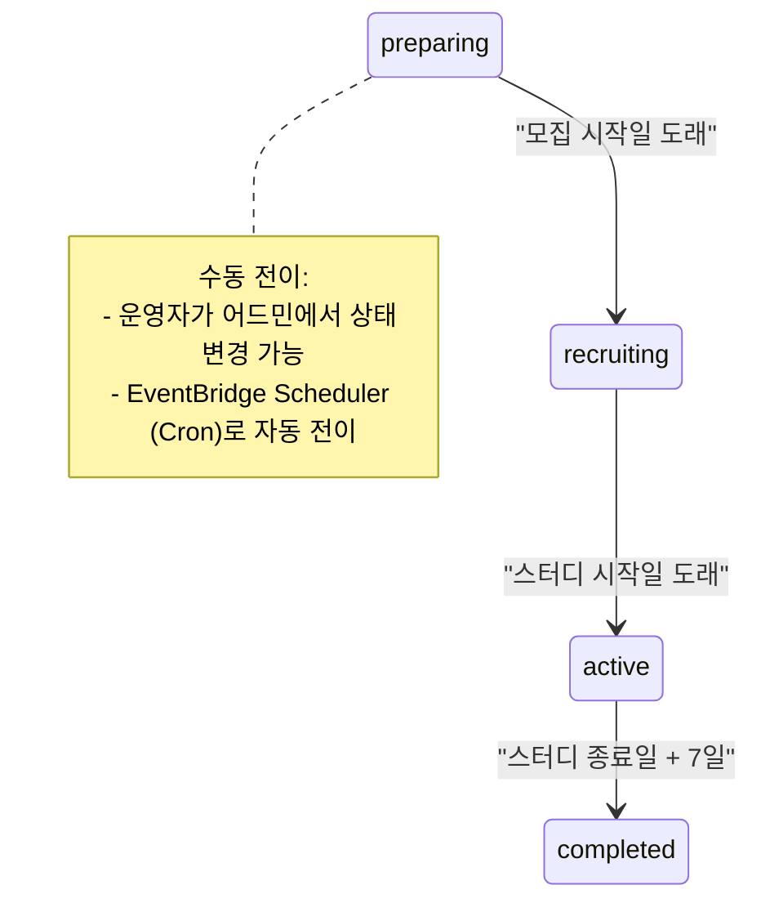
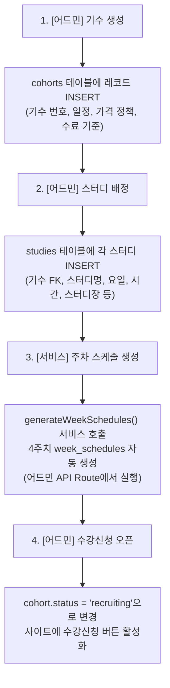
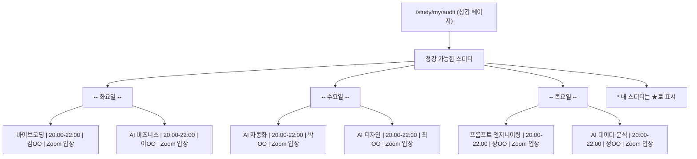
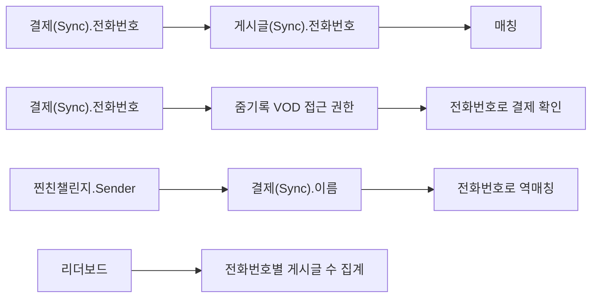
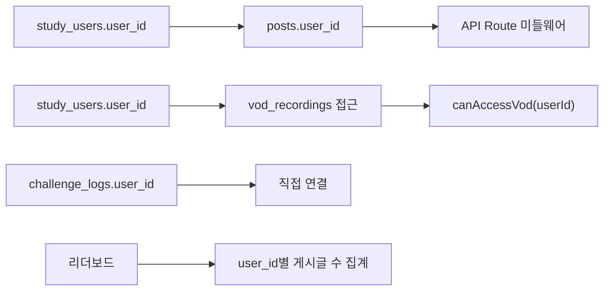
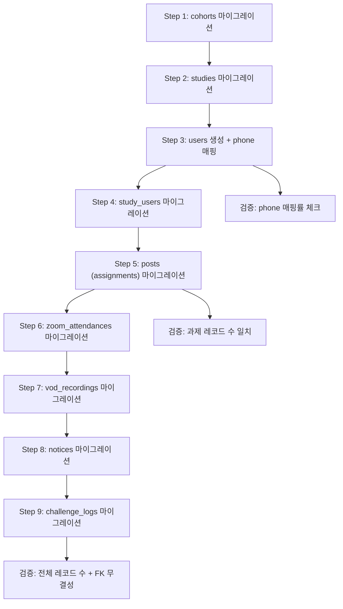

# GPTers 포털 리뉴얼 - LMS 과제 연동 및 수강 경험 설계

> **문서 ID**: renewal-07-lms-assignment
> **유형**: Domain Design (LMS)
> **대상**: 과제 연동 VOD 접근 권한, 수료 판정, 기수 관리, 주차 스케줄, 찐친챌린지, 리더보드, 청강, 버디
> **작성일**: 2026-03-06
> **수정일**: 2026-03-07
> **기반 문서**: gpters-renewal-plan-plus.md (M-05~M-07, S-01~S-06), gpters-renewal-context-analysis.md (5.3, 7.1~7.7), lms/CLAUDE.md, lms/API.md, lms/airtable-schema.md, lms-migration-reference.md, study-site-tasks.md, about-ai-study.md
> **아키텍처**: AWS 자체 구축 (RDS PostgreSQL + Drizzle ORM + Next.js API Routes)

---

## 목차

1. [과제 연동 VOD 접근 권한](#1-과제-연동-vod-접근-권한)
2. [수료 판정 알고리즘](#2-수료-판정-알고리즘)
3. [기수(Cohort) 관리 플로우](#3-기수cohort-관리-플로우)
4. [주차 스케줄 관리](#4-주차-스케줄-관리)
5. [찐친챌린지 집계](#5-찐친챌린지-집계)
6. [리더보드 집계](#6-리더보드-집계)
7. [청강 시스템](#7-청강-시스템)
8. [버디 시스템](#8-버디-시스템)
9. [전화번호 → userId 전환 계획](#9-전화번호--userid-전환-계획)
10. [레거시 LMS API 기능 매핑](#10-레거시-lms-api-기능-매핑)
11. [Airtable LMS 마이그레이션 매핑](#11-airtable-lms-마이그레이션-매핑)

---

## 1. 과제 연동 VOD 접근 권한

> **가장 중요한 자동화.** 수강생이 사례 게시글(과제)을 작성해야만 다른 스터디의 VOD 다시보기를 열람할 수 있는 핵심 넛지(Nudge) 메커니즘.

### 1.1 접근 권한 규칙

| 조건 | 접근 범위 | 과제 제출 필요 여부 |
|------|----------|-------------------|
| 1주차 VOD | 모든 수강생 접근 가능 | 불필요 |
| 내 스터디 VOD (2~4주차) | 내 스터디의 모든 주차 VOD | 불필요 (무조건 접근) |
| 타 스터디 VOD (2~4주차) | 해당 주차의 VOD만 | **해당 주차 과제 1개 이상 제출 필수** |
| 비로그인/미수강 | 1주차만 | - |

**핵심 원리**: 주차별 독립 체크. 2주차 과제를 제출하면 2주차 VOD만 열리고, 3주차 VOD는 3주차 과제를 별도로 제출해야 한다.

### 1.2 RDS PostgreSQL 스키마 (관련 테이블)

```sql
-- vod_recordings: VOD 다시보기 녹화본
CREATE TABLE vod_recordings (
  id UUID PRIMARY KEY DEFAULT gen_random_uuid(),
  cohort_id UUID NOT NULL REFERENCES cohorts(id),
  study_id UUID REFERENCES studies(id),        -- NULL이면 공통 일정 VOD
  week INT NOT NULL CHECK (week BETWEEN 1 AND 4),
  title TEXT NOT NULL,
  youtube_url TEXT NOT NULL,
  description TEXT,
  uploaded_at TIMESTAMPTZ DEFAULT now(),
  created_at TIMESTAMPTZ DEFAULT now()
);

-- posts: 커뮤니티 게시글 (과제 게시글 포함)
-- 과제 게시글은 post_type = 'assignment'로 구분
CREATE TABLE posts (
  id UUID PRIMARY KEY DEFAULT gen_random_uuid(),
  user_id UUID NOT NULL REFERENCES users(id),
  title TEXT NOT NULL,
  content TEXT,
  post_type TEXT NOT NULL DEFAULT 'general',    -- 'general', 'assignment', 'question', 'free'
  cohort_id UUID REFERENCES cohorts(id),
  study_id UUID REFERENCES studies(id),         -- 과제가 속한 스터디
  week INT CHECK (week BETWEEN 1 AND 4),        -- 주차인정
  deleted_at TIMESTAMPTZ,                        -- soft delete
  created_at TIMESTAMPTZ DEFAULT now(),
  updated_at TIMESTAMPTZ DEFAULT now()
);

-- study_users: 수강생-스터디 매핑
CREATE TABLE study_users (
  id UUID PRIMARY KEY DEFAULT gen_random_uuid(),
  user_id UUID NOT NULL REFERENCES users(id),
  study_id UUID NOT NULL REFERENCES studies(id),
  cohort_id UUID NOT NULL REFERENCES cohorts(id),
  role TEXT NOT NULL DEFAULT 'member' CHECK (role IN ('leader', 'member', 'buddy')),
  enrolled_at TIMESTAMPTZ DEFAULT now(),
  UNIQUE (user_id, study_id)
);
```

### 1.3 VOD 접근 권한 서비스 (TypeScript)

> 기존 Supabase DB 함수 `has_assignment_for_week()`, `is_my_study()`, `can_access_vod()`를 TypeScript 서비스 함수로 대체.

```typescript
// src/modules/lms/services/vod-access.service.ts
import { db } from '@/lib/db';
import { posts, studyUsers, vodRecordings } from '@/lib/db/schema';
import { and, eq, isNull } from 'drizzle-orm';

/**
 * 특정 사용자가 특정 기수의 특정 주차에 과제를 제출했는지 확인
 * (기존 Supabase DB function: has_assignment_for_week)
 */
export async function hasAssignmentForWeek(
  userId: string,
  cohortId: string,
  week: number
): Promise<boolean> {
  const result = await db
    .select({ id: posts.id })
    .from(posts)
    .where(
      and(
        eq(posts.userId, userId),
        eq(posts.cohortId, cohortId),
        eq(posts.postType, 'assignment'),
        eq(posts.week, week),
        isNull(posts.deletedAt)
      )
    )
    .limit(1);

  return result.length > 0;
}

/**
 * 특정 사용자가 특정 스터디에 소속되어 있는지 확인
 * (기존 Supabase DB function: is_my_study)
 */
export async function isMyStudy(
  userId: string,
  studyId: string
): Promise<boolean> {
  const result = await db
    .select({ id: studyUsers.id })
    .from(studyUsers)
    .where(
      and(
        eq(studyUsers.userId, userId),
        eq(studyUsers.studyId, studyId)
      )
    )
    .limit(1);

  return result.length > 0;
}

/**
 * VOD 접근 가능 여부를 판단하는 핵심 함수
 * (기존 Supabase DB function: can_access_vod)
 *
 * 규칙:
 *  1. 1주차 → 해당 기수 수강생이면 접근 가능
 *  2. 공통 일정 VOD (study_id IS NULL) → 과제 제출 여부로 판단
 *  3. 내 스터디 → 과제 무관 전체 접근
 *  4. 타 스터디 2~4주차 → 해당 주차 과제 제출 시에만 접근
 */
export async function canAccessVod(
  userId: string,
  vodId: string
): Promise<boolean> {
  // VOD 정보 조회
  const [vod] = await db
    .select({
      week: vodRecordings.week,
      studyId: vodRecordings.studyId,
      cohortId: vodRecordings.cohortId,
    })
    .from(vodRecordings)
    .where(eq(vodRecordings.id, vodId))
    .limit(1);

  if (!vod) return false;

  // 규칙 1: 1주차는 해당 기수 수강생이면 접근 가능
  if (vod.week === 1) {
    const enrolled = await db
      .select({ id: studyUsers.id })
      .from(studyUsers)
      .where(
        and(
          eq(studyUsers.userId, userId),
          eq(studyUsers.cohortId, vod.cohortId)
        )
      )
      .limit(1);
    return enrolled.length > 0;
  }

  // 규칙 2: 공통 일정 VOD (study_id IS NULL)는 과제 제출 여부로 판단
  if (!vod.studyId) {
    return hasAssignmentForWeek(userId, vod.cohortId, vod.week);
  }

  // 규칙 3: 내 스터디는 과제 제출 여부 무관 전체 접근
  if (await isMyStudy(userId, vod.studyId)) {
    return true;
  }

  // 규칙 4: 타 스터디 2~4주차는 해당 주차 과제 제출 시에만 접근
  return hasAssignmentForWeek(userId, vod.cohortId, vod.week);
}
```

### 1.4 VOD 접근 제어 미들웨어

> 기존 Supabase RLS 4개 정책(`vod_anon_read_week1`, `vod_authenticated_read`, `vod_admin_all`, `vod_leader_manage`)을 애플리케이션 레벨 미들웨어로 대체.

```typescript
// src/modules/lms/middleware/vod-access.middleware.ts
import { NextRequest, NextResponse } from 'next/server';
import { getSession } from '@/lib/auth/session';
import { canAccessVod } from '../services/vod-access.service';
import { db } from '@/lib/db';
import { users, studyUsers } from '@/lib/db/schema';
import { eq, and } from 'drizzle-orm';

type VodAccessRole = 'anon' | 'authenticated' | 'admin' | 'leader';

async function getUserRole(userId: string | null, studyId?: string): Promise<VodAccessRole> {
  if (!userId) return 'anon';

  // 어드민 체크
  const [user] = await db
    .select({ role: users.role })
    .from(users)
    .where(eq(users.id, userId))
    .limit(1);

  if (user?.role === 'admin') return 'admin';

  // 스터디 리더 체크
  if (studyId) {
    const [su] = await db
      .select({ role: studyUsers.role })
      .from(studyUsers)
      .where(
        and(
          eq(studyUsers.userId, userId),
          eq(studyUsers.studyId, studyId)
        )
      )
      .limit(1);
    if (su?.role === 'leader') return 'leader';
  }

  return 'authenticated';
}

/**
 * VOD 접근 제어 - 기존 RLS 정책 대체
 *
 * 정책 매핑:
 *  - vod_anon_read_week1     → 비로그인: week=1만 허용
 *  - vod_authenticated_read  → 로그인: canAccessVod() 서비스 함수로 판단
 *  - vod_admin_all           → 어드민: 전체 접근
 *  - vod_leader_manage       → 스터디 리더: 자기 스터디 VOD 관리 (CRUD)
 */
export async function vodAccessGuard(
  request: NextRequest,
  vodId: string,
  studyId?: string,
  method: string = 'GET'
): Promise<{ allowed: boolean; reason?: string }> {
  const session = await getSession(request);
  const userId = session?.userId ?? null;
  const role = await getUserRole(userId, studyId);

  // 어드민: 전체 접근 (기존 vod_admin_all)
  if (role === 'admin') {
    return { allowed: true };
  }

  // 스터디 리더: 자기 스터디 VOD 관리 (기존 vod_leader_manage)
  if (role === 'leader' && studyId) {
    return { allowed: true };
  }

  // 쓰기 작업은 어드민/리더만 가능
  if (method !== 'GET') {
    return { allowed: false, reason: 'VOD 관리 권한이 없습니다.' };
  }

  // 비로그인: 1주차만 (기존 vod_anon_read_week1)
  if (role === 'anon') {
    const [vod] = await db
      .select({ week: vodRecordings.week })
      .from(vodRecordings)
      .where(eq(vodRecordings.id, vodId))
      .limit(1);
    if (vod?.week === 1) return { allowed: true };
    return { allowed: false, reason: '로그인이 필요합니다.' };
  }

  // 로그인 사용자: canAccessVod 서비스 함수 (기존 vod_authenticated_read)
  const canAccess = await canAccessVod(userId!, vodId);
  if (canAccess) return { allowed: true };
  return { allowed: false, reason: '해당 주차 과제를 제출해야 VOD를 열람할 수 있습니다.' };
}
```

### 1.5 주차별 리셋 방식

주차 기반이므로 별도 리셋 로직 불필요. `week` 필드로 자연스럽게 분리됨.

- 2주차 과제 제출 → `posts.week = 2` 레코드 존재 → 2주차 VOD만 열림
- 3주차 과제 제출 → `posts.week = 3` 레코드 존재 → 3주차 VOD만 열림
- 각 주차는 독립적으로 체크되므로 Cron이나 리셋 배치 불필요

### 1.6 프론트엔드 연동 (VOD 목록 조회)

```typescript
// src/modules/lms/services/vod-query.service.ts
import { db } from '@/lib/db';
import { vodRecordings, posts, studyUsers, studies } from '@/lib/db/schema';
import { eq, and, isNull, asc } from 'drizzle-orm';

/**
 * 기수별 VOD 목록 + 접근 권한 정보 조회
 * (기존 supabase.from('vod_recordings').select() 대체)
 */
export async function getVodListWithPermissions(
  cohortId: string,
  userId?: string
) {
  // VOD 목록 조회 (Drizzle ORM)
  const vods = await db
    .select({
      id: vodRecordings.id,
      week: vodRecordings.week,
      title: vodRecordings.title,
      youtubeUrl: vodRecordings.youtubeUrl,
      description: vodRecordings.description,
      uploadedAt: vodRecordings.uploadedAt,
      studyId: vodRecordings.studyId,
      studyTitle: studies.title,
      studyDayOfWeek: studies.dayOfWeek,
    })
    .from(vodRecordings)
    .leftJoin(studies, eq(vodRecordings.studyId, studies.id))
    .where(eq(vodRecordings.cohortId, cohortId))
    .orderBy(asc(vodRecordings.week), asc(vodRecordings.uploadedAt));

  if (!userId) {
    // 비로그인: 1주차만 반환
    return vods.filter(v => v.week === 1);
  }

  // 로그인 사용자: 각 VOD별 접근 권한 체크
  const unlockStatus = await getWeeklyUnlockStatus(cohortId, userId);

  return vods.map(vod => ({
    ...vod,
    accessible:
      vod.week === 1 ||
      (vod.studyId && unlockStatus.myStudyIds.has(vod.studyId)) ||
      unlockStatus.submittedWeeks.has(vod.week),
  }));
}

/**
 * 주차별 잠금 상태 계산 (UI 표시용)
 * (기존 Supabase 클라이언트 쿼리 대체)
 */
export async function getWeeklyUnlockStatus(
  cohortId: string,
  userId: string
) {
  // 사용자의 주차별 과제 제출 현황
  const assignments = await db
    .select({ week: posts.week })
    .from(posts)
    .where(
      and(
        eq(posts.userId, userId),
        eq(posts.cohortId, cohortId),
        eq(posts.postType, 'assignment'),
        isNull(posts.deletedAt)
      )
    );

  const submittedWeeks = new Set(assignments.map(a => a.week).filter(Boolean) as number[]);

  // 사용자의 스터디 ID
  const myStudies = await db
    .select({ studyId: studyUsers.studyId })
    .from(studyUsers)
    .where(
      and(
        eq(studyUsers.userId, userId),
        eq(studyUsers.cohortId, cohortId)
      )
    );

  const myStudyIds = new Set(myStudies.map(s => s.studyId));

  return {
    submittedWeeks,    // Set<number> - 과제 제출한 주차
    myStudyIds,        // Set<string> - 내 스터디 ID 목록
    // UI에서: week === 1 || myStudyIds.has(studyId) || submittedWeeks.has(week) → 열림
  };
}
```

### 1.7 VOD API Route

```typescript
// src/app/api/vod/route.ts
import { NextRequest, NextResponse } from 'next/server';
import { getSession } from '@/lib/auth/session';
import { getVodListWithPermissions } from '@/modules/lms/services/vod-query.service';

export async function GET(request: NextRequest) {
  const { searchParams } = new URL(request.url);
  const cohortId = searchParams.get('cohortId');

  if (!cohortId) {
    return NextResponse.json({ error: 'cohortId is required' }, { status: 400 });
  }

  const session = await getSession(request);
  const vods = await getVodListWithPermissions(cohortId, session?.userId);

  return NextResponse.json({ vods });
}
```

```typescript
// src/app/api/vod/[vodId]/route.ts
import { NextRequest, NextResponse } from 'next/server';
import { vodAccessGuard } from '@/modules/lms/middleware/vod-access.middleware';

export async function GET(
  request: NextRequest,
  { params }: { params: { vodId: string } }
) {
  const { allowed, reason } = await vodAccessGuard(request, params.vodId);

  if (!allowed) {
    return NextResponse.json({ error: reason }, { status: 403 });
  }

  // VOD 상세 조회 로직
  // ...
}
```

---

## 2. 수료 판정 알고리즘

### 2.1 수료 조건 체계

| 등급 | 과제 조건 | 출석(Zoom) 조건 | 혜택 |
|------|----------|----------------|------|
| **수료** | 4주 중 3주 이상 과제 제출 | 4회 중 2회 이상 참여 | 수료증 발급 |
| **우수활동자** | 사례 게시글 2개 이상 | Zoom 2회 이상 참여 | 수료증 + 특별 뱃지 |
| **미수료** | 조건 미달 | 조건 미달 | - |

> 참고: `about-ai-study.md` 및 `study-site-tasks.md`의 수료 기준. 정확한 출석 횟수 기준은 기수별로 운영팀이 조정할 수 있으므로 `cohorts.graduation_min_attendance` 필드로 설정 가능하게 설계.

### 2.2 출석 데이터 테이블

```sql
-- zoom_attendances: Zoom 참여 기록
CREATE TABLE zoom_attendances (
  id UUID PRIMARY KEY DEFAULT gen_random_uuid(),
  user_id UUID NOT NULL REFERENCES users(id),
  study_id UUID NOT NULL REFERENCES studies(id),
  cohort_id UUID NOT NULL REFERENCES cohorts(id),
  week INT NOT NULL CHECK (week BETWEEN 1 AND 4),
  attended_at TIMESTAMPTZ DEFAULT now(),
  source TEXT DEFAULT 'manual',   -- 'manual', 'zoom_webhook', 'n8n'
  UNIQUE (user_id, study_id, week)
);
```

### 2.3 수료 판정 서비스 (TypeScript)

> 기존 Supabase DB function `get_graduation_candidates()`를 Drizzle ORM 집계 쿼리로 대체.

```typescript
// src/modules/lms/services/graduation.service.ts
import { db } from '@/lib/db';
import { studyUsers, posts, zoomAttendances, cohorts, users, studies } from '@/lib/db/schema';
import { eq, and, isNull, sql, count, countDistinct } from 'drizzle-orm';

export interface GraduationCandidate {
  userId: string;
  userName: string;
  studyTitle: string;
  assignmentCount: number;
  attendanceCount: number;
  isGraduated: boolean;
  isExcellent: boolean;
}

/**
 * 기수별 수료 대상자 판정
 * (기존 Supabase DB function: get_graduation_candidates)
 */
export async function getGraduationCandidates(
  cohortId: string
): Promise<GraduationCandidate[]> {
  // 기수별 수료 기준 조회
  const [cohort] = await db
    .select({
      minAssignments: cohorts.graduationMinAssignments,
      minAttendance: cohorts.graduationMinAttendance,
    })
    .from(cohorts)
    .where(eq(cohorts.id, cohortId))
    .limit(1);

  const minAssignments = cohort?.minAssignments ?? 3;
  const minAttendance = cohort?.minAttendance ?? 2;

  // 수강생 목록 + 과제/출석 집계
  const candidates = await db
    .select({
      userId: studyUsers.userId,
      userName: users.displayName,
      studyTitle: studies.title,
    })
    .from(studyUsers)
    .innerJoin(users, eq(users.id, studyUsers.userId))
    .innerJoin(studies, eq(studies.id, studyUsers.studyId))
    .where(eq(studyUsers.cohortId, cohortId));

  // 각 수강생별 과제/출석 집계
  const results: GraduationCandidate[] = [];

  for (const candidate of candidates) {
    // 과제 제출 주차 수 (중복 주차 제거)
    const [assignmentResult] = await db
      .select({ count: countDistinct(posts.week) })
      .from(posts)
      .where(
        and(
          eq(posts.userId, candidate.userId),
          eq(posts.cohortId, cohortId),
          eq(posts.postType, 'assignment'),
          isNull(posts.deletedAt)
        )
      );
    const assignmentCount = Number(assignmentResult?.count ?? 0);

    // 총 과제 게시글 수 (우수활동자 판정용)
    const [totalPostResult] = await db
      .select({ count: count() })
      .from(posts)
      .where(
        and(
          eq(posts.userId, candidate.userId),
          eq(posts.cohortId, cohortId),
          eq(posts.postType, 'assignment'),
          isNull(posts.deletedAt)
        )
      );
    const totalPostCount = Number(totalPostResult?.count ?? 0);

    // Zoom 출석 횟수
    const [attendanceResult] = await db
      .select({ count: count() })
      .from(zoomAttendances)
      .where(
        and(
          eq(zoomAttendances.userId, candidate.userId),
          eq(zoomAttendances.cohortId, cohortId)
        )
      );
    const attendanceCount = Number(attendanceResult?.count ?? 0);

    results.push({
      userId: candidate.userId,
      userName: candidate.userName,
      studyTitle: candidate.studyTitle,
      assignmentCount,
      attendanceCount,
      isGraduated: assignmentCount >= minAssignments && attendanceCount >= minAttendance,
      isExcellent: totalPostCount >= 2 && attendanceCount >= 2,
    });
  }

  // 정렬: 우수활동자 우선, 과제 수 내림차순, 출석 수 내림차순
  return results.sort((a, b) => {
    if (a.isExcellent !== b.isExcellent) return b.isExcellent ? 1 : -1;
    if (a.assignmentCount !== b.assignmentCount) return b.assignmentCount - a.assignmentCount;
    return b.attendanceCount - a.attendanceCount;
  });
}
```

### 2.4 수료증 테이블 및 자동 발급

```sql
-- certificates: 수료증
CREATE TABLE certificates (
  id UUID PRIMARY KEY DEFAULT gen_random_uuid(),
  user_id UUID NOT NULL REFERENCES users(id),
  cohort_id UUID NOT NULL REFERENCES cohorts(id),
  study_id UUID NOT NULL REFERENCES studies(id),
  certificate_type TEXT NOT NULL DEFAULT 'completion'
    CHECK (certificate_type IN ('completion', 'excellent')),
  issued_at TIMESTAMPTZ DEFAULT now(),
  certificate_url TEXT,           -- 생성된 수료증 PDF/이미지 URL (S3)
  metadata JSONB DEFAULT '{}',    -- 추가 정보 (과제 수, 출석 수 등)
  UNIQUE (user_id, cohort_id, study_id)
);
```

```typescript
// src/modules/lms/services/certificate.service.ts
import { db } from '@/lib/db';
import { certificates, studyUsers } from '@/lib/db/schema';
import { eq, and } from 'drizzle-orm';
import { getGraduationCandidates } from './graduation.service';

/**
 * 수료증 일괄 발급 (어드민용)
 * (기존 Supabase DB function: issue_certificates_batch)
 */
export async function issueCertificatesBatch(
  cohortId: string,
  issuedBy?: string
): Promise<number> {
  const candidates = await getGraduationCandidates(cohortId);
  let issuedCount = 0;

  for (const candidate of candidates) {
    if (!candidate.isGraduated) continue;

    // 해당 사용자의 스터디 조회
    const enrollments = await db
      .select({ studyId: studyUsers.studyId })
      .from(studyUsers)
      .where(
        and(
          eq(studyUsers.userId, candidate.userId),
          eq(studyUsers.cohortId, cohortId)
        )
      );

    for (const enrollment of enrollments) {
      await db
        .insert(certificates)
        .values({
          userId: candidate.userId,
          cohortId,
          studyId: enrollment.studyId,
          certificateType: candidate.isExcellent ? 'excellent' : 'completion',
          metadata: {
            assignmentCount: candidate.assignmentCount,
            attendanceCount: candidate.attendanceCount,
            issuedBy,
          },
        })
        .onConflictDoUpdate({
          target: [certificates.userId, certificates.cohortId, certificates.studyId],
          set: {
            certificateType: candidate.isExcellent ? 'excellent' : 'completion',
            metadata: {
              assignmentCount: candidate.assignmentCount,
              attendanceCount: candidate.attendanceCount,
              issuedBy,
            },
            issuedAt: new Date(),
          },
        });
    }

    issuedCount++;
  }

  return issuedCount;
}
```

### 2.5 기수 완료 시 수료증 자동 발급

> 기존 Supabase trigger `on_cohort_completed`를 애플리케이션 레벨 이벤트 핸들러로 대체.

```typescript
// src/modules/lms/handlers/cohort-completed.handler.ts
import { issueCertificatesBatch } from '../services/certificate.service';

/**
 * 기수 상태가 'completed'로 변경될 때 호출
 * (기존 Supabase trigger: trigger_cohort_completed → on_cohort_completed)
 *
 * 호출 시점:
 *  1. 어드민이 수동으로 상태 변경 시 (API Route에서 호출)
 *  2. Cron 배치에서 자동 상태 전이 시 (updateCohortStatuses에서 호출)
 */
export async function onCohortCompleted(cohortId: string): Promise<void> {
  const issuedCount = await issueCertificatesBatch(cohortId);
  console.log(`[CohortCompleted] cohortId=${cohortId}, certificates issued: ${issuedCount}`);
}
```

---

## 3. 기수(Cohort) 관리 플로우

### 3.1 기수 테이블 구조

```sql
CREATE TABLE cohorts (
  id UUID PRIMARY KEY DEFAULT gen_random_uuid(),
  cohort_number INT NOT NULL UNIQUE,             -- 21 (기수 번호)
  title TEXT NOT NULL,                           -- '21기 AI 스터디'
  status TEXT NOT NULL DEFAULT 'preparing'
    CHECK (status IN ('preparing', 'recruiting', 'active', 'completed')),

  -- 일정
  recruit_start_date DATE,                       -- 모집 시작일
  recruit_end_date DATE,                         -- 모집 마감일
  study_start_date DATE NOT NULL,                -- 스터디 시작일
  study_end_date DATE NOT NULL,                  -- 스터디 종료일

  -- 가격 정책
  price_super_early INT,                         -- 슈퍼얼리버드 가격 (149,000)
  price_early INT,                               -- 얼리버드 가격 (199,000)
  price_regular INT,                             -- 일반가 (269,000)
  super_early_deadline DATE,                     -- 슈퍼얼리버드 마감일
  early_deadline DATE,                           -- 얼리버드 마감일

  -- 수료 기준 (기수별 조정 가능)
  graduation_min_assignments INT DEFAULT 3,       -- 최소 과제 제출 주차 수
  graduation_min_attendance INT DEFAULT 2,        -- 최소 Zoom 출석 횟수

  created_at TIMESTAMPTZ DEFAULT now(),
  updated_at TIMESTAMPTZ DEFAULT now()
);
```

### 3.2 현재 가격 계산 서비스

> 기존 Supabase DB function `get_current_price()`를 TypeScript로 대체.

```typescript
// src/modules/lms/services/cohort.service.ts
import { db } from '@/lib/db';
import { cohorts } from '@/lib/db/schema';
import { eq } from 'drizzle-orm';

export async function getCurrentPrice(cohortId: string): Promise<number | null> {
  const [cohort] = await db
    .select()
    .from(cohorts)
    .where(eq(cohorts.id, cohortId))
    .limit(1);

  if (!cohort) return null;

  const today = new Date().toISOString().split('T')[0];

  if (cohort.superEarlyDeadline && today <= cohort.superEarlyDeadline) {
    return cohort.priceSuperEarly;
  }
  if (cohort.earlyDeadline && today <= cohort.earlyDeadline) {
    return cohort.priceEarly;
  }
  return cohort.priceRegular;
}
```

### 3.3 기수 상태 전이



### 3.4 기수 상태 자동 전이 (Cron 배치)

> 기존 Supabase Edge Function (Cron)을 AWS EventBridge Scheduler + Lambda (또는 Next.js Cron API Route)로 대체.

```typescript
// src/modules/lms/jobs/cohort-status.job.ts
import { db } from '@/lib/db';
import { cohorts } from '@/lib/db/schema';
import { eq, and, lte, sql } from 'drizzle-orm';
import { onCohortCompleted } from '../handlers/cohort-completed.handler';

/**
 * 기수 상태 자동 전이 (매일 00:05 KST 실행)
 * (기존 Supabase DB function: update_cohort_statuses)
 *
 * 실행 방법:
 *  - AWS EventBridge Scheduler → Lambda 호출
 *  - 또는 Next.js Cron API Route (vercel.json cron 설정)
 */
export async function updateCohortStatuses(): Promise<void> {
  const today = new Date().toISOString().split('T')[0];

  // preparing → recruiting
  await db
    .update(cohorts)
    .set({ status: 'recruiting', updatedAt: new Date() })
    .where(
      and(
        eq(cohorts.status, 'preparing'),
        lte(cohorts.recruitStartDate, today)
      )
    );

  // recruiting → active
  await db
    .update(cohorts)
    .set({ status: 'active', updatedAt: new Date() })
    .where(
      and(
        eq(cohorts.status, 'recruiting'),
        lte(cohorts.studyStartDate, today)
      )
    );

  // active → completed (스터디 종료일 + 7일 유예)
  const completedCohorts = await db
    .select({ id: cohorts.id })
    .from(cohorts)
    .where(
      and(
        eq(cohorts.status, 'active'),
        sql`${cohorts.studyEndDate} + INTERVAL '7 days' <= ${today}::date`
      )
    );

  for (const cohort of completedCohorts) {
    await db
      .update(cohorts)
      .set({ status: 'completed', updatedAt: new Date() })
      .where(eq(cohorts.id, cohort.id));

    // 수료증 자동 발급 트리거
    await onCohortCompleted(cohort.id);
  }
}
```

```typescript
// src/app/api/cron/cohort-status/route.ts
import { NextRequest, NextResponse } from 'next/server';
import { updateCohortStatuses } from '@/modules/lms/jobs/cohort-status.job';

// Cron 인증 (AWS EventBridge 또는 Vercel Cron)
export async function GET(request: NextRequest) {
  const authHeader = request.headers.get('authorization');
  if (authHeader !== `Bearer ${process.env.CRON_SECRET}`) {
    return NextResponse.json({ error: 'Unauthorized' }, { status: 401 });
  }

  await updateCohortStatuses();
  return NextResponse.json({ success: true });
}
```

### 3.5 기수 생성 → 스터디 배정 → 주차 스케줄 생성 플로우



### 3.6 기수별 일정 조회 서비스

> 기존 Supabase DB function `get_cohort_schedule()`를 TypeScript로 대체.

```typescript
// src/modules/lms/services/cohort.service.ts (추가)

export async function getCohortSchedule(cohortId: string) {
  const [cohort] = await db
    .select()
    .from(cohorts)
    .where(eq(cohorts.id, cohortId))
    .limit(1);

  if (!cohort) return null;

  const currentPrice = await getCurrentPrice(cohortId);
  const recruitStart = new Date(cohort.recruitStartDate);

  return {
    leaderRecruitStart: new Date(recruitStart.getTime() - 28 * 24 * 60 * 60 * 1000),
    recruitStart: cohort.recruitStartDate,
    recruitEnd: cohort.recruitEndDate,
    studyStart: cohort.studyStartDate,
    studyEnd: cohort.studyEndDate,
    settlementDeadline: new Date(
      new Date(cohort.studyEndDate).getTime() + 7 * 24 * 60 * 60 * 1000
    ),
    currentPrice,
    status: cohort.status,
  };
}
```

---

## 4. 주차 스케줄 관리

### 4.1 week_schedules 테이블 구조

```sql
CREATE TABLE week_schedules (
  id UUID PRIMARY KEY DEFAULT gen_random_uuid(),
  cohort_id UUID NOT NULL REFERENCES cohorts(id),
  week INT NOT NULL CHECK (week BETWEEN 1 AND 4),
  week_start_date DATE NOT NULL,                 -- 주차 시작일 (월요일)
  week_end_date DATE NOT NULL,                   -- 주차 종료일 (일요일)
  description TEXT,                              -- 주차 설명 (ex: '핵심 강의 주차')
  created_at TIMESTAMPTZ DEFAULT now(),
  UNIQUE (cohort_id, week)
);
```

### 4.2 주차 스케줄 자동 생성 서비스

> 기존 Supabase DB function `generate_week_schedules()`를 TypeScript로 대체.

```typescript
// src/modules/lms/services/week-schedule.service.ts
import { db } from '@/lib/db';
import { weekSchedules, cohorts } from '@/lib/db/schema';
import { eq } from 'drizzle-orm';

/**
 * 기수 생성 시 4주치 스케줄 자동 생성
 * (기존 Supabase DB function: generate_week_schedules)
 */
export async function generateWeekSchedules(cohortId: string): Promise<void> {
  const [cohort] = await db
    .select({ studyStartDate: cohorts.studyStartDate })
    .from(cohorts)
    .where(eq(cohorts.id, cohortId))
    .limit(1);

  if (!cohort) throw new Error(`Cohort not found: ${cohortId}`);

  // 시작일이 월요일이 아닐 경우 직전 월요일로 보정
  const startDate = new Date(cohort.studyStartDate);
  const dayOfWeek = startDate.getDay(); // 0=Sun, 1=Mon, ...
  const mondayOffset = dayOfWeek === 0 ? -6 : 1 - dayOfWeek;
  startDate.setDate(startDate.getDate() + mondayOffset);

  for (let week = 1; week <= 4; week++) {
    const weekStart = new Date(startDate);
    weekStart.setDate(weekStart.getDate() + (week - 1) * 7);

    const weekEnd = new Date(weekStart);
    weekEnd.setDate(weekEnd.getDate() + 6);

    await db
      .insert(weekSchedules)
      .values({
        cohortId,
        week,
        weekStartDate: weekStart.toISOString().split('T')[0],
        weekEndDate: weekEnd.toISOString().split('T')[0],
      })
      .onConflictDoUpdate({
        target: [weekSchedules.cohortId, weekSchedules.week],
        set: {
          weekStartDate: weekStart.toISOString().split('T')[0],
          weekEndDate: weekEnd.toISOString().split('T')[0],
        },
      });
  }
}
```

### 4.3 마감일 계산 서비스

> 기존 Supabase DB function `calculate_week_deadline()`를 TypeScript로 대체.

```typescript
// src/modules/lms/services/week-schedule.service.ts (추가)

const DAY_OFFSETS: Record<string, number> = {
  '월요일': 0, '화요일': 1, '수요일': 2, '목요일': 3,
  '금요일': 4, '토요일': 5, '일요일': 6,
};

/**
 * 특정 스터디의 특정 주차 과제 마감일 계산
 * (기존 Supabase DB function: calculate_week_deadline)
 */
export async function calculateWeekDeadline(
  cohortId: string,
  week: number,
  studyDay: string  // '화요일', '수요일', '목요일'
): Promise<Date | null> {
  const [schedule] = await db
    .select({ weekStartDate: weekSchedules.weekStartDate })
    .from(weekSchedules)
    .where(
      and(
        eq(weekSchedules.cohortId, cohortId),
        eq(weekSchedules.week, week)
      )
    )
    .limit(1);

  if (!schedule) return null;

  const dayOffset = DAY_OFFSETS[studyDay] ?? 0;
  const deadline = new Date(schedule.weekStartDate);
  deadline.setDate(deadline.getDate() + dayOffset);
  deadline.setHours(23, 59, 59, 999);

  return deadline;
}
```

### 4.4 프론트엔드 마감일 표시

```typescript
// src/lib/helpers/deadline.ts

/**
 * D-day 계산 (레거시 LMS의 calculateDday 함수 대응)
 */
export function calculateDday(deadline: Date): string {
  const now = new Date();
  const diff = deadline.getTime() - now.getTime();
  const days = Math.ceil(diff / (1000 * 60 * 60 * 24));

  if (days < 0) return '마감';
  if (days === 0) return 'D-Day';
  return `D-${days}`;
}

/**
 * 현재 주차 판별
 */
export function getCurrentWeek(
  weekSchedules: { week: number; week_start_date: string; week_end_date: string }[]
): number | null {
  const today = new Date().toISOString().split('T')[0];

  for (const ws of weekSchedules) {
    if (today >= ws.week_start_date && today <= ws.week_end_date) {
      return ws.week;
    }
  }
  return null;
}
```

---

## 5. 찐친챌린지 집계

### 5.1 찐친챌린지 개요

네트워킹방에서 인증 활동을 수행하고, Sender별로 집계하는 시스템.

- **기간**: 2주차 월요일 00:00 ~ 4주차 목요일 23:59:59
- **집계**: Sender별 인증 횟수 + 날짜 중복 제거
- **통계**: Top 5 + 파이차트 + 내 인증 현황

### 5.2 테이블 구조

```sql
CREATE TABLE challenge_logs (
  id UUID PRIMARY KEY DEFAULT gen_random_uuid(),
  cohort_id UUID NOT NULL REFERENCES cohorts(id),
  sender_name TEXT NOT NULL,             -- 인증자 이름
  user_id UUID REFERENCES users(id),     -- 매핑된 사용자 (nullable, 마이그레이션 대비)
  room_name TEXT NOT NULL,               -- 네트워킹방 이름 (ex: '21기 네트워킹방')
  certified_at TIMESTAMPTZ NOT NULL DEFAULT now(),
  created_at TIMESTAMPTZ DEFAULT now()
);

CREATE INDEX idx_challenge_logs_cohort ON challenge_logs(cohort_id);
CREATE INDEX idx_challenge_logs_sender ON challenge_logs(sender_name);
```

### 5.3 챌린지 집계 서비스

> 기존 Supabase DB function `get_challenge_period()`, `get_challenge_stats()`, `get_my_challenge_stats()`를 TypeScript 서비스로 대체.

```typescript
// src/modules/lms/services/challenge.service.ts
import { db } from '@/lib/db';
import { challengeLogs, weekSchedules, users } from '@/lib/db/schema';
import { eq, and, gte, lte, sql, count, countDistinct } from 'drizzle-orm';

interface ChallengePeriod {
  periodStart: Date;
  periodEnd: Date;
}

/**
 * 찐친챌린지 기간 계산 (2주차 월요일 ~ 4주차 목요일)
 * (기존 Supabase DB function: get_challenge_period)
 */
export async function getChallengePeriod(cohortId: string): Promise<ChallengePeriod | null> {
  const schedules = await db
    .select({
      week: weekSchedules.week,
      weekStartDate: weekSchedules.weekStartDate,
    })
    .from(weekSchedules)
    .where(eq(weekSchedules.cohortId, cohortId));

  const week2 = schedules.find(s => s.week === 2);
  const week4 = schedules.find(s => s.week === 4);

  if (!week2 || !week4) return null;

  return {
    periodStart: new Date(week2.weekStartDate),                      // 2주차 월요일 00:00
    periodEnd: new Date(new Date(week4.weekStartDate).getTime()      // 4주차 목요일 23:59:59
      + 3 * 24 * 60 * 60 * 1000 + 23 * 60 * 60 * 1000
      + 59 * 60 * 1000 + 59 * 1000),
  };
}

interface SenderStat {
  sender: string;
  certificationCount: number;
  uniqueDays: number;
  percentage: number;
}

interface ChallengeStats {
  cohortId: string;
  period: { start: Date; end: Date };
  stats: { totalCertifications: number; uniqueDayCertifications: number };
  senderStats: SenderStat[];
}

/**
 * 찐친챌린지 전체 통계
 * (기존 Supabase DB function: get_challenge_stats)
 */
export async function getChallengeStats(cohortId: string): Promise<ChallengeStats | null> {
  const period = await getChallengePeriod(cohortId);
  if (!period) return null;

  // Sender별 통계 (Drizzle raw SQL for complex aggregation)
  const senderRows = await db.execute(sql`
    SELECT
      sender_name,
      COUNT(*)::int AS cert_count,
      COUNT(DISTINCT DATE(certified_at))::int AS unique_days
    FROM challenge_logs
    WHERE cohort_id = ${cohortId}
      AND certified_at >= ${period.periodStart}
      AND certified_at <= ${period.periodEnd}
    GROUP BY sender_name
    ORDER BY unique_days DESC, cert_count DESC
  `);

  const totalCertifications = senderRows.rows.reduce(
    (sum: number, r: any) => sum + r.cert_count, 0
  );

  const uniqueDayCertifications = await db.execute(sql`
    SELECT COUNT(*)::int AS cnt FROM (
      SELECT DISTINCT sender_name, DATE(certified_at)
      FROM challenge_logs
      WHERE cohort_id = ${cohortId}
        AND certified_at >= ${period.periodStart}
        AND certified_at <= ${period.periodEnd}
    ) deduped
  `);

  const senderStats: SenderStat[] = senderRows.rows.map((r: any) => ({
    sender: r.sender_name,
    certificationCount: r.cert_count,
    uniqueDays: r.unique_days,
    percentage: Math.round((r.cert_count / Math.max(totalCertifications, 1)) * 1000) / 10,
  }));

  return {
    cohortId,
    period: { start: period.periodStart, end: period.periodEnd },
    stats: {
      totalCertifications,
      uniqueDayCertifications: Number(uniqueDayCertifications.rows[0]?.cnt ?? 0),
    },
    senderStats,
  };
}

/**
 * 특정 사용자의 찐친챌린지 인증 현황
 * (기존 Supabase DB function: get_my_challenge_stats)
 */
export async function getMyChallengeStats(
  cohortId: string,
  userId: string
): Promise<{ sender: string; certificationCount: number; uniqueDays: number; rank: number } | null> {
  const period = await getChallengePeriod(cohortId);
  if (!period) return null;

  // 사용자 이름 조회
  const [user] = await db
    .select({ displayName: users.displayName })
    .from(users)
    .where(eq(users.id, userId))
    .limit(1);

  if (!user) return null;

  // 내 인증 통계
  const myStats = await db.execute(sql`
    SELECT
      COUNT(*)::int AS cert_count,
      COUNT(DISTINCT DATE(certified_at))::int AS unique_days
    FROM challenge_logs
    WHERE cohort_id = ${cohortId}
      AND (user_id = ${userId} OR sender_name = ${user.displayName})
      AND certified_at >= ${period.periodStart}
      AND certified_at <= ${period.periodEnd}
  `);

  const certCount = Number(myStats.rows[0]?.cert_count ?? 0);
  const uniqueDays = Number(myStats.rows[0]?.unique_days ?? 0);

  if (certCount === 0) return null;

  // 순위 계산
  const rankResult = await db.execute(sql`
    SELECT COUNT(*) + 1 AS rank FROM (
      SELECT sender_name, COUNT(DISTINCT DATE(certified_at)) AS ud
      FROM challenge_logs
      WHERE cohort_id = ${cohortId}
        AND certified_at >= ${period.periodStart}
        AND certified_at <= ${period.periodEnd}
      GROUP BY sender_name
      HAVING COUNT(DISTINCT DATE(certified_at)) > ${uniqueDays}
    ) better
  `);

  return {
    sender: user.displayName,
    certificationCount: certCount,
    uniqueDays,
    rank: Number(rankResult.rows[0]?.rank ?? 1),
  };
}
```

---

## 6. 리더보드 집계

### 6.1 리더보드 규칙

- **집계 단위**: userId별 (레거시: 전화번호별)
- **대상**: 삭제되지 않은 과제 게시글만 (`post_type = 'assignment'`, `deleted_at IS NULL`)
- **범위**: 해당 기수만
- **결과**: 상위 10명 + 동점자 포함

### 6.2 리더보드 집계 서비스

> 기존 Supabase DB function `get_leaderboard()`를 Drizzle ORM 쿼리로 대체.

```typescript
// src/modules/lms/services/leaderboard.service.ts
import { db } from '@/lib/db';
import { posts, users } from '@/lib/db/schema';
import { eq, and, isNull, sql, count } from 'drizzle-orm';

interface LeaderboardEntry {
  rank: number;
  userId: string;
  displayName: string;
  avatarUrl: string | null;
  postCount: number;
}

/**
 * 기수별 리더보드 (활동왕 Top 10)
 * (기존 Supabase DB function: get_leaderboard)
 */
export async function getLeaderboard(cohortId: string): Promise<LeaderboardEntry[]> {
  const rows = await db.execute(sql`
    WITH post_counts AS (
      SELECT
        p.user_id,
        COUNT(*)::int AS cnt
      FROM posts p
      WHERE p.cohort_id = ${cohortId}
        AND p.post_type = 'assignment'
        AND p.deleted_at IS NULL
      GROUP BY p.user_id
    ),
    ranked AS (
      SELECT
        pc.user_id,
        pc.cnt,
        DENSE_RANK() OVER (ORDER BY pc.cnt DESC)::int AS rnk
      FROM post_counts pc
    )
    SELECT
      r.rnk AS rank,
      r.user_id,
      u.display_name,
      u.avatar_url,
      r.cnt AS post_count
    FROM ranked r
    JOIN users u ON u.id = r.user_id
    WHERE r.rnk <= 10
    ORDER BY r.rnk ASC, r.cnt DESC
  `);

  return rows.rows.map((r: any) => ({
    rank: r.rank,
    userId: r.user_id,
    displayName: r.display_name,
    avatarUrl: r.avatar_url,
    postCount: r.post_count,
  }));
}
```

### 6.3 리더보드 캐싱 전략

- API Route에서 `Cache-Control: s-maxage=300` 헤더 설정 (CDN 캐싱 5분)
- 또는 React Query의 `staleTime: 5 * 60 * 1000`으로 클라이언트 캐싱
- 리더보드는 실시간성 불필요하므로 5분 TTL 적용

```typescript
// src/app/api/leaderboard/route.ts
import { NextRequest, NextResponse } from 'next/server';
import { getLeaderboard } from '@/modules/lms/services/leaderboard.service';

export async function GET(request: NextRequest) {
  const cohortId = request.nextUrl.searchParams.get('cohortId');
  if (!cohortId) {
    return NextResponse.json({ error: 'cohortId required' }, { status: 400 });
  }

  const leaderboard = await getLeaderboard(cohortId);

  return NextResponse.json(
    { leaderboard },
    { headers: { 'Cache-Control': 'public, s-maxage=300, stale-while-revalidate=60' } }
  );
}
```

---

## 7. 청강 시스템

### 7.1 청강 개념

수강생은 자신이 신청한 스터디 외에도 **같은 기수 내 다른 스터디의 Zoom 세션에 자유롭게 참여**할 수 있다. GPTers의 '열린 청강' 문화.

### 7.2 청강 가능 조건

| 조건 | 설명 |
|------|------|
| 동일 기수 수강생 | 해당 기수에 결제 완료된 사용자 |
| Zoom 세션 | 스터디별 줌 세션 링크 접근 가능 |
| VOD 접근 | 과제 연동 권한 정책에 따름 (섹션 1 참조) |

### 7.3 청강 가능 스터디 목록 서비스

> 기존 Supabase DB function `get_audit_studies()`를 Drizzle ORM 쿼리로 대체.

```typescript
// src/modules/lms/services/audit.service.ts
import { db } from '@/lib/db';
import { studies, studyUsers } from '@/lib/db/schema';
import { eq, and, sql } from 'drizzle-orm';

interface AuditStudy {
  studyId: string;
  title: string;
  dayOfWeek: string;
  studyTime: string;
  leaderName: string;
  zoomUrl: string;
  isMyStudy: boolean;
}

/**
 * 청강 가능 스터디 목록 (내 스터디 포함)
 * (기존 Supabase DB function: get_audit_studies)
 */
export async function getAuditStudies(
  userId: string,
  cohortId: string
): Promise<AuditStudy[]> {
  const rows = await db.execute(sql`
    SELECT
      s.id AS study_id,
      s.title,
      s.day_of_week,
      s.study_time,
      s.leader_name,
      s.zoom_url,
      EXISTS (
        SELECT 1 FROM study_users su
        WHERE su.user_id = ${userId} AND su.study_id = s.id
      ) AS is_my_study
    FROM studies s
    WHERE s.cohort_id = ${cohortId}
      AND s.is_cancelled = FALSE
    ORDER BY
      CASE s.day_of_week
        WHEN '월요일' THEN 1 WHEN '화요일' THEN 2
        WHEN '수요일' THEN 3 WHEN '목요일' THEN 4
        WHEN '금요일' THEN 5 WHEN '토요일' THEN 6
        WHEN '일요일' THEN 7
      END
  `);

  return rows.rows.map((r: any) => ({
    studyId: r.study_id,
    title: r.title,
    dayOfWeek: r.day_of_week,
    studyTime: r.study_time,
    leaderName: r.leader_name,
    zoomUrl: r.zoom_url,
    isMyStudy: r.is_my_study,
  }));
}
```

### 7.4 청강 UI 요구사항



---

## 8. 버디 시스템

### 8.1 버디 규칙

| 항목 | 내용 |
|------|------|
| 정원 | 30명 선착순 |
| 조건 | 먼저 결제 → 수강신청 → 버디 폼 제출 |
| 환급 조건 | 사례글 2회 작성 시 100% 환급 (100원 제외) |
| 추적 | `posts` 테이블에서 해당 사용자의 기수 내 과제 게시글 수 카운트 |

### 8.2 버디 데이터 모델

```sql
-- study_users 테이블의 role = 'buddy'로 관리
-- 추가적으로 버디 전용 필드가 필요하면 별도 테이블

CREATE TABLE buddy_enrollments (
  id UUID PRIMARY KEY DEFAULT gen_random_uuid(),
  user_id UUID NOT NULL REFERENCES users(id),
  cohort_id UUID NOT NULL REFERENCES cohorts(id),
  study_user_id UUID NOT NULL REFERENCES study_users(id),
  payment_amount INT NOT NULL,                   -- 결제 금액
  refund_amount INT,                             -- 환급 금액 (= payment_amount - 100)
  required_posts INT DEFAULT 2,                  -- 환급 조건: 필요 게시글 수
  current_posts INT DEFAULT 0,                   -- 현재 게시글 수 (캐시)
  refund_eligible BOOLEAN DEFAULT FALSE,         -- 환급 자격 달성 여부
  refund_processed BOOLEAN DEFAULT FALSE,        -- 환급 처리 완료 여부
  refund_processed_at TIMESTAMPTZ,
  enrolled_at TIMESTAMPTZ DEFAULT now(),
  UNIQUE (user_id, cohort_id)
);
```

### 8.3 버디 환급 자격 자동 추적

> 기존 Supabase trigger `trigger_buddy_post_change` → `update_buddy_status()`를 애플리케이션 서비스 레벨로 대체. 과제 게시글 생성/삭제 시 서비스 함수에서 호출.

```typescript
// src/modules/lms/services/buddy.service.ts
import { db } from '@/lib/db';
import { buddyEnrollments, posts } from '@/lib/db/schema';
import { eq, and, isNull, count } from 'drizzle-orm';

/**
 * 버디 환급 자격 상태 갱신
 * (기존 Supabase trigger function: update_buddy_status)
 *
 * 호출 시점:
 *  - 과제 게시글 INSERT 후 (PostService.createPost에서 호출)
 *  - 과제 게시글 soft delete 후 (PostService.deletePost에서 호출)
 */
export async function updateBuddyStatus(
  userId: string,
  cohortId: string
): Promise<void> {
  // 해당 사용자의 버디 등록 확인
  const [buddy] = await db
    .select()
    .from(buddyEnrollments)
    .where(
      and(
        eq(buddyEnrollments.userId, userId),
        eq(buddyEnrollments.cohortId, cohortId),
        eq(buddyEnrollments.refundProcessed, false)
      )
    )
    .limit(1);

  if (!buddy) return;

  // 현재 유효 게시글 수 계산
  const [result] = await db
    .select({ count: count() })
    .from(posts)
    .where(
      and(
        eq(posts.userId, userId),
        eq(posts.cohortId, cohortId),
        eq(posts.postType, 'assignment'),
        isNull(posts.deletedAt)
      )
    );

  const postCount = Number(result?.count ?? 0);
  const isEligible = postCount >= buddy.requiredPosts;

  // 버디 상태 업데이트
  await db
    .update(buddyEnrollments)
    .set({
      currentPosts: postCount,
      refundEligible: isEligible,
      refundAmount: isEligible ? buddy.paymentAmount - 100 : null,
    })
    .where(eq(buddyEnrollments.id, buddy.id));
}
```

```typescript
// src/modules/lms/services/post.service.ts (발췌)
import { updateBuddyStatus } from './buddy.service';

export async function createPost(data: CreatePostInput) {
  const post = await db.insert(posts).values(data).returning();

  // 과제 게시글인 경우 버디 환급 자격 갱신
  if (data.postType === 'assignment' && data.cohortId) {
    await updateBuddyStatus(data.userId, data.cohortId);
  }

  return post;
}

export async function softDeletePost(postId: string) {
  const [post] = await db
    .update(posts)
    .set({ deletedAt: new Date() })
    .where(eq(posts.id, postId))
    .returning();

  // 과제 게시글인 경우 버디 환급 자격 재계산
  if (post.postType === 'assignment' && post.cohortId) {
    await updateBuddyStatus(post.userId, post.cohortId);
  }

  return post;
}
```

### 8.4 버디 환급 대상자 조회 (어드민용)

```typescript
// src/modules/lms/services/buddy.service.ts (추가)

export async function getRefundCandidates(cohortId: string) {
  const rows = await db.execute(sql`
    SELECT
      be.id,
      u.display_name,
      u.phone,
      be.payment_amount,
      be.refund_amount,
      be.current_posts,
      be.required_posts,
      be.refund_eligible,
      be.refund_processed
    FROM buddy_enrollments be
    JOIN users u ON u.id = be.user_id
    WHERE be.cohort_id = ${cohortId}
      AND be.refund_eligible = TRUE
      AND be.refund_processed = FALSE
    ORDER BY be.enrolled_at
  `);

  return rows.rows;
}
```

---

## 9. 전화번호 → userId 전환 계획

### 9.1 현재 상태 (레거시)

레거시 LMS는 **전화번호 기반 매칭**으로 모든 데이터를 연결한다.



### 9.2 리뉴얼 목표

모든 데이터를 **자체 관리 `users.id` (UUID) 기반**으로 연결.



### 9.3 마이그레이션 전략

#### Phase 1: 사용자 매핑 테이블 생성

```sql
-- 전화번호 → userId 매핑 (마이그레이션 기간 한시적 사용)
CREATE TABLE user_phone_mapping (
  id UUID PRIMARY KEY DEFAULT gen_random_uuid(),
  user_id UUID NOT NULL REFERENCES users(id),
  phone TEXT NOT NULL,
  verified BOOLEAN DEFAULT FALSE,
  created_at TIMESTAMPTZ DEFAULT now(),
  UNIQUE (phone)
);

CREATE INDEX idx_phone_mapping_phone ON user_phone_mapping(phone);
CREATE INDEX idx_phone_mapping_user ON user_phone_mapping(user_id);
```

#### Phase 2: 기존 데이터 매핑

```sql
-- users 테이블에서 이메일로 사용자 매칭
-- 매칭 안 되면 전화번호로 SMS 인증 후 매핑

INSERT INTO user_phone_mapping (user_id, phone, verified)
SELECT
  u.id AS user_id,
  u.phone,
  TRUE AS verified
FROM users u
WHERE u.phone IS NOT NULL;
```

#### Phase 3: 과거 데이터 userId 연결

```sql
-- 마이그레이션된 posts에 user_id 연결
UPDATE posts p
SET user_id = upm.user_id
FROM user_phone_mapping upm
WHERE p.legacy_phone = upm.phone
  AND p.user_id IS NULL;

-- 마이그레이션된 challenge_logs에 user_id 연결
UPDATE challenge_logs cl
SET user_id = upm.user_id
FROM user_phone_mapping upm
JOIN users u ON u.id = upm.user_id
WHERE cl.sender_name = u.display_name
  AND cl.user_id IS NULL;
```

#### Phase 4: 전화번호 의존 제거

- 모든 쿼리에서 전화번호 대신 `user_id` 사용
- `user_phone_mapping` 테이블은 참조용으로 유지
- 새로운 데이터는 처음부터 `user_id`로만 생성

---

## 10. 레거시 LMS API 기능 매핑

### 10.1 전체 매핑표

| 레거시 LMS API | 용도 | 리뉴얼 대응 | 구현 방식 |
|---------------|------|-----------|----------|
| `POST /api/auth/login` | 전화번호 로그인 | 자체 Auth (NextAuth.js) | 카카오/네이버/이메일 로그인 |
| `GET /api/cohorts` | 기수 목록 + 현재 기수 | `cohorts` 테이블 Drizzle 쿼리 | Server Component 직접 쿼리 |
| `GET /api/studies?cohort=N` | 확정 스터디 목록 | `studies` 테이블 Drizzle 쿼리 | ISR (300s TTL) |
| `GET /api/vod?cohort=N` | VOD 다시보기 | `vod_recordings` + 접근 제어 미들웨어 | API Route + 미들웨어 필터링 |
| `GET /api/user/dashboard` | 통합 대시보드 | 서비스 함수 조합 (서버 액션) | CSR + React Query (30s) |
| `GET /api/posts/all?cohort=N` | 과제 게시글 | `posts` 테이블 Drizzle 쿼리 | ISR + 페이지네이션 |
| `GET /api/notices?cohort=N` | 멤버 공지 | `notices` 테이블 Drizzle 쿼리 | Server Component |
| `GET /api/leader/notices` | 스터디장 가이드 | `notices` WHERE category='leader-guide' | Server Component |
| `GET /api/sessions/all` | 공통 세션 캘린더 | `notices` WHERE category='zoom-session' | Server Component |
| `GET /api/sessions/today` | 오늘의 세션 | 동일 + 날짜 필터 | CSR (실시간) |
| `GET /api/leaderboard` | 활동왕 Top 10 | `getLeaderboard()` 서비스 함수 | React Query (5min cache) |
| `GET /api/challenge` | 찐친챌린지 통계 | `getChallengeStats()` 서비스 함수 | React Query (5min cache) |
| `GET/POST /api/leader/best-presenter` | 베스트발표자 | `best_presenters` 테이블 | Server Action |

### 10.2 삭제되는 기능

| 기능 | 이유 |
|------|------|
| 전화번호 기반 로그인 | 자체 Auth (NextAuth.js)로 대체 |
| localStorage 캐싱 (CacheManager) | React Query로 대체 |
| Airtable 직접 쿼리 | RDS PostgreSQL + Drizzle ORM으로 대체 |
| BetterMode iframe 임베드 | 자체 플랫폼으로 통합 |
| Upstash Redis 캐싱 | React Query + CDN Cache-Control로 대체 |
| Supabase RLS 정책 | 애플리케이션 레벨 미들웨어로 대체 |
| Supabase DB Functions | TypeScript 서비스 함수로 대체 |
| Supabase Edge Functions | AWS Lambda / Next.js API Routes로 대체 |
| Supabase Auth (auth.users) | 자체 users 테이블 + NextAuth.js |

### 10.3 신규 추가 기능

| 기능 | 설명 | 관련 섹션 |
|------|------|----------|
| 애플리케이션 레벨 VOD 접근 제어 | 미들웨어 기반 자동화 (기존 RLS 대체) | 섹션 1 |
| 수료증 자동 발급 핸들러 | 기수 완료 시 서비스 함수 실행 (기존 DB 트리거 대체) | 섹션 2 |
| 기수 상태 자동 전이 | EventBridge Scheduler + Cron API Route | 섹션 3 |
| 버디 환급 자격 자동 추적 | 서비스 함수에서 호출 (기존 DB 트리거 대체) | 섹션 8 |
| userId 기반 데이터 연결 | 전화번호 의존 제거 | 섹션 9 |
| Airtable LMS 마이그레이션 | 9개 테이블 → RDS 이관 | 섹션 11 |

---

## 11. Airtable LMS 마이그레이션 매핑

### 11.1 Airtable 9개 테이블 → RDS 매핑

| # | Airtable 테이블 | 주요 필드 | RDS 대응 테이블 | 비고 |
|---|----------------|----------|----------------|------|
| 1 | Studies | 스터디명, 요일, 시간, 리더 | `studies` | day_of_week: 한글 → enum 고려 |
| 2 | Cohorts (기수) | 기수번호("19기"), 시작일, 종료일 | `cohorts` | 문자열 "19기" → INT 19 파싱 필요 |
| 3 | Members (수강생) | 이름, 전화번호, 스터디, 역할 | `study_users` + `users` | 전화번호 → userId 매핑 (Phase 1~3) |
| 4 | Assignments (과제) | 제출자, 스터디, 주차, URL | `posts` (post_type='assignment') | Airtable lookup 배열 → FK 변환 |
| 5 | Attendance (출석) | 수강생, 스터디, 주차, 참석일 | `zoom_attendances` | source='airtable_migration' |
| 6 | VOD (녹화) | 스터디, 주차, YouTube URL | `vod_recordings` | - |
| 7 | Payments (결제Sync) | 이름, 전화번호, 금액, 상태 | `orders` + `payments` (별도 도메인) | payment 모듈 참조 |
| 8 | Notices (공지) | 제목, 내용, 카테고리, 기수 | `notices` | category enum 매핑 |
| 9 | Challenge (챌린지) | Sender, 인증일, 방이름 | `challenge_logs` | sender_name 기반 |

### 11.2 필드 타입 변환 주의사항

```typescript
// Airtable 필드 타입 → RDS 변환 유틸리티
// src/modules/lms/migration/airtable-field-converter.ts

/**
 * 기수 문자열 → 숫자 변환
 * "19기" → 19, "21기" → 21
 */
export function parseCohortNumber(cohortStr: string): number {
  const match = cohortStr.match(/(\d+)/);
  if (!match) throw new Error(`Invalid cohort string: ${cohortStr}`);
  return parseInt(match[1], 10);
}

/**
 * Airtable lookup 배열 → 단일 값 추출
 * Airtable의 Linked Record 필드는 배열로 반환됨
 * ["스터디A"] → "스터디A"
 */
export function extractLinkedRecord(value: string[] | string | null): string | null {
  if (Array.isArray(value)) return value[0] ?? null;
  return value;
}

/**
 * Airtable의 전화번호 정규화
 * "010-1234-5678" → "01012345678"
 * "+82 10-1234-5678" → "01012345678"
 */
export function normalizePhone(phone: string): string {
  return phone.replace(/[\s\-\+]/g, '').replace(/^82/, '0');
}
```

### 11.3 마이그레이션 대상 API 엔드포인트 (12개)

| # | 레거시 API | Airtable 테이블 | 신규 API Route | 데이터 소스 |
|---|-----------|----------------|---------------|-----------|
| 1 | `POST /api/auth/login` | Members | `POST /api/auth/[...nextauth]` | users (자체 Auth) |
| 2 | `GET /api/cohorts` | Cohorts | `GET /api/cohorts` | cohorts |
| 3 | `GET /api/studies` | Studies | `GET /api/studies` | studies |
| 4 | `GET /api/vod` | VOD | `GET /api/vod` | vod_recordings |
| 5 | `GET /api/user/dashboard` | Members+Assignments+Attendance | `GET /api/dashboard` | 복합 쿼리 |
| 6 | `GET /api/posts/all` | Assignments | `GET /api/posts` | posts |
| 7 | `GET /api/notices` | Notices | `GET /api/notices` | notices |
| 8 | `GET /api/leader/notices` | Notices (filtered) | `GET /api/leader/notices` | notices |
| 9 | `GET /api/sessions/all` | Notices (zoom-session) | `GET /api/sessions` | notices |
| 10 | `GET /api/sessions/today` | Notices (today) | `GET /api/sessions/today` | notices |
| 11 | `GET /api/leaderboard` | Assignments (aggregated) | `GET /api/leaderboard` | posts (집계) |
| 12 | `GET /api/challenge` | Challenge | `GET /api/challenge` | challenge_logs |

### 11.4 마이그레이션 실행 순서



---

## Supabase → AWS 전환 요약

| 기존 (Supabase) | 신규 (AWS 자체 구축) |
|-----------------|-------------------|
| `auth.users` FK 참조 | `users` 테이블 자체 관리 |
| DB Function (plpgsql) | TypeScript 서비스 함수 (Drizzle ORM) |
| RLS 정책 (4개) | 애플리케이션 레벨 미들웨어 (`vodAccessGuard`) |
| `supabase.from().select()` | Drizzle ORM 쿼리 (`db.select().from()`) |
| Supabase Edge Function | Next.js API Routes / AWS Lambda |
| Supabase Cron (pg_cron) | AWS EventBridge Scheduler / Cron API Route |
| Supabase Realtime | React Query + CDN Cache-Control |
| DB Triggers | 서비스 함수에서 명시적 호출 |
| Supabase Auth | NextAuth.js (카카오/네이버/이메일) |
| Supabase Storage | AWS S3 |

---

## Version History

| Version | Date | Changes | Author |
|---------|------|---------|--------|
| 1.0 | 2026-03-06 | 초기 작성 - 9개 섹션 + 레거시 매핑 | Claude (LMS Domain Expert) |
| 1.1 | 2026-03-07 | Supabase → AWS 자체 구축 전환: DB 함수 → TS 서비스, RLS → 미들웨어, auth.users → users, Drizzle ORM 적용, Airtable 마이그레이션 매핑 추가 (섹션 11) | Claude (Architecture Migration) |
