# 어드민 대시보드 설계서

> **요약**: GPTers 포털 리뉴얼 어드민 대시보드 전체 설계 - IA, 14개 페이지 CRUD 스펙, Bulk Action, 접근 제어
>
> **Author**: Admin Designer Agent
> **Created**: 2026-03-06
> **Last Modified**: 2026-03-07
> **Status**: Draft v1.1

---

## 관련 문서

- Plan: [gpters-renewal-plan-plus.md](../01-plan/gpters-renewal-plan-plus.md) (M-09~M-11, S-08~S-09)
- Context: [gpters-renewal-context-analysis.md](../01-plan/gpters-renewal-context-analysis.md) (섹션 5 운영 고통, 6.4 운영자 화면)
- PRD: `gpters-renewal/docs/prd/02-어드민-PRD.md`
- 프로토타입: `gpters-renewal/app/admin/`

---

## 목차

1. [배경 및 목표](#1-배경-및-목표)
2. [어드민 IA (Information Architecture)](#2-어드민-ia-information-architecture)
3. [접근 제어](#3-접근-제어)
4. [레이아웃 구조](#4-레이아웃-구조)
5. [페이지별 CRUD 스펙 (14개)](#5-페이지별-crud-스펙-14개)
6. [핵심 어드민 기능 상세](#6-핵심-어드민-기능-상세)
7. [Bulk Action 패턴](#7-bulk-action-패턴)
8. [어드민 전용 API Routes 목록](#8-어드민-전용-api-routes-목록)
9. [운영 효율 개선 매트릭스](#9-운영-효율-개선-매트릭스)

---

## 1. 배경 및 목표

### 1.1 현재 운영 고통 (해결 대상)

운영자(뽀짝이)는 에어테이블 + Bettermode + 카카오톡 + 스프레드시트 + Retool 등 5개 이상의 도구를 전환하며 수작업한다.

| 문제 ID | 현상 | 심각도 |
|---------|------|--------|
| P13 | 배너 하나 수정에 9단계 클릭 (Bettermode 7단계 네비게이션) | High |
| P14 | 어드민 설정과 프론트 화면 연결 불명확 | Medium |
| P15 | 게시글 카테고리 이동 불가 → 삭제/재게시 → 웹훅 2회 발동 | High |
| P16 | 상품/쿠폰 관리가 Retool(외부 도구)에 분리 | High |
| P17 | 마케터가 문구를 자유롭게 수정 불가 | Medium |
| P22 | 사이트보다 외부 도구를 더 많이 사용 (11개 의존) | Critical |
| P23 | 기수/스터디 데이터가 에어테이블에 분산 → PostgreSQL과 수동 동기화 | Critical |
| P24 | 수료/환급 판정을 에어테이블 수식 + 수동 검토로 진행 | High |

### 1.2 설계 목표

| 목표 | 설명 | 성공 지표 |
|------|------|----------|
| G-1 | 외부 도구 의존 완전 제거 | 에어테이블 접근 0건/월, Retool 0건/월 |
| G-2 | 1~2클릭 접근 | 주요 작업 모두 2클릭 이내 |
| G-3 | 자동화 내재화 | 수동 집계 작업 0건 |
| G-4 | 운영 효율 10x | 기수 준비 시간 70% 단축 |
| G-5 | 단일 관리 콘솔 | 모든 운영 작업을 어드민 대시보드 1곳에서 수행 |

### 1.3 아키텍처 변경 요약 (v1.1)

이전 설계(v1.0)에서 Supabase 기반으로 기술된 부분을 AWS 자체 구축 아키텍처로 전환한다.

| 항목 | v1.0 (Supabase) | v1.1 (AWS Self-Build) |
|------|-----------------|----------------------|
| 인증 | Supabase Auth (`auth.users`) | NextAuth.js + JWT (self-managed `users` 테이블) |
| DB 접근 | Supabase Client / RPC | Drizzle ORM + Amazon RDS PostgreSQL |
| 파일 저장 | Supabase Storage | Amazon S3 + CloudFront CDN |
| 접근 제어 | Supabase session + RLS | JWT 기반 admin 미들웨어 + role 검증 |
| DB 함수 | Supabase PostgreSQL Function | Drizzle ORM 애플리케이션 로직 (TypeScript) |
| LMS 데이터 | 에어테이블 (외부) | 통합 RDS 테이블 (마이그레이션 완료) |

---

## 2. 어드민 IA (Information Architecture)

```
/admin                              # 대시보드 - 핵심 지표 요약 + 빠른 작업
├── /admin/cohorts                  # 기수 관리 (에어테이블 대체 핵심)
├── /admin/studies                  # 스터디 관리 + 최종제출 원클릭 토글
├── /admin/users                    # 회원 관리 + 역할 부여
├── /admin/posts                    # 게시글 관리 + 카테고리 이동
├── /admin/banners                  # 배너 관리 + 드래그앤드롭 순서
├── /admin/products                 # 상품/쿠폰 관리 (Retool 대체)
├── /admin/payments                 # 결제/주문 관리 + 환불 처리
├── /admin/completion               # 수료/환급 관리 + 일괄 발급
├── /admin/notices                  # 공지사항 관리
├── /admin/reports                  # 신고/모더레이션 큐
├── /admin/badges                   # 뱃지 관리
├── /admin/sessions                 # 세션(Zoom) 관리
├── /admin/texts                    # 텍스트/문구 관리 (P17 해결)
└── /admin/taxonomy                 # 분류 관리 (카테고리/태그)
```

### 2.1 사이드바 메뉴 항목 (프로토타입 기준 확정)

```typescript
// gpters-renewal/app/admin/layout.tsx 기준
const sidebarItems = [
  { label: "대시보드",   href: "/admin",            icon: LayoutDashboard },
  { label: "게시글",     href: "/admin/posts",       icon: FileText },
  { label: "스터디",     href: "/admin/studies",     icon: BookOpen },
  { label: "배너",       href: "/admin/banners",     icon: Image },
  { label: "텍스트",     href: "/admin/texts",       icon: Type },
  { label: "상품/쿠폰",  href: "/admin/products",    icon: ShoppingBag },
  { label: "기수",       href: "/admin/cohorts",     icon: Calendar },
  { label: "세션",       href: "/admin/sessions",    icon: Video },
  { label: "수료/환급",  href: "/admin/completion",  icon: GraduationCap },
  { label: "회원",       href: "/admin/users",       icon: Users },
  { label: "신고",       href: "/admin/moderation",  icon: Shield },
  { label: "뱃지",       href: "/admin/badges",      icon: Award },
  { label: "분류",       href: "/admin/taxonomy",    icon: Tag },
  { label: "리포트",     href: "/admin/reports",     icon: BarChart3 },
];
```

---

## 3. 접근 제어

### 3.1 역할별 접근 범위

| 역할 | 접근 가능 페이지 | 비고 |
|------|----------------|------|
| **admin** (운영자) | 전체 14개 페이지 | 신연권, 뽀짝이 |
| **marketer** (마케터) | /admin/banners, /admin/texts, /admin/products | 재호 |
| **leader** (스터디장) | /admin/studies (자기 스터디만) | 읽기 + 최종제출 토글만 |

### 3.2 JWT 기반 미들웨어 접근 제어

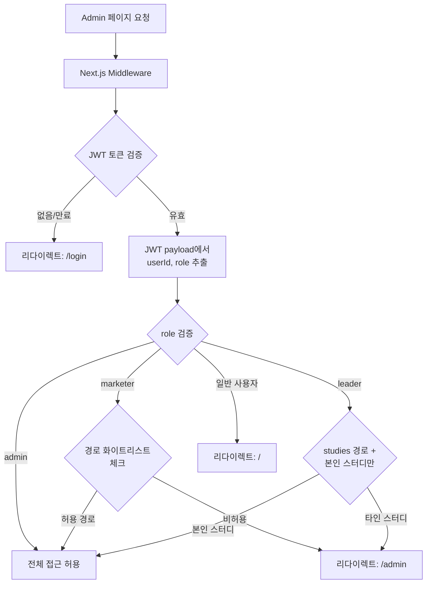

```typescript
// middleware.ts - JWT 기반 admin 접근 제어
import { jwtVerify } from 'jose';

export async function middleware(request: NextRequest) {
  const { pathname } = request.nextUrl;

  if (pathname.startsWith('/admin')) {
    // 1. JWT 토큰 추출 (httpOnly cookie)
    const token = request.cookies.get('auth-token')?.value;
    if (!token) {
      return NextResponse.redirect(new URL('/login', request.url));
    }

    // 2. JWT 검증 (ADMIN_JWT_SECRET으로 서명 검증)
    try {
      const { payload } = await jwtVerify(
        token,
        new TextEncoder().encode(process.env.JWT_SECRET)
      );

      const userRole = payload.role as string;

      // 3. admin 역할 체크
      if (!['admin', 'marketer', 'leader'].includes(userRole)) {
        return NextResponse.redirect(new URL('/', request.url));
      }

      // 4. 마케터 경로 제한
      if (userRole === 'marketer') {
        const allowedPaths = ['/admin/banners', '/admin/texts', '/admin/products'];
        const isAllowed = allowedPaths.some(p => pathname.startsWith(p));
        if (!isAllowed && pathname !== '/admin') {
          return NextResponse.redirect(new URL('/admin', request.url));
        }
      }

      // 5. 스터디장 경로 제한
      if (userRole === 'leader') {
        if (!pathname.startsWith('/admin/studies') && pathname !== '/admin') {
          return NextResponse.redirect(new URL('/admin', request.url));
        }
      }

      // 6. 요청 헤더에 사용자 정보 주입 (API Route에서 사용)
      const requestHeaders = new Headers(request.headers);
      requestHeaders.set('x-user-id', payload.sub as string);
      requestHeaders.set('x-user-role', userRole);

      return NextResponse.next({ headers: requestHeaders });

    } catch (error) {
      // JWT 검증 실패 (만료, 변조 등)
      return NextResponse.redirect(new URL('/login', request.url));
    }
  }
}
```

### 3.3 API Route 레벨 역할 검증

```typescript
// lib/admin-auth.ts - API Route용 인증 헬퍼
import { jwtVerify } from 'jose';

export type AdminRole = 'admin' | 'marketer' | 'leader';

interface AdminUser {
  id: string;
  role: AdminRole;
  email: string;
}

export async function requireAdmin(
  request: Request,
  allowedRoles: AdminRole[] = ['admin']
): Promise<AdminUser> {
  const token = request.headers.get('cookie')
    ?.split(';')
    .find(c => c.trim().startsWith('auth-token='))
    ?.split('=')[1];

  if (!token) {
    throw new Error('Unauthorized: No token');
  }

  const { payload } = await jwtVerify(
    token,
    new TextEncoder().encode(process.env.JWT_SECRET)
  );

  const role = payload.role as AdminRole;
  if (!allowedRoles.includes(role)) {
    throw new Error(`Forbidden: ${role} not in ${allowedRoles}`);
  }

  return {
    id: payload.sub as string,
    role,
    email: payload.email as string,
  };
}

// 사용 예시 (API Route)
// const admin = await requireAdmin(request, ['admin']);
// const adminOrMarketer = await requireAdmin(request, ['admin', 'marketer']);
```

### 3.4 SEO 차단

```typescript
// app/admin/layout.tsx
export const metadata = {
  robots: { index: false, follow: false },
};
```

모든 `/admin/*` 페이지에 `noindex, nofollow` 메타태그 적용. 어드민 URL이 검색엔진에 노출되지 않도록 한다.

---

## 4. 레이아웃 구조

### 4.1 어드민 레이아웃

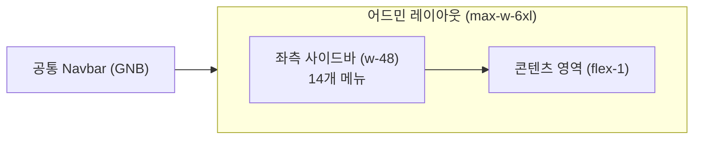

```typescript
// app/admin/layout.tsx 구조
<div className="mx-auto max-w-6xl px-4 py-8">
  <div className="flex gap-8">
    <aside className="w-48 shrink-0 hidden md:block">
      {/* 사이드바 메뉴 */}
    </aside>
    <div className="flex-1 min-w-0">
      {children}
    </div>
  </div>
</div>
```

- 최대 너비: `max-w-6xl`
- 사이드바: 고정 `w-48`, 모바일에서 hidden (모바일 어드민 접근은 제한적)
- 활성 메뉴: `bg-accent text-foreground font-medium`
- 비활성 메뉴: `text-muted-foreground hover:bg-muted`

---

## 5. 페이지별 CRUD 스펙 (14개)

---

### 5-01. 대시보드 `/admin`

**목적**: 운영자가 로그인 후 가장 먼저 보는 화면. 오늘의 핵심 지표와 자주 쓰는 작업에 즉시 접근.

#### 오늘의 요약 (StatCard x5)

| 지표 | 데이터 소스 (Drizzle ORM) | 전일 대비 표시 |
|------|--------------------------|-------------|
| 오늘 가입 | `db.select().from(users).where(gte(users.createdAt, today))` | +N / -N |
| 신규 게시글 | `db.select().from(posts).where(gte(posts.createdAt, today))` | +N / -N |
| 댓글 | `db.select().from(comments).where(gte(comments.createdAt, today))` | +N / -N |
| 스터디 신청 | `db.select().from(orders).where(and(gte(orders.createdAt, today), eq(orders.status, 'paid')))` | +N / -N |
| 매출 | `db.select({ total: sum(payments.amount) }).from(payments).where(gte(payments.createdAt, today))` | +N% |

- 통계 캐시: 1분 TTL (SWR or React Query)
- 각 카드 클릭 시 해당 관리 페이지로 이동
- **참고**: `users` 테이블은 자체 관리 (NextAuth.js 연동). Airtable에서 마이그레이션된 기수/스터디 데이터도 동일 RDS에서 조회.

#### 빠른 작업 (QuickAction 8개)

| 버튼 | 이동 경로 | 사용 빈도 |
|------|----------|----------|
| 배너 관리 | /admin/banners | 주 2~3회 |
| 게시글 관리 | /admin/posts | 매일 |
| 스터디 관리 | /admin/studies | 기수 전환 집중 |
| 상품/쿠폰 | /admin/products | 기수별 |
| 공지 작성 | /write?type=notice | 주 1~2회 |
| 텍스트 수정 | /admin/texts | 캠페인 시 |
| 기수 관리 | /admin/cohorts | 기수 전환 시 |
| 수료 판정 | /admin/completion | 기수 종료 후 |

#### 최근 활동 피드 (ActivityFeed)

- 최근 50건 시간순 표시
- 활동 유형: `post | study | signup | comment | admin | payment | moderation`
- 각 항목 클릭 시 해당 게시글/회원/스터디로 이동
- 유형별 필터 가능

#### 현재 기수 현황 요약

```
21기 현황 (3/16 ~ 4/13)
수강생 342명 | 결제 89,298,000원 | 과제 제출률 72%
```

- **데이터 소스**: 통합 RDS의 `cohorts`, `enrollments`, `payments`, `assignments` 테이블 조인 쿼리
- 기존 에어테이블에서 관리하던 기수 현황이 이제 단일 쿼리로 조회 가능

---

### 5-02. 기수 관리 `/admin/cohorts`

**목적**: 에어테이블에서 수동 관리하던 기수 데이터 완전 내재화. 에어테이블 마이그레이션 데이터 포함.

#### 목록 화면

| 컬럼 | 내용 |
|------|------|
| 기수 | N기 |
| 상태 | 준비 / 모집 / 진행 / 완료 (Badge) |
| 모집 기간 | YYYY-MM-DD ~ YYYY-MM-DD |
| 스터디 기간 | YYYY-MM-DD ~ YYYY-MM-DD |
| 스터디 수 | N개 |
| 수강생 수 | N명 |
| 매출 | 원N,NNN,NNN |
| 작업 | 상세보기 버튼 |

- 정렬: 기수 번호 역순 (최신 기수 기본)
- 상태 필터: 준비 / 모집 / 진행 / 완료
- **참고**: 1~20기 데이터는 에어테이블에서 마이그레이션된 데이터 (읽기 전용 표시)

#### 기수 생성 (Create)

| 필드 | 타입 | Validation | 자동 계산 |
|------|------|-----------|----------|
| 기수 번호 | Number (자동 증가) | 읽기 전용 | - |
| 스터디 시작일 | Date | 필수 | - |
| 스터디 종료일 | Date | 시작일 + 28일 자동 | 자동 |
| 모집 시작일 | Date | 시작일 - 14일 자동 | 자동 |
| 모집 마감일 | Date | 시작일 - 4일 자동 | 자동 |
| 슈퍼얼리버드 마감 | Date | 모집 시작 + 7일 자동 | 자동 |
| 얼리버드 마감 | Date | 모집 시작 + 10일 자동 | 자동 |

**핵심 자동 계산**: 스터디 시작일 1개 입력 → 전체 타임라인 자동 생성 (D-42~D+28).

#### 기수 상태 전환

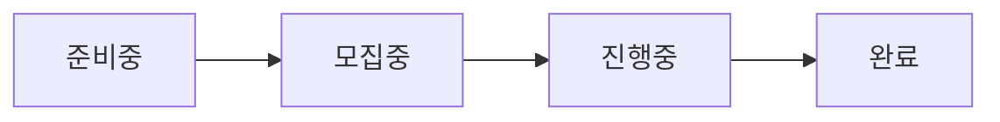

- 상태 변경 시 해당 기수의 모든 스터디 상태 연동 전환 (AlertDialog 확인 필수)
- 기수 상태 변경 이력 로그 기록

#### 기수 타임라인 뷰

| 마일스톤 | 시점 | 자동화 여부 |
|----------|------|-----------|
| 스터디장 모집 | D-42 | 수동 시작 |
| 사전판매 오픈 | D-21 | 상품 상태 → 판매중 자동 |
| 슈퍼얼리버드 마감 | D-14 | `getCurrentPrice()` 자동 전환 |
| 얼리버드 마감 | D-7 | `getCurrentPrice()` 자동 전환 |
| 모집 마감 | D-4 | 상품 상태 → 품절 자동 |
| 스터디 시작 | D-0 | 기수 상태 → 진행중 자동 |
| 스터디 종료 | D+28 | 기수 상태 → 완료 자동 |

---

### 5-03. 스터디 관리 `/admin/studies`

**목적**: 기수별 스터디 목록 관리 + 최종제출 원클릭 토글 (6단계 → 1단계).

#### 목록 화면

| 컬럼 | 내용 |
|------|------|
| 스터디명 | 텍스트 |
| 스터디장 | 이름 |
| 상태 | Select 드롭다운 (즉시 변경) |
| 참여자 | N/N명 |
| 최종제출 | Toggle 스위치 |
| 작업 | 상세 버튼 + 외부링크 아이콘 |

- 기수 필터: 드롭다운 (최신 기수 기본 선택)
- 상태 필터: 작성중 / 모집중 / 진행중 / 완료

#### 최종제출 토글 (P13 핵심 해결)

```
기존: 게시글 진입 → 수정 버튼 → 긴 스크롤 → 최종제출 탭 → 토글 → 저장 (6단계)
개선: 스터디 목록 행의 Toggle 스위치 1클릭 (1단계)
```

- Toggle 변경 즉시 서버 반영 (낙관적 업데이트)
- ON: primary 색상 표시, OFF: muted 표시

#### 상태 전환 규칙

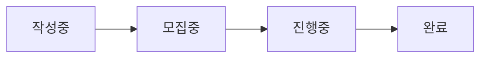

- 상태 변경 시 AlertDialog로 확인
- 역방향 전환은 운영자 권한만 가능

#### 스터디 상세 (수강생 현황)

| 컬럼 | 내용 |
|------|------|
| 이름 | 수강생 이름 |
| 1주차 | 과제 제출 여부 (체크/X) |
| 2주차 | 과제 제출 여부 |
| 3주차 | 과제 제출 여부 |
| 4주차 | 과제 제출 여부 |
| 출석 | N/4회 |
| 수료 예측 | 충족 여부 |

- **데이터 소스**: `enrollments` JOIN `assignments` JOIN `attendances` (통합 RDS)
- 기존 에어테이블 수식 기반 집계를 Drizzle ORM 쿼리로 대체

---

### 5-04. 회원 관리 `/admin/users`

**목적**: 회원 검색, 역할 관리, 수강 이력 조회.

#### 목록 화면

| 컬럼 | 내용 |
|------|------|
| 체크박스 | Bulk Action용 |
| 닉네임 | 텍스트 |
| 이메일 | 텍스트 |
| 가입일 | YYYY-MM-DD |
| 역할 | Badge (일반/스터디장/운영자) |
| 스터디 참여 | N회 |
| 게시글 수 | N개 |
| 작업 | 상세보기 |

- 검색: 이름, 이메일, 닉네임 (실시간 필터)
- 필터: 가입일 범위 / 역할 / 스터디 참여 여부
- 정렬: 가입일순 / 역할순
- **데이터 소스**: self-managed `users` 테이블 (NextAuth.js 연동)

#### 회원 상세 패널 (Slide-over or 별도 페이지)

| 섹션 | 내용 |
|------|------|
| 기본 정보 | 프로필 이미지, 이름, 이메일, 가입일, 마지막 로그인 |
| 역할 변경 | Select 드롭다운 (일반 / 스터디장 / 운영자) |
| 스터디 이력 | 참여한 기수, 스터디명, 수료 여부 |
| 작성 게시글 | 제목, 카테고리, 작성일, 투표수 |
| 결제 이력 | 주문번호, 스터디명, 금액, 결제일, 상태 |

#### 역할 부여 규칙

| 역할 | 부여 방법 | 스터디 지정 |
|------|----------|-----------|
| 일반 회원 | 회원가입 시 자동 | 불필요 |
| 스터디장 | 운영자 수동 부여 | 담당 스터디 필수 지정 |
| 운영자 | 운영자 권한 부여 | 불필요 |

#### Bulk Action (회원)

- 체크박스 선택 → 하단 액션바 노출
- 가능한 일괄 작업: 역할 변경, 내보내기 (CSV)

---

### 5-05. 게시글 관리 `/admin/posts`

**목적**: 게시글 모더레이션 + 카테고리 이동 (P15 해결).

#### 목록 화면

| 컬럼 | 내용 |
|------|------|
| 체크박스 | Bulk Action용 |
| 제목 | 링크 (클릭 시 상세로) |
| 카테고리 | Badge |
| 작성자 | 이름 |
| 작성일 | YYYY-MM-DD |
| 조회수 | N |
| 상태 | 공개 / 비공개 / 신고됨 |
| 작업 | 이동 / 수정 / 삭제 |

- 검색: 제목, 작성자, 본문 키워드
- 카테고리 필터: 전체 / AI활용법 / 프롬프트 / 자동화 / 개발 / 비즈니스 / AI뉴스
- 상태 필터: 공개 / 비공개 / 신고됨
- 콘텐츠 유형 필터: 피드 포스트 / 사례 게시글
- 정렬: 최신순 / 조회수순 / 댓글수순

#### 카테고리 이동 (P15 핵심 해결)

```
기존: 삭제 후 재게시 → 웹훅 2회 발동 → 중복 데이터
개선: category_id 업데이트만 (새 게시글 이벤트 미발동)
```

- 단일 이동: 행 내 "이동" 드롭다운 → 대상 카테고리 선택 → 즉시 반영
- 이동 시 댓글, 투표, 북마크 데이터 보존
- 이동 이력 로그 기록 (누가, 언제, 어디서 → 어디로)

#### Bulk Action (게시글)

- 체크박스 선택 → 하단 액션바 노출
- 가능한 일괄 작업: 카테고리 이동 / 공개·비공개 전환 / 삭제 (AlertDialog 필수)

---

### 5-06. 배너 관리 `/admin/banners`

**목적**: 홈 히어로 배너 및 프로모션 배너 관리. 드래그앤드롭 순서 변경.

#### 목록 화면 (탭 구조)

탭: 히어로 / 피드 / 하단

각 탭별 배너 목록:

| 요소 | 내용 |
|------|------|
| 드래그 핸들 | GripVertical 아이콘 (드래그앤드롭) |
| 순서 번호 | 1, 2, 3... |
| 썸네일 | 80x48 미리보기 |
| 제목 | 배너명 |
| 링크 | URL |
| 활성 Toggle | ON/OFF |
| 수정 버튼 | 편집 모달 |

#### 배너 CRUD

| 필드 | 타입 | 비고 |
|------|------|------|
| 제목 | Text | 관리용 (프론트 미노출 가능) |
| 이미지 | File upload (S3 + CloudFront) | 권장 비율 16:6 |
| 링크 URL | URL | 내부/외부 링크 |
| 노출 시작일 | Date | 비워두면 즉시 |
| 노출 종료일 | Date | 비워두면 무기한 |
| 활성 여부 | Toggle | 기간과 무관하게 즉시 제어 |

- 드래그앤드롭 순서 변경: 서버에 `order` 필드 저장
- 미리보기: 실제 홈 배너 영역에서의 모습 확인 (P14 해결)
- 노출 기간 설정: 시작일/종료일 지정 → 자동 노출/숨김

#### 배너 위치별 스펙

| 위치 | 경로 | 용도 |
|------|------|------|
| 히어로 (홈 상단) | hero | 기수 모집 공고, 주요 이벤트 |
| 피드 인라인 | feed | 탐색 피드 중간 프로모션 |
| 하단 CTA | bottom | 뉴스레터 구독, 스터디 CTA |

---

### 5-07. 상품/쿠폰 관리 `/admin/products`

**목적**: Retool 의존 제거 (P16). 상품 CRUD + 가격 자동 전환 설정 + 쿠폰 관리.

#### 상품 목록

| 컬럼 | 내용 |
|------|------|
| 상품명 | 기수 + 스터디 패키지명 |
| 기수 | N기 |
| 현재 가격 | 자동 계산된 현재 적용가 + 단계명 (슈퍼얼리버드 등) |
| 정가 | 일반가 |
| 상태 | 판매중 / 품절 / 숨김 |
| 작업 | 수정 / 상태 변경 |

#### 상품 생성/수정 필드

| 필드 | 타입 | 비고 |
|------|------|------|
| 상품명 | Text | 예: "21기 AI 스터디" |
| 연결 기수 | Select | cohorts 테이블 참조 |
| 슈퍼얼리버드가 | Number | 원 단위 |
| 슈퍼얼리버드 마감일 | Date | 기수 생성 시 자동 계산 |
| 얼리버드가 | Number | 원 단위 |
| 얼리버드 마감일 | Date | 기수 생성 시 자동 계산 |
| 일반가 | Number | 원 단위 |
| 모집 마감일 | Date | 기수 생성 시 자동 계산 |
| 정원 | Number | 기수 전체 정원 |

**가격 자동 전환**: `getCurrentPrice(productId)` TypeScript 함수가 조회 시점에 마감일 기반으로 계산. Cron 불필요.

#### 쿠폰 관리 탭

| 컬럼 | 내용 |
|------|------|
| 쿠폰 코드 | 자동 생성 or 수동 입력 |
| 유형 | 스터디장 지인초대 / 임직원 / 프로모션 |
| 할인 방식 | 정액(-N원) / 정률(-N%) |
| 할인 금액 | N원 or N% |
| 사용 한도 | N회 (0 = 무제한) |
| 사용 횟수 | N/N 실시간 표시 |
| 유효 기간 | YYYY-MM-DD ~ YYYY-MM-DD |
| 상태 | 활성 / 만료 / 비활성 |

#### 쿠폰 생성 필드

| 필드 | 타입 | 비고 |
|------|------|------|
| 쿠폰 코드 | Text | "자동 생성" 버튼 |
| 쿠폰 유형 | Select | 지인초대 / 임직원 / 프로모션 |
| 할인 방식 | Radio | 정액 / 정률 |
| 할인 금액/비율 | Number | 원 or % |
| 적용 대상 상품 | Multi-select | 특정 상품 or 전체 |
| 사용 한도 | Number | 0 = 무제한 |
| 유효 기간 | DateRange | 시작일~종료일 |

---

### 5-08. 결제/주문 관리 `/admin/payments`

**목적**: 결제 현황 조회 + 환불 처리 (Retool 대체 일부).

#### 목록 화면

| 컬럼 | 내용 |
|------|------|
| 주문번호 | ORD-YYYYMMDD-NNNN |
| 주문자 | 이름 |
| 스터디명 | 기수+스터디 |
| 결제 금액 | 원N,NNN |
| 쿠폰 | 코드 (있는 경우) |
| 결제일 | YYYY-MM-DD HH:mm |
| 상태 | 완료 / 취소 / 환불 / 가상계좌 대기 |

- 검색: 주문자 이름, 이메일, 주문번호
- 필터: 기수별 / 스터디별 / 결제 상태 / 기간
- 정렬: 최신순 / 금액순
- 상단 요약: 기수별 총 매출, 환불 건수/금액

#### 주문 상세

| 정보 | 내용 |
|------|------|
| 주문 기본 | 주문번호, 주문일, 결제 수단 |
| 상품 정보 | 스터디명, 기수, 적용 가격 단계 |
| 쿠폰 | 사용 쿠폰 코드, 할인 금액 |
| 금액 내역 | 정가 / 할인 / 최종 결제액 |
| 환불 정보 | 환불 사유, 금액, 처리 일시 (환불 건만) |

#### 환불 처리 플로우

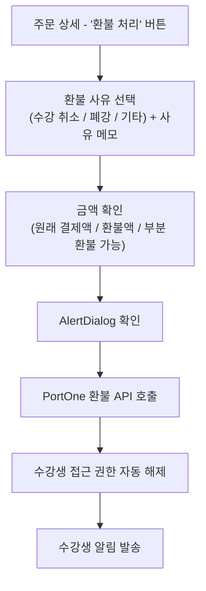

#### 특수 결제 처리

| 케이스 | 처리 |
|--------|------|
| 0원 결제 (임직원/스터디장) | `impUid = 'X-{uuid}'` 패턴 표시, PG 미사용 표시 |
| 가상계좌 대기 | 만료일 타이머 표시, 입금 확인 후 자동 등록 |

---

### 5-09. 수료/환급 관리 `/admin/completion`

**목적**: 에어테이블 수동 집계 제거. 수료 자동 판정 + 수료증 일괄 발급 + 환급 처리.

> 프로토타입: `gpters-renewal/app/admin/completion/page.tsx` 구현 완료

#### 수료 기준 설정 (기수별)

| 필드 | 기본값 | 설명 |
|------|--------|------|
| 최소 출석 | 3회 (4회 중) | Zoom 세션 참여 |
| 최소 과제 | 3주차 (4주 중) | 사례 게시글 제출 |
| 우수활동자 조건 | 과제 4주 + 출석 4회 | 우수 마크 |
| 환급 대상 조건 | 사례글 2회 이상 작성 | 버디 100% 환급 (100원 제외) |

- **참고**: 기존 에어테이블의 수료 기준 수식을 DB 기반 설정으로 마이그레이션. 기수별 커스텀 기준 저장 가능.

#### 수료 판정 실행

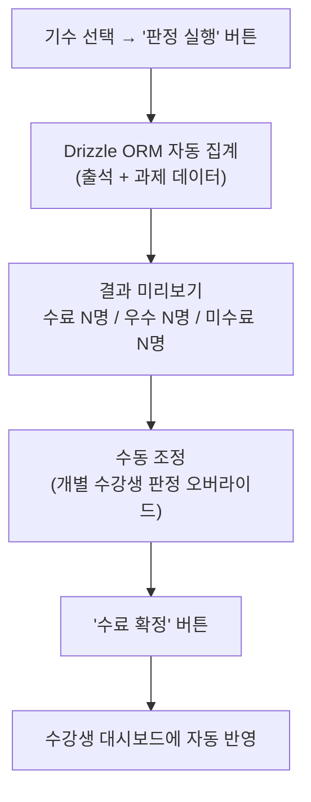

#### 수료 현황 테이블

| 컬럼 | 내용 |
|------|------|
| 체크박스 | Bulk Action용 |
| 이름 | 수강생 이름 |
| 출석 | N/4 |
| 과제 | N/4 |
| 판정 | Badge (수료 / 우수 / 미수료) |
| 수료증 | 발급완료 / 미발급 |
| 환급 | 미처리 / 처리완료 / 해당없음 |

#### 수료증 일괄 발급 (Bulk)

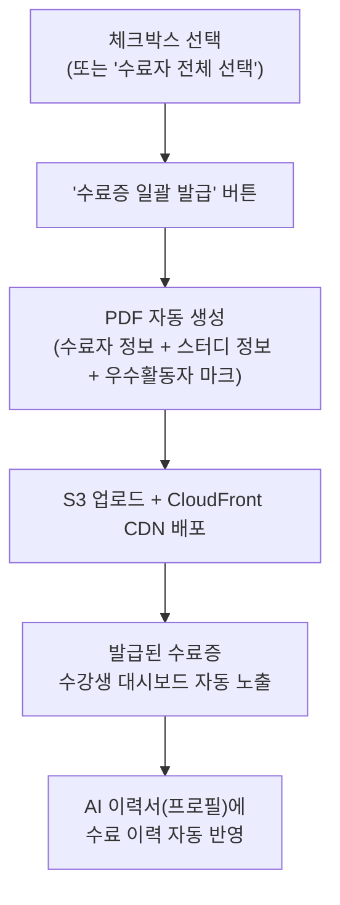

#### 환급 대상자 일괄 추출 (Bulk)

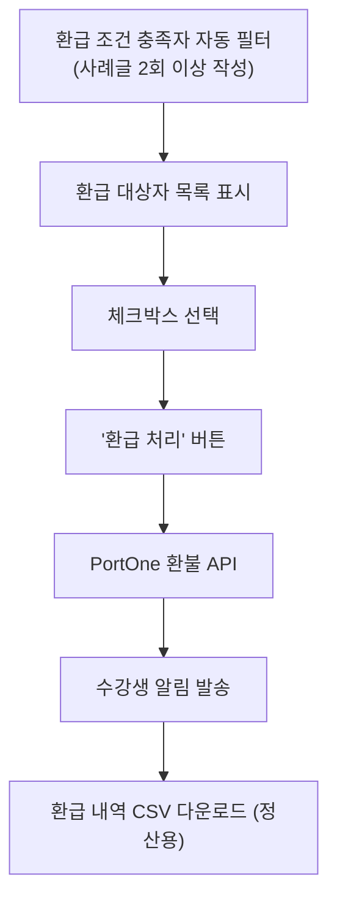

---

### 5-10. 공지사항 관리 `/admin/notices`

**목적**: 사이트 내 공지사항 CRUD 관리.

#### 목록 화면

| 컬럼 | 내용 |
|------|------|
| 체크박스 | Bulk Action용 |
| 제목 | 텍스트 (클릭 시 상세) |
| 작성자 | 관리자 이름 |
| 공개 대상 | 전체 / 수강생 / 특정 기수 |
| 작성일 | YYYY-MM-DD |
| 상태 | 게시 / 임시저장 |
| 작업 | 수정 / 삭제 |

- 정렬: 최신순 (고정 상단 공지 별도)
- 상단 고정 여부 Toggle

#### 공지 작성 필드

| 필드 | 타입 | 비고 |
|------|------|------|
| 제목 | Text | 필수 |
| 내용 | RichText | Markdown 지원 |
| 공개 대상 | Select | 전체 / 수강생 / N기 |
| 상단 고정 | Toggle | |
| 발행 일시 | DateTime | 예약 발행 가능 |

---

### 5-11. 신고/모더레이션 `/admin/reports` (또는 `/admin/moderation`)

**목적**: 커뮤니티 건전성 유지. 신고 큐 처리.

#### 신고 큐 목록

| 컬럼 | 내용 |
|------|------|
| 신고 대상 | 게시글/댓글/사용자 (링크) |
| 신고 사유 | 스팸 / 욕설 / 허위정보 / 기타 |
| 신고 건수 | N건 (3건 이상 최상단) |
| 신고 일시 | YYYY-MM-DD HH:mm |
| 상태 | 미처리 / 처리중 / 해결됨 / 기각 |
| 담당자 | 처리 관리자 |

- 상태 필터: 미처리 우선 표시
- 동일 대상 신고 3건 이상: 최상단 + 강조 표시

#### 처리 액션

| 액션 | 설명 |
|------|------|
| 내용 확인 | 신고된 게시글/댓글/프로필 미리보기 |
| 비공개 | 해당 콘텐츠 즉시 비공개 처리 |
| 삭제 | 영구 삭제 (AlertDialog 확인) |
| 사용자 경고 | 경고 DM 발송 |
| 이용 제한 | 특정 기간 게시글 작성 제한 |
| 기각 | 신고 무효 처리 (사유 메모) |

#### Bulk Action (신고)

- 일괄 기각: 스팸성 중복 신고 일괄 처리

---

### 5-12. 뱃지 관리 `/admin/badges`

**목적**: 수강생 뱃지(업적) CRUD 관리.

#### 목록 화면

| 컬럼 | 내용 |
|------|------|
| 뱃지 이미지 | 아이콘 미리보기 |
| 뱃지명 | 텍스트 |
| 설명 | 취득 조건 |
| 취득 조건 | 자동 (조건 기반) / 수동 (운영자 부여) |
| 취득자 수 | N명 |
| 상태 | 활성 / 비활성 |

#### 뱃지 생성 필드

| 필드 | 타입 | 비고 |
|------|------|------|
| 뱃지명 | Text | 예: "AI 탐험가" |
| 설명 | Text | 취득 조건 설명 |
| 이미지 | File upload (S3) | SVG/PNG |
| 취득 방식 | Radio | 자동 / 수동 |
| 자동 취득 조건 | Select | 수료 / 게시글 N개 / 연속 출석 N회 |

---

### 5-13. 세션 관리 `/admin/sessions`

**목적**: AI토크, Zoom 발표 세션 관리 (구글 캘린더 대체 일부).

#### 목록 화면

탭: 리스트 뷰 / 캘린더 뷰

리스트 컬럼:

| 컬럼 | 내용 |
|------|------|
| 날짜/시간 | YYYY-MM-DD HH:mm |
| 세션명 | 텍스트 |
| 유형 | AI토크 / Zoom 발표 / OT / 네트워킹 |
| 스터디 | 해당 스터디명 |
| Zoom URL | 링크 (클릭 복사) |
| 기수 | N기 |
| 작업 | 수정 / 삭제 |

#### 세션 생성 필드

| 필드 | 타입 | 비고 |
|------|------|------|
| 세션명 | Text | |
| 유형 | Select | AI토크 / Zoom발표 / OT / 네트워킹 |
| 날짜/시간 | DateTime | |
| Zoom URL | URL | |
| 담당 스터디 | Select | studies 참조 |
| 반복 패턴 | Select | 없음 / 매주 N요일 (4회) |

- 반복 세션: 4주분 일괄 생성
- 세션이 수강생 대시보드 "이번 주 할 일"에 자동 노출
- Zoom URL 변경 즉시 반영

---

### 5-14. 분류 관리 `/admin/taxonomy`

**목적**: 카테고리 및 태그 관리.

#### 카테고리 관리

| 컬럼 | 내용 |
|------|------|
| 드래그 핸들 | 노출 순서 변경 |
| 카테고리명 | 텍스트 |
| 게시글 수 | N개 |
| 상태 | 활성 / 숨김 |
| 작업 | 수정 / 숨김 |

6개 대분류: AI활용법 / 프롬프트 / 자동화노코드 / 개발코딩 / 비즈니스마케팅 / AI뉴스

#### 태그 관리

| 컬럼 | 내용 |
|------|------|
| 태그명 | 텍스트 |
| 사용 빈도 | N회 |
| 생성일 | YYYY-MM-DD |
| 작업 | 병합 / 삭제 |

- 태그 병합: 유사 태그 통합 (#chatgpt + #ChatGPT → #ChatGPT)
- 추천 태그 설정: 글쓰기 자동 완성에 노출

---

### 5-15 (추가). 리포트 `/admin/reports`

**목적**: 운영 데이터 시각화 리포트.

#### 리포트 항목

| 리포트 | 기간 | 내용 |
|--------|------|------|
| 기수별 매출 | 기수 선택 | 총 매출, 환불, 순매출, 가격 단계별 비율 |
| 회원 현황 | 월별 | 신규 가입, 누적, 역할별 분포 |
| 게시글 활동 | 주별/월별 | 작성수, 카테고리별, 투표 통계 |
| 수료/환급 | 기수별 | 수료율, 환급율, 우수활동자 비율 |
| 과제 제출률 | 기수/주차별 | 주차별 제출률 추이 |

- **데이터 소스**: 모든 리포트가 통합 RDS 단일 소스에서 Drizzle ORM 쿼리로 생성 (에어테이블/외부 도구 참조 불필요)

---

## 6. 핵심 어드민 기능 상세

### 6.1 기수 관리: 날짜 입력 → 전체 일정 자동 계산

**입력**: 스터디 시작일 1개

**자동 계산 출력**:

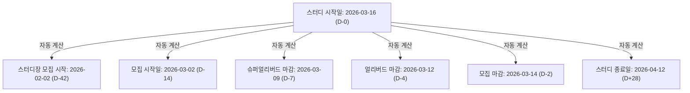

**애플리케이션 로직**: TypeScript (Drizzle ORM)

```typescript
// lib/admin/cohort-schedule.ts
import { addDays, subDays } from 'date-fns';

export function calculateCohortSchedule(startDate: Date) {
  return {
    studyStart: startDate,
    studyEnd: addDays(startDate, 28),
    recruitmentStart: subDays(startDate, 14),
    recruitmentEnd: subDays(startDate, 4),
    superEarlyDeadline: subDays(startDate, 7),
    earlyDeadline: subDays(startDate, 4),
    leaderRecruitStart: subDays(startDate, 42),
  };
}

// API Route에서 사용
// POST /api/admin/cohorts
export async function POST(request: Request) {
  const admin = await requireAdmin(request, ['admin']);
  const { studyStartDate } = await request.json();

  const schedule = calculateCohortSchedule(new Date(studyStartDate));

  const [cohort] = await db.insert(cohorts).values({
    number: await getNextCohortNumber(),
    studyStartDate: schedule.studyStart,
    studyEndDate: schedule.studyEnd,
    recruitmentStartDate: schedule.recruitmentStart,
    recruitmentEndDate: schedule.recruitmentEnd,
    superEarlyDeadline: schedule.superEarlyDeadline,
    earlyDeadline: schedule.earlyDeadline,
    leaderRecruitStartDate: schedule.leaderRecruitStart,
    status: 'preparing',
    createdBy: admin.id,
  }).returning();

  return NextResponse.json(cohort);
}
```

### 6.2 최종제출 토글: 6단계 → 1단계

| 항목 | 기존 (Bettermode) | 개선 (어드민) |
|------|-----------------|-------------|
| 접근 경로 | 관리 → 디자인 스튜디오 → ... → 게시물 | `/admin/studies` 목록 |
| 조작 | 스크롤 → 탭 찾기 → 토글 → 저장 | Toggle 스위치 클릭 1회 |
| 단계 수 | 6단계 | 1단계 |
| 저장 | 수동 저장 필요 | 즉시 서버 반영 |

**구현**: `PATCH /api/admin/studies/{id}/submit-toggle`

### 6.3 배너 관리: 드래그앤드롭 순서

**라이브러리**: `@dnd-kit/core` + `@dnd-kit/sortable`

```tsx
// 핵심 구현 패턴
<SortableContext items={banners.map(b => b.id)}>
  {banners.map(banner => (
    <SortableBannerRow key={banner.id} banner={banner} />
  ))}
</SortableContext>
```

- 드래그 완료 시 `PATCH /api/admin/banners/reorder` 호출 (전체 순서 배열 전송)
- 낙관적 업데이트: UI 즉시 반영 후 서버 동기화

### 6.4 가격 관리: 슈퍼얼리버드/얼리버드/일반가 자동 전환

```typescript
// lib/admin/pricing.ts - 애플리케이션 레벨 가격 계산 (Cron 불필요)
import { db } from '@/lib/db';
import { products } from '@/lib/db/schema';
import { eq } from 'drizzle-orm';

export async function getCurrentPrice(productId: string) {
  const product = await db.query.products.findFirst({
    where: eq(products.id, productId),
  });

  if (!product) throw new Error('Product not found');

  const now = new Date();

  if (now < product.superEarlyDeadline) {
    return { price: product.superEarlyPrice, stage: 'super_early' };
  } else if (now < product.earlyDeadline) {
    return { price: product.earlyPrice, stage: 'early' };
  } else {
    return { price: product.regularPrice, stage: 'regular' };
  }
}
```

어드민에서 현재 적용 중인 가격 단계를 Badge로 표시:
- `슈퍼얼리버드` (primary 색상)
- `얼리버드` (secondary 색상)
- `일반가` (muted 색상)

### 6.5 수강생 현황: 기수별/주차별 과제 제출 대시보드

```
21기 바이브코딩 - 수강생 현황 (18명)

이름     1주차  2주차  3주차  4주차  출석   수료예측
홍길동   v      v      x      -      2/2    위험
김철수   v      v      v      -      2/2    수료 예상
이영희   v      v      v      -      2/2    수료 예상
박민수   v      x      x      -      1/2    위험
...
```

- 미제출자: 빨간 배경 강조
- 수료 예측: 현재 기준으로 최종 수료 가능 여부 자동 계산
- **데이터 소스**: `enrollments` + `assignments` + `attendances` 테이블 조인 (Drizzle ORM)
- 기존 에어테이블 수동 집계를 실시간 자동 대시보드로 대체

### 6.6 환급 대상자 일괄 추출

**조건**: 사례글 2회 이상 작성 (버디 환급, 100원 제외 전액 환급)

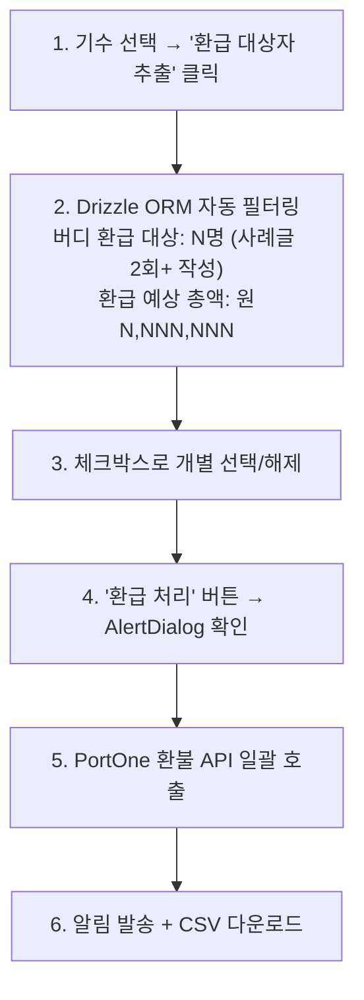

### 6.7 수료증 일괄 발급

**수료 조건**: 출석 N회 이상 + 과제 N주차 이상 (기수별 설정)

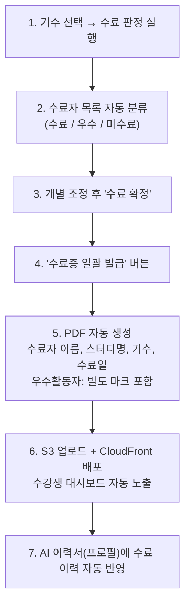

---

## 7. Bulk Action 패턴

### 7.1 공통 UX 패턴

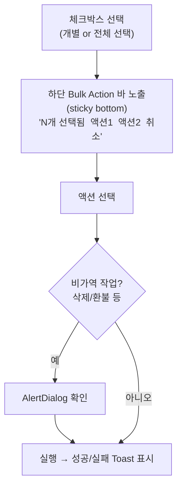

**컴포넌트**: `components/admin/bulk-action-bar.tsx` (프로토타입 존재)

### 7.2 Bulk Action 적용 페이지별 액션

| 페이지 | 가능한 Bulk Action |
|--------|------------------|
| 회원 관리 (`/admin/users`) | 역할 변경, CSV 내보내기 |
| 게시글 관리 (`/admin/posts`) | 카테고리 이동, 공개/비공개, 삭제 |
| 수료/환급 (`/admin/completion`) | 수료증 일괄 발급, 환급 처리 |
| 신고 관리 (`/admin/reports`) | 일괄 기각, 일괄 비공개 |

### 7.3 삭제 확인 패턴 (공통)

비가역적 작업(삭제, 환불, 권한 해제)은 반드시 AlertDialog 사용:

```tsx
<AlertDialog>
  <AlertDialogContent>
    <AlertDialogHeader>
      <AlertDialogTitle>N개 게시글을 삭제하시겠어요?</AlertDialogTitle>
      <AlertDialogDescription>
        삭제된 게시글은 복구할 수 없습니다. 댓글과 투표도 함께 삭제됩니다.
      </AlertDialogDescription>
    </AlertDialogHeader>
    <AlertDialogFooter>
      <AlertDialogCancel>취소</AlertDialogCancel>
      <AlertDialogAction className="bg-destructive">삭제</AlertDialogAction>
    </AlertDialogFooter>
  </AlertDialogContent>
</AlertDialog>
```

---

## 8. 어드민 전용 API Routes 목록

모든 어드민 API는 `/api/admin/` 접두사 사용. JWT 기반 미들웨어에서 admin 역할 검증. Drizzle ORM으로 RDS PostgreSQL 접근.

### 8.1 인증 흐름

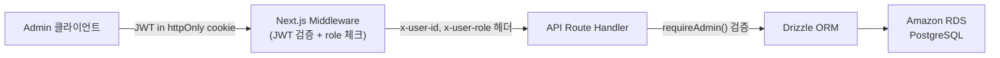

### 8.2 대시보드

| Method | Path | Description | Auth |
|--------|------|-------------|------|
| GET | /api/admin/dashboard/stats | 오늘의 요약 통계 | admin |
| GET | /api/admin/dashboard/activities | 최근 활동 피드 | admin |
| GET | /api/admin/dashboard/cohort-summary | 현재 기수 현황 요약 | admin |

### 8.3 기수 관리

| Method | Path | Description | Auth |
|--------|------|-------------|------|
| GET | /api/admin/cohorts | 기수 목록 (마이그레이션 데이터 포함) | admin |
| POST | /api/admin/cohorts | 기수 생성 (날짜 자동 계산) | admin |
| PATCH | /api/admin/cohorts/{id} | 기수 수정 / 상태 변경 | admin |
| DELETE | /api/admin/cohorts/{id} | 기수 삭제 (준비중만) | admin |
| GET | /api/admin/cohorts/{id}/schedule | 기수 타임라인 | admin |
| GET | /api/admin/cohorts/{id}/stats | 기수 통계 (수강생, 매출, 제출률) | admin |

### 8.4 스터디 관리

| Method | Path | Description | Auth |
|--------|------|-------------|------|
| GET | /api/admin/studies | 스터디 목록 (기수 필터) | admin, leader |
| POST | /api/admin/studies | 스터디 생성 | admin |
| PATCH | /api/admin/studies/{id} | 스터디 수정 | admin, leader |
| PATCH | /api/admin/studies/{id}/submit-toggle | 최종제출 토글 | admin, leader |
| PATCH | /api/admin/studies/{id}/status | 상태 변경 | admin |
| GET | /api/admin/studies/{id}/members | 수강생 현황 (과제+출석) | admin, leader |
| POST | /api/admin/studies/{id}/members | 수강생 수동 추가 | admin |

### 8.5 회원 관리

| Method | Path | Description | Auth |
|--------|------|-------------|------|
| GET | /api/admin/users | 회원 목록 (검색/필터) | admin |
| GET | /api/admin/users/{id} | 회원 상세 | admin |
| PATCH | /api/admin/users/{id}/role | 역할 변경 | admin |
| GET | /api/admin/users/{id}/enrollments | 수강 이력 | admin |
| GET | /api/admin/users/{id}/posts | 작성 게시글 | admin |
| POST | /api/admin/users/export | 회원 CSV 내보내기 | admin |

### 8.6 게시글 관리

| Method | Path | Description | Auth |
|--------|------|-------------|------|
| GET | /api/admin/posts | 게시글 목록 (검색/필터) | admin |
| PATCH | /api/admin/posts/{id} | 게시글 수정 | admin |
| PATCH | /api/admin/posts/{id}/category | 카테고리 이동 (웹훅 미발동) | admin |
| PATCH | /api/admin/posts/{id}/visibility | 공개/비공개 | admin |
| DELETE | /api/admin/posts/{id} | 게시글 삭제 | admin |
| POST | /api/admin/posts/bulk-move | 게시글 일괄 이동 | admin |
| POST | /api/admin/posts/bulk-delete | 게시글 일괄 삭제 | admin |

### 8.7 배너 관리

| Method | Path | Description | Auth |
|--------|------|-------------|------|
| GET | /api/admin/banners | 배너 목록 (위치별) | admin, marketer |
| POST | /api/admin/banners | 배너 생성 | admin, marketer |
| PATCH | /api/admin/banners/{id} | 배너 수정 | admin, marketer |
| PATCH | /api/admin/banners/{id}/toggle | 활성/비활성 | admin, marketer |
| DELETE | /api/admin/banners/{id} | 배너 삭제 | admin |
| POST | /api/admin/banners/reorder | 순서 변경 (배열) | admin, marketer |

### 8.8 상품/쿠폰 관리

| Method | Path | Description | Auth |
|--------|------|-------------|------|
| GET | /api/admin/products | 상품 목록 | admin, marketer |
| POST | /api/admin/products | 상품 생성 | admin |
| PATCH | /api/admin/products/{id} | 상품 수정 | admin |
| GET | /api/admin/products/{id}/price | 현재 적용 가격 | admin, marketer |
| GET | /api/admin/coupons | 쿠폰 목록 | admin, marketer |
| POST | /api/admin/coupons | 쿠폰 생성 | admin |
| PATCH | /api/admin/coupons/{id} | 쿠폰 수정 | admin |
| DELETE | /api/admin/coupons/{id} | 쿠폰 삭제 (미사용만) | admin |

### 8.9 결제/주문 관리

| Method | Path | Description | Auth |
|--------|------|-------------|------|
| GET | /api/admin/payments | 결제 목록 (필터) | admin |
| GET | /api/admin/payments/{id} | 주문 상세 | admin |
| POST | /api/admin/payments/{id}/refund | 환불 처리 | admin |
| GET | /api/admin/payments/summary | 기수별 매출 요약 | admin |

### 8.10 수료/환급 관리

| Method | Path | Description | Auth |
|--------|------|-------------|------|
| GET | /api/admin/completion/criteria | 수료 기준 조회 | admin |
| POST | /api/admin/completion/criteria | 수료 기준 설정 | admin |
| POST | /api/admin/completion/judge | 수료 판정 실행 | admin |
| GET | /api/admin/completion/preview | 판정 결과 미리보기 | admin |
| POST | /api/admin/completion/confirm | 수료 확정 | admin |
| POST | /api/admin/completion/certificates | 수료증 일괄 발급 (S3 업로드) | admin |
| GET | /api/admin/completion/refund-targets | 환급 대상자 추출 | admin |
| POST | /api/admin/completion/bulk-refund | 환급 일괄 처리 | admin |
| GET | /api/admin/completion/refund-export | 환급 내역 CSV | admin |

### 8.11 신고/모더레이션

| Method | Path | Description | Auth |
|--------|------|-------------|------|
| GET | /api/admin/reports | 신고 목록 (상태 필터) | admin |
| PATCH | /api/admin/reports/{id}/status | 신고 상태 변경 | admin |
| POST | /api/admin/reports/{id}/action | 제재 처리 | admin |
| POST | /api/admin/reports/bulk-dismiss | 일괄 기각 | admin |

### 8.12 텍스트/문구 관리

| Method | Path | Description | Auth |
|--------|------|-------------|------|
| GET | /api/admin/texts | 텍스트 영역 목록 | admin, marketer |
| PATCH | /api/admin/texts/{key} | 텍스트 수정 | admin, marketer |
| GET | /api/admin/texts/{key}/history | 변경 이력 | admin |
| POST | /api/admin/texts/{key}/restore | 이전 버전 복원 | admin |

---

## 9. 운영 효율 개선 매트릭스

### 9.1 에어테이블 대체 범위 (완전 내재화)

| 기능 | 현재 (에어테이블 수작업) | 리뉴얼 (어드민 자동화) | 절감 효과 |
|------|----------------------|---------------------|----------|
| 기수 날짜 관리 | 날짜 수동 입력, 계산 | 시작일 1개 → 전체 자동 | 작업 90% 감소 |
| 스터디 상태 관리 | 에어테이블 레코드 수동 수정 | 어드민 Toggle 1클릭 | 6단계→1단계 |
| 과제 제출 집계 | 매주 에어테이블 수동 집계 | 실시간 자동 대시보드 | 주간 2시간 절감 |
| 수료 대상자 추출 | 수동 필터링 + 검토 | 자동 필터링 + 오버라이드 | 기수당 4시간 절감 |
| 환급 대상자 추출 | 조건 수동 확인 후 추출 | 조건 기반 자동 추출 | 기수당 2시간 절감 |
| 스터디장/수강생 배정 | 에어테이블 수동 매칭 | 어드민 UI에서 직접 관리 | 기수당 3시간 절감 |
| 수료증 발급 | 에어테이블 데이터 추출 → 수동 PDF | 자동 판정 → 일괄 PDF → S3 배포 | 기수당 6시간 절감 |
| 기수별 매출 집계 | 에어테이블 + 스프레드시트 수동 집계 | 통합 RDS 실시간 쿼리 | 기수당 1시간 절감 |

### 9.2 Bettermode/외부 도구 대체 범위

| 기능 | 현재 (외부 도구) | 리뉴얼 (통합 어드민) | 절감 효과 |
|------|----------------|-------------------|----------|
| 배너 교체 | BM 9단계 네비게이션 | 어드민 Toggle 1클릭 | 9단계→1단계 |
| 게시글 카테고리 이동 | 삭제/재게시 → 웹훅 오류 | 카테고리 이동 1클릭 | 오류 제거 |
| 상품/쿠폰 관리 | Retool 별도 접속 | 어드민 통합 | 도구 전환 제거 |
| 텍스트 문구 수정 | 개발자 요청 필요 | 마케터 직접 수정 | 개발 의존도 제거 |
| 수료증 발급 | PDF 수동 생성 | 자동 생성 + 일괄 발급 | 기수당 6시간 절감 |

### 9.3 전체 운영 효율 목표

| 지표 | 현재 | 목표 | 측정 방법 |
|------|------|------|----------|
| 외부 도구 접근 | 월 수십 건 | 0건/월 | 운영 로그 |
| 기수 준비 시간 | 약 40시간 | 12시간 이하 | 운영 시간 측정 |
| 배너 교체 소요 시간 | 10~15분 | 1분 이하 | 직접 측정 |
| 수료/환급 처리 시간 | 기수당 8시간 | 기수당 1시간 | 직접 측정 |
| 게시글 카테고리 오류 | 월 N건 (웹훅 중복) | 0건 | 에러 로그 |
| 에어테이블 의존 | 필수 (기수/스터디 관리) | 0 (완전 내재화) | 접근 로그 |

---

## Version History

| Version | Date | Changes | Author |
|---------|------|---------|--------|
| 1.0 | 2026-03-06 | 초기 작성 - 14개 어드민 페이지 전체 설계 | Admin Designer Agent |
| 1.1 | 2026-03-07 | Supabase → AWS 자체 구축 전환, 에어테이블 통합 내재화 반영 | Admin Designer Agent |
