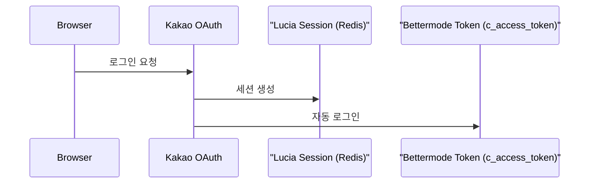
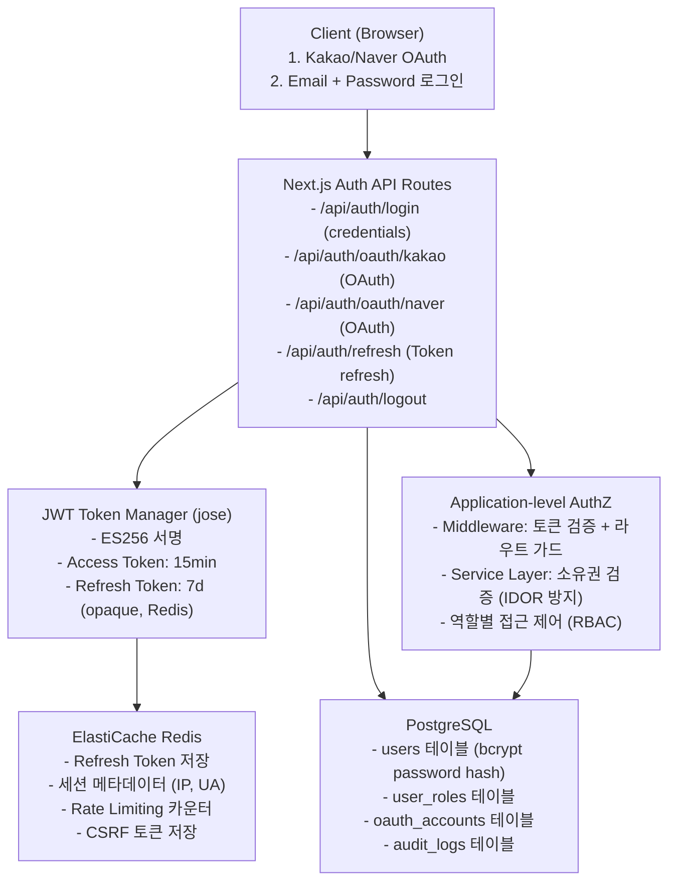
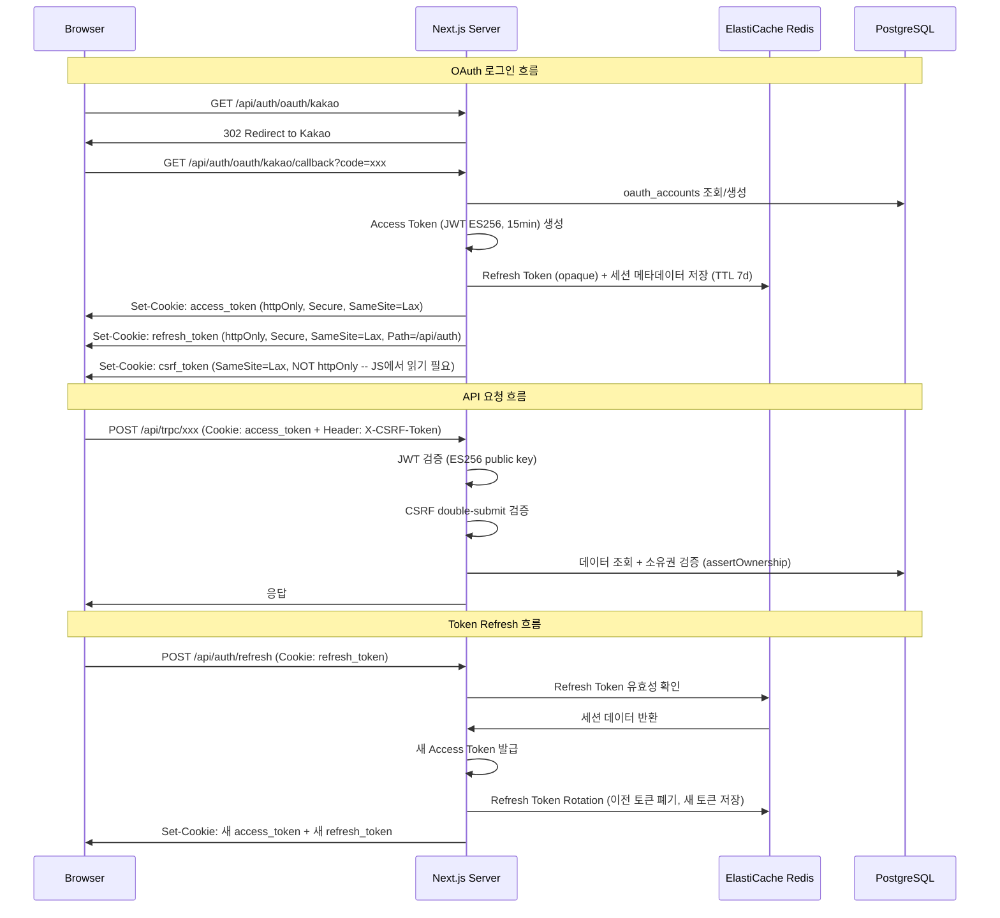
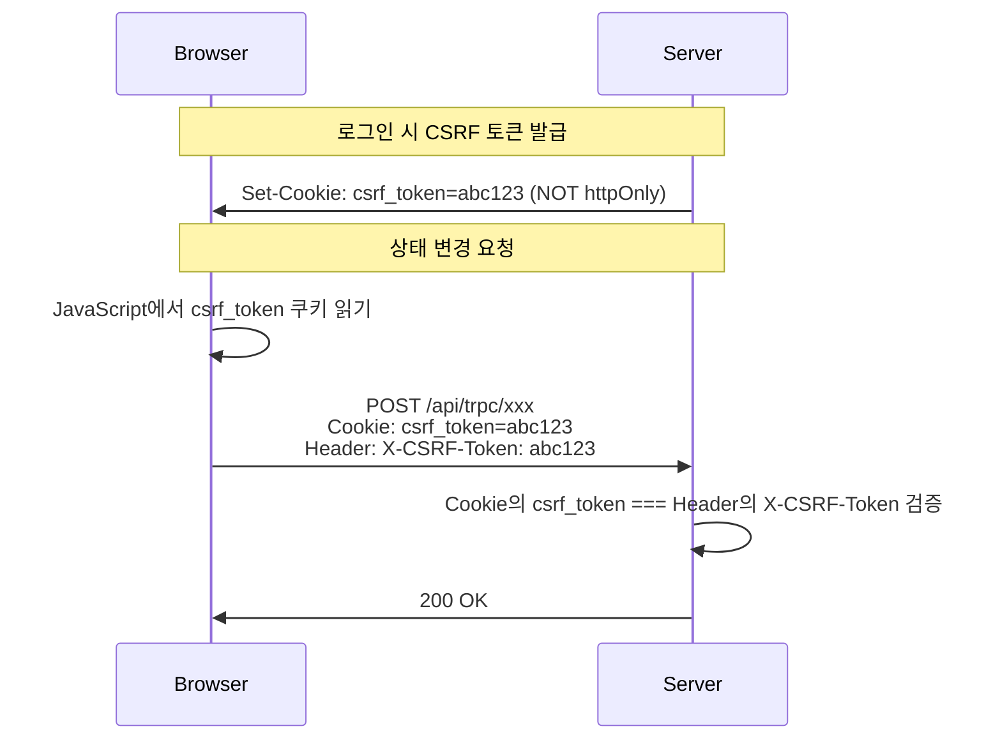

# GPTers Portal Renewal - Security Architecture Review

> Security Architect 검토 | 2026-03-05 (rev. 2026-03-07 Self-Build Auth 전환)
> 대상: gpters-study (Legacy) + gpters-portal (Renewal)

---

## 1. Executive Summary

GPTers 포털 리뉴얼의 보안 아키텍처를 OWASP Top 10 (2021) 기준으로 검토했습니다.
레거시 코드베이스 분석 결과 **Critical 2건, High 5건, Medium 6건, Low 3건**의 보안 이슈를 식별했으며,
자체 구축 인증/인가 아키텍처(JWT + Redis Session + Application-level Authorization) 전환 시 해결해야 할 항목과 권장 아키텍처를 제시합니다.

### 전체 위험 요약

| Severity | Count | 대표 항목 |
|----------|-------|-----------|
| **Critical** | 2 | CORS wildcard origin, XSS (dangerouslySetInnerHTML) |
| **High** | 5 | 보안 헤더 부재, Rate Limiting 미적용, 세션 보안 |
| **Medium** | 6 | PII 로깅, CSRF 미적용, 환경변수 관리 |
| **Low** | 3 | 쿠키 설정 강화, 에러 메시지 노출, 의존성 관리 |

### 리뉴얼 인증/인가 스택

| 계층 | 기술 | 설명 |
|------|------|------|
| 인증 (AuthN) | JWT (jose, ES256) | Access Token 15min, Refresh Token 7d |
| 비밀번호 | bcrypt (salt rounds 12) | 자체 회원가입 시 |
| OAuth | Kakao/Naver Direct API | 미들웨어 라이브러리 없이 직접 구현 |
| 세션 저장소 | ElastiCache Redis | Refresh Token + 세션 메타데이터 |
| CSRF | Double-submit cookie | SameSite=Lax + X-CSRF-Token 헤더 |
| Rate Limiting | ElastiCache Redis | Application-level sliding window |
| 인가 (AuthZ) | Middleware + Service Layer | Application-level 소유권 검증 |

---

## 2. 현재 상태 분석 (As-Is)

### 2.1 인증 아키텍처

**현재 구조**: Lucia + Redis 세션 + Kakao OAuth



**식별된 문제점**:

1. **Bettermode 토큰 기반 자동 세션 생성** (High)
   - 파일: `gpters-study/apps/web/src/server/features/auth/lib.ts` L101-129
   - `c_access_token` 쿠키가 있으면 Bettermode API로 userId를 조회 후 자동 세션 생성
   - Bettermode 토큰 탈취 시 세션 하이재킹 가능
   - 리뉴얼에서 Bettermode 제거 시 이 경로 완전 삭제 필요

2. **세션 쿠키 설정** (Medium)
   - `sameSite: 'lax'`, `secure: production only`, `httpOnly: 미설정(Lucia 기본값)`
   - Lucia의 기본 쿠키에 `httpOnly`가 명시적으로 설정되어 있지 않음

3. **OAuth Callback URL 하드코딩** (Low)
   - 파일: `gpters-study/apps/web/src/server/features/auth/oauth.ts` L26
   - `https://www.gpters.org/login/oauth/kakao/callback` 하드코딩
   - 환경별 분기 없음 (개발/스테이징 환경 대응 불가)

### 2.2 인가 (Authorization)

**현재 구조**: tRPC procedure 레벨 인증

- `publicProcedure`: 인증 없이 접근 가능
- `internalProcedure`: `x-admin-token` 헤더로 정적 API Key 검증
- `protectedProcedure`: Lucia 세션 기반 (gpters-study)

**식별된 문제점**:

1. **역할 기반 접근 제어(RBAC) 부재** (High)
   - 비회원/회원/수강생/스터디장/운영자 구분이 프로시저 레벨에서만 존재
   - DB Row 수준의 접근 제어 없음 (IDOR 취약)
   - 리뉴얼에서 Application-level Authorization (Middleware + Service Layer)로 해결 필요

2. **Internal API Key 단일 정적값** (Medium)
   - 파일: `gpters-portal/apps/web/src/server/lib/trpc.ts` L56
   - `process.env.API_ADMIN_KEY` 단일 키로 모든 Internal API 접근
   - 키 로테이션 메커니즘 없음

---

## 3. OWASP Top 10 분석

### A01: Broken Access Control - High

**현재 상태**:
- Row-level 접근 제어 없음. tRPC 프로시저에서 `ctx.session.userId`로 필터링하나,
  모든 엔드포인트에서 일관되게 적용되는지 보장할 수 없음
- IDOR 가능성: 다른 사용자의 주문/결제 정보 접근 가능성 존재

**리뉴얼 권장사항 -- Application-level Authorization**:

모든 데이터 접근에 대해 Middleware + Service Layer에서 소유권 검증을 수행합니다.
Application-level에서 일관된 인가 패턴을 적용합니다.

```typescript
// lib/auth/authorization.ts
// 소유권 검증 헬퍼 (모든 서비스 레이어에서 사용)

import { TRPCError } from '@trpc/server'

type Role = 'guest' | 'member' | 'student' | 'leader' | 'admin'

interface AuthContext {
  userId: string
  role: Role
}

/** 리소스 소유자인지 검증 */
export function assertOwnership(
  ctx: AuthContext,
  resourceOwnerId: string,
  opts?: { allowAdmin?: boolean }
) {
  if (ctx.userId === resourceOwnerId) return
  if (opts?.allowAdmin && ctx.role === 'admin') return
  throw new TRPCError({ code: 'FORBIDDEN', message: '접근 권한이 없습니다' })
}

/** 최소 역할 요구 */
export function assertRole(ctx: AuthContext, minRole: Role) {
  const hierarchy: Role[] = ['guest', 'member', 'student', 'leader', 'admin']
  const userLevel = hierarchy.indexOf(ctx.role)
  const requiredLevel = hierarchy.indexOf(minRole)
  if (userLevel < requiredLevel) {
    throw new TRPCError({ code: 'FORBIDDEN', message: '권한이 부족합니다' })
  }
}

/** 수강 등록 여부 검증 */
export async function assertEnrolled(
  ctx: AuthContext,
  productId: string,
  db: PrismaClient
) {
  if (ctx.role === 'admin' || ctx.role === 'leader') return
  const enrollment = await db.userEnrollment.findFirst({
    where: {
      userId: ctx.userId,
      productId,
      deletedAt: null,
      OR: [
        { expiredAt: null },
        { expiredAt: { gt: new Date() } },
      ],
    },
  })
  if (!enrollment) {
    throw new TRPCError({ code: 'FORBIDDEN', message: '수강 등록이 필요합니다' })
  }
}
```

**IDOR 방지 체크리스트**:

모든 데이터 조회/수정 엔드포인트에서 다음을 검증해야 합니다:

| 리소스 | 소유권 검증 기준 | 예외 |
|--------|-----------------|------|
| 주문/결제 | `order.userId === ctx.userId` | admin 전체 접근 |
| 프로필 수정 | `profile.id === ctx.userId` | admin 전체 접근 |
| 게시글 수정/삭제 | `post.authorId === ctx.userId` | admin 삭제 가능 |
| 수강 컨텐츠 | `enrollment` 존재 여부 | admin, leader 접근 |
| 댓글 수정/삭제 | `comment.authorId === ctx.userId` | admin 삭제 가능 |

```typescript
// 서비스 레이어 적용 예시: 주문 조회
async function getOrder(ctx: AuthContext, orderId: string) {
  const order = await db.order.findUniqueOrThrow({ where: { id: orderId } })
  assertOwnership(ctx, order.userId, { allowAdmin: true })
  return order
}

// 서비스 레이어 적용 예시: 게시글 수정
async function updatePost(ctx: AuthContext, postId: string, data: UpdatePostInput) {
  const post = await db.communityPost.findUniqueOrThrow({ where: { id: postId } })
  assertOwnership(ctx, post.authorId) // admin도 수정 불가 (삭제만 가능)
  return db.communityPost.update({ where: { id: postId }, data })
}
```

### A02: Cryptographic Failures - Medium

**현재 상태**:
- OAuth JWT (ES256) 키 관리: 환경변수로 PEM 키 관리 (적절)
- Redis 세션: Upstash TLS 연결 (적절)
- PII 평문 저장: 전화번호, 이메일, 이름이 DB에 평문 저장

**리뉴얼 자체 구축 세션/토큰 아키텍처**:

```typescript
// lib/auth/token.ts
import * as jose from 'jose'

const ALGORITHM = 'ES256'
// ES256 키 쌍은 환경변수로 PEM 형식 관리
// 절대 하드코딩 금지, Vault 또는 환경변수에서 로드

interface TokenPayload {
  sub: string       // userId
  role: Role
  sessionId: string // Refresh Token과 연결
}

/** Access Token 발급 (15분) */
export async function signAccessToken(payload: TokenPayload): Promise<string> {
  const privateKey = await jose.importPKCS8(process.env.JWT_PRIVATE_KEY!, ALGORITHM)
  return new jose.SignJWT({ role: payload.role, sid: payload.sessionId })
    .setProtectedHeader({ alg: ALGORITHM })
    .setSubject(payload.sub)
    .setIssuedAt()
    .setExpirationTime('15m')
    .setIssuer('gpters.org')
    .setAudience('gpters.org')
    .sign(privateKey)
}

/** Access Token 검증 */
export async function verifyAccessToken(token: string): Promise<TokenPayload> {
  const publicKey = await jose.importSPKI(process.env.JWT_PUBLIC_KEY!, ALGORITHM)
  const { payload } = await jose.jwtVerify(token, publicKey, {
    issuer: 'gpters.org',
    audience: 'gpters.org',
  })
  return {
    sub: payload.sub!,
    role: payload.role as Role,
    sessionId: payload.sid as string,
  }
}

/** Refresh Token: opaque random string, Redis에 저장 */
export function generateRefreshToken(): string {
  return crypto.randomUUID() + '-' + crypto.randomBytes(32).toString('hex')
}
```

```typescript
// lib/auth/session.ts
import { Redis } from 'ioredis'

const SESSION_TTL = 7 * 24 * 60 * 60 // 7일 (Refresh Token 수명)

interface SessionData {
  userId: string
  role: Role
  refreshToken: string
  userAgent: string
  ip: string
  createdAt: string
}

export class SessionManager {
  constructor(private redis: Redis) {}

  async createSession(data: Omit<SessionData, 'createdAt'>): Promise<string> {
    const sessionId = crypto.randomUUID()
    await this.redis.set(
      `session:${sessionId}`,
      JSON.stringify({ ...data, createdAt: new Date().toISOString() }),
      'EX', SESSION_TTL
    )
    // 사용자별 활성 세션 목록 관리 (동시 세션 제한용)
    await this.redis.sadd(`user_sessions:${data.userId}`, sessionId)
    return sessionId
  }

  async getSession(sessionId: string): Promise<SessionData | null> {
    const data = await this.redis.get(`session:${sessionId}`)
    return data ? JSON.parse(data) : null
  }

  async revokeSession(sessionId: string, userId: string): Promise<void> {
    await this.redis.del(`session:${sessionId}`)
    await this.redis.srem(`user_sessions:${userId}`, sessionId)
  }

  async revokeAllSessions(userId: string): Promise<void> {
    const sessionIds = await this.redis.smembers(`user_sessions:${userId}`)
    if (sessionIds.length > 0) {
      await this.redis.del(...sessionIds.map(id => `session:${id}`))
      await this.redis.del(`user_sessions:${userId}`)
    }
  }
}
```

**PII 암호화 권장사항**:
- PII 필드에 대해 Application-level 암호화 또는 PostgreSQL `pgcrypto` 적용
- 전화번호, 이메일: AES-256-GCM 암호화 후 저장
- 검색이 필요한 필드: Blind Index 패턴 적용

```typescript
// PII 암호화 유틸리티 (권장 패턴)
import { createCipheriv, createDecipheriv, randomBytes } from 'crypto'

const ALGORITHM = 'aes-256-gcm'

export function encryptPII(plaintext: string, key: Buffer): string {
  const iv = randomBytes(12)
  const cipher = createCipheriv(ALGORITHM, key, iv)
  const encrypted = Buffer.concat([cipher.update(plaintext, 'utf8'), cipher.final()])
  const tag = cipher.getAuthTag()
  return Buffer.concat([iv, tag, encrypted]).toString('base64')
}
```

### A03: Injection - Low (현재), Medium (리뉴얼 시 주의)

**현재 상태**:
- Prisma ORM 사용으로 SQL Injection 위험 낮음
- tRPC + Zod 스키마 검증으로 입력 검증 양호
- `$queryRaw` 사용 부분 주의 필요

**리뉴얼 권장사항**:
- Prisma `$queryRaw`는 tagged template literal만 사용 (parameterized query 강제)
- Zod 스키마 검증을 모든 입력에 일관되게 적용
- `$queryRawUnsafe` 사용 금지

### A04: Insecure Design - Critical (XSS)

**XSS 취약점**: `dangerouslySetInnerHTML` 사용

| 파일 | 위험도 | 상태 |
|------|--------|------|
| `gpters-portal/.../post-content.tsx` L29 | **Critical** | sanitize 라이브러리 미설치 |
| `gpters-study/.../analytics.tsx` L7, 49, 74 | Medium | 정적 스크립트 (제어 가능) |
| `gpters-study/.../tip-button.tsx` L68 | Medium | 동적 컨텐츠 주의 |

**가장 위험한 부분** (`gpters-portal`):

```tsx
// gpters-portal/apps/web/src/features/community/ui/post-content.tsx
export function PostContent({ content }: PostContentProps) {
  return (
    <article
      dangerouslySetInnerHTML={{ __html: content }}  // sanitize 없음!
    />
  )
}
```

주석에 "서버 사이드에서 DOMPurify/sanitize-html로 정화된 콘텐츠만 전달해야 합니다"라고 명시되어 있으나,
실제로 `sanitize` 또는 `DOMPurify` 관련 코드가 gpters-portal에 존재하지 않습니다.
`package.json`에도 관련 의존성이 없습니다.

**즉시 조치 필요**:

```typescript
// 서버 사이드 sanitize 적용 필수
import sanitizeHtml from 'sanitize-html'

const ALLOWED_TAGS = [
  'h1', 'h2', 'h3', 'h4', 'h5', 'h6',
  'p', 'br', 'hr', 'ul', 'ol', 'li',
  'strong', 'em', 'u', 's', 'code', 'pre',
  'blockquote', 'a', 'img', 'table', 'thead', 'tbody', 'tr', 'th', 'td',
]

export function sanitizePostContent(html: string): string {
  return sanitizeHtml(html, {
    allowedTags: ALLOWED_TAGS,
    allowedAttributes: {
      'a': ['href', 'target', 'rel'],
      'img': ['src', 'alt', 'width', 'height'],
    },
    allowedSchemes: ['https'],
    transformTags: {
      'a': sanitizeHtml.simpleTransform('a', { rel: 'noopener noreferrer', target: '_blank' }),
    },
  })
}
```

### A05: Security Misconfiguration - Critical (CORS)

**CORS Wildcard Origin** (Critical):

```javascript
// gpters-study/apps/web/next.config.mjs L12
const CORS_HEADERS = [
  { key: 'Access-Control-Allow-Origin', value: '*' },  // 모든 오리진 허용!
  { key: 'Access-Control-Allow-Credentials', value: 'true' },
  // ...
]
```

`Access-Control-Allow-Origin: *`와 `Access-Control-Allow-Credentials: true`의 조합은
브라우저에서 실제로는 차단되지만, 설계 의도 자체가 위험합니다.
결제 관련 API(`/api/purchase/bettermode`, `/api/study/selling` 등)에도 동일하게 적용됩니다.

**보안 헤더 부재** (High):

gpters-study와 gpters-portal 모두 다음 헤더가 설정되어 있지 않습니다:
- `Strict-Transport-Security` (HSTS)
- `X-Frame-Options`
- `X-Content-Type-Options`
- `Content-Security-Policy` (CSP)
- `Referrer-Policy`

gpters-portal의 `next.config.mjs`에는 `X-DNS-Prefetch-Control`만 설정되어 있습니다.

**리뉴얼 필수 적용**:

```javascript
// next.config.mjs
const securityHeaders = [
  {
    key: 'Strict-Transport-Security',
    value: 'max-age=63072000; includeSubDomains; preload'
  },
  {
    key: 'X-Frame-Options',
    value: 'DENY'
  },
  {
    key: 'X-Content-Type-Options',
    value: 'nosniff'
  },
  {
    key: 'Referrer-Policy',
    value: 'strict-origin-when-cross-origin'
  },
  {
    key: 'Permissions-Policy',
    value: 'camera=(), microphone=(), geolocation=()'
  },
  {
    key: 'Content-Security-Policy',
    value: [
      "default-src 'self'",
      "script-src 'self' 'unsafe-inline' https://t1.kakaocdn.net https://cdn.channel.io",
      "style-src 'self' 'unsafe-inline'",
      "img-src 'self' data: https://*.gpters.org https://*.r2.dev https://k.kakaocdn.net",
      "connect-src 'self' https://*.gpters.org",
      "frame-ancestors 'none'",
    ].join('; ')
  },
]

const nextConfig = {
  headers: async () => [
    {
      source: '/(.*)',
      headers: securityHeaders,
    },
    {
      source: '/api/:path*',
      headers: [
        {
          key: 'Access-Control-Allow-Origin',
          value: 'https://www.gpters.org',  // 특정 오리진만 허용
        },
        {
          key: 'Access-Control-Allow-Methods',
          value: 'GET, POST, OPTIONS',
        },
        {
          key: 'Access-Control-Allow-Headers',
          value: 'Content-Type, Authorization, X-CSRF-Token',
        },
      ],
    },
  ],
}
```

### A06: Vulnerable and Outdated Components - Medium

**현재 상태**:
- `@t3-oss/env-nextjs` 로 환경변수 검증 (양호)
- Airtable 의존성 존재 (일몰 예정이나 공격 표면 확대)
- `gpters-portal/.env`에 `API_ADMIN_KEY=dev-admin-key-change-me` (예제값이지만 주의)

**리뉴얼 권장사항**:
- `pnpm audit` 정기 실행 + Dependabot/Renovate 설정
- Airtable 패키지 제거 일정 확정
- 사용하지 않는 의존성 정리

### A07: Identification and Authentication Failures - High

**현재 상태**:
- 전화번호 기반 인증 (Airtable 직접 조회) -- 비밀번호 없음
- Kakao OAuth 단일 프로바이더 (Naver 설정은 있으나 사용 여부 불확실)
- Brute Force 방어 없음 (Rate Limiting 미적용)

**리뉴얼 아키텍처 (Self-Build Auth)**:



**인증 흐름 상세**:



**비밀번호 보안 (bcrypt)**:

```typescript
// lib/auth/password.ts
import bcrypt from 'bcrypt'

const SALT_ROUNDS = 12

export async function hashPassword(password: string): Promise<string> {
  return bcrypt.hash(password, SALT_ROUNDS)
}

export async function verifyPassword(
  password: string,
  hash: string
): Promise<boolean> {
  return bcrypt.compare(password, hash)
}

// 비밀번호 정책
export const PASSWORD_POLICY = {
  minLength: 8,
  maxLength: 100,
  requireUppercase: false,  // 한국어 사용자 UX 고려
  requireNumber: true,
  requireSpecialChar: false,
} as const

export const passwordSchema = z.string()
  .min(PASSWORD_POLICY.minLength, '비밀번호는 8자 이상이어야 합니다')
  .max(PASSWORD_POLICY.maxLength)
  .regex(/\d/, '숫자를 1개 이상 포함해야 합니다')
```

**OAuth Direct Implementation (Kakao 예시)**:

```typescript
// lib/auth/oauth/kakao.ts
const KAKAO_AUTH_URL = 'https://kauth.kakao.com/oauth/authorize'
const KAKAO_TOKEN_URL = 'https://kauth.kakao.com/oauth/token'
const KAKAO_USER_URL = 'https://kapi.kakao.com/v2/user/me'

export function getKakaoAuthUrl(state: string): string {
  const params = new URLSearchParams({
    client_id: process.env.KAKAO_CLIENT_ID!,
    redirect_uri: `${process.env.APP_URL}/api/auth/oauth/kakao/callback`,
    response_type: 'code',
    state, // CSRF 방지
  })
  return `${KAKAO_AUTH_URL}?${params}`
}

export async function exchangeKakaoCode(code: string): Promise<KakaoTokens> {
  const res = await fetch(KAKAO_TOKEN_URL, {
    method: 'POST',
    headers: { 'Content-Type': 'application/x-www-form-urlencoded' },
    body: new URLSearchParams({
      grant_type: 'authorization_code',
      client_id: process.env.KAKAO_CLIENT_ID!,
      client_secret: process.env.KAKAO_CLIENT_SECRET!,
      redirect_uri: `${process.env.APP_URL}/api/auth/oauth/kakao/callback`,
      code,
    }),
  })
  if (!res.ok) throw new Error('Kakao token exchange failed')
  return res.json()
}

export async function getKakaoUser(accessToken: string): Promise<KakaoUser> {
  const res = await fetch(KAKAO_USER_URL, {
    headers: { Authorization: `Bearer ${accessToken}` },
  })
  if (!res.ok) throw new Error('Kakao user info fetch failed')
  return res.json()
}
```

### A08: Software and Data Integrity Failures - Low (양호)

**현재 양호한 부분**:
- Portone Webhook 멱등성 처리 (`acquireWebhookLock`)
- 결제 금액 서버 검증 (`portonePaymentData.amount.toFixed(2) !== savedPrice.toFixed(2)`)
- Bettermode Webhook signing secret 검증

### A09: Security Logging and Monitoring Failures - Medium

**현재 상태**:
- `@gpters/logger` (Pino) 기반 구조화 로깅 (양호)
- `hashPII`, `maskEmail` 함수 존재 (양호)
- Sentry 에러 추적 (양호)
- 보안 이벤트 전용 로깅 부재 (인증 실패, 권한 위반 등)

**리뉴얼 권장사항**:
- 보안 감사 로그 별도 구성: 로그인/로그아웃, 권한 변경, 결제, 관리자 작업
- 이상 접근 탐지: 동일 IP에서 다수 계정 로그인 시도 등
- 인증 실패 로그와 Rate Limiting 카운터 연동

```typescript
// lib/auth/audit-log.ts
import { createModuleLogger } from '@gpters/logger'

const authAuditLog = createModuleLogger('auth-audit')

export function logAuthEvent(event: {
  action: 'login' | 'logout' | 'login_failed' | 'token_refresh' | 'password_change' | 'role_change'
  userId?: string
  ip: string
  userAgent: string
  metadata?: Record<string, unknown>
}) {
  authAuditLog.info({
    ...event,
    timestamp: new Date().toISOString(),
  }, `auth:${event.action}`)
}
```

### A10: Server-Side Request Forgery (SSRF) - Low

**현재 상태**:
- Bettermode API, Portone API, Airtable API 등 외부 호출 존재
- 사용자 입력이 직접 URL에 반영되는 경로는 확인되지 않음
- 리뉴얼에서 Bettermode/Airtable 제거 시 공격 표면 감소

---

## 4. 역할 기반 접근 제어 (RBAC) 설계

### 4.1 역할 체계

```sql
-- 사용자 역할 테이블
CREATE TABLE user_roles (
  user_id UUID REFERENCES users(id) PRIMARY KEY,
  role TEXT NOT NULL DEFAULT 'member'
    CHECK (role IN ('guest', 'member', 'student', 'leader', 'admin')),
  updated_at TIMESTAMPTZ NOT NULL DEFAULT now(),
  updated_by UUID REFERENCES users(id)
);

-- 역할별 권한 매트릭스
-- guest:   공개 게시글 조회만
-- member:  게시글 CRUD, 프로필 관리
-- student: member + 수강 컨텐츠 접근
-- leader:  student + 스터디 관리
-- admin:   전체 접근
```

### 4.2 Application-level 인가 미들웨어

```typescript
// middleware.ts
import { NextResponse, type NextRequest } from 'next/server'
import { verifyAccessToken } from '@/lib/auth/token'

// CSRF double-submit cookie 검증
function verifyCsrf(request: NextRequest): boolean {
  if (request.method === 'GET' || request.method === 'HEAD') return true
  const cookieToken = request.cookies.get('csrf_token')?.value
  const headerToken = request.headers.get('X-CSRF-Token')
  if (!cookieToken || !headerToken) return false
  return cookieToken === headerToken
}

export async function middleware(request: NextRequest) {
  const response = NextResponse.next()
  const { pathname } = request.nextUrl

  // 공개 경로는 인증 불필요
  const publicPaths = ['/login', '/signup', '/api/auth/', '/api/webhook/']
  if (publicPaths.some(p => pathname.startsWith(p))) {
    return response
  }

  // CSRF 검증 (상태 변경 요청)
  if (!verifyCsrf(request)) {
    return NextResponse.json(
      { error: 'CSRF token mismatch' },
      { status: 403 }
    )
  }

  // Access Token 검증
  const accessToken = request.cookies.get('access_token')?.value
  if (!accessToken) {
    // 보호 라우트인 경우 로그인 페이지로
    const protectedPaths = ['/settings', '/study/my', '/checkout', '/admin']
    if (protectedPaths.some(p => pathname.startsWith(p))) {
      return NextResponse.redirect(new URL('/login', request.url))
    }
    return response
  }

  try {
    const payload = await verifyAccessToken(accessToken)

    // 관리자 라우트 가드
    if (pathname.startsWith('/admin') && payload.role !== 'admin') {
      return NextResponse.redirect(new URL('/', request.url))
    }

    // 인증 정보를 하위 핸들러에 전달 (request header에 주입)
    const requestHeaders = new Headers(request.headers)
    requestHeaders.set('x-user-id', payload.sub)
    requestHeaders.set('x-user-role', payload.role)

    return NextResponse.next({
      request: { headers: requestHeaders },
    })
  } catch {
    // 토큰 만료 시 refresh 페이지로 리다이렉트 또는 401
    if (pathname.startsWith('/api/')) {
      return NextResponse.json({ error: 'Token expired' }, { status: 401 })
    }
    return NextResponse.redirect(new URL('/login', request.url))
  }
}

export const config = {
  matcher: ['/((?!_next/static|_next/image|favicon.ico).*)'],
}
```

### 4.3 tRPC Context에서 인증 정보 추출

```typescript
// server/lib/trpc.ts
import { initTRPC, TRPCError } from '@trpc/server'
import type { Role } from '@/lib/auth/authorization'

interface AuthContext {
  userId: string | null
  role: Role | null
}

export function createContext(opts: { headers: Headers }): AuthContext {
  return {
    userId: opts.headers.get('x-user-id'),
    role: (opts.headers.get('x-user-role') as Role) ?? null,
  }
}

const t = initTRPC.context<AuthContext>().create({
  errorFormatter({ shape, error }) {
    const isProduction = process.env.NODE_ENV === 'production'
    return {
      ...shape,
      data: {
        ...shape.data,
        zodError: error.cause instanceof ZodError ? error.cause.flatten() : null,
        stack: isProduction ? undefined : shape.data.stack,
      },
      message: isProduction && shape.data.code === 'INTERNAL_SERVER_ERROR'
        ? '서버 오류가 발생했습니다'
        : shape.message,
    }
  },
})

export const publicProcedure = t.procedure

export const protectedProcedure = t.procedure.use(async ({ ctx, next }) => {
  if (!ctx.userId || !ctx.role) {
    throw new TRPCError({ code: 'UNAUTHORIZED' })
  }
  return next({ ctx: { userId: ctx.userId, role: ctx.role } })
})

export const adminProcedure = protectedProcedure.use(async ({ ctx, next }) => {
  if (ctx.role !== 'admin') {
    throw new TRPCError({ code: 'FORBIDDEN' })
  }
  return next({ ctx })
})
```

---

## 5. 세션 보안

### 5.1 쿠키 설정

| 쿠키 | httpOnly | Secure | SameSite | Path | Max-Age |
|-------|----------|--------|----------|------|---------|
| `access_token` | Yes | Yes | Lax | `/` | 900 (15min) |
| `refresh_token` | Yes | Yes | Lax | `/api/auth` | 604800 (7d) |
| `csrf_token` | **No** (JS 읽기 필요) | Yes | Lax | `/` | 604800 (7d) |

```typescript
// lib/auth/cookies.ts
import { ResponseCookie } from 'next/dist/compiled/@edge-runtime/cookies'

const IS_PRODUCTION = process.env.NODE_ENV === 'production'

export const ACCESS_TOKEN_COOKIE: Partial<ResponseCookie> = {
  httpOnly: true,
  secure: IS_PRODUCTION,
  sameSite: 'lax',
  path: '/',
  maxAge: 15 * 60, // 15min
}

export const REFRESH_TOKEN_COOKIE: Partial<ResponseCookie> = {
  httpOnly: true,
  secure: IS_PRODUCTION,
  sameSite: 'lax',
  path: '/api/auth', // refresh 엔드포인트에서만 전송
  maxAge: 7 * 24 * 60 * 60, // 7d
}

export const CSRF_TOKEN_COOKIE: Partial<ResponseCookie> = {
  httpOnly: false, // JavaScript에서 읽어서 X-CSRF-Token 헤더로 전송
  secure: IS_PRODUCTION,
  sameSite: 'lax',
  path: '/',
  maxAge: 7 * 24 * 60 * 60, // 7d
}
```

### 5.2 CSRF Double-Submit Cookie 패턴



### 5.3 Refresh Token Rotation

모든 Refresh Token 사용 시 기존 토큰을 폐기하고 새 토큰을 발급합니다.
이를 통해 Refresh Token 탈취 시 피해를 최소화합니다.

```typescript
// api/auth/refresh/route.ts
export async function POST(request: NextRequest) {
  const refreshToken = request.cookies.get('refresh_token')?.value
  if (!refreshToken) {
    return NextResponse.json({ error: 'No refresh token' }, { status: 401 })
  }

  const session = await sessionManager.getSession(refreshToken)
  if (!session) {
    // 이미 폐기된 Refresh Token 사용 시도 = 토큰 탈취 의심
    // 해당 사용자의 모든 세션 강제 폐기
    logAuthEvent({
      action: 'login_failed',
      ip: request.ip ?? 'unknown',
      userAgent: request.headers.get('user-agent') ?? '',
      metadata: { reason: 'reused_refresh_token' },
    })
    return NextResponse.json({ error: 'Invalid token' }, { status: 401 })
  }

  // 기존 토큰 폐기
  await sessionManager.revokeSession(refreshToken, session.userId)

  // 새 토큰 발급
  const newRefreshToken = generateRefreshToken()
  const newSessionId = await sessionManager.createSession({
    userId: session.userId,
    role: session.role,
    refreshToken: newRefreshToken,
    userAgent: request.headers.get('user-agent') ?? '',
    ip: request.ip ?? 'unknown',
  })

  const newAccessToken = await signAccessToken({
    sub: session.userId,
    role: session.role,
    sessionId: newSessionId,
  })

  const response = NextResponse.json({ success: true })
  response.cookies.set('access_token', newAccessToken, ACCESS_TOKEN_COOKIE)
  response.cookies.set('refresh_token', newRefreshToken, REFRESH_TOKEN_COOKIE)
  return response
}
```

---

## 6. 결제 보안

### 6.1 현재 양호한 부분

- 서버 사이드 금액 검증 (Portone 응답 금액 vs DB 저장 금액 비교)
- Webhook 멱등성 (Redis lock)
- 0원 결제 처리 패턴 (`impUid 'X-'` prefix)

### 6.2 리뉴얼 권장사항

```typescript
// 결제 보안 체크리스트
const paymentSecurityChecklist = {
  // 1. 클라이언트에서 금액 전송 금지
  // 금액은 항상 서버에서 DB 조회하여 결정
  serverSideAmountLookup: true,

  // 2. 결제 완료 후 이중 검증
  // PG 응답 금액 === DB 주문 금액 비교
  doubleVerification: true,

  // 3. 결제 상태 머신
  // Pending -> Success/Failed/Cancelled (역방향 불가)
  stateMachine: true,

  // 4. Webhook 인증
  // Portone webhook IP whitelist 또는 signature 검증
  webhookAuth: 'RECOMMENDED',

  // 5. 카드 정보 미저장 (PCI-DSS)
  // Portone 토큰화 사용, 카드 번호 마스킹만 저장
  pciCompliance: true,
}
```

### 6.3 Portone Webhook 보안 강화

```typescript
// 현재: imp_uid, merchant_uid 길이 검증만
// 권장: Portone V2 webhook signature 검증 추가

import { createHmac } from 'crypto'
import { timingSafeEqual } from 'crypto'

function verifyPortoneWebhook(
  payload: string,
  signature: string,
  secret: string
): boolean {
  const hmac = createHmac('sha256', secret)
  hmac.update(payload)
  const expectedSignature = hmac.digest('hex')
  return timingSafeEqual(
    Buffer.from(signature),
    Buffer.from(expectedSignature)
  )
}
```

---

## 7. API 보안

### 7.1 Rate Limiting (현재 미적용 -- High)

레거시와 포털 모두 Rate Limiting이 적용되어 있지 않습니다.
ElastiCache Redis를 사용하여 Application-level Rate Limiting을 적용합니다.

```typescript
// lib/rate-limit.ts
import { Redis } from 'ioredis'

interface RateLimitConfig {
  windowMs: number  // 윈도우 크기 (밀리초)
  max: number       // 윈도우 내 최대 요청 수
  prefix: string
}

export class RateLimiter {
  constructor(private redis: Redis) {}

  async check(key: string, config: RateLimitConfig): Promise<{ success: boolean; remaining: number }> {
    const redisKey = `${config.prefix}:${key}`
    const now = Date.now()
    const windowStart = now - config.windowMs

    // Sliding window 구현
    const pipe = this.redis.pipeline()
    pipe.zremrangebyscore(redisKey, 0, windowStart)
    pipe.zadd(redisKey, now, `${now}:${crypto.randomUUID()}`)
    pipe.zcard(redisKey)
    pipe.pexpire(redisKey, config.windowMs)

    const results = await pipe.exec()
    const count = results?.[2]?.[1] as number ?? 0

    return {
      success: count <= config.max,
      remaining: Math.max(0, config.max - count),
    }
  }
}

// 엔드포인트별 Rate Limit 설정
export const RATE_LIMITS = {
  global:   { windowMs: 60_000, max: 100, prefix: 'rl:global' },
  auth:     { windowMs: 60_000, max: 5,   prefix: 'rl:auth' },
  payment:  { windowMs: 60_000, max: 10,  prefix: 'rl:payment' },
  upload:   { windowMs: 60_000, max: 20,  prefix: 'rl:upload' },
} as const
```

```typescript
// middleware.ts에 Rate Limiting 통합
import { RateLimiter, RATE_LIMITS } from '@/lib/rate-limit'

const rateLimiter = new RateLimiter(redis)

// middleware 내부에서
const ip = request.ip ?? request.headers.get('x-forwarded-for') ?? '127.0.0.1'
let config = RATE_LIMITS.global

if (pathname.startsWith('/api/auth')) config = RATE_LIMITS.auth
else if (pathname.startsWith('/api/payment')) config = RATE_LIMITS.payment

const { success, remaining } = await rateLimiter.check(ip, config)
if (!success) {
  return new NextResponse('Too Many Requests', {
    status: 429,
    headers: { 'Retry-After': '60', 'X-RateLimit-Remaining': '0' },
  })
}
```

### 7.2 Input Validation

현재 tRPC + Zod 조합으로 양호하나, 리뉴얼 시 다음 패턴 강제:

```typescript
// 모든 문자열 입력에 max length 필수
const PostCreateInput = z.object({
  title: z.string().min(1).max(200),
  content: z.string().min(1).max(50000),
  spaceId: z.string().uuid(),
})

// 숫자 범위 제한
const PaginationInput = z.object({
  page: z.number().int().min(1).max(1000),
  limit: z.number().int().min(1).max(100),
})
```

### 7.3 에러 메시지 보안

```typescript
// 프로덕션 에러 포맷터 (tRPC)
errorFormatter({ shape, error, ctx }) {
  const isProduction = process.env.NODE_ENV === 'production'
  return {
    ...shape,
    data: {
      ...shape.data,
      // 프로덕션에서는 Zod 에러만 노출, 스택 트레이스 숨김
      zodError: error.cause instanceof ZodError ? error.cause.flatten() : null,
      stack: isProduction ? undefined : shape.data.stack,
    },
    message: isProduction && shape.data.code === 'INTERNAL_SERVER_ERROR'
      ? '서버 오류가 발생했습니다'
      : shape.message,
  }
}
```

---

## 8. 개인정보보호 (PIPA/GDPR)

### 8.1 현재 PII 처리 현황

| PII 항목 | 저장 위치 | 암호화 | 마스킹 |
|----------|-----------|--------|--------|
| 이름 | PostgreSQL | 평문 | maskName 존재 |
| 이메일 | PostgreSQL | 평문 | maskEmail 존재 |
| 전화번호 | PostgreSQL | 평문 | 부분적 |
| 카드번호 | Portone (토큰) | PG 관리 | 마스킹 저장 |
| Kakao ID | PostgreSQL | 평문 | - |

### 8.2 리뉴얼 권장사항

```typescript
// 1. PII 접근 로깅 (PIPA 의무)
const piiAccessLog = createModuleLogger('pii-access')

async function getUserProfile(requesterId: string, targetUserId: string) {
  piiAccessLog.info({
    requesterId,
    targetUserId,
    action: 'read',
    fields: ['name', 'email', 'phone'],
  }, 'PII access')
  // ...
}

// 2. 데이터 최소 수집 원칙
// 회원가입 시 필수: 이메일 (또는 OAuth ID)
// 결제 시 필수: 이름, 전화번호
// 기타: 수집하지 않음

// 3. 회원 탈퇴 시 PII 삭제/익명화
async function anonymizeUser(userId: string) {
  await db.userProfile.update({
    where: { id: userId },
    data: {
      name: '탈퇴회원',
      email: `deleted_${userId}@anonymous.local`,
      phone: null,
      kakaoId: null,
      deletedAt: new Date(),
    },
  })
  // 모든 활성 세션 폐기
  await sessionManager.revokeAllSessions(userId)
}

// 4. PII 보관 기간 정책
// - 활성 회원: 서비스 이용 중 보관
// - 탈퇴 회원: 즉시 익명화 (법적 보관 의무 항목 제외)
// - 결제 기록: 5년 보관 (전자상거래법)
// - 로그인 기록: 3개월 보관
```

---

## 9. 환경변수 보안

### 9.1 현재 문제점

1. **Client 노출 변수 과다** (Medium)
   - `NEXT_PUBLIC_PAYMENT_IDENTITY`, `NEXT_PUBLIC_PAYMENT_TOSS_ID` 등 결제 채널 ID가 클라이언트 노출
   - Portone 가맹점 식별코드는 클라이언트 필요하나, 채널 ID는 서버에서 관리 권장

2. **`.env` 파일 관리** (Medium)
   - `gpters-portal/.env` 파일이 존재 (gitignore 확인 필요)
   - `API_ADMIN_KEY=dev-admin-key-change-me` 같은 예시값 포함

### 9.2 리뉴얼 환경변수 구조

```typescript
// env.ts
import { createEnv } from '@t3-oss/env-nextjs'

export const env = createEnv({
  server: {
    // JWT 키 (ES256 PEM)
    JWT_PRIVATE_KEY: z.string(),   // PKCS8 PEM, 절대 노출 금지
    JWT_PUBLIC_KEY: z.string(),    // SPKI PEM

    // OAuth
    KAKAO_CLIENT_ID: z.string(),
    KAKAO_CLIENT_SECRET: z.string(),
    NAVER_CLIENT_ID: z.string(),
    NAVER_CLIENT_SECRET: z.string(),

    // Redis (ElastiCache)
    REDIS_URL: z.string().url(),

    // 결제
    PORTONE_API_SECRET: z.string(),
    PORTONE_WEBHOOK_SECRET: z.string(),  // webhook signature 검증용

    // 내부
    CRON_SECRET: z.string().min(32),
    API_ADMIN_KEY: z.string().min(32),

    // PII 암호화
    PII_ENCRYPTION_KEY: z.string().length(64), // 32 bytes hex
  },
  client: {
    NEXT_PUBLIC_APP_URL: z.string().url(),
    NEXT_PUBLIC_PORTONE_STORE_ID: z.string(),  // 가맹점 ID만 노출
  },
})
```

---

## 10. 자체 구축 인증 보안 리뷰 체크리스트

자체 인증 시스템 구축 시 반드시 검토해야 할 항목들입니다.

### 10.1 토큰 보안

- [ ] JWT 서명 알고리즘: ES256 (비대칭키) 사용, HS256 금지
- [ ] Access Token 만료: 15분 이하
- [ ] Refresh Token 만료: 7일 이하
- [ ] Refresh Token Rotation 적용 (사용 시 폐기 후 재발급)
- [ ] 폐기된 Refresh Token 재사용 시 전체 세션 폐기 (토큰 탈취 대응)
- [ ] JWT `iss`, `aud` 클레임 검증
- [ ] JWT `exp` 검증 (jose 라이브러리 기본 제공)

### 10.2 비밀번호 보안

- [ ] bcrypt salt rounds 12 이상
- [ ] 비밀번호 최소 길이 8자
- [ ] 비밀번호 최대 길이 제한 (bcrypt DoS 방지, 100자 권장)
- [ ] 로그인 실패 Rate Limiting (IP + 계정 기반)
- [ ] 비밀번호 변경 시 기존 세션 전체 폐기

### 10.3 OAuth 보안

- [ ] OAuth state 파라미터로 CSRF 방지
- [ ] Authorization Code를 Access Token으로 교환 시 server-side에서 처리
- [ ] OAuth Callback URL 환경변수화 (하드코딩 금지)
- [ ] OAuth provider로부터 받은 사용자 정보의 email 검증 여부 확인

### 10.4 세션 보안

- [ ] 쿠키: httpOnly, Secure, SameSite=Lax
- [ ] Refresh Token 쿠키 Path를 `/api/auth`로 제한
- [ ] CSRF Double-submit cookie 패턴 적용
- [ ] 동시 세션 수 제한 (선택적, 보안 강화 시)
- [ ] 로그아웃 시 서버 세션(Redis) + 클라이언트 쿠키 모두 삭제

### 10.5 키 관리

- [ ] ES256 키 쌍은 Vault 또는 환경변수에서 로드 (코드에 포함 금지)
- [ ] 키 로테이션 계획 수립 (최소 연 1회)
- [ ] PII 암호화 키 별도 관리
- [ ] Internal API Key 로테이션 메커니즘

---

## 11. 보안 체크리스트 (리뉴얼 구현용)

### Phase 1: 즉시 조치 (Critical/High)

- [ ] **XSS**: `post-content.tsx`에 `sanitize-html` 또는 `DOMPurify` 적용
- [ ] **CORS**: wildcard origin을 특정 도메인으로 제한
- [ ] **보안 헤더**: HSTS, X-Frame-Options, X-Content-Type-Options, CSP 설정
- [ ] **Rate Limiting**: ElastiCache Redis 기반 Application-level Rate Limiting 적용
- [ ] **RBAC**: Application-level 소유권 검증 (assertOwnership) 패턴 적용

### Phase 2: 리뉴얼 아키텍처 (High/Medium)

- [ ] Self-Build Auth 구축 (JWT ES256 + bcrypt + Redis Session)
- [ ] Kakao/Naver OAuth Direct API 구현
- [ ] Bettermode 토큰 자동 로그인 경로 제거
- [ ] PII 암호화 적용 (전화번호, 이메일)
- [ ] CSRF Double-submit cookie 패턴 적용
- [ ] Portone Webhook signature 검증 추가
- [ ] Internal API Key 로테이션 메커니즘

### Phase 3: 강화 (Medium/Low)

- [ ] 보안 감사 로그 구성 (auth-audit)
- [ ] PII 접근 로깅
- [ ] 회원 탈퇴 시 데이터 익명화 + 세션 폐기
- [ ] 의존성 취약점 정기 스캔 (GitHub Dependabot)
- [ ] CSP nonce 기반 스크립트 관리
- [ ] OAuth Callback URL 환경변수화

---

## 12. 참고 파일 경로

| 항목 | 경로 |
|------|------|
| Legacy 인증 | `/Users/popup-kay/Documents/GitHub/agentkay/gpters/gpters-study/apps/web/src/server/features/auth/` |
| Legacy 세션 어댑터 | `/Users/popup-kay/Documents/GitHub/agentkay/gpters/gpters-study/apps/web/src/server/features/auth/adapter.ts` |
| Legacy CORS 설정 | `/Users/popup-kay/Documents/GitHub/agentkay/gpters/gpters-study/apps/web/next.config.mjs` L11-20 |
| Legacy 환경변수 | `/Users/popup-kay/Documents/GitHub/agentkay/gpters/gpters-study/apps/web/env.ts` |
| Legacy 결제 Webhook | `/Users/popup-kay/Documents/GitHub/agentkay/gpters/gpters-study/apps/web/src/app/api/purchase/webhook/route.ts` |
| Portal XSS 위험 | `/Users/popup-kay/Documents/GitHub/agentkay/gpters/gpters-portal/apps/web/src/features/community/ui/post-content.tsx` |
| Portal tRPC 인가 | `/Users/popup-kay/Documents/GitHub/agentkay/gpters/gpters-portal/apps/web/src/server/lib/trpc.ts` |
| Portal next.config | `/Users/popup-kay/Documents/GitHub/agentkay/gpters/gpters-portal/apps/web/next.config.mjs` |
| Portal middleware | `/Users/popup-kay/Documents/GitHub/agentkay/gpters/gpters-portal/apps/web/src/middleware.ts` |
